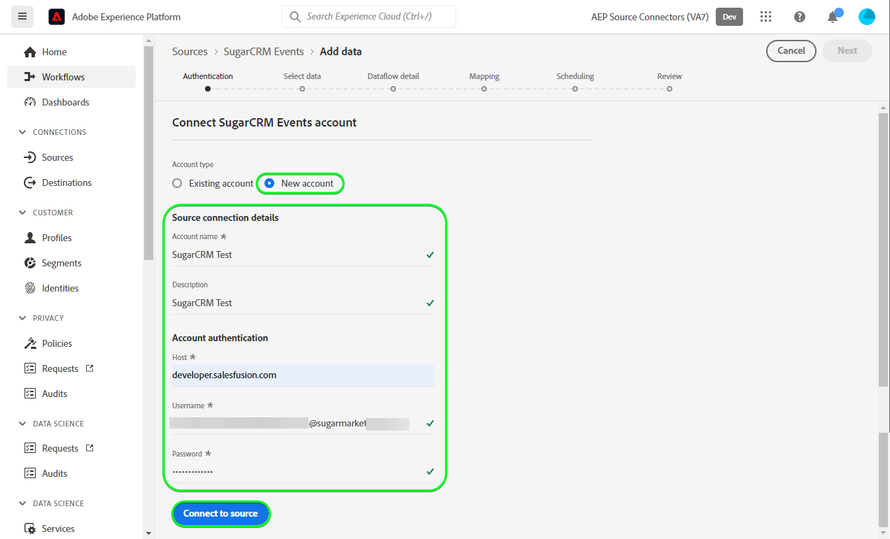

# (Beta) Cree una [!DNL SugarCRM Events] conexión de origen en la interfaz de usuario

>[!NOTE]
>
>El [!DNL SugarCRM Events] el origen está en versión beta. Consulte la [información general de orígenes](../../../../home.md#terms-and-conditions) para obtener más información sobre el uso de fuentes etiquetadas como beta.

Este tutorial proporciona los pasos para crear una [!DNL SugarCRM Events] conexión de origen mediante la interfaz de usuario de Adobe Experience Platform.

## Primeros pasos

Este tutorial requiere una comprensión práctica de los siguientes componentes de Experience Platform:

* [[!DNL Experience Data Model (XDM)] Sistema](../../../../../xdm/home.md): El marco estandarizado mediante el cual [!DNL Experience Platform] organiza los datos de experiencia del cliente.
   * [Conceptos básicos de composición de esquemas](../../../../../xdm/schema/composition.md): Obtenga información acerca de los componentes básicos de los esquemas XDM, incluidos los principios clave y las prácticas recomendadas en la composición de esquemas.
   * [Tutorial del Editor de esquemas](../../../../../xdm/tutorials/create-schema-ui.md): Aprenda a crear esquemas personalizados mediante la interfaz de usuario del Editor de esquemas.
* [[!DNL Real-Time Customer Profile]](../../../../../profile/home.md): Proporciona un perfil de consumidor unificado y en tiempo real basado en los datos agregados de varias fuentes.

Si ya tiene un válido [!DNL SugarCRM] cuenta de, puede omitir el resto de este documento y continuar con el tutorial sobre [configuración de un flujo de datos](../../dataflow/crm.md).

### Recopilar credenciales necesarias

Para poder conectarse [!DNL SugarCRM Events] En Platform, debe proporcionar valores para las siguientes propiedades de conexión:

| Credencial | Descripción | Ejemplo |
| --- | --- | --- |
| `Host` | El punto final de la API de SugarCRM al que se conecta el origen. | `developer.salesfusion.com` |
| `Username` | Su nombre de usuario de cuenta de desarrollador de SugarCRM. | `abc.def@example.com@sugarmarketdemo000.com` |
| `Password` | Contraseña de su cuenta de desarrollador de SugarCRM. | `123456789` |

### Creación de un esquema de Platform para [!DNL SugarCRM]

Antes de crear un [!DNL SugarCRM] conexión de origen, también debe asegurarse de crear primero un esquema de Platform para utilizarlo en el origen. Consulte el tutorial sobre [creación de un esquema de Platform](../../../../../xdm/schema/composition.md) para obtener información detallada sobre cómo crear un esquema.

>[!WARNING]
>
>Al asignar el esquema, asegúrese de asignar también el obligatorio `event_id` y `timestamp` campos requeridos por Platform.

## Conecte su [!DNL SugarCRM Events] account

En la IU de Platform, seleccione **[!UICONTROL Fuentes]** desde la barra de navegación izquierda para acceder a [!UICONTROL Fuentes] workspace. El [!UICONTROL Catálogo] La pantalla muestra una variedad de fuentes con las que puede crear una cuenta.

Puede seleccionar la categoría adecuada del catálogo en la parte izquierda de la pantalla. También puede encontrar la fuente específica con la que desea trabajar utilizando la opción de búsqueda.

En el *CRM* categoría, seleccionar **[!UICONTROL Eventos de SugarCRM]**, y luego seleccione **[!UICONTROL Añadir datos]**.

El **[!UICONTROL Conectar cuenta de eventos de SugarCRM]** página. En esta página, puede usar credenciales nuevas o existentes.

### Cuenta existente

Para utilizar una cuenta existente, seleccione la [!DNL SugarCRM Events] cuenta con la que desea crear un nuevo flujo de datos y seleccione **[!UICONTROL Siguiente]** para continuar.

### Nueva cuenta

Si está creando una cuenta nueva, seleccione **[!UICONTROL Nueva cuenta]** y, a continuación, proporcione un nombre, una descripción opcional y sus credenciales. Cuando termine, seleccione **[!UICONTROL Conectar con el origen]** y, a continuación, espere un poco para que se establezca la nueva conexión.

## Pasos siguientes

Al seguir este tutorial, ha establecido una conexión con su [!DNL SugarCRM Events] cuenta. Ahora puede continuar con el siguiente tutorial y [configuración de un flujo de datos para introducir datos en Platform](../../dataflow/crm.md).

## Recursos adicionales

Las secciones siguientes proporcionan recursos adicionales a los que puede hacer referencia al utilizar el [!DNL SugarCRM] origen.

### Mecanismos de protección {#guardrails}

El [!DNL SugarCRM] Las tarifas de aceleración de API son de 90 llamadas por minuto o 2000 llamadas por día, lo que suceda primero. Sin embargo, esta restricción se ha eludido añadiendo un parámetro a la especificación de conexión que retrasará el tiempo de solicitud para que nunca se alcance el límite de velocidad.

### Validación {#validation}

Para validar que ha configurado correctamente el origen y [!DNL SugarCRM Events] Si se están introduciendo datos, siga los pasos a continuación:

* En la IU de Platform, seleccione **[!UICONTROL Ver flujos de datos]** al lado del [!DNL SugarCRM Events] menú de tarjeta en el catálogo de fuentes. A continuación, seleccione **[!UICONTROL Previsualizar conjunto de datos]** para verificar los datos que se han introducido.

* Según el tipo de objeto con el que trabaje, puede comprobar los datos agregados con los recuentos visibles en [!DNL SugarMarket] Página de eventos a continuación:

>[!NOTE]
>
>El [!DNL SugarMarket] las páginas no incluyen los recuentos de objetos eliminados. Sin embargo, los datos recuperados a través de esta fuente también incluirán el recuento eliminado, que se marcaría con un indicador eliminado.
