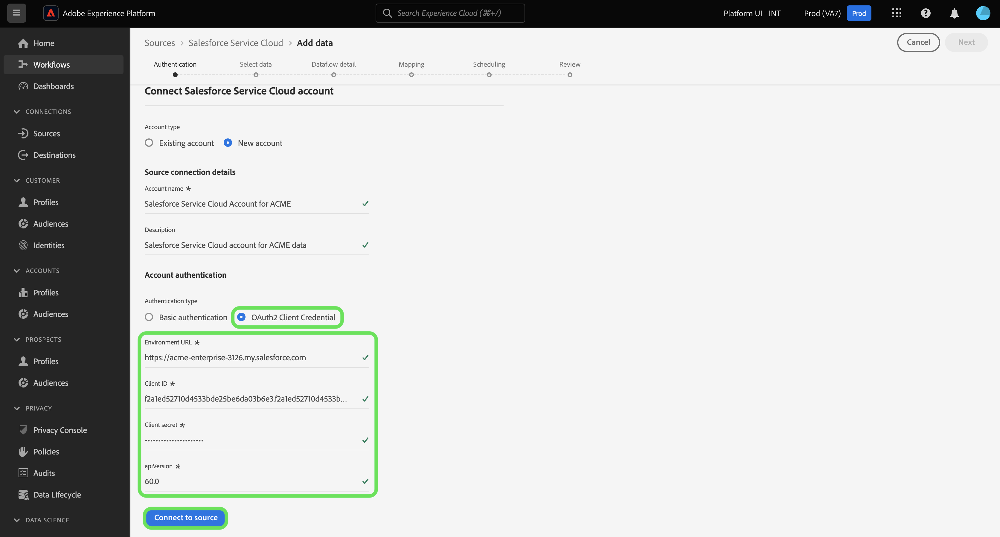

# Conecte su cuenta de [!DNL Salesforce Service Cloud] al Experience Platform mediante la interfaz de usuario

Este tutorial proporciona pasos sobre cómo conectar su cuenta de [!DNL Salesforce Service Cloud] y llevar los datos de éxito de los clientes a Adobe Experience Platform mediante la interfaz de usuario de Experience Platform.

## Introducción

Este tutorial requiere una comprensión práctica de los siguientes componentes de Experience Platform:

* [[!DNL Experience Data Model (XDM)] Sistema](../../../../../xdm/home.md): El marco estandarizado mediante el cual el Experience Platform organiza los datos de experiencia del cliente.
   * [Aspectos básicos de la composición de esquemas](../../../../../xdm/schema/composition.md): obtenga información sobre los componentes básicos de los esquemas XDM, incluidos los principios clave y las prácticas recomendadas en la composición de esquemas.
   * [Tutorial del editor de esquemas](../../../../../xdm/tutorials/create-schema-ui.md): Aprenda a crear esquemas personalizados mediante la interfaz de usuario del editor de esquemas.
* [[!DNL Real-Time Customer Profile]](../../../../../profile/home.md): proporciona un perfil de consumidor unificado y en tiempo real basado en los datos agregados de varias fuentes.

Si ya tiene una conexión [!DNL Salesforce Service Cloud] válida, puede omitir el resto de este documento y continuar con el tutorial sobre [configuración de un flujo de datos para que el cliente se realice correctamente](../../dataflow/customer-success.md)

### Recopilar credenciales necesarias

El origen [!DNL Salesforce Service Cloud] admite la autenticación básica y la credencial de cliente OAuth2.

>[!BEGINTABS]

>[!TAB Autenticación básica]

Debe proporcionar valores para las siguientes credenciales a fin de conectar su cuenta de [!DNL Salesforce Service Cloud] mediante la autenticación básica.

| Credencial | Descripción |
| --- | --- |
| URL de entorno | Dirección URL de la instancia de origen [!DNL Salesforce Service Cloud]. |
| Nombre de usuario | Nombre de usuario para la cuenta de usuario [!DNL Salesforce Service Cloud]. |
| Contraseña | Contraseña de la cuenta de usuario [!DNL Salesforce Service Cloud]. |
| Token de seguridad | Token de seguridad para la cuenta de usuario [!DNL Salesforce Service Cloud]. |
| Versión de API | (Opcional) La versión de la API de REST de la instancia [!DNL Salesforce Service Cloud] que está utilizando. El valor de la versión de la API debe tener formato decimal. Por ejemplo, si está usando la versión de API `52`, debe introducir el valor como `52.0`. Si este campo se deja en blanco, el Experience Platform utilizará automáticamente la última versión disponible. |

Para obtener más información sobre la autenticación, consulte [esta [!DNL Salesforce Service Cloud] guía de autenticación](https://developer.salesforce.com/docs/atlas.en-us.api_rest.meta/api_rest/quickstart_oauth.htm).

>[!TAB Credencial de cliente de OAuth2]

Debe proporcionar valores para las siguientes credenciales a fin de conectar su cuenta de [!DNL Salesforce Service Cloud] mediante la credencial de cliente de OAuth2.

| Credencial | Descripción |
| --- | --- |
| URL de entorno | Dirección URL de la instancia de origen [!DNL Salesforce Service Cloud]. |
| ID de cliente | El ID de cliente se utiliza junto con el secreto de cliente como parte de la autenticación OAuth2. Juntos, el ID de cliente y el secreto de cliente permiten que su aplicación funcione en nombre de su cuenta al identificar su aplicación en [!DNL Salesforce Service Cloud]. |
| Secreto del cliente | El secreto de cliente se utiliza junto con el ID de cliente como parte de la autenticación OAuth2. Juntos, el ID de cliente y el secreto de cliente permiten que su aplicación funcione en nombre de su cuenta al identificar su aplicación en [!DNL Salesforce Service Cloud]. |
| Versión de API | La versión de la API de REST de la instancia [!DNL Salesforce Service Cloud] que está utilizando. El valor de la versión de la API debe tener formato decimal. Por ejemplo, si está usando la versión de API `52`, debe introducir el valor como `52.0`. Si este campo se deja en blanco, el Experience Platform utilizará automáticamente la última versión disponible. |

Para obtener más información sobre el uso de OAuth para [!DNL Salesforce Service Cloud], lea la [[!DNL Salesforce Service Cloud] guía sobre flujos de autorización de OAuth](https://help.salesforce.com/s/articleView?id=sf.remoteaccess_oauth_flows.htm&amp;type=5).

>[!ENDTABS]

Una vez que haya recopilado las credenciales requeridas, puede seguir los pasos a continuación para conectar su cuenta de [!DNL Salesforce Service Cloud] al Experience Platform.

## Conectar su cuenta de [!DNL Salesforce Service Cloud]

En la interfaz de usuario de Platform, seleccione **[!UICONTROL Sources]** en el panel de navegación izquierdo para acceder al área de trabajo [!UICONTROL Sources]. Puede seleccionar la categoría adecuada del catálogo en la parte izquierda de la pantalla. También puede encontrar la fuente específica con la que desea trabajar utilizando la opción de búsqueda.

Seleccione **[!DNL Salesforce Service Cloud]** en la categoría *[!UICONTROL Éxito del cliente]* y luego seleccione **[!UICONTROL Agregar datos]**.

>[!TIP]
>
>Los orígenes del catálogo de orígenes muestran la opción **[!UICONTROL Set up]** cuando un origen determinado aún no tiene una cuenta autenticada. Una vez que existe una cuenta autenticada, esta opción cambia a **[!UICONTROL Agregar datos]**.

Aparecerá la página **[!UICONTROL Conectar con Salesforce Service Cloud]**. En esta página, puede usar credenciales nuevas o existentes.

### Usar una cuenta existente

Para usar una cuenta existente, seleccione **[!UICONTROL Cuenta existente]** y luego seleccione la cuenta que desee en la lista que aparece. Cuando termine, seleccione **[!UICONTROL Siguiente]** para continuar.

### Crear una nueva cuenta

Para crear una cuenta nueva, selecciona **[!UICONTROL Cuenta nueva]** y proporciona un nombre y una descripción para tu nueva cuenta de [!DNL Salesforce Service Cloud].

A continuación, seleccione el tipo de autenticación que desee utilizar para la nueva cuenta.

>[!BEGINTABS]

>[!TAB Autenticación básica]

Para la autenticación básica, seleccione **[!UICONTROL Autenticación básica]** y proporcione valores para las siguientes credenciales:

* URL de entorno
* Nombre de usuario
* Contraseña
* Versión de API (opcional)

Cuando termine, seleccione **[!UICONTROL Conectarse al origen]**.

>[!TAB Credencial de cliente de OAuth2]

Para la credencial de cliente de OAuth 2, seleccione **[!UICONTROL Credencial de cliente de OAuth2]** y, a continuación, proporcione valores para las siguientes credenciales:

* URL de entorno
* ID de cliente
* Secreto del cliente
* Versión de API

Cuando termine, seleccione **[!UICONTROL Conectarse al origen]**.

>[!ENDTABS]

## Pasos siguientes

Al seguir este tutorial, ha establecido una conexión con su cuenta de [!DNL Salesforce Service Cloud]. Ahora puede continuar con el siguiente tutorial y [configurar un flujo de datos para llevar los datos de éxito del cliente a Experience Platform](../../dataflow/customer-success.md).
