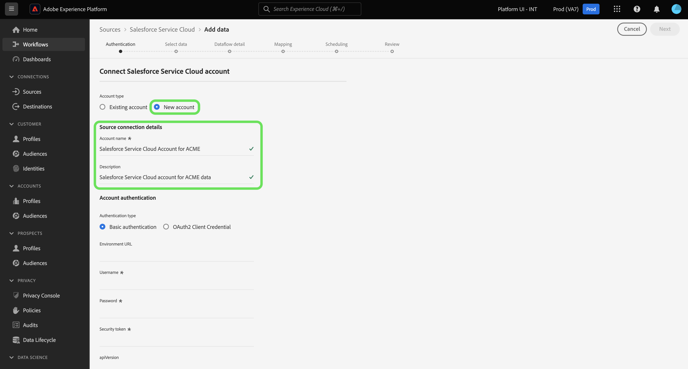

# Conecte su [!DNL Salesforce Service Cloud] cuenta de al Experience Platform mediante la interfaz de usuario de

Este tutorial proporciona pasos sobre cómo conectar su [!DNL Salesforce Service Cloud] y llevar los datos de éxito de los clientes a Adobe Experience Platform mediante la interfaz de usuario de Experience Platform.

## Introducción

Este tutorial requiere una comprensión práctica de los siguientes componentes de Experience Platform:

* [[!DNL Experience Data Model (XDM)] Sistema](../../../../../xdm/home.md): El marco estandarizado mediante el cual Experience Platform organiza los datos de experiencia del cliente.
   * [Conceptos básicos de composición de esquemas](../../../../../xdm/schema/composition.md): Obtenga información acerca de los componentes básicos de los esquemas XDM, incluidos los principios clave y las prácticas recomendadas en la composición de esquemas.
   * [Tutorial del Editor de esquemas](../../../../../xdm/tutorials/create-schema-ui.md): Aprenda a crear esquemas personalizados mediante la interfaz de usuario del Editor de esquemas.
* [[!DNL Real-Time Customer Profile]](../../../../../profile/home.md): Proporciona un perfil de consumidor unificado y en tiempo real basado en los datos agregados de varias fuentes.

Si ya tiene un válido [!DNL Salesforce Service Cloud] conexión, puede omitir el resto de este documento y continuar con el tutorial sobre [configuración correcta de un flujo de datos para un cliente](../../dataflow/customer-success.md)

### Recopilar credenciales necesarias

Para acceder a su [!DNL Salesforce Service Cloud] cuenta en el Experience Platform, debe proporcionar los siguientes valores:

| Credencial | Descripción |
| --- | --- |
| `environmentUrl` | La dirección URL del [!DNL Salesforce Service Cloud] instancia de origen. |
| `username` | El nombre de usuario de [!DNL Salesforce Service Cloud] cuenta de usuario. |
| `password` | La contraseña para el [!DNL Salesforce Service Cloud] cuenta de usuario. |
| `securityToken` | El token de seguridad para [!DNL Salesforce Service Cloud] cuenta de usuario. |
| `apiVersion` | (Opcional) La versión de la API de REST de [!DNL Salesforce Service Cloud] instancia de que está utilizando. Si este campo se deja en blanco, el Experience Platform utilizará automáticamente la última versión disponible. |

Para obtener más información sobre la autenticación, consulte [esta [!DNL Salesforce] guía de autenticación](https://developer.salesforce.com/docs/atlas.en-us.api_rest.meta/api_rest/quickstart_oauth.htm).

## Conecte su [!DNL Salesforce Service Cloud] account

Una vez que haya recopilado las credenciales necesarias, puede seguir los pasos a continuación para vincular su [!DNL Salesforce] cuenta para el Experience Platform.

En la IU de Platform, seleccione **[!UICONTROL Fuentes]** desde la navegación izquierda para acceder al espacio de trabajo de orígenes. El *[!UICONTROL Catálogo]* La pantalla muestra una variedad de fuentes disponibles en el catálogo de fuentes de Experience Platform.

Puede seleccionar la categoría adecuada del catálogo en la parte izquierda de la pantalla. También puede encontrar una fuente específica utilizando la opción de búsqueda.

Seleccionar **[!UICONTROL Éxito del cliente]** en la lista de categorías de fuentes y, a continuación, seleccione **[!UICONTROL Añadir datos]** desde el [!DNL Salesforce Service Cloud] Tarjeta de.

El **[!UICONTROL Conectar con Salesforce Service Cloud]** página. En esta página, puede usar credenciales nuevas o existentes.

>[!BEGINTABS]

>[!TAB Usar una cuenta existente de Salesforce Service Cloud]

Para usar una cuenta existente, seleccione **[!UICONTROL Cuenta existente]** y, a continuación, seleccione la cuenta que desee utilizar en la lista que aparece. Cuando termine, seleccione **[!UICONTROL Siguiente]** para continuar.

>[!TAB Cree una nueva cuenta de Salesforce Service Cloud]

Para usar una cuenta nueva, seleccione **[!UICONTROL Nueva cuenta]** y proporcione un nombre, una descripción y su [!DNL Salesforce Service Cloud] credenciales de autenticación. Cuando termine, seleccione **[!UICONTROL Conectar con el origen]** y espere unos segundos para que se establezca la nueva conexión.

>[!ENDTABS]

## Pasos siguientes

Al seguir este tutorial, ha establecido una conexión con su [!DNL Salesforce Service Cloud] cuenta. Ahora puede continuar con el siguiente tutorial y [configure un flujo de datos para llevar los datos de éxito del cliente a Experience Platform](../../dataflow/customer-success.md).
