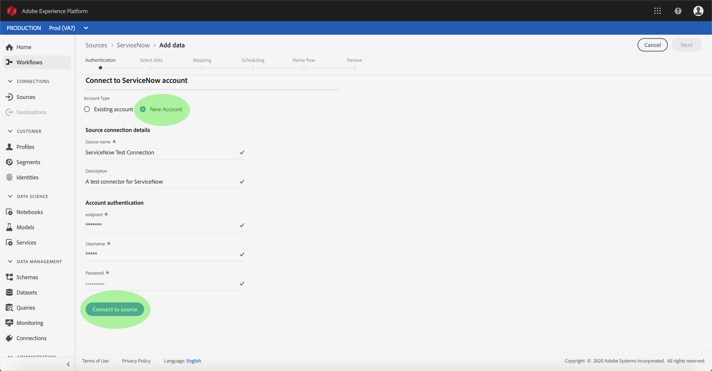

# Creación de un conector de origen ServiceNow en la interfaz de usuario

Los conectores de origen de Adobe Experience Platform permiten la ingesta de datos externos de forma programada. Este tutorial proporciona los pasos para crear un conector de origen ServiceNow mediante la interfaz de usuario de la plataforma.

## Primeros pasos

Este tutorial requiere un conocimiento práctico de los siguientes componentes de Adobe Experience Platform:

* [Sistema](../../../../../xdm/home.md)de modelo de datos de experiencia (XDM): Marco normalizado mediante el cual la plataforma de experiencias organiza los datos de experiencia del cliente.
   * [Conceptos básicos de la composición](../../../../../xdm/schema/composition.md)de esquemas: Obtenga información sobre los componentes básicos de los esquemas XDM, incluidos los principios clave y las prácticas recomendadas en la composición de esquemas.
   * [Tutorial](../../../../../xdm/tutorials/create-schema-ui.md)del Editor de Esquemas: Obtenga información sobre cómo crear esquemas personalizados mediante la interfaz de usuario del Editor de Esquemas.
* [Perfil](../../../../../profile/home.md)del cliente en tiempo real: Proporciona un perfil de consumo unificado y en tiempo real basado en datos agregados de varias fuentes.

Si ya tiene una conexión ServiceNow, puede omitir el resto de este documento y continuar con el tutorial sobre la [configuración de un flujo de datos](../../dataflow/customer-success.md)

### Recopilar las credenciales necesarias

Para acceder a su cuenta de ServiceNow en la plataforma, debe proporcionar los siguientes valores:

| Credencial | Descripción |
| ---------- | ----------- |
| `endpoint` | Extremo del servidor ServiceNow. |
| `username` | Nombre de usuario utilizado para conectarse al servidor ServiceNow para la autenticación. |
| `password` | La contraseña para conectarse al servidor de ServiceNow para la autenticación. |

Para obtener más información sobre cómo empezar, consulte [este documento](https://developer.servicenow.com/app.do#!/rest_api_doc?v=newyork&amp;id=r_TableAPI-GET)de ServiceNow.

## Conectar su cuenta de ServiceNow

Una vez recopiladas las credenciales necesarias, puede seguir los pasos a continuación para crear una nueva cuenta de ServiceNow para conectarse a Platform.

Inicie sesión en <a href="https://platform.adobe.com" target="_blank">Adobe Experience Platform</a> y, a continuación, seleccione **Fuentes** en la barra de navegación izquierda para acceder al espacio de trabajo *Fuentes* . La pantalla *Catálogo* muestra una serie de orígenes para los que puede crear una cuenta y cada origen muestra el número de cuentas existentes y los flujos de conjuntos de datos asociados a ellas.

Puede seleccionar la categoría adecuada en el catálogo a la izquierda de la pantalla. También puede encontrar la fuente específica con la que desea trabajar mediante la opción de búsqueda.

En la categoría Éxito *del* cliente, seleccione **ServicioAhora** para mostrar una barra de información en el lado derecho de la pantalla. La barra de información proporciona una breve descripción de la fuente seleccionada, así como opciones para conectarse con la fuente o la vista de la misma. Para crear una cuenta nueva, seleccione Origen **de** Connect.

Aparece la página *Conectar con ServiceNow* . En esta página, puede usar credenciales nuevas o existentes.

### Nueva cuenta

Si está utilizando nuevas credenciales, seleccione **Nueva cuenta**. En el formulario de entrada que aparece, proporcione la conexión con un nombre, una descripción opcional y las credenciales de ServiceNow. Cuando termine, seleccione **Connect** y, a continuación, espere un poco de tiempo para que se establezca la nueva cuenta.

### Cuenta existente

Para conectar una cuenta existente, seleccione la cuenta de ServiceNow con la que desea conectarse y, a continuación, seleccione **Siguiente** para continuar.

## Pasos siguientes

Siguiendo este tutorial, ha establecido una conexión con su cuenta de ServiceNow. Ahora puede continuar con el siguiente tutorial y [configurar un flujo de datos para traer datos a Platform](../../dataflow/customer-success.md).
