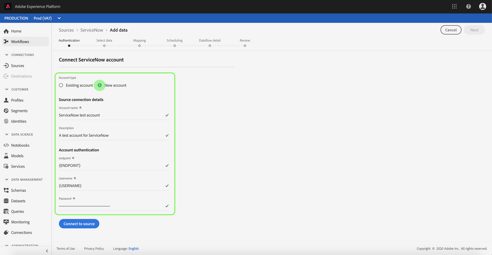

# Crear una conexión de origen [!DNL ServiceNow] en la interfaz de usuario

Los conectores de Source en Adobe Experience Platform permiten introducir datos de origen externo de forma programada. Este tutorial proporciona los pasos para crear un conector de origen [!DNL ServiceNow] mediante la interfaz de usuario [!DNL Platform].

## Introducción

Este tutorial requiere una comprensión práctica de los siguientes componentes de Adobe Experience Platform:

* [[!DNL Experience Data Model (XDM)] Sistema](../../../../../xdm/home.md): El marco de trabajo estandarizado mediante el cual [!DNL Experience Platform] organiza los datos de la experiencia del cliente.
   * [Aspectos básicos de la composición de esquemas](../../../../../xdm/schema/composition.md): obtenga información sobre los componentes básicos de los esquemas XDM, incluidos los principios clave y las prácticas recomendadas en la composición de esquemas.
   * [Tutorial del editor de esquemas](../../../../../xdm/tutorials/create-schema-ui.md): Aprenda a crear esquemas personalizados mediante la interfaz de usuario del editor de esquemas.
* [[!DNL Real-Time Customer Profile]](../../../../../profile/home.md): proporciona un perfil de consumidor unificado y en tiempo real basado en los datos agregados de varias fuentes.

Si ya tiene una conexión [!DNL ServiceNow] válida, puede omitir el resto de este documento y continuar con el tutorial sobre [configuración de un flujo de datos](../../dataflow/customer-success.md)

### Recopilar credenciales necesarias

Para tener acceso a su cuenta de [!DNL ServiceNow] en [!DNL Platform], debe proporcionar los siguientes valores:

| Credencial | Descripción |
| ---------- | ----------- |
| `endpoint` | Extremo del servidor [!DNL ServiceNow]. |
| `username` | Nombre de usuario utilizado para conectarse al servidor [!DNL ServiceNow] para la autenticación. |
| `password` | Contraseña para conectarse al servidor [!DNL ServiceNow] para la autenticación. |

Para obtener más información sobre cómo empezar, consulte [este [!DNL ServiceNow] documento](https://developer.servicenow.com/app.do#!/rest_api_doc?v=newyork&amp;id=r_TableAPI-GET).

## Conectar su cuenta de [!DNL ServiceNow]

Una vez que haya recopilado las credenciales requeridas, puede seguir los pasos a continuación para vincular su cuenta de [!DNL ServiceNow] a [!DNL Platform].

Inicie sesión en [Adobe Experience Platform](https://platform.adobe.com) y, a continuación, seleccione **[!UICONTROL Fuentes]** en la barra de navegación izquierda para acceder al área de trabajo de **[!UICONTROL Fuentes]**. La pantalla **[!UICONTROL Catálogo]** muestra una variedad de orígenes con los que puede crear una cuenta.

Puede seleccionar la categoría adecuada del catálogo en la parte izquierda de la pantalla. También puede encontrar la fuente específica con la que desea trabajar utilizando la opción de búsqueda.

En la categoría **[!UICONTROL Éxito del cliente]**, seleccione **[!UICONTROL ServiceNow]**. Si es la primera vez que usa este conector, seleccione **[!UICONTROL Configurar]**. De lo contrario, seleccione **[!UICONTROL Conectar origen]** para crear un nuevo conector [!DNL ServiceNow].

Aparecerá la página **[!UICONTROL Conectar con ServiceNow]**. En esta página, puede usar credenciales nuevas o existentes.

### Nueva cuenta

Si está usando credenciales nuevas, seleccione **[!UICONTROL Nueva cuenta]**. En el formulario de entrada que aparece, proporcione un nombre, una descripción opcional y sus credenciales de [!DNL ServiceNow]. Cuando termine, seleccione **[!UICONTROL Conectar]** y deje pasar un tiempo para que se establezca la nueva conexión.

### Cuenta existente

Para conectar una cuenta existente, seleccione la cuenta de [!DNL ServiceNow] con la que desee conectarse y, a continuación, seleccione **[!UICONTROL Siguiente]** para continuar.

## Pasos siguientes

Al seguir este tutorial, ha establecido una conexión con su cuenta de [!DNL ServiceNow]. Ahora puede continuar con el siguiente tutorial y [configurar un flujo de datos para introducir datos en [!DNL Platform]](../../dataflow/customer-success.md).
