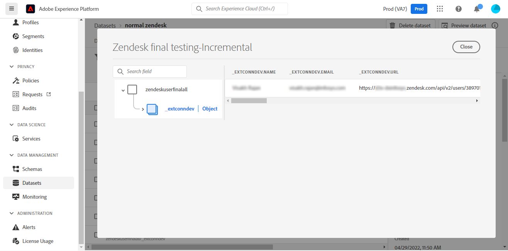

# (Beta) Cree un [!DNL Zendesk] conexión de origen en la interfaz de usuario

>[!NOTE]
>
>La variable [!DNL Zendesk] el origen está en versión beta. Consulte la [información general sobre fuentes](../../../../home.md#terms-and-conditions) para obtener más información sobre el uso de fuentes con etiquetas beta.

Este tutorial proporciona los pasos para crear un [!DNL Zendesk] conexión de origen mediante la interfaz de usuario de Adobe Experience Platform.

## Primeros pasos

Este tutorial requiere una comprensión práctica de los siguientes componentes de Adobe Experience Platform:

* [[!DNL Experience Data Model (XDM)] Sistema](../../../../../xdm/home.md): El marco normalizado por el cual [!DNL Experience Platform] organiza los datos de experiencia del cliente.
   * [Aspectos básicos de la composición del esquema](../../../../../xdm/schema/composition.md): Obtenga información sobre los componentes básicos de los esquemas XDM, incluidos los principios clave y las prácticas recomendadas en la composición de esquemas.
   * [Tutorial del Editor de esquemas](../../../../../xdm/tutorials/create-schema-ui.md): Obtenga información sobre cómo crear esquemas personalizados mediante la interfaz de usuario del Editor de esquemas.
* [[!DNL Real-Time Customer Profile]](../../../../../profile/home.md): Proporciona un perfil de cliente unificado y en tiempo real basado en datos agregados de varias fuentes.

### Recopilar las credenciales necesarias

Para acceder a su [!DNL Zendesk] en Platform, debe proporcionar valores para las siguientes credenciales:

| Credencial | Descripción | Ejemplo |
| --- | --- | --- |
| Subdomain | Dominio único específico de su cuenta creado durante el proceso de registro. | `yoursubdomain` |
| Token de acceso | Token de la API de Zendesk. | `0lZnClEvkJSTQ7olGLl7PMhVq99gu26GTbJtf` |

Para obtener más información sobre cómo autenticar su [!DNL Zendesk] fuente, consulte la [[!DNL Zendesk] información general de la fuente](../../../../connectors/customer-success/zendesk.md).

### Crear un esquema de Platform para [!DNL Zendesk]

Antes de crear una [!DNL Zendesk] conexión de origen, también debe asegurarse de crear primero un esquema de Platform para utilizarlo con el origen. Consulte el tutorial en [creación de un esquema de Platform](../../../../../xdm/schema/composition.md) para ver los pasos completos sobre cómo crear un esquema.

Para obtener instrucciones adicionales sobre [!DNL Zendesk] esquema necesario para [!DNL Zendesk Search API], consulte [límites](#limits) a continuación.

## Conecte su [!DNL Zendesk] account

En la interfaz de usuario de Platform, seleccione **[!UICONTROL Fuentes]** en la barra de navegación izquierda para acceder a la [!UICONTROL Fuentes] espacio de trabajo. La variable [!UICONTROL Catálogo] muestra una variedad de fuentes con las que puede crear una cuenta.

Puede seleccionar la categoría adecuada del catálogo en la parte izquierda de la pantalla. Alternativamente, puede encontrar la fuente específica con la que desea trabajar usando la opción de búsqueda.

En el *Éxito del cliente* categoría, seleccione **[!UICONTROL Zendesk]** y, a continuación, seleccione **[!UICONTROL Añadir datos]**.

La variable **[!UICONTROL Conectar cuenta de Zendesk]** se abre. En esta página, puede usar credenciales nuevas o existentes.

### Cuenta existente

Para usar una cuenta existente, seleccione la opción *Zendesk* cuenta con la que desee crear un nuevo flujo de datos y, a continuación, seleccione **[!UICONTROL Siguiente]** para continuar.

### Nueva cuenta

Si está creando una cuenta nueva, seleccione **[!UICONTROL Nueva cuenta]** y, a continuación, proporcione un nombre, una descripción opcional y sus credenciales. Cuando termine, seleccione **[!UICONTROL Conectar a origen]** y, a continuación, permita que la nueva conexión se establezca durante algún tiempo.

### Selección de datos

Una vez autenticado el origen, la página se actualiza en un árbol de esquema interactivo que le permite explorar e inspeccionar la jerarquía de los datos. Select **[!UICONTROL Siguiente]** para continuar.

## Pasos siguientes

Siguiendo este tutorial, se ha autenticado y creado una conexión de origen entre las [!DNL Zendesk] cuenta y plataforma. Ahora puede continuar con el siguiente tutorial y [crear un flujo de datos para incorporar los datos de éxito de los clientes a Platform](../../dataflow/customer-success.md).

## Recursos adicionales

Las secciones a continuación proporcionan recursos adicionales a los que puede hacer referencia al usar la variable [!DNL Zendesk] fuente.

### Validación {#validation}

A continuación se describen los pasos que puede seguir para validar que ha conectado correctamente su [!DNL Zendesk] origen y que [!DNL Zendesk] se están incorporando perfiles a Platform.

En la interfaz de usuario de Platform, seleccione **[!UICONTROL Conjuntos de datos]** desde el panel de navegación izquierdo para acceder a la [!UICONTROL Conjuntos de datos] espacio de trabajo. La variable [!UICONTROL Actividad de conjunto de datos] muestra los detalles de las ejecuciones.

A continuación, seleccione el ID de ejecución de flujo de datos del flujo de datos que desea ver para ver detalles específicos sobre ese flujo de datos ejecutado.

Finalmente, seleccione **[!UICONTROL Vista previa del conjunto de datos]** para mostrar los datos introducidos.

También puede verificar los datos de Platform con los datos de su [!DNL Zendesk] > [!DNL Customers] página.

### Esquema de Zendesk

La tabla siguiente enumera las asignaciones admitidas que deben configurarse para Zendesk.

>[!TIP]
>
>Consulte [API de búsqueda de Zendesk > Exportar resultados de búsqueda](https://developer.zendesk.com/api-reference/ticketing/ticket-management/search/#export-search-results) para obtener más información sobre la API.

| Fuente | Tipo |
|---|---|
| `results.active` | Booleano |
| `results.alias` | Cadena |
| `results.created_at` | Cadena |
| `results.custom_role_id` | Número entero |
| `results.default_group_id` | Número entero |
| `results.details` | Cadena |
| `results.email` | Cadena |
| `results.external_id` | Número entero |
| `results.iana_time_zone` | Cadena |
| `results.id` | Número entero |
| `results.last_login_at` | Cadena |
| `results.locale` | Cadena |
| `results.locale_id` | Número entero |
| `results.moderator` | Booleano |
| `results.name` | Cadena |
| `results.notes` | Cadena |
| `results.only_private_comments` | Booleano |
| `results.organization_id` | Número entero |
| `results.phone` | Cadena |
| `results.photo` | Cadena |
| `results.report_csv` | Booleano |
| `results.restricted_agent` | Booleano |
| `results.result_type` | Cadena |
| `results.role` | Cadena |
| `results.role_type` | Número entero |
| `results.shared` | Booleano |
| `results.shared_agent` | Booleano |
| `results.shared_phone_number` | Booleano |
| `results.signature` | Cadena |
| `results.suspended` | Booleano |
| `results.ticket_restriction` | Cadena |
| `results.time_zone` | Cadena |
| `results.two_factor_auth_enabled` | Booleano |
| `results.updated_at` | Cadena |
| `results.url` | Cadena |
| `results.verified` | Booleano |

{style=&quot;table-layout:auto&quot;}

### Límites {#limits}

* La variable [API de búsqueda de Zendesk > Exportar resultados de búsqueda](https://developer.zendesk.com/api-reference/ticketing/ticket-management/search/#export-search-results) devuelve un máximo de 1000 registros por página.
   * El valor de la variable ``filter[type]`` se establece en ``user`` y, por lo tanto, la conexión de Zendesk solo devuelve usuarios.
   * La cantidad de resultados por página que administra el ``page[size]`` parámetro. El valor se establece en ``100``. Esto se hace para reducir el impacto de las restricciones de reducción de velocidad establecidas por Zendesk.
   * Consulte [Límites](https://developer.zendesk.com/api-reference/ticketing/ticket-management/search/#limits) y [Paginación](https://developer.zendesk.com/api-reference/ticketing/ticket-management/search/#pagination-1).
   * También puede consultar [Paginación mediante listas utilizando paginación de cursor](https://developer.zendesk.com/documentation/developer-tools/pagination/paginating-through-lists-using-cursor-pagination/).
