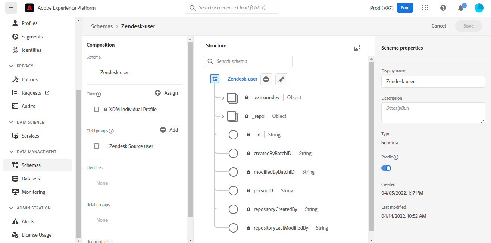

# Crear una conexión de origen [!DNL Zendesk] en la interfaz de usuario

Este tutorial proporciona los pasos para crear una conexión de origen [!DNL Zendesk] mediante la interfaz de usuario de Adobe Experience Platform.

## Introducción

Este tutorial requiere una comprensión práctica de los siguientes componentes de Adobe Experience Platform:

* [[!DNL Experience Data Model (XDM)] Sistema](../../../../../xdm/home.md): El marco de trabajo estandarizado mediante el cual [!DNL Experience Platform] organiza los datos de la experiencia del cliente.
   * [Aspectos básicos de la composición de esquemas](../../../../../xdm/schema/composition.md): obtenga información sobre los componentes básicos de los esquemas XDM, incluidos los principios clave y las prácticas recomendadas en la composición de esquemas.
   * [Tutorial del editor de esquemas](../../../../../xdm/tutorials/create-schema-ui.md): Aprenda a crear esquemas personalizados mediante la interfaz de usuario del editor de esquemas.
* [[!DNL Real-Time Customer Profile]](../../../../../profile/home.md): proporciona un perfil de consumidor unificado y en tiempo real basado en los datos agregados de varias fuentes.

### Recopilar credenciales necesarias

Para tener acceso a su cuenta de [!DNL Zendesk] en Platform, debe proporcionar valores para las siguientes credenciales:

| Credencial | Descripción | Ejemplo |
| --- | --- | --- |
| Subdomain | El dominio único específico de su cuenta creado durante el proceso de registro. | `yoursubdomain` |
| Token de acceso | Token de API de Zendesk. | `0lZnClEvkJSTQ7olGLl7PMhVq99gu26GTbJtf` |

Para obtener más información sobre cómo autenticar el origen de [!DNL Zendesk], consulte la [[!DNL Zendesk] descripción general del origen](../../../../connectors/customer-success/zendesk.md).

### Crear un esquema de plataforma para [!DNL Zendesk]

Antes de crear una conexión de origen de [!DNL Zendesk], también debe asegurarse de crear primero un esquema de Platform para utilizarlo en el origen. Consulte el tutorial de [creación de un esquema de Platform](../../../../../xdm/schema/composition.md) para ver los pasos detallados sobre cómo crear un esquema.

Para obtener instrucciones adicionales sobre el esquema [!DNL Zendesk] necesario para [!DNL Zendesk Search API], consulte la sección [límites](#limits) a continuación.

## Conectar su cuenta de [!DNL Zendesk]

En la interfaz de usuario de Platform, seleccione **[!UICONTROL Sources]** en la barra de navegación izquierda para acceder al área de trabajo [!UICONTROL Sources]. La pantalla [!UICONTROL Catálogo] muestra una variedad de orígenes con los que puede crear una cuenta.

Puede seleccionar la categoría adecuada del catálogo en la parte izquierda de la pantalla. También puede encontrar la fuente específica con la que desea trabajar utilizando la opción de búsqueda.

En la categoría *Éxito del cliente*, seleccione **[!UICONTROL Zendesk]** y después **[!UICONTROL Agregar datos]**.

Aparecerá la página **[!UICONTROL Conectar cuenta de Zendesk]**. En esta página, puede usar credenciales nuevas o existentes.

### Cuenta existente

Para usar una cuenta existente, selecciona la cuenta de *Zendesk* con la que deseas crear un nuevo flujo de datos y luego selecciona **[!UICONTROL Siguiente]** para continuar.

### Nueva cuenta

Si va a crear una cuenta nueva, seleccione **[!UICONTROL Cuenta nueva]** y, a continuación, proporcione un nombre, una descripción opcional y sus credenciales. Cuando termine, seleccione **[!UICONTROL Conectarse al origen]** y deje pasar un tiempo para que se establezca la nueva conexión.

### Seleccionar datos

Una vez autenticado el origen, la página se actualiza a un árbol de esquema interactivo que le permite explorar e inspeccionar la jerarquía de los datos. Seleccione **[!UICONTROL Siguiente]** para continuar.

## Pasos siguientes

Al seguir este tutorial, se ha autenticado y creado una conexión de origen entre su cuenta de [!DNL Zendesk] y Platform. Ahora puede continuar con el siguiente tutorial y [crear un flujo de datos para llevar los datos de éxito de los clientes a la plataforma](../../dataflow/customer-success.md).

## Recursos adicionales

Las secciones siguientes proporcionan recursos adicionales a los que puede hacer referencia al usar el origen [!DNL Zendesk].

### Validación {#validation}

A continuación se describen los pasos que puede seguir para comprobar que ha conectado correctamente el origen de [!DNL Zendesk] y que los perfiles de [!DNL Zendesk] se están ingiriendo en Platform.

En la interfaz de usuario de Platform, seleccione **[!UICONTROL Conjuntos de datos]** en el panel de navegación izquierdo para acceder al área de trabajo de [!UICONTROL Conjuntos de datos]. La pantalla [!UICONTROL Actividad de conjunto de datos] muestra los detalles de las ejecuciones.

A continuación, seleccione el ID de ejecución del flujo de datos que desea ver para ver detalles específicos sobre esa ejecución del flujo de datos.

Finalmente, seleccione **[!UICONTROL Previsualizar conjunto de datos]** para mostrar los datos ingeridos.

También puede comprobar los datos de Platform con los datos de la página [!DNL Zendesk] > [!DNL Customers].

### Esquema de Zendesk

La tabla siguiente enumera las asignaciones compatibles que deben configurarse para Zendesk.

>[!TIP]
>
>Consulte [API de búsqueda de Zendesk > Exportar resultados de búsqueda](https://developer.zendesk.com/api-reference/ticketing/ticket-management/search/#export-search-results) para obtener más información sobre la API.

| Fuente | Tipo |
|---|---|
| `results.active` | Booleano |
| `results.alias` | Cadena |
| `results.created_at` | Cadena |
| `results.custom_role_id` | Entero |
| `results.default_group_id` | Entero |
| `results.details` | Cadena |
| `results.email` | Cadena |
| `results.external_id` | Entero |
| `results.iana_time_zone` | Cadena |
| `results.id` | Entero |
| `results.last_login_at` | Cadena |
| `results.locale` | Cadena |
| `results.locale_id` | Entero |
| `results.moderator` | Booleano |
| `results.name` | Cadena |
| `results.notes` | Cadena |
| `results.only_private_comments` | Booleano |
| `results.organization_id` | Entero |
| `results.phone` | Cadena |
| `results.photo` | Cadena |
| `results.report_csv` | Booleano |
| `results.restricted_agent` | Booleano |
| `results.result_type` | Cadena |
| `results.role` | Cadena |
| `results.role_type` | Entero |
| `results.shared` | Booleano |
| `results.shared_agent` | Booleano |
| `results.shared_phone_number` | Booleano |
| `results.signature` | Cadena |
| `results.suspended` | Booleano |
| `results.ticket_restriction` | Cadena |
| `results.time_zone` | Cadena |
| `results.two_factor_auth_enabled` | Booleano |
| `results.updated_at` | Cadena |
| `results.url` | Cadena |
| `results.verified` | Booleano |

{style="table-layout:auto"}

### Límites {#limits}

* La [API de búsqueda de Zendesk > Exportar resultados de búsqueda](https://developer.zendesk.com/api-reference/ticketing/ticket-management/search/#export-search-results) devuelve un máximo de 1000 registros por página.
   * El valor del parámetro ``filter[type]`` está establecido en ``user`` y, por lo tanto, la conexión de Zendesk solo devuelve usuarios.
   * El parámetro ``page[size]`` administra el número de resultados por página. El valor se ha establecido en ``100``. Esto se hace para reducir el impacto de las restricciones de reducción de velocidad establecidas por Zendesk.
   * Ver [límites](https://developer.zendesk.com/api-reference/ticketing/ticket-management/search/#limits) y [paginación](https://developer.zendesk.com/api-reference/ticketing/ticket-management/search/#pagination-1).
   * También puede hacer referencia a [Paginación mediante listas usando paginación de cursor](https://developer.zendesk.com/documentation/developer-tools/pagination/paginating-through-lists-using-cursor-pagination/).
