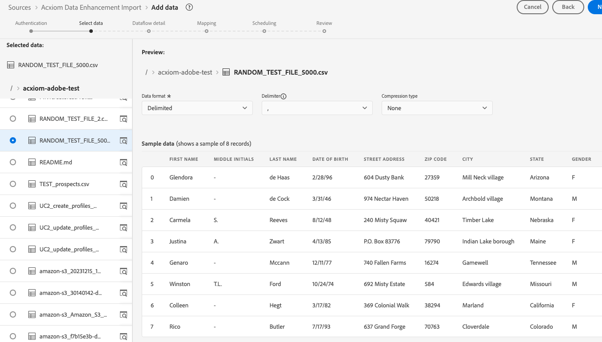
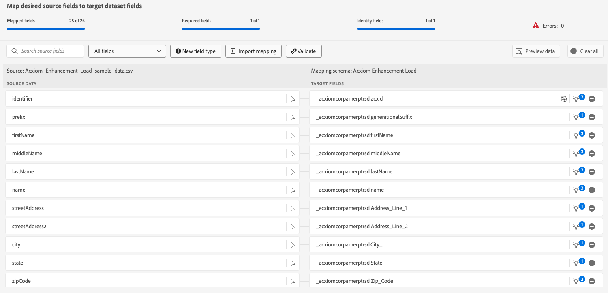

# Crear una conexión de origen y un flujo de datos de [!DNL Acxiom Data Ingestion] en la interfaz de usuario

>[!NOTE]
>
>El origen [!DNL Acxiom Data Ingestion] está en la versión beta. Lea los [términos y condiciones](../../../../home.md#terms-and-conditions) en la descripción general de orígenes para obtener más información sobre el uso de orígenes etiquetados como beta.

Utilice el origen [!DNL Acxiom Data Ingestion] para introducir datos de [!DNL Acxiom] en Real-time Customer Data Platform y enriquecer perfiles de origen. A continuación, puede usar sus perfiles de origen enriquecidos con [!DNL Acxiom] para mejorar las audiencias y activarlos en todos los canales de marketing.

Lea este tutorial para aprender a crear una conexión de origen y un flujo de datos de [!DNL Acxiom Data Ingestion] mediante la interfaz de usuario de Adobe Experience Platform. El origen [!DNL Acxiom Data Ingestion] se usa para recuperar y asignar la respuesta del servicio de mejora [!DNL Acxiom] mediante Amazon S3 como punto de colocación.

## Requisitos previos {#prerequisites}

Este tutorial requiere una comprensión práctica de los siguientes componentes de Experience Platform:

* [[!DNL Experience Data Model (XDM)] Sistema](../../../../../xdm/home.md): El marco estandarizado mediante el cual el Experience Platform organiza los datos de experiencia del cliente.
   * [Aspectos básicos de la composición de esquemas](../../../../../xdm/schema/composition.md): obtenga información sobre los componentes básicos de los esquemas XDM, incluidos los principios clave y las prácticas recomendadas en la composición de esquemas.
   * [Tutorial del editor de esquemas](../../../../../xdm/tutorials/create-schema-ui.md): Aprenda a crear esquemas personalizados mediante la interfaz de usuario del editor de esquemas.
* [[!DNL Real-Time Customer Profile]](../../../../../profile/home.md): proporciona un perfil de consumidor unificado y en tiempo real basado en los datos agregados de varias fuentes.

### Recopilar credenciales necesarias

Para acceder al bloque en Experience Platform, debe proporcionar valores válidos para las siguientes credenciales:

| Credencial | Descripción |
| --- | --- |
| Clave de autenticación [!DNL Acxiom] | La clave de autenticación. Puede recuperar este valor del equipo [!DNL Acxiom]. |
| Clave de acceso de [!DNL Amazon S3] | ID de clave de acceso para el bloque. Puede recuperar este valor del equipo [!DNL Acxiom]. |
| clave secreta [!DNL Amazon S3] | El ID de clave secreta de su cubo. Puede recuperar este valor del equipo [!DNL Acxiom]. |
| Nombre del segmento | Este es el espacio en el que se compartirán los archivos. Puede recuperar este valor del equipo [!DNL Acxiom]. |

>[!IMPORTANT]
>
>Debe tener los permisos para **[!UICONTROL Ver fuentes]** y **[!UICONTROL Administrar fuentes]** habilitados en su cuenta para conectar su cuenta de [!DNL Acxiom] al Experience Platform. Póngase en contacto con el administrador del producto para obtener los permisos necesarios. Para obtener más información, lea la [guía de la interfaz de usuario de control de acceso](../../../../../access-control/ui/overview.md).

## Conectar su cuenta de [!DNL Acxiom]

En la interfaz de usuario de Platform, seleccione **[!UICONTROL Sources]** en la barra de navegación izquierda para acceder al área de trabajo [!UICONTROL Sources]. La pantalla [!UICONTROL Catálogo] muestra una variedad de orígenes con los que puede crear una cuenta.

Puede seleccionar la categoría adecuada del catálogo en la parte izquierda de la pantalla. También puede encontrar la fuente específica con la que desea trabajar utilizando la opción de búsqueda.

En la categoría **[!UICONTROL Socios de datos e identidad]**, seleccione **[!UICONTROL Ingesta de datos de Acxiom]** y, a continuación, seleccione **[!UICONTROL Configurar]**.

>[!TIP]
>
>Una tarjeta de origen que muestra **[!UICONTROL Agregar datos]** significa que el origen ya tiene una cuenta autenticada. Por otro lado, una tarjeta de origen que muestra **[!UICONTROL Configurar]** significa que debe proporcionar credenciales y crear una nueva cuenta para utilizar ese origen.

### Crear una nueva cuenta

Si está usando credenciales nuevas, seleccione **[!UICONTROL Nueva cuenta]**. En el formulario de entrada que aparece, proporcione un nombre, una descripción opcional y sus credenciales de [!DNL Acxiom]. Cuando termine, seleccione **[!UICONTROL Conectarse al origen]** y deje pasar un tiempo para que se establezca la nueva conexión.

| Credenciales | Descripción |
| --- | --- |
| Nombre de la cuenta | El nombre de la cuenta. |
| Descripción | (Opcional) Una breve explicación del propósito de la cuenta. |
| Clave de autenticación [!DNL Acxiom] | La clave proporcionada por [!DNL Acxiom] necesaria para la aprobación de la cuenta. Debe coincidir con el valor correcto antes de establecer una conexión con la base de datos.  Esta clave debe tener 24 caracteres y solo puede incluir: A-Z, a-z y 0-9. |
| Clave de acceso de S3 | La clave de acceso S3 hace referencia a la ubicación de Amazon S3. Esto lo proporciona el administrador cuando se definen los permisos de la función S3. |
| Clave secreta S3 | La clave secreta S3 hace referencia a la ubicación de Amazon S3. Esto lo proporciona el administrador cuando se definen los permisos de la función S3. |
| s3SessionToken | (Opcional) El valor del token de autenticación al conectarse a S3. |
| serviceUrl | (Opcional) La ubicación URL que se utilizará al conectarse a S3 en una ubicación no estándar. |
| Nombre del segmento | (Opcional) Nombre del contenedor de S3 configurado en S3 que sirve como ruta de inicio en la selección de datos. |
| Ruta de carpeta | Si se utilizan subdirectorios en un bloque, también se puede especificar una ruta como ruta de inicio en la selección de datos. |

### Usar una cuenta existente

Para usar una cuenta existente, seleccione **[!UICONTROL Cuenta existente]**.

Seleccione una cuenta de la lista para ver los detalles de dicha cuenta. Una vez que haya seleccionado una cuenta, seleccione **[!UICONTROL Siguiente]** para continuar.

## Seleccionar datos

Seleccione el archivo que desea introducir del bloque y el subdirectorio deseados. Se puede proporcionar una vista previa de los datos una vez definidos el delimitador y el tipo de compresión. Una vez que haya seleccionado el archivo, seleccione **[!UICONTROL Siguiente]** para continuar.

>[!NOTE]
>
>Aunque se enumeran los tipos de archivo JSON y Parquet, no es necesario ni se espera que los utilice durante el flujo de trabajo de origen [!DNL Acxiom].

## Proporcionar detalles del conjunto de datos y flujo de datos

A continuación, debe proporcionar información sobre el conjunto de datos y el flujo de datos.

### Detalles del conjunto de datos

>[!BEGINTABS]

>[!TAB Usar un nuevo conjunto de datos]

Un conjunto de datos es una construcción de almacenamiento y administración para una colección de datos, normalmente una tabla, que contiene un esquema (columnas) y campos (filas). Los datos que se incorporan correctamente al Experience Platform se conservan dentro del lago de datos como conjuntos de datos. Para usar un nuevo conjunto de datos, seleccione **[!UICONTROL Nuevo conjunto de datos]**.

| Nuevos detalles del conjunto de datos | Descripción |
| --- | --- |
| Nombre del conjunto de datos de salida | Nombre del nuevo conjunto de datos. |
| Descripción | (Opcional) Una breve explicación del propósito del conjunto de datos. |
| Esquema | Una lista desplegable de esquemas que existen en su organización. También puede crear su propio esquema antes del proceso de configuración de origen. Para obtener más información, lea la guía sobre [creación del esquema en la interfaz de usuario](../../../../../xdm/tutorials/create-schema-ui.md). |

>[!TAB Usar un conjunto de datos existente]

Para usar un conjunto de datos existente, seleccione **[!UICONTROL Conjunto de datos existente]**.

Puede seleccionar **[!UICONTROL Búsqueda avanzada]** para ver una ventana de todos los conjuntos de datos de su organización, incluidos sus detalles respectivos, como si están habilitados para la ingesta en el Perfil del cliente en tiempo real.

>[!ENDTABS]

+++Seleccione esta opción para habilitar la Ingesta de perfiles, los diagnósticos de error y la ingesta parcial.

Si el conjunto de datos está habilitado para Perfil del cliente en tiempo real, durante este paso, puede alternar **[!UICONTROL Conjunto de datos de perfil]** para habilitar los datos para la ingesta de perfiles. También puede usar este paso para habilitar **[!UICONTROL diagnósticos de error]** y **[!UICONTROL ingesta parcial]**.

* **[!UICONTROL Diagnósticos de error]**: seleccione **[!UICONTROL Diagnósticos de error]** para indicar a la fuente que produzca diagnósticos de error a los que pueda hacer referencia posteriormente al supervisar la actividad del conjunto de datos y el estado del flujo de datos.
* **[!UICONTROL Ingesta parcial]**: La ingesta parcial por lotes es la capacidad de ingerir datos que contengan errores, hasta un determinado umbral configurable. Esta función le permite introducir correctamente todos los datos precisos en Experience Platform, mientras que todos los datos incorrectos se agrupan por separado con información sobre los motivos por los que no son válidos.

+++

### Detalles del flujo de datos

Una vez configurado el conjunto de datos, debe proporcionar detalles sobre el flujo de datos, incluido un nombre, una descripción opcional y configuraciones de alerta.

| Configuraciones de flujo de datos | Descripción |
| --- | --- |
| Nombre de flujo de datos | Nombre del flujo de datos.  De forma predeterminada, se utiliza el nombre del archivo que se está importando. |
| Descripción | (Opcional) Una breve descripción del flujo de datos. |
| Alertas | El Experience Platform puede generar alertas basadas en eventos a las que los usuarios pueden suscribirse; todas estas opciones incluyen un flujo de datos en ejecución para almacenarlas en déclencheur.  Para obtener más información, lea la [descripción general de las alertas](../../alerts.md) <ul><li>**Inicio de ejecución del flujo de datos de origen**: seleccione esta alerta para recibir una notificación cuando comience la ejecución del flujo de datos.</li><li>**Ejecución correcta del flujo de datos de origen**: seleccione esta alerta para recibir una notificación si el flujo de datos termina sin errores.</li><li>**Error al ejecutar el flujo de datos de origen**: seleccione esta alerta para recibir una notificación si la ejecución del flujo de datos termina con errores.</li></ul> |

## Asignación

Utilice la interfaz de asignación para asignar los datos de origen a los campos de esquema adecuados antes de introducir datos en el Experience Platform.  Para obtener más información, lea la guía de asignación [en la interfaz de usuario](../../../../../data-prep/ui/mapping.md)

## Programe la ingesta del flujo de datos

A continuación, utilice la interfaz de programación para definir la programación de ingesta del flujo de datos.

| Configuración de programación | Descripción |
| --- | --- |
| Frecuencia | Configure la frecuencia para indicar con qué frecuencia debe ejecutarse el flujo de datos. Puede establecer su frecuencia en: <ul><li>**Una vez**: establezca su frecuencia en `once` para crear una ingesta única. Las configuraciones para intervalo y relleno no están disponibles al crear un flujo de datos de ingesta único. De forma predeterminada, la frecuencia de programación se establece en una vez.</li><li>**Minuto**: establezca su frecuencia en `minute` para programar el flujo de datos e ingerir datos por minuto.</li><li>**Hora**: establezca su frecuencia en `hour` para programar el flujo de datos e ingerir datos por hora.</li><li>**Día**: Establezca su frecuencia en `day` para programar su flujo de datos e ingerir datos por día.</li><li>**Semana**: establezca su frecuencia en `week` para programar el flujo de datos e ingerir datos por semana.</li></ul> |
| Intervalo | Una vez seleccionada una frecuencia, puede configurar la configuración del intervalo para establecer el lapso de tiempo entre cada ingesta. Por ejemplo, si establece la frecuencia en día y configura el intervalo en 15, el flujo de datos se ejecutará cada 15 días. No puede establecer el intervalo en cero. El valor mínimo del intervalo aceptado para cada frecuencia es el siguiente:<ul><li>**Una vez**: n/a</li><li>**Minuto**: 15</li><li>**Hora**: 1</li><li>**Día**: 1</li><li>**Semana**: 1</li></ul> |
| Hora de inicio | La marca de tiempo de la ejecución proyectada, presentada en la zona horaria UTC. |
| Relleno | El relleno determina qué datos se incorporan inicialmente. Si el relleno está habilitado, todos los archivos actuales de la ruta especificada se introducirán durante la primera ingesta programada. Si se desactiva el relleno, solo se incorporarán los archivos que se carguen entre la primera ejecución de la ingesta y la hora de inicio. Los archivos cargados antes de la hora de inicio no se incorporarán. |

## Revisión del flujo de datos

Utilice la página Revisar para obtener un resumen del flujo de datos antes de la ingesta. Los detalles se agrupan en las siguientes categorías:

* **Conexión**: muestra el tipo de origen, la ruta de acceso relevante del archivo de origen elegido y el número de columnas dentro de ese archivo de origen.
* **Asignar campos de conjunto de datos y asignación**: muestra en qué conjunto de datos se están ingiriendo los datos de origen, incluido el esquema al que se adhiere el conjunto de datos.
* **Programación**: muestra ese período, frecuencia e intervalo activos de la programación de ingesta.
Una vez que haya revisado el flujo de datos, haga clic en Finalizar y espere un poco para que se cree el flujo de datos.

## Pasos siguientes

Al seguir este tutorial, ha creado correctamente un flujo de datos para llevar los datos por lotes de su origen de [!DNL Acxiom] al Experience Platform. Para obtener recursos adicionales, visite la documentación descrita a continuación.

### Monitorización del flujo de datos

Una vez creado el flujo de datos, puede monitorizar los datos que se están ingiriendo a través de él para ver información sobre las tasas de ingesta, el éxito y los errores. Para obtener más información sobre cómo supervisar el flujo de datos, visite el tutorial sobre [supervisar cuentas y flujos de datos en la interfaz de usuario](../../../../../dataflows/ui/monitor-sources.md).

### Actualizar el flujo de datos

Para actualizar configuraciones para la programación, asignación e información general de los flujos de datos, visite el tutorial sobre [actualización de flujos de datos de origen en la interfaz de usuario](../../update-dataflows.md).

### Eliminar el flujo de datos

Puede eliminar flujos de datos que ya no sean necesarios o que se hayan creado incorrectamente mediante la función **[!UICONTROL Delete]** disponible en el área de trabajo **[!UICONTROL Flujos de datos]**. Para obtener más información sobre cómo eliminar flujos de datos, visite el tutorial sobre [eliminar flujos de datos en la interfaz de usuario](../../delete.md).

## Recursos adicionales {#additional-resources}

Para obtener más información, lea [[!DNL Acxiom] InfoBase](https://www.acxiom.com/wp-content/uploads/2022/02/fs-acxiom-infobase_AC-0268-22.pdf).
