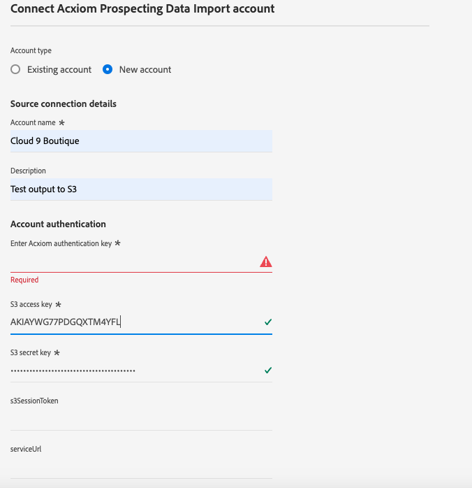
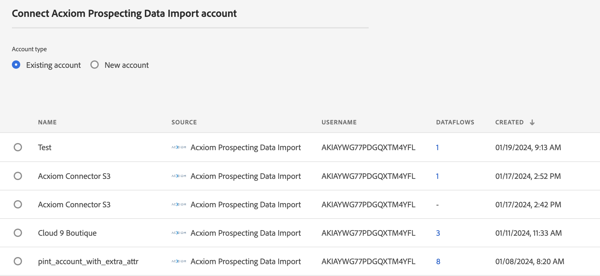

# Crear un [!DNL Acxiom Prospecting Data Import] conexión de origen y flujo de datos en la IU

>[!NOTE]
>
>El [!DNL Acxiom Prospecting Data Import] el origen está en versión beta. Lea el [información general de orígenes](../../../../home.md#terms-and-conditions) para obtener más información sobre el uso de fuentes etiquetadas como beta.

[!DNL Acxiom]La importación de datos de prospección de para Adobe Real-time Customer Data Platform es un proceso para ofrecer las audiencias de clientes potenciales más productivas posibles. [!DNL Acxiom] toma los datos de origen de Real-Time CDP a través de una exportación segura y los ejecuta a través de un sistema de higiene y resolución de identidades galardonado. Esto genera un archivo de datos para utilizarlo como lista de supresión. Este archivo de datos se compara con la base de datos global Acxiom, que permite adaptar las listas de clientes potenciales para su importación.

Puede usar el complemento [!DNL Acxiom] origen para recuperar y asignar respuestas del servicio de cliente potencial de Acxiom mediante Amazon S3 como punto de caída.

Lea este tutorial para aprender a crear un [!DNL Acxiom Prospecting Data Import] conexión de origen y flujo de datos mediante la interfaz de usuario de Adobe Experience Platform.

## Requisitos previos {#prerequisites}

Este tutorial requiere una comprensión práctica de los siguientes componentes de Experience Platform:

* [[!DNL Experience Data Model (XDM)] Sistema](../../../../../xdm/home.md): El marco estandarizado mediante el cual Experience Platform organiza los datos de experiencia del cliente.
   * [Conceptos básicos de composición de esquemas](../../../../../xdm/schema/composition.md): Obtenga información acerca de los componentes básicos de los esquemas XDM, incluidos los principios clave y las prácticas recomendadas en la composición de esquemas.
   * [Tutorial del Editor de esquemas](../../../../../xdm/tutorials/create-schema-ui.md): Aprenda a crear esquemas personalizados mediante la interfaz de usuario del Editor de esquemas.
* [[!DNL Real-Time Customer Profile]](../../../../../profile/home.md): Proporciona un perfil de consumidor unificado y en tiempo real basado en los datos agregados de varias fuentes.
* [[!DNL Prospect Profile]](../../../../../profile/ui/prospect-profile.md): Aprenda a crear y utilizar un perfil de cliente potencial para recopilar información sobre clientes desconocidos mediante información de terceros.

### Recopilar credenciales necesarias

Para acceder al bloque en Experience Platform, debe proporcionar valores válidos para las siguientes credenciales:

| Credencial | Descripción |
| --- | --- |
| [!DNL Acxiom] clave de autenticación | La clave de autenticación. Puede recuperar este valor desde la variable [!DNL Acxiom] equipo. |
| [!DNL Amazon S3] tecla de acceso | ID de clave de acceso para el bloque. Puede recuperar este valor desde la variable [!DNL Acxiom] equipo. |
| [!DNL Amazon S3] clave secreta | El ID de clave secreta de su cubo. Puede recuperar este valor desde la variable [!DNL Acxiom] equipo. |
| Nombre del segmento | Este es el espacio en el que se compartirán los archivos. Puede recuperar este valor desde la variable [!DNL Acxiom] equipo. |

>[!IMPORTANT]
>
>Debe tener ambos **[!UICONTROL Ver orígenes]** y **[!UICONTROL Administrar fuentes]** permisos habilitados para su cuenta con el fin de conectar su [!DNL Acxiom] cuenta para el Experience Platform. Póngase en contacto con el administrador del producto para obtener los permisos necesarios. Para obtener más información, lea la [guía de IU de control de acceso](../../../../../access-control/ui/overview.md).

## Conecte su [!DNL Acxiom] account

En la IU de Platform, seleccione **[!UICONTROL Fuentes]** desde la barra de navegación izquierda para acceder a [!UICONTROL Fuentes] workspace. El [!UICONTROL Catálogo] La pantalla muestra una variedad de fuentes para las que puede crear una cuenta con.

Puede seleccionar la categoría adecuada del catálogo en la parte izquierda de la pantalla. También puede encontrar la fuente específica con la que desea trabajar utilizando la opción de búsqueda.

En el **[!UICONTROL Socios de datos e identidad]** categoría, seleccionar **[!UICONTROL Importación de datos de prospección de Acxiom]** y luego seleccione **[!UICONTROL Configuración de]**.

>[!TIP]
>
>Tarjeta de origen que se muestra **[!UICONTROL Añadir datos]** significa que el origen ya tiene una cuenta autenticada. Por otro lado, una tarjeta de origen que muestra **[!UICONTROL Configuración de]** significa que debe proporcionar credenciales y crear una nueva cuenta para utilizar ese origen.

### Crear una nueva cuenta

Si está usando credenciales nuevas, seleccione **[!UICONTROL Nueva cuenta]**. En el formulario de entrada que aparece, proporcione un nombre, una descripción opcional y su [!DNL Acxiom] credenciales. Cuando termine, seleccione **[!UICONTROL Conectar con el origen]** y, a continuación, espere un poco para que se establezca la nueva conexión.

| Credenciales | Descripción |
| --- | --- |
| Nombre de la cuenta | El nombre de la cuenta. |
| Descripción | (Opcional) Una breve explicación del propósito de la cuenta. |
| [!DNL Acxiom] clave de autenticación | El [!DNL Acxiom]Clave proporcionada por el usuario requerida para la aprobación de cuentas. Debe coincidir con el valor correcto antes de establecer una conexión con la base de datos.  Esta clave debe tener 24 caracteres y solo puede incluir: A-Z, a-z y 0-9. |
| Clave de acceso de S3 | La clave de acceso S3 hace referencia a la ubicación de Amazon S3. Esto lo proporciona el administrador cuando se definen los permisos de la función S3. |
| Clave secreta S3 | La clave secreta S3 hace referencia a la ubicación de Amazon S3. Esto lo proporciona el administrador cuando se definen los permisos de la función S3. |
| s3SessionToken | (Opcional) El valor del token de autenticación al conectarse a S3. |
| serviceUrl | (Opcional) La ubicación URL que se utilizará al conectarse a S3 en una ubicación no estándar. |
| Nombre del segmento | (Opcional) Nombre del contenedor de S3 configurado en S3 que sirve como ruta de inicio en la selección de datos. |
| Ruta de carpeta | Si se utilizan subdirectorios en un bloque, también se puede especificar una ruta como ruta de inicio en la selección de datos. |

### Usar una cuenta existente

Para usar una cuenta existente, seleccione **[!UICONTROL Cuenta existente]**.

Seleccione una cuenta de la lista para ver los detalles de dicha cuenta. Una vez seleccionada una cuenta, seleccione **[!UICONTROL Siguiente]** para continuar.

## Seleccionar datos

Seleccione el archivo que desea introducir del bloque y el subdirectorio deseados. Se puede proporcionar una vista previa de los datos una vez definidos el delimitador y el tipo de compresión. Una vez seleccionado el archivo, seleccione **[!UICONTROL Siguiente]** para continuar.

>[!NOTE]
>
>Aunque los tipos de archivo JSON y Parquet aparecen en la lista, no es necesario ni se espera que los utilice durante el [!DNL Acxiom] flujo de trabajo de origen.

## Proporcionar detalles del conjunto de datos y flujo de datos

A continuación, debe proporcionar información sobre el conjunto de datos y el flujo de datos.

### Detalles del conjunto de datos

>[!BEGINTABS]

>[!TAB Usar un nuevo conjunto de datos]

Un conjunto de datos es una construcción de almacenamiento y administración para una colección de datos, normalmente una tabla, que contiene un esquema (columnas) y campos (filas). Los datos que se incorporan correctamente al Experience Platform se conservan dentro del lago de datos como conjuntos de datos. Para utilizar un nuevo conjunto de datos, seleccione **[!UICONTROL Nuevo conjunto de datos]**.

| Nuevos detalles del conjunto de datos | Descripción |
| --- | --- |
| Nombre del conjunto de datos de salida | Nombre del nuevo conjunto de datos. |
| Descripción | (Opcional) Una breve explicación del propósito del conjunto de datos. |
| Esquema | Una lista desplegable de esquemas que existen en su organización. También puede crear su propio esquema antes del proceso de configuración de origen. Para obtener más información, lea la guía de [creación de esquemas en la IU](../../../../../xdm/tutorials/create-schema-ui.md). |

>[!TAB Usar un conjunto de datos existente]

Para utilizar un conjunto de datos existente, seleccione **[!UICONTROL Conjunto de datos existente]**.

Puede seleccionar **[!UICONTROL Búsqueda avanzada]** para ver una ventana de todos los conjuntos de datos de su organización, incluidos sus detalles respectivos, como si están habilitados para su ingesta en el Perfil del cliente en tiempo real.

>[!ENDTABS]

### Detalles del flujo de datos

Durante este paso, si el conjunto de datos está habilitado para Perfil, puede seleccionar **[!UICONTROL Conjunto de datos de perfil]** Marcar para habilitar los datos de la ingesta de perfiles. También puede activar [!UICONTROL Diagnósticos de error] y [!UICONTROL Ingesta parcial].

* **Diagnóstico de errores** - Seleccionar **Diagnósticos de error** para indicar a la fuente que produzca diagnósticos de error a los que posteriormente pueda hacer referencia mediante API. Para obtener más información, lea la [resumen de diagnósticos de error](../../../../../ingestion/quality/error-diagnostics.md)
* **Habilitar ingesta parcial** - La ingesta parcial por lotes es la capacidad de ingerir datos que contengan errores, hasta un determinado umbral. Con esta capacidad, los usuarios pueden introducir correctamente todos sus datos correctos en Adobe Experience Platform, mientras que todos sus datos incorrectos se agrupan por separado, junto con los detalles de por qué no es válido.  Para obtener más información, lea la [Resumen de ingesta parcial](../../../../../ingestion/batch-ingestion/partial.md)

| Configuraciones de flujo de datos | Descripción |
| --- | --- |
| Nombre de flujo de datos | Nombre del flujo de datos.  De forma predeterminada, se utiliza el nombre del archivo que se está importando. |
| Descripción | (Opcional) Una breve descripción del flujo de datos. |
| Alertas | El Experience Platform puede generar alertas basadas en eventos a las que los usuarios pueden suscribirse; todas estas opciones incluyen un flujo de datos en ejecución para almacenarlas en déclencheur.  Para obtener más información, lea la [información general sobre alertas](../../alerts.md) <ul><li>**Inicio de ejecución de flujo de datos**: seleccione esta alerta para recibir una notificación cuando comience la ejecución del flujo de datos.</li><li>**Ejecución correcta del flujo de datos de orígenes**: seleccione esta alerta para recibir una notificación si el flujo de datos termina sin errores.</li><li>**Error al ejecutar flujo de datos de fuentes**: seleccione esta alerta para recibir una notificación si la ejecución del flujo de datos termina con errores.</li></ul> |

## Asignación

Utilice la interfaz de asignación para asignar los datos de origen a los campos de esquema adecuados antes de introducir datos en el Experience Platform.  Para obtener más información, lea la [Guía de asignación en la IU de](../../../../../data-prep/ui/mapping.md)

## Programe la ingesta del flujo de datos

Utilice la interfaz de programación para definir la programación de ingesta del flujo de datos.

* **Frecuencia**: configure la frecuencia para indicar con qué frecuencia debe ejecutarse el flujo de datos. Puede establecer su frecuencia en: una vez, minuto, hora, día o semana.
* **Intervalo**: Una vez seleccionada una frecuencia, puede configurar la configuración del intervalo para establecer el lapso de tiempo entre cada ingesta. Por ejemplo, si establece la frecuencia en día y configura el intervalo en 15, el flujo de datos se ejecutará cada 15 días. El intervalo no puede establecerse en cero y debe establecerse en al menos 15.
* **Hora de inicio** - La marca de tiempo de la ejecución proyectada, presentada en la zona horaria UTC.
* **Relleno** : El relleno determina qué datos se incorporan inicialmente. Si el relleno está habilitado, todos los archivos actuales de la ruta especificada se introducirán durante la primera ingesta programada. Si se desactiva el relleno, solo se incorporarán los archivos que se carguen entre la primera ejecución de la ingesta y la hora de inicio. Los archivos cargados antes de la hora de inicio no se incorporarán.

## Revisión del flujo de datos

Utilice la página Revisar para obtener un resumen del flujo de datos antes de la ingesta. Los detalles se agrupan en las siguientes categorías:

* **Conexión** : Muestra el tipo de origen, la ruta relevante del archivo de origen elegido y la cantidad de columnas dentro de ese archivo de origen.
* **Asignar campos de conjunto de datos y asignación** : Muestra en qué conjunto de datos se están ingiriendo los datos de origen, incluido el esquema al que se adhiere el conjunto de datos.
* **Programación** - Muestra el periodo activo, la frecuencia y el intervalo de la programación de ingesta.
Una vez que haya revisado el flujo de datos, haga clic en Finalizar y espere un poco para que se cree el flujo de datos.

## Pasos siguientes

Al seguir este tutorial, ha creado correctamente un flujo de datos para extraer datos por lotes de su [!DNL Acxiom] origen a Experience Platform. Para obtener recursos adicionales, visite la documentación descrita a continuación.

### Monitorización del flujo de datos

Una vez creado el flujo de datos, puede monitorizar los datos que se están ingiriendo a través de él para ver información sobre las tasas de ingesta, el éxito y los errores. Para obtener más información sobre cómo monitorizar el flujo de datos, visite el tutorial sobre [monitorización de cuentas y flujos de datos en la IU](../../monitor.md).

### Actualizar el flujo de datos

Para actualizar las configuraciones de la programación, la asignación y la información general de los flujos de datos, visite el tutorial sobre [actualización de flujos de datos de origen en la IU](../../update-dataflows.md)

### Eliminar el flujo de datos

Puede eliminar los flujos de datos que ya no son necesarios o que se crearon incorrectamente utilizando **[!UICONTROL Eliminar]** función disponible en el **[!UICONTROL Flujos de datos]** workspace. Para obtener más información sobre cómo eliminar flujos de datos, visite el tutorial sobre [eliminación de flujos de datos en la IU](../../delete.md).

## Recursos adicionales {#additional-resources}

[!DNL Acxiom] Datos de audiencia y distribución: https://www.acxiom.com/customer-data/audience-data-distribution/
