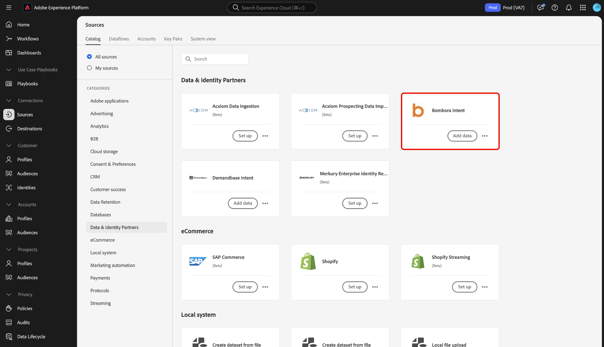

# Conectar [!DNL Bombora Intent] a Experience Platform mediante la interfaz de usuario

Lea esta guía para obtener información sobre cómo conectar su cuenta de [!DNL Bombora Intent] a Adobe Experience Platform mediante la interfaz de usuario.

## Introducción 

Este tutorial requiere una comprensión práctica de los siguientes componentes de Experience Platform:

* [Real-Time CDP B2B edition](../../../../../rtcdp/b2b-overview.md): Real-Time CDP B2B edition está diseñado específicamente para los especialistas en marketing que operan en un modelo de servicio de empresa a empresa. Agrupa datos de varias fuentes y los combina en una sola vista de personas y perfiles de cuenta. Estos datos unificados permiten a los especialistas en marketing dirigirse a públicos específicos con precisión y captarlos en todos los canales disponibles.
* [Fuentes](../../../../home.md): Experience Platform permite la ingesta de datos de varias fuentes al tiempo que le ofrece la capacidad de estructurar, etiquetar y mejorar los datos entrantes mediante los servicios de Experience Platform.
* [Zonas protegidas](../../../../../sandboxes/home.md): Experience Platform proporciona zonas protegidas virtuales que dividen una sola instancia de Experience Platform en entornos virtuales independientes para ayudar a desarrollar y evolucionar aplicaciones de experiencia digital.

## Navegar por el catálogo de fuentes

En la interfaz de usuario de Experience Platform, seleccione **[!UICONTROL Fuentes]** en el panel de navegación izquierdo para acceder al área de trabajo *[!UICONTROL Fuentes]*. Puede seleccionar la categoría adecuada en el panel *[!UICONTROL Categorías]*. También puede utilizar la barra de búsqueda para desplazarse al origen específico que desee utilizar.

Para usar [!DNL Bombora], seleccione la tarjeta de origen **[!UICONTROL Bombora Intent]** en *[!UICONTROL Socios de datos e identidad]* y, a continuación, seleccione **[!UICONTROL Agregar datos]**.

>[!TIP]
>
>Los orígenes del catálogo de orígenes muestran la opción **[!UICONTROL Set up]** cuando un origen determinado aún no tiene una cuenta autenticada. Una vez que existe una cuenta autenticada, esta opción cambia a **[!UICONTROL Agregar datos]**.

## Autenticación {#authentication}

### Usar una cuenta existente {#existing}

Para usar una cuenta existente, seleccione **[!UICONTROL Cuenta existente]** y luego seleccione la cuenta que desee usar de la lista de cuentas en la interfaz.

Una vez que haya seleccionado su cuenta, seleccione **[!UICONTROL Siguiente]** para continuar con el paso siguiente.

### Crear una nueva cuenta {#create}

Si no tiene una cuenta existente, debe crear una nueva cuenta proporcionando las credenciales de autenticación necesarias que se correspondan con su origen.

Para crear una cuenta nueva, selecciona **[!UICONTROL Cuenta nueva]** y, a continuación, proporciona un nombre de cuenta y, opcionalmente, una descripción para los detalles de la cuenta. A continuación, proporcione los valores de autenticación adecuados para autenticar el origen con Experience Platform. Para conectar su cuenta de [!DNL Bombora], debe tener las siguientes credenciales:

* **Id. de clave de acceso**: Su id. de clave de acceso [!DNL Bombora]. Se trata de una cadena alfanumérica de 61 caracteres que es necesaria para autenticar su cuenta en Experience Platform.
* **Clave de acceso secreta**: Su clave de acceso secreta [!DNL Bombora]. Es una cadena de 40 caracteres con codificación base 64 necesaria para autenticar su cuenta en Experience Platform.
* **Nombre del contenedor**: el contenedor [!DNL Bombora] desde el que se extraerán los datos.

## Proporcionar detalles del flujo de datos {#provide-dataflow-details}

Una vez que la cuenta esté autenticada y conectada, ahora debe proporcionar los siguientes detalles para el flujo de datos:

* **Nombre de flujo de datos**: Nombre del flujo de datos. Puede utilizar este nombre para buscar el flujo de datos en la interfaz de usuario, una vez creado y procesado.
* **Descripción**: (Opcional) Una breve explicación o información adicional para el flujo de datos.
* **Origen del dominio**: Campo del dominio o sitio web que coincide con los registros de la cuenta de origen respecto a las cuentas de Experience Platform. Este valor puede depender de las configuraciones. Si no se proporciona, el dominio predeterminado es accountOrganization.website.

## Programación del flujo de datos {#schedule-dataflow}

A continuación, utilice la interfaz de programación para configurar una programación de ingesta para el flujo de datos.

* **Frecuencia**: configure la frecuencia para indicar con qué frecuencia debe ejecutarse el flujo de datos. Puede programar su flujo de datos de [!DNL Bombora] para que ingrese datos con una frecuencia semanal.
* **Intervalo**: el intervalo representa la cantidad de tiempo entre cada ciclo de ingesta. El único intervalo admitido para un flujo de datos de [!DNL Bombora] es 1. Esto significa que el flujo de datos ingerirá datos una vez a la semana, cada semana.
* **Hora de inicio**: La hora de inicio dicta cuándo se producirá la primera iteración de ejecución del flujo de datos. [!DNL Bombora] envía datos a Adobe una vez a la semana, los lunes, a las 12:00 p.m. UTC. Por lo tanto, debe establecer la hora de inicio de la ingesta después de las 12:00 PM UTC. Además, debe confirmar el tiempo de ingesta con [!DNL Bombora], ya que pueden alterar su programación al soltar archivos en Adobe.

Una vez que haya configurado la programación de ingesta del flujo de datos, seleccione **[!UICONTROL Siguiente]**.

## Revisar flujo de datos {#review-dataflow}

El paso final del proceso de creación del flujo de datos es revisar el flujo de datos antes de ejecutarlo. Use el paso *[!UICONTROL Revisar]* para revisar los detalles del nuevo flujo de datos antes de que se ejecute. Los detalles se agrupan en las siguientes categorías:

* **Conexión**: muestra el tipo de origen, la ruta de acceso relevante del archivo de origen elegido y el número de columnas dentro de ese archivo de origen.
* **Programación**: muestra el período activo, la frecuencia y el intervalo de la programación de ingesta.

Una vez que haya revisado el flujo de datos, seleccione **[!UICONTROL Finalizar]**.

## Pasos siguientes

Al seguir este tutorial, ha creado correctamente un flujo de datos para llevar los datos de intención de su origen de [!DNL Bombora] a Experience Platform. Para obtener recursos adicionales, visite la documentación descrita a continuación.

### Monitorización del flujo de datos

Una vez creado el flujo de datos, puede monitorizar los datos que se están ingiriendo a través de él para ver información sobre las tasas de ingesta, el éxito y los errores. Para obtener más información sobre cómo supervisar el flujo de datos, visite el tutorial sobre [supervisar cuentas y flujos de datos en la interfaz de usuario](../../../../../dataflows/ui/monitor-sources.md).

### Actualizar el flujo de datos

Para actualizar configuraciones para la programación, asignación e información general de los flujos de datos, visite el tutorial sobre [actualización de flujos de datos de origen en la interfaz de usuario](../../update-dataflows.md).

### Eliminar el flujo de datos

Puede eliminar flujos de datos que ya no sean necesarios o que se hayan creado incorrectamente mediante la función **[!UICONTROL Delete]** disponible en el área de trabajo **[!UICONTROL Flujos de datos]**. Para obtener más información sobre cómo eliminar flujos de datos, visite el tutorial sobre [eliminar flujos de datos en la interfaz de usuario](../../delete.md).
