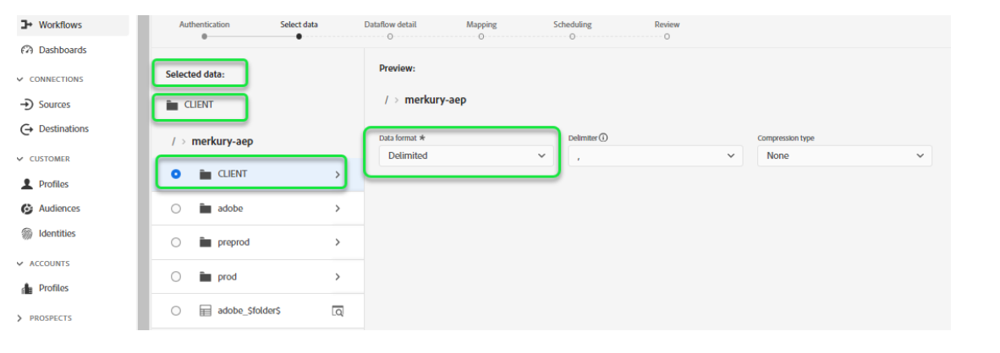
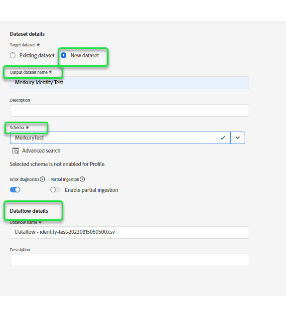
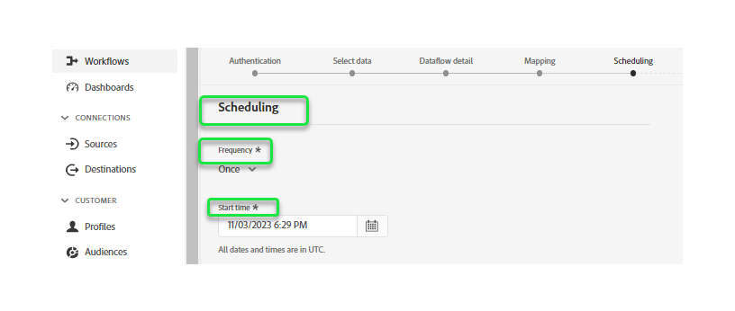

# Crear un [!DNL Merkury Enterprise Identity Resolution] conexión de origen y flujo de datos en la IU

>[!NOTE]
>
>El [!DNL Merkury Enterprise Identity Resolution] el origen está en versión beta. Lea el [información general de orígenes](../../../../home.md#terms-and-conditions) para obtener más información sobre el uso de fuentes etiquetadas como beta.

Este tutorial proporciona los pasos para crear una [!DNL Merkury Enterprise Identity Resolution] conexión de origen y flujo de datos mediante la interfaz de usuario de Adobe Experience Platform.

## Introducción 

Este tutorial requiere una comprensión práctica de los siguientes componentes de Experience Platform:

* [[!DNL Experience Data Model (XDM)] Sistema](../../../../../xdm/home.md): El marco estandarizado mediante el cual Experience Platform organiza los datos de experiencia del cliente.
   * [Conceptos básicos de composición de esquemas](../../../../../xdm/schema/composition.md): Obtenga información acerca de los componentes básicos de los esquemas XDM, incluidos los principios clave y las prácticas recomendadas en la composición de esquemas.
   * [Tutorial del Editor de esquemas](../../../../../xdm/tutorials/create-schema-ui.md): Aprenda a crear esquemas personalizados mediante la interfaz de usuario del Editor de esquemas.
* [[!DNL Real-Time Customer Profile]](../../../../../profile/home.md): Proporciona un perfil de consumidor unificado y en tiempo real basado en los datos agregados de varias fuentes.

### Recopilar credenciales necesarias

Para acceder al bloque en Experience Platform, debe proporcionar valores válidos para las siguientes credenciales:

| Credencial | Descripción |
| --- | --- |
| Clave de acceso | ID de clave de acceso para el bloque. Puede recuperar este valor de su [!DNL Merkury] equipo. |
| Clave secreta | El ID de clave secreta de su cubo. Puede recuperar este valor de su [!DNL Merkury] equipo. |
| Nombre del segmento | Este es su espacio de Mercury donde se compartirán los archivos. Puede recuperar este valor de su [!DNL Merkury] equipo. |

Para obtener más información sobre la configuración de para [!DNL Merkury] y otros requisitos previos, lea el [[!DNL Merkury] descripción general de origen](../../../../connectors/data-partners/merkury.md).

## Conecta tu cuenta de Merkury

En la IU de Platform, seleccione **[!UICONTROL Fuentes]** desde la barra de navegación izquierda para acceder a [!UICONTROL Fuentes] workspace. El [!UICONTROL Catálogo] La pantalla muestra una variedad de fuentes para las que puede crear una cuenta con.

Puede seleccionar la categoría adecuada del catálogo en la parte izquierda de la pantalla. También puede encontrar la fuente específica con la que desea trabajar utilizando la opción de búsqueda.

En el **[!UICONTROL Socios de datos]** categoría, seleccionar **[!UICONTROL Merkury]** y luego seleccione **[!UICONTROL Configuración de]**.

El **[!UICONTROL Conectar con Merkury]** página. En esta página, puede usar credenciales nuevas o existentes.

### Crear una nueva cuenta

Si está usando credenciales nuevas, seleccione **[!UICONTROL Nueva cuenta]**. En el formulario de entrada que aparece, proporcione un nombre, una descripción opcional y su [!DNL Merkury] credenciales. Cuando termine, seleccione **[!UICONTROL Conectar con el origen]** y, a continuación, espere un poco para que se establezca la nueva conexión.

### Usar una cuenta existente

Para usar una cuenta existente, seleccione **[!UICONTROL Cuenta existente]** y luego seleccione la [!DNL Merkury] cuenta que desea utilizar. Seleccione **[!UICONTROL Siguiente]** para continuar.

>[!BEGINSHADEBOX]

**Formatos de archivo compatibles**

Puede introducir los siguientes formatos de archivo con el [!DNL Merkury] fuente:

* Valores separados por delimitadores (DSV): cualquier valor de un solo carácter puede utilizarse como delimitador para archivos de datos con formato DSV.
* [!DNL JavaScript Object Notation] (JSON): Los archivos de datos con formato JSON deben ser compatibles con XDM.
* [!DNL Apache Parquet]: los archivos de datos con formato de parquet deben ser compatibles con XDM.
* Archivos comprimidos: los archivos JSON y delimitados se pueden comprimir como: `bzip2`, `gzip`, `deflate`, `zipDeflate`, `tarGzip`, y `tar`.

>[!ENDSHADEBOX]

## Adición de datos

Después de crear su [!DNL Merkury] cuenta, la **[!UICONTROL Añadir datos]** Este paso aparece y proporciona una interfaz para que explore su [!DNL Merkury] jerarquía de archivos y seleccione la carpeta o el archivo específico que desea llevar al Experience Platform.

* La parte izquierda de la interfaz es un explorador de directorios, que muestra su [!DNL Merkury] jerarquía de archivos.
* La parte derecha de la interfaz permite obtener una vista previa de hasta 100 filas de datos desde una carpeta o archivo compatible.

Seleccione la carpeta raíz para acceder a la jerarquía de carpetas. Desde aquí, puede seleccionar una sola carpeta para introducir todos los archivos de la carpeta de forma recursiva. Al ingerir una carpeta completa, debe asegurarse de que todos los archivos de esa carpeta compartan el mismo formato de datos y esquema.

Una vez seleccionada una carpeta, la interfaz correcta se actualiza a una vista previa del contenido y la estructura del primer archivo de la carpeta seleccionada.

Durante este paso, puede realizar varias configuraciones en los datos antes de continuar. Primero, seleccione **[!UICONTROL Formato de datos]** y, a continuación, seleccione el formato de datos adecuado para el archivo en el panel desplegable que aparece.

La siguiente tabla muestra los formatos de datos adecuados para los tipos de archivo admitidos:

| Tipo de archivo | Formato de datos |
| --- | --- |
| CSV | [!UICONTROL Delimitado] |
| JSON | [!UICONTROL JSON] |
| Parquet | [!UICONTROL XDM Parquet] |

### Seleccionar un delimitador de columna

+++Seleccione esta opción para ver los pasos sobre cómo establecer un delimitador

Después de configurar el formato de datos, puede establecer un delimitador de columna al ingerir archivos delimitados. Seleccione el **[!UICONTROL Delimitador]** y, a continuación, seleccione un delimitador en el menú desplegable. El menú muestra las opciones utilizadas con más frecuencia para delimitadores, incluida una coma (`,`), una pestaña (`\t`) y una barra vertical (`|`).

Si prefiere utilizar un delimitador personalizado, seleccione **[!UICONTROL Personalizado]** e introduzca un delimitador de un solo carácter de su elección en la barra de entrada emergente.

+++

### Ingesta de archivos comprimidos

+++ Seleccione esta opción para ver los pasos de ingesta de archivos comprimidos

También puede introducir archivos JSON comprimidos o delimitados especificando su tipo de compresión.

En el [!UICONTROL Seleccionar datos] , seleccione un archivo comprimido para su ingesta y, a continuación, seleccione su tipo de archivo adecuado y si es compatible con XDM o no. A continuación, seleccione **[!UICONTROL Tipo de compresión]** y, a continuación, seleccione el tipo de archivo comprimido adecuado para los datos de origen.

Para llevar un archivo específico a Platform, seleccione una carpeta y, a continuación, el archivo que desea introducir. Durante este paso, también puede obtener una vista previa del contenido de otros archivos de una carpeta determinada mediante el icono de vista previa junto a un nombre de archivo.

Cuando termine, seleccione **[!UICONTROL Siguiente]**.

+++

## Proporcionar detalles del flujo de datos

El [!UICONTROL Detalles del flujo de datos] le permite seleccionar si desea utilizar un conjunto de datos existente o uno nuevo. Durante este proceso, también puede configurar los datos para que se introduzcan en el perfil y habilitar ajustes como [!UICONTROL Diagnósticos de error], [!UICONTROL Ingesta parcial], y [!UICONTROL Alertas].

### Usar un conjunto de datos existente

Para introducir datos en un conjunto de datos existente, seleccione **[!UICONTROL Conjunto de datos existente]**. Puede recuperar un conjunto de datos existente mediante la variable [!UICONTROL Búsqueda avanzada] o desplazándose por la lista de conjuntos de datos existentes en el menú desplegable. Una vez seleccionado un conjunto de datos, proporcione un nombre y una descripción para el flujo de datos.

### Usar un nuevo conjunto de datos

Para introducir en un nuevo conjunto de datos, seleccione **[!UICONTROL Nuevo conjunto de datos]** y, a continuación, proporcione un nombre del conjunto de datos de salida y una descripción opcional. A continuación, seleccione un esquema al que asignar mediante la variable [!UICONTROL Búsqueda avanzada] o desplazándose por la lista de esquemas existentes en el menú desplegable. Una vez seleccionado un esquema, proporcione un nombre y una descripción para el flujo de datos.

### Habilitar diagnósticos de perfil y error

+++Seleccione esta opción para ver los pasos para habilitar el diagnóstico de errores y la ingesta de perfiles

A continuación, seleccione la **[!UICONTROL Conjunto de datos de perfil]** para habilitar su conjunto de datos para el perfil del cliente en tiempo real. Esto le permite crear una vista integral de los atributos y comportamientos de una entidad. Los datos de todos los conjuntos de datos habilitados para perfiles se incluirán en el perfil y los cambios se aplicarán al guardar el flujo de datos.

[!UICONTROL Diagnósticos de error] permite generar mensajes de error detallados para cualquier registro erróneo que se produzca en el flujo de datos, mientras que [!UICONTROL Ingesta parcial] permite la ingesta de datos que contienen errores, hasta un determinado umbral que se define manualmente. Consulte la [resumen de ingesta parcial por lotes](../../../../../ingestion/batch-ingestion/partial.md) para obtener más información.

+++

### Habilitar alertas

+++Seleccione esta opción para ver los pasos necesarios para activar las alertas

Puede activar alertas para recibir notificaciones sobre el estado del flujo de datos. Seleccione una alerta de la lista a la que suscribirse para recibir notificaciones sobre el estado del flujo de datos. Para obtener más información sobre las alertas, consulte la guía de [suscripción a alertas de fuentes mediante la IU](../../alerts.md).

Cuando haya terminado de proporcionar detalles al flujo de datos, seleccione **[!UICONTROL Siguiente]**.

+++

## Asignación de campos de datos a un esquema XDM

El [!UICONTROL Asignación] Este paso aparece y le proporciona una interfaz para asignar los campos de origen del esquema de origen a sus campos XDM de destino adecuados en el esquema de destino.

Platform proporciona recomendaciones inteligentes para campos asignados automáticamente en función del esquema o el conjunto de datos de destino seleccionado. Puede ajustar manualmente las reglas de asignación para adaptarlas a sus casos de uso. En función de sus necesidades, puede elegir asignar campos directamente o utilizar funciones de preparación de datos para transformar los datos de origen y derivar valores calculados o calculados. Para ver los pasos detallados sobre el uso de la interfaz de asignación y los campos calculados, consulte la [Guía de IU de preparación de datos](../../../../../data-prep/ui/mapping.md).

Una vez que los datos de origen se hayan asignado correctamente, seleccione **[!UICONTROL Siguiente]**.

## Programar ejecuciones de ingesta

El [!UICONTROL Programación] Este paso aparece, lo que le permite configurar una programación de ingesta para introducir automáticamente los datos de origen seleccionados mediante las asignaciones configuradas. De forma predeterminada, la programación está configurada en `Once`. Para ajustar la frecuencia de ingesta, seleccione **[!UICONTROL Frecuencia]** y, a continuación, seleccione una opción en el menú desplegable.

>[!TIP]
>
>El intervalo y el relleno no son visibles durante una ingesta única.

Si establece la frecuencia de ingesta en `Minute`, `Hour`, `Day`, o `Week`, debe establecer un intervalo para establecer un intervalo de tiempo establecido entre cada ingesta. Por ejemplo, una frecuencia de ingesta establecida en `Day` y un intervalo establecido en `15` significa que el flujo de datos está programado para introducir datos cada 15 días.

Durante este paso, también puede activar **relleno** y defina una columna para la ingesta incremental de datos. El relleno se utiliza para introducir datos históricos, mientras que la columna que defina para la ingesta incremental permite diferenciar los nuevos datos de los datos existentes.

Consulte la tabla siguiente para obtener más información sobre las configuraciones de programación.

| Campo | Descripción |
| --- | --- |
| Frecuencia | La frecuencia con la que se produce una ingesta. Las frecuencias seleccionables incluyen `Once`, `Minute`, `Hour`, `Day`, y `Week`. |
| Intervalo | Un entero que define el intervalo para la frecuencia seleccionada. El valor del intervalo debe ser un entero distinto de cero y debe establecerse en mayor o igual que 15. |
| Hora de inicio | Una marca de tiempo UTC que indica cuándo se configurará para que se produzca la primera ingesta. La hora de inicio debe ser posterior o igual a la hora UTC actual. |
| Relleno | Un valor booleano que determina qué datos se incorporan inicialmente. Si el relleno está habilitado, todos los archivos actuales de la ruta especificada se introducirán durante la primera ingesta programada. Si se desactiva el relleno, solo se incorporarán los archivos que se carguen entre la primera ejecución de la ingesta y la hora de inicio. Los archivos cargados antes de la hora de inicio no se incorporarán. |

>[!NOTE]
>
>Para la ingesta por lotes, cada flujo de datos posterior selecciona los archivos que se van a ingerir desde el origen en función de su **última modificación** marca de tiempo. Esto significa que los flujos de datos por lotes seleccionan archivos del origen que son nuevos o que se han modificado desde la última ejecución del flujo. Además, debe asegurarse de que haya un lapso de tiempo suficiente entre la carga del archivo y una ejecución de flujo programada, ya que es posible que los archivos que no se han cargado completamente en su cuenta de almacenamiento en la nube antes del tiempo de ejecución del flujo programado no se recojan para su ingesta.

Cuando termine de configurar la programación de ingesta, seleccione **[!UICONTROL Siguiente]**.

## Revisión del flujo de datos

El **[!UICONTROL Revisar]** Este paso aparece, lo que le permite revisar el nuevo flujo de datos antes de crearlo. Los detalles se agrupan en las siguientes categorías:

* **[!UICONTROL Conexión]**: Muestra el tipo de origen, la ruta relevante del archivo de origen elegido y la cantidad de columnas dentro de ese archivo de origen.
* **[!UICONTROL Asignar campos de conjunto de datos y asignación]**: Muestra en qué conjunto de datos se están ingiriendo los datos de origen, incluido el esquema al que se adhiere el conjunto de datos.
* **[!UICONTROL Programación]**: Muestra el periodo activo, la frecuencia y el intervalo de la programación de ingesta.

Una vez revisado el flujo de datos, haga clic en **[!UICONTROL Finalizar]** y deje pasar un tiempo para crear el flujo de datos.

## Pasos siguientes

Al seguir este tutorial, ha creado correctamente un flujo de datos para extraer datos por lotes de su [!DNL Merkury] origen a Experience Platform. Para obtener recursos adicionales, visite la documentación descrita a continuación.

### Monitorización del flujo de datos

Una vez creado el flujo de datos, puede monitorizar los datos que se están ingiriendo a través de él para ver información sobre las tasas de ingesta, el éxito y los errores. Para obtener más información sobre cómo monitorizar el flujo de datos, visite el tutorial sobre [monitorización de cuentas y flujos de datos en la IU](../../monitor.md).

### Actualizar el flujo de datos

Para actualizar las configuraciones de la programación, la asignación y la información general de los flujos de datos, visite el tutorial sobre [actualización de flujos de datos de origen en la IU](../../update-dataflows.md)

### Eliminar el flujo de datos

Puede eliminar los flujos de datos que ya no son necesarios o que se crearon incorrectamente utilizando **[!UICONTROL Eliminar]** función disponible en el **[!UICONTROL Flujos de datos]** workspace. Para obtener más información sobre cómo eliminar flujos de datos, visite el tutorial sobre [eliminación de flujos de datos en la IU](../../delete.md).