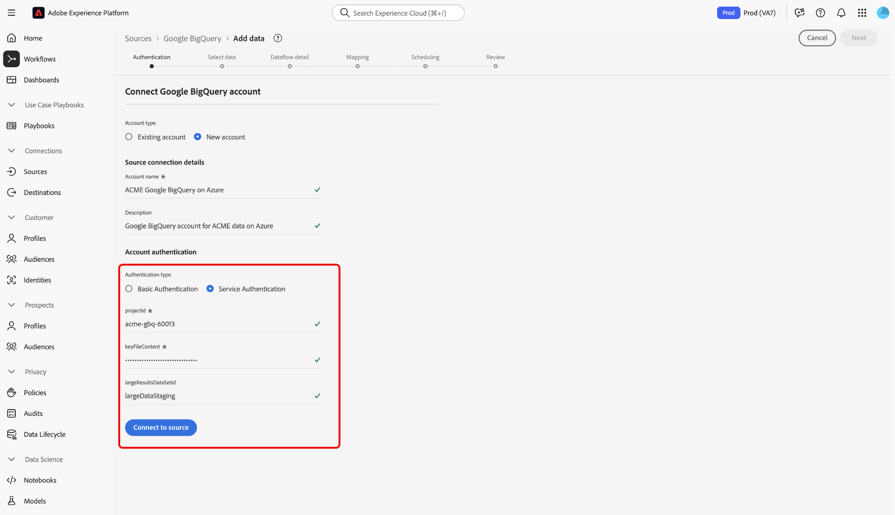

# Conectar [!DNL Google BigQuery] a Experience Platform mediante la interfaz de usuario

>[!IMPORTANT]
>
>El origen [!DNL Google BigQuery] está disponible en el catálogo de orígenes para los usuarios que han adquirido Real-Time Customer Data Platform Ultimate.

Lea este tutorial para aprender a conectar su cuenta de [!DNL Google BigQuery] a Adobe Experience Platform mediante la interfaz de usuario.

## Introducción 

Este tutorial requiere una comprensión práctica de los siguientes componentes de Experience Platform:

* [[!DNL Experience Data Model (XDM)] Sistema](../../../../../xdm/home.md): El marco estandarizado mediante el cual Experience Platform organiza los datos de experiencia del cliente.
   * [Aspectos básicos de la composición de esquemas](../../../../../xdm/schema/composition.md): obtenga información sobre los componentes básicos de los esquemas XDM, incluidos los principios clave y las prácticas recomendadas en la composición de esquemas.
   * [Tutorial del editor de esquemas](../../../../../xdm/tutorials/create-schema-ui.md): Aprenda a crear esquemas personalizados mediante la interfaz de usuario del editor de esquemas.
* [[!DNL Real-Time Customer Profile]](../../../../../profile/home.md): proporciona un perfil de consumidor unificado y en tiempo real basado en los datos agregados de varias fuentes.

Si ya tiene una conexión [!DNL Google BigQuery] válida, puede omitir el resto de este documento y continuar con el tutorial sobre [configuración de un flujo de datos](../../dataflow/databases.md).

### Recopilar credenciales necesarias

Lea la [[!DNL Google BigQuery] guía de autenticación](../../../../connectors/databases/bigquery.md#prerequisites) para ver los pasos detallados sobre cómo recopilar las credenciales requeridas.

## Navegar por el catálogo de fuentes {#navigate}

En la interfaz de usuario de Experience Platform, seleccione **[!UICONTROL Fuentes]** en el panel de navegación izquierdo para acceder al área de trabajo *[!UICONTROL Fuentes]*. Puede seleccionar la categoría adecuada en el panel *[!UICONTROL Categorías]*. También puede utilizar la barra de búsqueda para desplazarse al origen específico que desee utilizar.

Para usar [!DNL Google BigQuery], seleccione la tarjeta de origen **[!UICONTROL Google BigQuery]** en *[!UICONTROL Bases de datos]* y luego seleccione **[!UICONTROL Agregar datos]**.

>[!TIP]
>
>Los orígenes del catálogo de orígenes muestran la opción **[!UICONTROL Set up]** cuando un origen determinado aún no tiene una cuenta autenticada. Una vez creada una cuenta autenticada, esta opción cambia a **[!UICONTROL Agregar datos]**.

## Usar una cuenta existente {#existing}

Para usar una cuenta existente, selecciona la cuenta de [!DNL Google BigQuery] con la que deseas conectarte y, a continuación, selecciona **[!UICONTROL Siguiente]** para continuar.

## Crear una nueva cuenta {#create}

Si no tiene una cuenta existente, debe crear una nueva cuenta proporcionando las credenciales de autenticación necesarias que se correspondan con su origen.

Para crear una cuenta nueva, selecciona **[!UICONTROL Cuenta nueva]** y, a continuación, proporciona un nombre y, opcionalmente, agrega una descripción para tu cuenta.

### Conectarse a Experience Platform en Azure {#azure}

Puede conectar su cuenta de [!DNL Google BigQuery] a Experience Platform en Azure mediante la autenticación básica o de servicio.

>[!BEGINTABS]

>[!TAB Usar autenticación básica]

Para usar la autenticación básica, selecciona **[!UICONTROL Autenticación básica]** y proporciona valores para tu [proyecto, ID de cliente, secreto de cliente, token de actualización y (opcional) conjunto de datos de resultados grandes](../../../../connectors/databases/bigquery.md#generate-your-google-bigquery-credentials). Cuando termine, seleccione **[!UICONTROL Conectarse al origen]** y espere unos momentos para que se establezca la conexión.

>[!TAB Usar autenticación de servicio]

Para usar la autenticación del servicio, selecciona **[!UICONTROL Autenticación del servicio]** y proporciona valores para tu [ID de proyecto, contenido de archivos de claves y (opcional) ID de conjuntos de datos de resultados grandes](../../../../connectors/databases/bigquery.md#generate-your-google-bigquery-credentials). Cuando termine, seleccione **[!UICONTROL Conectarse al origen]** y espere unos momentos para que se establezca la conexión.

>[!ENDTABS]

### Conexión a Experience Platform en Amazon Web Service (AWS) {#aws}

>[!AVAILABILITY]
>
>Esta sección se aplica a las implementaciones de Experience Platform que se ejecutan en Amazon Web Service (AWS). Experience Platform que se ejecuta en AWS está disponible actualmente para un número limitado de clientes. Para obtener más información sobre la infraestructura de Experience Platform compatible, consulte la [descripción general de la nube múltiple de Experience Platform](../../../../../landing/multi-cloud.md).

Para crear una nueva cuenta de [!DNL Google BigQuery] y conectarse a Experience Platform en AWS, asegúrese de que se encuentra en una zona protegida de VA6 y, a continuación, proporcione las credenciales necesarias para la autenticación.

* **Id. de proyecto**: El id. de proyecto que corresponde con su cuenta de [!DNL Google BigQuery].
* **Contenido del archivo de clave**: El archivo de clave que se usa para autenticar la cuenta de servicio. Puede recuperar este valor del [[!DNL Google Cloud service accounts] tablero](https://console.cloud.google.com). El contenido del archivo de claves está en formato JSON. Debe codificar esto en [!DNL Base64] al autenticarse en Experience Platform.
* **ID del conjunto de datos**: El ID del conjunto de datos [!DNL Google BigQuery]. Este ID representa dónde se encuentran las tablas de datos y debe crearse previamente para permitir conjuntos de resultados grandes.

## Omitir vista previa de datos de ejemplo {#skip-preview-of-sample-data}

Durante el paso de selección de datos, puede encontrar un tiempo de espera al ingerir tablas o archivos de datos grandes. Puede omitir la previsualización de datos para evitar el tiempo de espera y seguir viendo el esquema, aunque sin datos de ejemplo. Para omitir la vista previa de datos, active la opción **[!UICONTROL Omitir vista previa de datos de ejemplo]**.

El resto del flujo de trabajo sigue siendo el mismo. La única advertencia es que omitir la previsualización de datos puede impedir que los campos calculados y requeridos se validen automáticamente durante el paso de asignación y, a continuación, tendrá que validar manualmente esos campos durante la asignación.

## Pasos siguientes

Al seguir este tutorial, ha establecido una conexión con su cuenta de [!DNL Google BigQuery]. Ahora puede continuar con el siguiente tutorial y [configurar un flujo de datos para introducir datos en Experience Platform](../../dataflow/databases.md).
