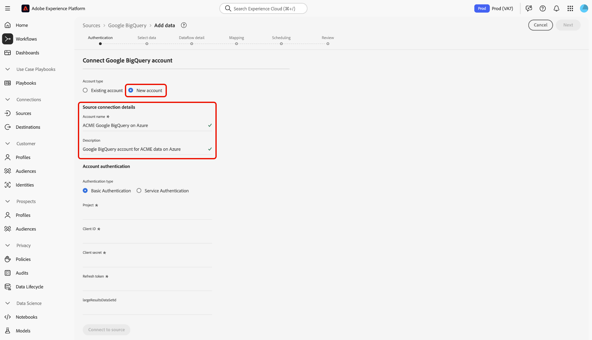

# Creación de un conector de origen de Google Big Consulta en la interfaz de usuario

> [!NOTE]
> El conector Google BigQuery está en fase beta. Las funciones y la documentación están sujetas a cambios.

Los conectores de origen de Adobe Experience Platform permiten la ingesta de datos externos de forma programada. Este tutorial proporciona los pasos para crear un conector de origen de Google Big Consulta (en adelante, &quot;GBQ&quot;) mediante la interfaz de usuario de la plataforma.

## Primeros pasos

Este tutorial requiere un conocimiento práctico de los siguientes componentes de Adobe Experience Platform:

* [Sistema](../../../../../xdm/home.md)de modelo de datos de experiencia (XDM): Marco normalizado mediante el cual la plataforma de experiencias organiza los datos de experiencia del cliente.
   * [Conceptos básicos de la composición](../../../../../xdm/schema/composition.md)de esquemas: Obtenga información sobre los componentes básicos de los esquemas XDM, incluidos los principios clave y las prácticas recomendadas en la composición de esquemas.
   * [Tutorial](../../../../../xdm/tutorials/create-schema-ui.md)del Editor de Esquemas: Obtenga información sobre cómo crear esquemas personalizados mediante la interfaz de usuario del Editor de Esquemas.
* [Perfil](../../../../../profile/home.md)del cliente en tiempo real: Proporciona un perfil de consumo unificado y en tiempo real basado en datos agregados de varias fuentes.

Si ya tiene una conexión base GBQ, puede omitir el resto de este documento y continuar con el tutorial sobre la [configuración de un flujo de datos](../../dataflow/databases.md).

### Recopilar las credenciales necesarias

Para acceder a su cuenta GBQ en Platform, debe proporcionar los siguientes valores:

| Credencial | Descripción |
| ---------- | ----------- |
| `project` | ID de proyecto del proyecto BigQuery predeterminado con el que se realizará la consulta. |
| `clientID` | El valor de ID utilizado para generar el token de actualización. |
| `clientSecret` | El valor secreto utilizado para generar el token de actualización. |
| `refreshToken` | El autentificador de actualización obtenido de Google utilizado para autorizar el acceso a BigQuery. |

Para obtener más información sobre estos valores, consulte [este documento](https://cloud.google.com/storage/docs/json_api/v1/how-tos/authorizing)GBQ.

## Conectar su cuenta GBQ

Una vez que haya recopilado las credenciales requeridas, puede seguir los pasos a continuación para crear una nueva conexión de base de entrada para vincular su cuenta GBQ a Platform.

Inicie sesión en <a href="https://platform.adobe.com" target="_blank">Adobe Experience Platform</a> y, a continuación, seleccione **Fuentes** en la barra de navegación izquierda para acceder al espacio de trabajo *Fuentes* . La pantalla *Catálogo* muestra una serie de orígenes para los que puede crear conexiones de base de entrada y cada origen muestra el número de conexiones de base existentes asociadas a ellos.

En la categoría *Bases* de datos, seleccione **Google Big Consulta** para mostrar una barra de información en el lado derecho de la pantalla. La barra de información proporciona una breve descripción de la fuente seleccionada, así como opciones para conectarse con la fuente o la vista de la misma. Para crear una nueva conexión base de entrada, seleccione Origen **de** Connect.

Aparece la página *Conectar con la Consulta* principal de Google. En esta página, puede usar credenciales nuevas o existentes.

### Nueva cuenta

Si está utilizando nuevas credenciales, seleccione **Nueva cuenta**. En el formulario de entrada que aparece, proporcione la conexión base con un nombre, una descripción opcional y sus credenciales GBQ. Cuando termine, seleccione **Connect** y, a continuación, espere un poco de tiempo para que se establezca la nueva conexión base.

### Cuenta existente

Para conectar una cuenta existente, seleccione la cuenta GBQ con la que desea conectarse y, a continuación, seleccione **Siguiente** para continuar.

## Pasos siguientes

Siguiendo este tutorial, ha establecido una conexión de base con su cuenta GBQ. Ahora puede continuar con el siguiente tutorial y [configurar un flujo de datos para traer datos a Platform](../../dataflow/databases.md).