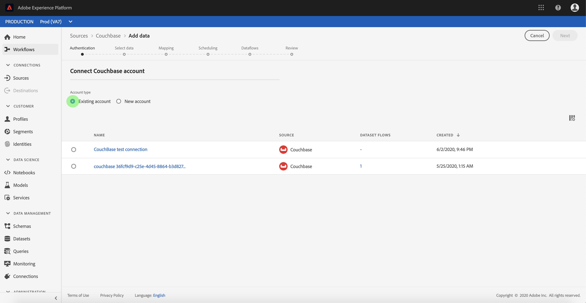

# Creación de un conector [!DNL Couchbase] de origen en la interfaz de usuario

>[!NOTE]
>
> El [!DNL Couchbase] conector está en versión beta. Consulte la descripción general [de](../../../../home.md#terms-and-conditions) Fuentes para obtener más información sobre el uso de conectores con etiquetas beta.

Los conectores de origen de [!DNL Adobe Experience Platform] proporcionan la capacidad de ingerir datos externos de forma programada. Este tutorial proporciona los pasos para crear un conector de [!DNL Couchbase] origen mediante la interfaz [!DNL Platform] de usuario.

## Primeros pasos

Este tutorial requiere un conocimiento práctico de los siguientes componentes de [!DNL Platform]:

* [[!DNL Experience Data Model] (XDM) Sistema](../../../../../xdm/home.md): El marco normalizado por el cual [!DNL Experience Platform] organiza los datos de experiencia del cliente.
   * [Conceptos básicos de la composición](../../../../../xdm/schema/composition.md)de esquemas: Obtenga información sobre los componentes básicos de los esquemas XDM, incluidos los principios clave y las prácticas recomendadas en la composición de esquemas.
   * [Tutorial](../../../../../xdm/tutorials/create-schema-ui.md)del Editor de esquemas: Obtenga información sobre cómo crear esquemas personalizados mediante la interfaz de usuario del Editor de Esquemas.
* [[!Perfil del cliente en tiempo real de DNL]](../../../../../profile/home.md): Proporciona un perfil de consumo unificado y en tiempo real basado en datos agregados de varias fuentes.

Si ya tiene una conexión válida, puede omitir el resto de este documento y continuar con el tutorial sobre la [!DNL Couchbase] configuración de un flujo de datos .

### Recopilar las credenciales necesarias

Para autenticar el conector [!DNL Couchbase] de origen, debe proporcionar valores para la siguiente propiedad de conexión:

| Credencial | Descripción |
| ---------- | ----------- |
| `connectionString` | La cadena de conexión que se utiliza para conectar con la [!DNL Couchbase] instancia. El patrón de cadena de conexión para [!DNL Couchbase] es `Server={SERVER}; Port={PORT};AuthMech=1;CredString=[{\"user\": \"{USER}\", \"pass\":\"{PASS}\"}];`. Para obtener más información sobre la adquisición de una cadena de conexión, consulte la documentación sobre la [[!DNL Couchbase] conexión](https://docs.Couchbase.com/c-sdk/2.10/client-settings.html#configuring-overview). |

## Conectar su [!DNL Couchbase] cuenta

Una vez recopiladas las credenciales necesarias, puede seguir los pasos a continuación para vincular su [!DNL Couchbase] cuenta a [!DNL Platform].

Inicie sesión en [Adobe Experience Platform](https://platform.adobe.com) y seleccione **[!UICONTROL Fuentes]** en la barra de navegación izquierda para acceder al espacio de trabajo **[!UICONTROL Fuentes]** . La pantalla **[!UICONTROL Catálogo]** muestra una serie de orígenes con los que puede crear una cuenta.

Puede seleccionar la categoría adecuada en el catálogo a la izquierda de la pantalla. También puede encontrar la fuente específica con la que desea trabajar mediante la opción de búsqueda.

En la categoría **[!UICONTROL Bases]** de datos, seleccione **[!UICONTROL Couchbase]**. Si es la primera vez que utiliza este conector, seleccione **[!UICONTROL Configurar]**. De lo contrario, seleccione **[!UICONTROL Añadir datos]** para crear un nuevo [!DNL Couchbase] conector.

Aparecerá la página **[!UICONTROL Conectar con Couchbase]** . En esta página, puede usar credenciales nuevas o existentes.

### Nueva cuenta

Si está utilizando nuevas credenciales, seleccione **[!UICONTROL Nueva cuenta]**. En el formulario de entrada que aparece, especifique un nombre, una descripción opcional y sus [!DNL Couchbase] credenciales. Cuando termine, seleccione **[!UICONTROL Conectar a origen]** y, a continuación, espere un poco para que se establezca la nueva conexión.

### Cuenta existente

Para conectar una cuenta existente, seleccione la [!DNL Couchbase] cuenta con la que desea conectarse y, a continuación, seleccione **[!UICONTROL Siguiente]** en la esquina superior derecha para continuar.

## Pasos siguientes

Siguiendo este tutorial, ha establecido una conexión con su [!DNL Couchbase] cuenta. Ahora puede continuar con el siguiente tutorial y [configurar un flujo de datos para incluir [!DNL Platform]](../../dataflow/databases.md)datos.