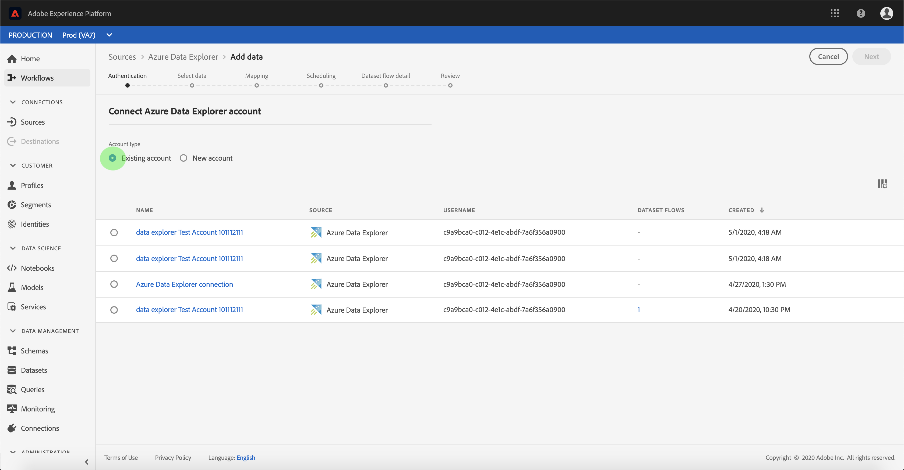

# Creación de un conector [!DNL Azure Data Explorer] de origen en la interfaz de usuario

>[!NOTE]
>
> El [!DNL Azure Data Explorer] conector está en versión beta. Consulte la descripción general [de](../../../../home.md#terms-and-conditions) Fuentes para obtener más información sobre el uso de conectores con etiquetas beta.

Los conectores de origen de Adobe Experience Platform permiten la ingesta de datos externos de forma programada. Este tutorial proporciona los pasos para crear un conector de origen [!DNL Azure Data Explorer] (en adelante denominado &quot;[!DNL Data Explorer]&quot;) mediante la interfaz [!DNL Platform] de usuario.

## Primeros pasos

Este tutorial requiere un conocimiento práctico de los siguientes componentes de Adobe Experience Platform:

* [[!DNL Experience Data Model (XDM)] Sistema](../../../../../xdm/home.md): El marco normalizado por el cual [!DNL Experience Platform] organiza los datos de experiencia del cliente.
   * [Conceptos básicos de la composición](../../../../../xdm/schema/composition.md)de esquemas: Obtenga información sobre los componentes básicos de los esquemas XDM, incluidos los principios clave y las prácticas recomendadas en la composición de esquemas.
   * [Tutorial](../../../../../xdm/tutorials/create-schema-ui.md)del Editor de esquemas: Obtenga información sobre cómo crear esquemas personalizados mediante la interfaz de usuario del Editor de Esquemas.
* [[!DNL Real-time Customer Profile]](../../../../../profile/home.md):: Proporciona un perfil de consumo unificado y en tiempo real basado en datos agregados de varias fuentes.

Si ya tiene una conexión válida, puede omitir el resto de este documento y continuar con el tutorial sobre la [!DNL Data Explorer] configuración de un flujo de datos .

### Recopilar las credenciales necesarias

Para acceder a su [!DNL Data Explorer] cuenta en [!DNL Platform], debe proporcionar los siguientes valores:

| Credencial | Descripción |
| ---------- | ----------- |
| `endpoint` | The endpoint of the [!DNL Data Explorer] server. |
| `database` | Nombre de la [!DNL Data Explorer] base de datos. |
| `tenant` | ID de inquilino único que se utiliza para conectarse a la [!DNL Data Explorer] base de datos. |
| `servicePrincipalId` | ID de principal de servicio único que se utiliza para conectarse a la [!DNL Data Explorer] base de datos. |
| `servicePrincipalKey` | Clave principal de servicio única utilizada para conectarse a la [!DNL Data Explorer] base de datos. |

Para obtener más información sobre cómo empezar, consulte [ [!DNL Data Explorer] este documento](https://docs.microsoft.com/en-us/azure/data-explorer/kusto/management/access-control/how-to-authenticate-with-aad).

## Conectar su [!DNL Azure Data Explorer] cuenta

Una vez recopiladas las credenciales necesarias, puede seguir los pasos a continuación para vincular su [!DNL Data Explorer] cuenta a [!DNL Platform].

Inicie sesión en [Adobe Experience Platform](https://platform.adobe.com) y seleccione **[!UICONTROL Fuentes]** en la barra de navegación izquierda para acceder al espacio de trabajo **[!UICONTROL Fuentes]** . La pantalla **[!UICONTROL Catálogo]** muestra una serie de orígenes para los que puede crear una cuenta.

Puede seleccionar la categoría adecuada en el catálogo a la izquierda de la pantalla. También puede encontrar la fuente específica con la que desea trabajar mediante la opción de búsqueda.

En la categoría **[!UICONTROL Bases de datos]** , seleccione Data Explorer **[!UICONTROL de]** Azure. Si es la primera vez que utiliza este conector, seleccione **[!UICONTROL Configurar]**. De lo contrario, seleccione **[!UICONTROL Añadir datos]** para crear un nuevo conector de Data Explorer.

Aparece la página **[!UICONTROL Conectar con la Data Explorer]** de Azure. En esta página, puede usar credenciales nuevas o existentes.

### Nueva cuenta

Si está utilizando nuevas credenciales, seleccione **[!UICONTROL Nueva cuenta]**. En el formulario de entrada que aparece, especifique un nombre, una descripción opcional y sus [!DNL Data Explorer] credenciales. Cuando termine, seleccione **[!UICONTROL Connect]** y, a continuación, espere un poco de tiempo para que se establezca la nueva conexión.

### Cuenta existente

Para conectar una cuenta existente, seleccione la [!DNL Data Explorer] cuenta con la que desea conectarse y, a continuación, seleccione **[!UICONTROL Siguiente]** para continuar.

## Pasos siguientes

Siguiendo este tutorial, ha establecido una conexión con su [!DNL Data Explorer] cuenta. Ahora puede continuar con el siguiente tutorial y [configurar un flujo de datos para incluir [!DNL Platform]](../../dataflow/databases.md)datos.