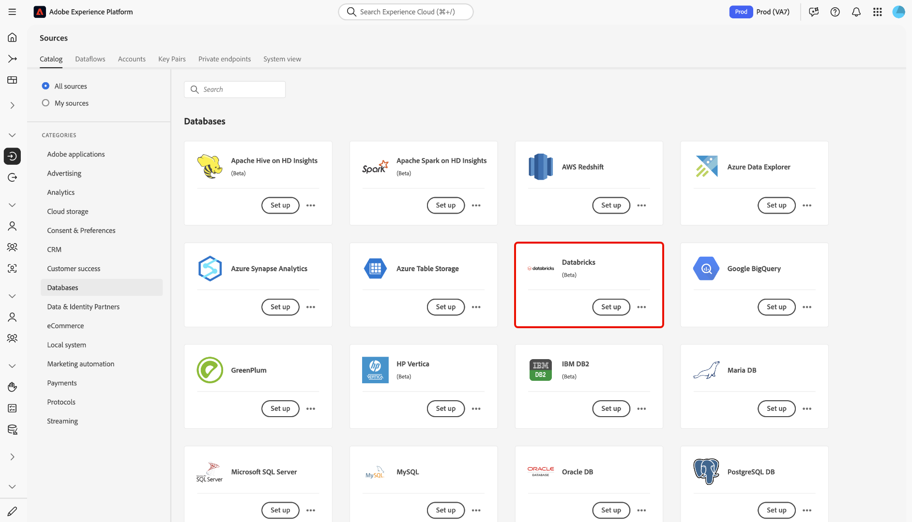

# Conectar [!DNL Databricks] a Experience Platform en la interfaz de usuario

>[!AVAILABILITY]
>
>* El origen [!DNL Databricks] está disponible en el catálogo de orígenes para los usuarios que han adquirido Real-Time CDP Ultimate.
>
>* El origen [!DNL Databricks] está en la versión beta. Lea los [términos y condiciones](../../../../home.md#terms-and-conditions) en la descripción general de orígenes para obtener más información sobre el uso de orígenes etiquetados como beta.

Lea esta guía para obtener información sobre cómo conectar su cuenta de [!DNL Databricks] a Adobe Experience Platform mediante el área de trabajo de orígenes en la interfaz de usuario.

## Introducción

Esta guía requiere una comprensión práctica de los siguientes componentes de Experience Platform:

* [Fuentes](../../../../home.md): Experience Platform permite la ingesta de datos de varias fuentes al tiempo que le ofrece la capacidad de estructurar, etiquetar y mejorar los datos entrantes mediante los servicios de Experience Platform.
* [Zonas protegidas](../../../../../sandboxes/home.md): Experience Platform proporciona zonas protegidas virtuales que dividen una sola instancia de Experience Platform en entornos virtuales independientes para ayudar a desarrollar y evolucionar aplicaciones de experiencia digital.

### Recopilar credenciales necesarias

Proporcione valores para las siguientes credenciales a fin de conectar [!DNL Databricks] a Experience Platform.

| Credencial | Descripción |
| --- | --- |
| Dominio | La URL de su área de trabajo [!DNL Databricks]. Por ejemplo, `https://adb-1234567890123456.7.azuredatabricks.net`. |
| ID de clúster | El identificador de su clúster en [!DNL Databricks]. Este clúster ya debe ser un clúster existente y debe ser un clúster interactivo. |
| Token de acceso | El token de acceso que autentica su cuenta de [!DNL Databricks]. Puede generar el token de acceso mediante el área de trabajo [!DNL Databricks]. |
| Base de datos | Nombre de la base de datos en el lago delta. |

Para obtener más información, lea la [[!DNL Databricks] información general](../../../../connectors/databases/databricks.md).

## Navegar por el catálogo de fuentes

En la interfaz de usuario de Experience Platform, seleccione **[!UICONTROL Fuentes]** en el panel de navegación izquierdo para acceder al área de trabajo *[!UICONTROL Fuentes]*. Elija una categoría o utilice la barra de búsqueda para encontrar el origen.

Para conectarse a [!DNL Databricks], vaya a la categoría *[!UICONTROL Bases de datos]*, seleccione la tarjeta de origen de **[!UICONTROL Azure Databricks]** y, a continuación, seleccione **[!UICONTROL Configurar]**.

>[!TIP]
>
>Los orígenes del catálogo de orígenes muestran la opción **[!UICONTROL Set up]** cuando un origen determinado aún no tiene una cuenta autenticada. Una vez creada una cuenta autenticada, esta opción cambia a **[!UICONTROL Agregar datos]**.

### Usar una cuenta existente

Para usar una cuenta existente, seleccione **[!UICONTROL Cuenta existente]** y luego seleccione la cuenta [!DNL Azure Databricks] que desee usar.

### Crear una nueva cuenta

Para crear una cuenta nueva, selecciona **[!UICONTROL Cuenta nueva]**, proporciona un nombre y, opcionalmente, agrega una descripción para tu cuenta. A continuación, proporcione valores para las siguientes credenciales de autenticación:

* Dominio
* ID de clúster
* Token de acceso
* Base de datos

Además, debe copiar y pegar sus credenciales de [!UICONTROL URI SAS de ensayo] en su entorno [!DNL Azure Databricks]. Cuando termine, seleccione **[!UICONTROL Conectarse al origen]** y espere unos momentos para que se establezca la conexión.

## Crear un flujo de datos para [!DNL Azure Databricks] datos

Ahora que ha conectado correctamente su cuenta de [!DNL Azure Databricks], puede [crear un flujo de datos e introducir datos de su base de datos en Experience Platform](../../dataflow/databases.md).
