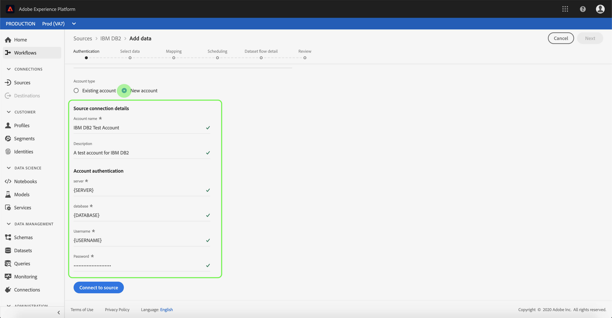
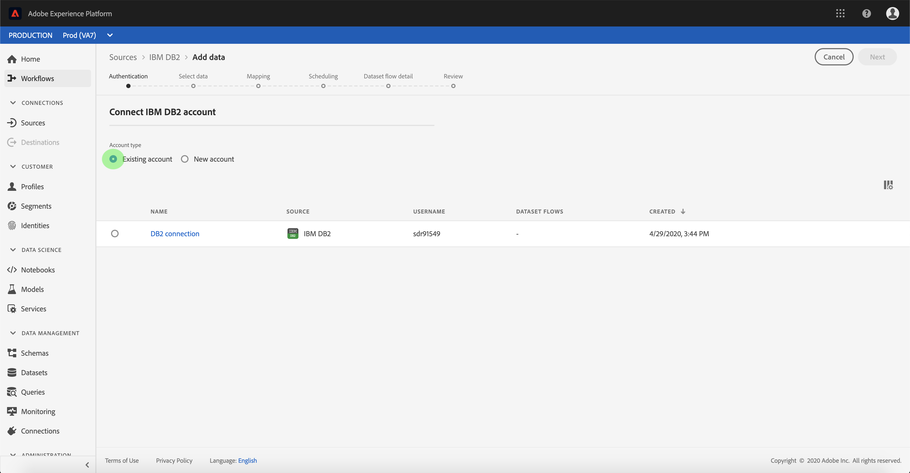

# Crear una conexión de origen de IBM DB2 en la interfaz de usuario

>[!NOTE]
>
> El conector IBM DB2 está en versión beta. Consulte [Resumen de fuentes](../../../../home.md#terms-and-conditions) para obtener más información sobre el uso de conectores con etiqueta beta.

Los conectores de Source en Adobe Experience Platform permiten introducir datos de origen externo de forma programada. Este tutorial proporciona los pasos para crear un conector de origen de IBM DB2 (denominado en adelante &quot;DB2&quot;) mediante la interfaz de usuario [!DNL Platform].

## Introducción

Este tutorial requiere una comprensión práctica de los siguientes componentes de Adobe Experience Platform:

* [[!DNL Experience Data Model (XDM)] Sistema](../../../../../xdm/home.md): El marco de trabajo estandarizado mediante el cual [!DNL Experience Platform] organiza los datos de la experiencia del cliente.
   * [Aspectos básicos de la composición de esquemas](../../../../../xdm/schema/composition.md): obtenga información sobre los componentes básicos de los esquemas XDM, incluidos los principios clave y las prácticas recomendadas en la composición de esquemas.
   * [Tutorial del editor de esquemas](../../../../../xdm/tutorials/create-schema-ui.md): Aprenda a crear esquemas personalizados mediante la interfaz de usuario del editor de esquemas.
* [[!DNL Real-Time Customer Profile]](../../../../../profile/home.md): proporciona un perfil de consumidor unificado y en tiempo real basado en los datos agregados de varias fuentes.

Si ya tiene una conexión DB2 válida, puede omitir el resto de este documento y continuar con el tutorial sobre [configuración de un flujo de datos](../../dataflow/databases.md).

### Recopilar credenciales necesarias

Las secciones siguientes proporcionan información adicional que necesitará conocer para conectarse correctamente a DB2 mediante la API [!DNL Flow Service].

| Credencial | Descripción |
| ---------- | ----------- |
| `server` | Nombre del servidor DB2. Puede especificar el número de puerto después del nombre del servidor delimitado por dos puntos. Por ejemplo: server:port. |
| `database` | Nombre de la base de datos DB2. |
| `username` | Nombre de usuario utilizado para conectarse a la base de datos DB2. |
| `password` | Contraseña de la cuenta de usuario especificada para el nombre de usuario. |

Para obtener más información sobre cómo empezar, consulte [este documento de DB2](https://www.ibm.com/support/knowledgecenter/SSFMBX/com.ibm.swg.im.dashdb.doc/connecting/connect_credentials.html).

## Conectar su cuenta de IBM DB2

Una vez que haya recopilado las credenciales necesarias, puede seguir los pasos a continuación para vincular su cuenta de DB2 a [!DNL Platform].

Inicie sesión en [Adobe Experience Platform](https://platform.adobe.com) y, a continuación, seleccione **[!UICONTROL Fuentes]** en la barra de navegación izquierda para acceder al área de trabajo de **[!UICONTROL Fuentes]**. La pantalla **[!UICONTROL Catálogo]** muestra una variedad de orígenes con los que puede crear una cuenta.

Puede seleccionar la categoría adecuada del catálogo en la parte izquierda de la pantalla. También puede encontrar la fuente específica con la que desea trabajar utilizando la opción de búsqueda.

En la categoría **[!UICONTROL Bases de datos]**, seleccione **[!UICONTROL IBM DB2]**. Si es la primera vez que usa este conector, seleccione **[!UICONTROL Configurar]**. De lo contrario, seleccione **[!UICONTROL Agregar datos]** para crear un nuevo conector DB2.

Aparecerá la página **[!UICONTROL Conectar con IBM DB2]**. En esta página, puede usar credenciales nuevas o existentes.

### Nueva cuenta

Si está usando credenciales nuevas, seleccione **[!UICONTROL Nueva cuenta]**. En el formulario de entrada que aparece, proporcione un nombre, una descripción opcional y sus credenciales de DB2. Cuando termine, seleccione **[!UICONTROL Conectar]** y deje pasar un tiempo para que se establezca la nueva conexión.

### Cuenta existente

Para conectar una cuenta existente, seleccione la cuenta DB2 con la que desee conectarse y, a continuación, seleccione **[!UICONTROL Siguiente]** para continuar.

## Pasos siguientes

Al seguir este tutorial, ha establecido una conexión con su cuenta de DB2. Ahora puede continuar con el siguiente tutorial y [configurar un flujo de datos para introducir datos en [!DNL Platform]](../../dataflow/databases.md).
