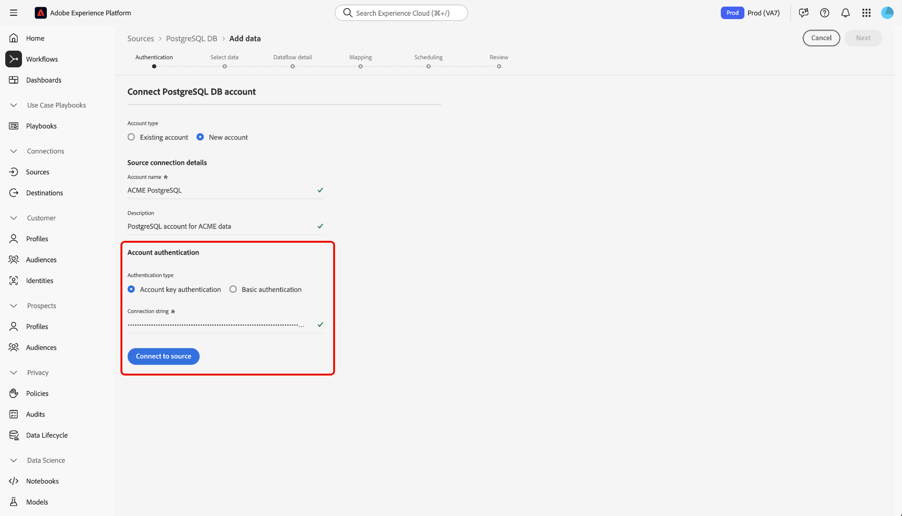
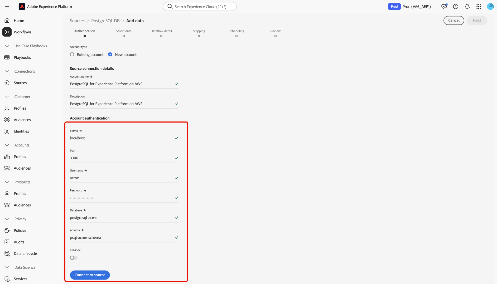

# Conectar [!DNL PostgreSQL] a Experience Platform mediante la interfaz de usuario

Lea esta guía para obtener información sobre cómo conectar la base de datos de [!DNL PostgreSQL] a Adobe Experience Platform mediante el área de trabajo de orígenes en la interfaz de usuario de Experience Platform.

## Introducción

Este tutorial requiere una comprensión práctica de los siguientes componentes de Adobe Experience Platform:

* [[!DNL Experience Data Model (XDM)] Sistema](../../../../../xdm/home.md): El marco estandarizado mediante el cual Experience Platform organiza los datos de experiencia del cliente.
   * [Aspectos básicos de la composición de esquemas](../../../../../xdm/schema/composition.md): obtenga información sobre los componentes básicos de los esquemas XDM, incluidos los principios clave y las prácticas recomendadas en la composición de esquemas.
   * [Tutorial del editor de esquemas](../../../../../xdm/tutorials/create-schema-ui.md): Aprenda a crear esquemas personalizados mediante la interfaz de usuario del editor de esquemas.
* [[!DNL Real-Time Customer Profile]](../../../../../profile/home.md): proporciona un perfil de consumidor unificado y en tiempo real basado en los datos agregados de varias fuentes.

Si ya tiene una conexión [!DNL PostgreSQL] válida, puede omitir el resto de este documento y continuar con el tutorial sobre [configuración de un flujo de datos](../../dataflow/databases.md).

### Recopilar credenciales necesarias

Lea la [[!DNL PostgreSQL] descripción general](../../../../connectors/databases/postgres.md) para obtener más información sobre la autenticación.

### Habilitar el cifrado SSL para la cadena de conexión

Puede habilitar el cifrado SSL para la cadena de conexión [!DNL PostgreSQL] adjuntando la cadena de conexión con las siguientes propiedades:

| Propiedad | Descripción | Ejemplo |
| --- | --- | --- |
| `EncryptionMethod` | Permite habilitar el cifrado SSL en los datos de [!DNL PostgreSQL]. | <uL><li>`EncryptionMethod=0`(deshabilitado)</li><li>`EncryptionMethod=1`(Habilitado)</li><li>`EncryptionMethod=6`(RequestSSL)</li></ul> |
| `ValidateServerCertificate` | Valida el certificado enviado por la base de datos [!DNL PostgreSQL] cuando se aplica `EncryptionMethod`. | <uL><li>`ValidationServerCertificate=0`(deshabilitado)</li><li>`ValidationServerCertificate=1`(Habilitado)</li></ul> |

El siguiente es un ejemplo de una cadena de conexión [!DNL PostgreSQL] anexada con cifrado SSL: `Server={SERVER};Database={DATABASE};Port={PORT};UID={USERNAME};Password={PASSWORD};EncryptionMethod=1;ValidateServerCertificate=1`.

## Navegar por el catálogo de fuentes {#navigate}

En la interfaz de usuario de Experience Platform, seleccione **[!UICONTROL Fuentes]** en el panel de navegación izquierdo para acceder al área de trabajo *[!UICONTROL Fuentes]*. Seleccione la categoría adecuada en el panel *[!UICONTROL Categorías]*. También puede usar la barra de búsqueda para ir al origen específico que desee usar.

Para usar [!DNL PostgreSQL], seleccione la tarjeta de origen **[!UICONTROL PostgreSQL DB]** en *[!UICONTROL Bases de datos]* y, a continuación, seleccione **[!UICONTROL Configurar]**.

>[!TIP]
>
>Los orígenes del catálogo de orígenes muestran la opción **[!UICONTROL Set up]** cuando un origen determinado aún no tiene una cuenta autenticada. Una vez creada una cuenta autenticada, esta opción cambia a **[!UICONTROL Agregar datos]**.

## Usar una cuenta existente {#existing}

Para usar una cuenta existente, seleccione **[!UICONTROL Cuenta existente]** y luego seleccione la cuenta [!DNL PostgreSQL] que desee usar.

## Crear una nueva cuenta {#create}

Si no tiene una cuenta existente, debe crear una nueva cuenta proporcionando las credenciales de autenticación necesarias que se correspondan con su origen.

Para crear una cuenta nueva, selecciona **[!UICONTROL Cuenta nueva]** y, a continuación, proporciona un nombre y, opcionalmente, agrega una descripción para tu cuenta.

### Conectarse a Experience Platform en Azure {#azure}

Puede conectar su cuenta de [!DNL PostgreSQL] a Experience Platform en Azure mediante la clave de cuenta o la autenticación básica.

>[!BEGINTABS]

>[!TAB Autenticación de clave de cuenta]

Para usar la autenticación de clave de cuenta, selecciona **[!UICONTROL Autenticación de clave de cuenta]**, proporciona tu [cadena de conexión](../../../../connectors/databases/postgres.md#azure) y, a continuación, selecciona **[!UICONTROL Conectarse al origen]**.

>[!TAB Autenticación básica]

Para usar la autenticación básica, selecciona **[!UICONTROL Autenticación básica]**, proporciona valores para tus [credenciales de autenticación](../../../../connectors/databases/postgres.md#azure) y, a continuación, selecciona **[!UICONTROL Conectarse al origen]**.

>[!ENDTABS]

### Conexión a Experience Platform en Amazon Web Service (AWS) {#aws}

>[!AVAILABILITY]
>
>Esta sección se aplica a las implementaciones de Experience Platform que se ejecutan en Amazon Web Service (AWS). Experience Platform que se ejecuta en AWS está disponible actualmente para un número limitado de clientes. Para obtener más información sobre la infraestructura de Experience Platform compatible, consulte la [descripción general de la nube múltiple de Experience Platform](../../../../../landing/multi-cloud.md).

Para crear una nueva cuenta de [!DNL PostgreSQL] y conectarse a Experience Platform en AWS, asegúrese de estar en una zona protegida de VA6 y, a continuación, proporcione las [credenciales necesarias para la autenticación](../../../../connectors/databases/postgres.md#aws).

## Crear un flujo de datos para los datos de [!DNL PostgreSQL]

Al seguir este tutorial, ha establecido una conexión con su cuenta de [!DNL MariaDB]. Ahora puede continuar con el siguiente tutorial y [configurar un flujo de datos para introducir datos en Experience Platform](../../dataflow/databases.md).
