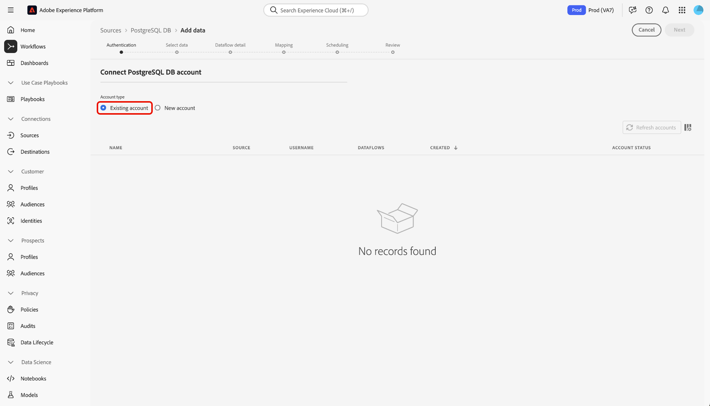

# Crear un [!DNL PostgreSQL] conexión de origen en la interfaz de usuario

Los conectores de origen en Adobe Experience Platform permiten introducir datos de origen externo de forma programada. Este tutorial proporciona los pasos para crear una [!DNL PostgreSQL] conector de origen mediante [!DNL Platform] interfaz de usuario.

## Primeros pasos

Este tutorial requiere una comprensión práctica de los siguientes componentes de Adobe Experience Platform:

* [[!DNL Experience Data Model (XDM)] Sistema](../../../../../xdm/home.md): El marco estandarizado mediante el cual [!DNL Experience Platform] organiza los datos de experiencia del cliente.
   * [Conceptos básicos de composición de esquemas](../../../../../xdm/schema/composition.md): Obtenga información acerca de los componentes básicos de los esquemas XDM, incluidos los principios clave y las prácticas recomendadas en la composición de esquemas.
   * [Tutorial del Editor de esquemas](../../../../../xdm/tutorials/create-schema-ui.md): Aprenda a crear esquemas personalizados mediante la interfaz de usuario del Editor de esquemas.
* [[!DNL Real-Time Customer Profile]](../../../../../profile/home.md): Proporciona un perfil de consumidor unificado y en tiempo real basado en los datos agregados de varias fuentes.

Si ya tiene un válido [!DNL PostgreSQL] conexión, puede omitir el resto de este documento y continuar con el tutorial sobre [configuración de un flujo de datos](../../dataflow/databases.md).

### Recopilar credenciales necesarias

Para acceder a su [!DNL PostgreSQL] cuenta en [!DNL Platform], debe proporcionar el siguiente valor:

| Credencial | Descripción |
| ---------- | ----------- |
| `connectionString` | La cadena de conexión asociada a su [!DNL PostgreSQL] cuenta. El [!DNL PostgreSQL] el patrón de cadena de conexión es: `Server={SERVER};Database={DATABASE};Port={PORT};UID={USERNAME};Password={PASSWORD}`. |

Para obtener más información sobre cómo empezar, consulte esta [[!DNL PostgreSQL] documento](https://www.postgresql.org/docs/9.2/app-psql.html).

#### Habilitar el cifrado SSL para la cadena de conexión

Puede habilitar el cifrado SSL para su [!DNL PostgreSQL] cadena de conexión adjuntando la cadena de conexión con las siguientes propiedades:

| Propiedad | Descripción | Ejemplo |
| --- | --- | --- |
| `EncryptionMethod` | Permite habilitar el cifrado SSL en su [!DNL PostgreSQL] datos. | <uL><li>`EncryptionMethod=0`(Desactivado)</li><li>`EncryptionMethod=1`(Habilitado)</li><li>`EncryptionMethod=6`(RequestSSL)</li></ul> |
| `ValidateServerCertificate` | Valida el certificado enviado por su [!DNL PostgreSQL] base de datos cuando `EncryptionMethod` se aplica. | <uL><li>`ValidationServerCertificate=0`(Desactivado)</li><li>`ValidationServerCertificate=1`(Habilitado)</li></ul> |

El siguiente es un ejemplo de [!DNL PostgreSQL] cadena de conexión anexada con cifrado SSL: `Server={SERVER};Database={DATABASE};Port={PORT};UID={USERNAME};Password={PASSWORD};EncryptionMethod=1;ValidateServerCertificate=1`.

## Conecte su [!DNL PostgreSQL] account

Una vez que haya recopilado las credenciales necesarias, puede seguir los pasos a continuación para vincular su [!DNL PostgreSQL] cuenta a [!DNL Platform].

Iniciar sesión en [Adobe Experience Platform](https://platform.adobe.com) y luego seleccione **[!UICONTROL Fuentes]** desde la barra de navegación izquierda para acceder a **[!UICONTROL Fuentes]** workspace. El **[!UICONTROL Catálogo]** La pantalla muestra una variedad de fuentes para las que puede crear una cuenta con.

Puede seleccionar la categoría adecuada del catálogo en la parte izquierda de la pantalla. También puede encontrar la fuente específica con la que desea trabajar utilizando la opción de búsqueda.

En el **[!UICONTROL Bases de datos]** categoría, seleccionar **[!UICONTROL PostgreSQL DB]**. Si es la primera vez que utiliza este conector, seleccione **[!UICONTROL Configurar]**. De lo contrario, seleccione **[!UICONTROL Añadir datos]** para crear una nueva [!DNL PostgreSQL] conector.

El **[!UICONTROL Conectar a[!DNL PostgreSQL]]** página. En esta página, puede usar credenciales nuevas o existentes.

### Nueva cuenta

Si está usando credenciales nuevas, seleccione **[!UICONTROL Nueva cuenta]**. En el formulario de entrada que aparece, proporcione un nombre, una descripción opcional y su [!DNL PostgreSQL] credenciales. Cuando termine, seleccione **[!UICONTROL Connect]** y, a continuación, espere un poco para que se establezca la nueva conexión.

### Cuenta existente

Para conectar una cuenta existente, seleccione la [!DNL PostgreSQL] cuenta con la que desea conectarse y, a continuación, seleccione **[!UICONTROL Siguiente]** para continuar.

## Pasos siguientes

Al seguir este tutorial, ha establecido una conexión con su [!DNL PostgreSQL] cuenta. Ahora puede continuar con el siguiente tutorial y [configuración de un flujo de datos para introducir datos en [!DNL Platform]](../../dataflow/databases.md).
