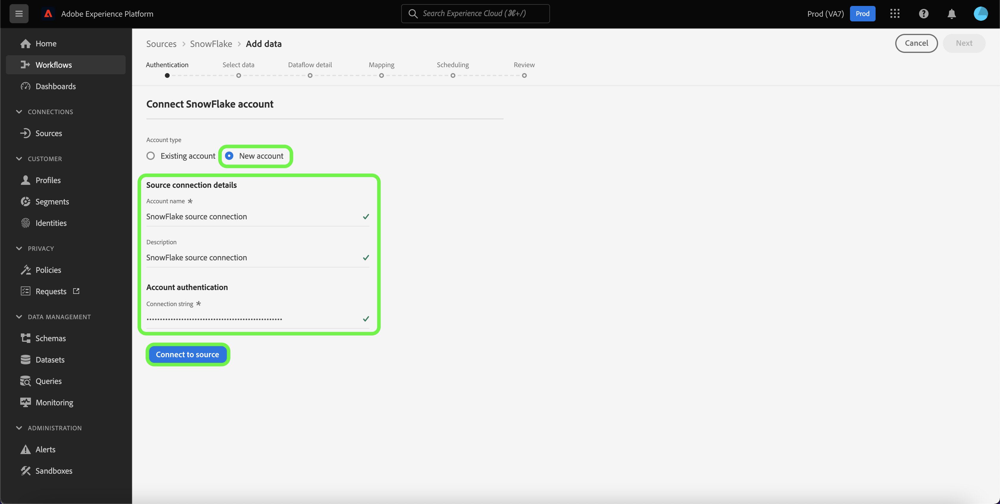

# Cree un [!DNL Snowflake] conexión de origen en la interfaz de usuario

Este tutorial proporciona los pasos para crear un [!DNL Snowflake] conector de origen mediante la interfaz de usuario de Adobe Experience Platform.

## Primeros pasos

Este tutorial requiere una comprensión práctica de los siguientes componentes de Platform:

* [Fuentes](../../../../home.md): [!DNL Experience Platform] permite la ingesta de datos de varias fuentes, al mismo tiempo que permite estructurar, etiquetar y mejorar los datos entrantes mediante [!DNL Platform] servicios.
* [Sandboxes](../../../../../sandboxes/home.md): [!DNL Experience Platform] proporciona entornos limitados virtuales que dividen un solo [!DNL Platform] en entornos virtuales independientes para ayudar a desarrollar y desarrollar aplicaciones de experiencia digital.

### Recopilar las credenciales necesarias

Para acceder a su cuenta de Snowflake en [!DNL Platform], debe proporcionar el siguiente valor de autenticación:

| Credencial | Descripción |
| ---------- | ----------- |
| Cuenta | El nombre de cuenta completo asociado con su [!DNL Snowflake] cuenta. Una [!DNL Snowflake] el nombre de cuenta incluye el nombre de su cuenta, su región y su plataforma de nube. Por ejemplo, `cj12345.east-us-2.azure`. Para obtener más información sobre los nombres de cuenta, consulte esta [[!DNL Snowflake document on account identifiers]](https://docs.snowflake.com/en/user-guide/admin-account-identifier.html). |
| Almacén | La variable [!DNL Snowflake] warehouse administra el proceso de ejecución de consultas para la aplicación. Cada [!DNL Snowflake] el almacén es independiente entre sí y se debe acceder a él de forma individual al llevar los datos a Platform. |
| Base de datos | La variable [!DNL Snowflake] base de datos contiene los datos que desea que sean compatibles con Platform. |
| Nombre de usuario | El nombre de usuario de la variable [!DNL Snowflake] cuenta. |
| Contraseña | La contraseña de la variable [!DNL Snowflake] cuenta de usuario. |
| Cadena de conexión | La cadena de conexión utilizada para conectarse a su [!DNL Snowflake] instancia. El patrón de cadena de conexión para [!DNL Snowflake] es `jdbc:snowflake://{ACCOUNT_NAME}.snowflakecomputing.com/?user={USERNAME}&password={PASSWORD}&db={DATABASE}&warehouse={WAREHOUSE}` |

Para obtener más información sobre estos valores, consulte [este documento de Snowflake](https://docs.snowflake.com/en/user-guide/key-pair-auth.html).

## Conecte su cuenta de Snowflake

En la interfaz de usuario de Platform, seleccione **[!UICONTROL Fuentes]** desde el panel de navegación izquierdo para acceder a la [!UICONTROL Fuentes] espacio de trabajo. La variable [!UICONTROL Catálogo] muestra una variedad de fuentes con las que puede crear una cuenta.

Puede seleccionar la categoría adecuada del catálogo en la parte izquierda de la pantalla. También puede encontrar la fuente específica con la que desea trabajar mediante la barra de búsqueda.

En el [!UICONTROL Bases de datos] categoría, seleccione **[!UICONTROL Snowflake]** y, a continuación, seleccione **[!UICONTROL Añadir datos]**.

La variable **[!UICONTROL Conectarse al Snowflake]** se abre. En esta página, puede usar credenciales nuevas o existentes.

### Cuenta existente

Para conectar una cuenta existente, seleccione la cuenta de Snowflake con la que desee conectarse y, a continuación, seleccione **[!UICONTROL Siguiente]** para continuar.

### Nueva cuenta

Si está utilizando credenciales nuevas, seleccione **[!UICONTROL Nueva cuenta]**. En el formulario de entrada que aparece, indique un nombre, una descripción opcional y las credenciales del Snowflake. Cuando termine, seleccione **[!UICONTROL Connect]** y, a continuación, permita que la nueva conexión se establezca durante algún tiempo.

## Pasos siguientes

Siguiendo este tutorial, ha establecido una conexión con su cuenta de Snowflake. Ahora puede continuar con el siguiente tutorial y [configurar un flujo de datos para introducir datos [!DNL Platform]](../../dataflow/databases.md).
