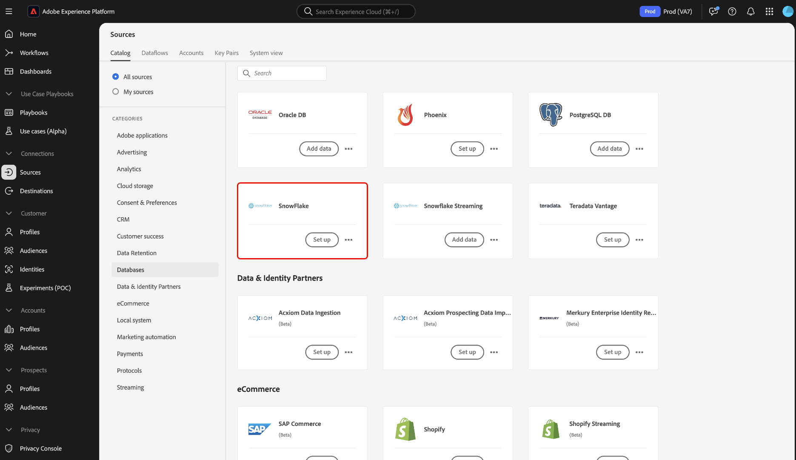

# Conectar [!DNL Snowflake] a Experience Platform mediante la interfaz de usuario

>[!IMPORTANT]
>
>El origen [!DNL Snowflake] está disponible en el catálogo de orígenes para los usuarios que han adquirido Real-Time Customer Data Platform Ultimate.

Lea esta guía para obtener información sobre cómo conectar su cuenta de [!DNL Snowflake] a Adobe Experience Platform mediante la interfaz de usuario.

## Introducción

>[!WARNING]
>
>La autenticación básica (o autenticación de clave de cuenta) para el origen [!DNL Snowflake] quedará obsoleta en noviembre de 2025. Debe pasar a la autenticación basada en pares de claves para seguir utilizando el origen e introduciendo datos de la base de datos en Experience Platform. Para obtener más información sobre la obsolescencia, lea la [[!DNL Snowflake] guía de prácticas recomendadas sobre cómo mitigar los riesgos de compromiso de credenciales](https://www.snowflake.com/en/resources/white-paper/best-practices-to-mitigate-the-risk-of-credential-compromise/).

Este tutorial requiere una comprensión práctica de los siguientes componentes de Experience Platform:

* [Fuentes](../../../../home.md): Experience Platform permite la ingesta de datos de varias fuentes al tiempo que le ofrece la capacidad de estructurar, etiquetar y mejorar los datos entrantes mediante los servicios de [!DNL Experience Platform].
* [Zonas protegidas](../../../../../sandboxes/home.md): Experience Platform proporciona zonas protegidas virtuales que dividen una sola instancia de Experience Platform en entornos virtuales independientes para ayudar a desarrollar y evolucionar aplicaciones de experiencia digital.

>[!NOTE]
>
>Debe establecer el indicador `PREVENT_UNLOAD_TO_INLINE_URL` en `FALSE` para permitir la descarga de datos de la base de datos [!DNL Snowflake] en Experience Platform.

## Navegar por el catálogo de fuentes {#navigate}

En la interfaz de usuario de Experience Platform, seleccione **[!UICONTROL Fuentes]** en el panel de navegación izquierdo para acceder al área de trabajo [!UICONTROL Fuentes]. Puede seleccionar la categoría adecuada del catálogo en la parte izquierda de la pantalla. También puede encontrar la fuente específica con la que desea trabajar utilizando la opción de búsqueda.

Seleccione **[!DNL Snowflake]** en la categoría *[!UICONTROL Bases de datos]* y luego seleccione **[!UICONTROL Configurar]**.

>[!TIP]
>
>Los orígenes del catálogo de orígenes muestran la opción **[!UICONTROL Set up]** cuando un origen determinado aún no tiene una cuenta autenticada. Una vez que existe una cuenta autenticada, esta opción cambia a **[!UICONTROL Agregar datos]**.

## Usar una cuenta existente {#existing}

A continuación, se le redirige al paso de autenticación del flujo de trabajo de fuentes. Aquí puede usar una cuenta existente o crear una nueva cuenta.

Para usar una cuenta existente, seleccione la cuenta de [!DNL Snowflake] con la que desee conectarse y, a continuación, seleccione **[!UICONTROL Siguiente]** para continuar.

## Crear una nueva cuenta {#create}

Si no tiene una cuenta existente, debe crear una nueva cuenta proporcionando las credenciales de autenticación necesarias que se correspondan con su origen.

Para crear una cuenta nueva, selecciona **[!UICONTROL Cuenta nueva]** y, a continuación, proporciona un nombre y, opcionalmente, agrega una descripción para tu cuenta.

### Conectarse a Experience Platform en Azure {#azure}

Puede conectar su cuenta de [!DNL Snowflake] a Experience Platform en Azure mediante la autenticación de clave de cuenta o la autenticación de par de claves.

>[!BEGINTABS]

>[!TAB Autenticación de clave de cuenta]

Para usar la autenticación de clave de cuenta, selecciona **[!UICONTROL Autenticación de clave de cuenta]**, proporciona la cadena de conexión en el formulario de entrada y, a continuación, selecciona **[!UICONTROL Conectarse al origen]**.

| Credencial | Descripción |
| --- | --- |
| Cuenta | Un nombre de cuenta identifica de forma exclusiva una cuenta de su organización. En este caso, debe identificar una cuenta de forma exclusiva en diferentes organizaciones de [!DNL Snowflake]. Para ello, debe anteponer el nombre de su organización al nombre de la cuenta. Por ejemplo: `orgname-account_name`. Lee la guía sobre [cómo recuperar tu [!DNL Snowflake] identificador de cuenta](../../../../connectors/databases/snowflake.md#retrieve-your-account-identifier) para obtener instrucciones adicionales. Para obtener más información, consulte la [[!DNL Snowflake] documentación](https://docs.snowflake.com/en/user-guide/admin-account-identifier#format-1-preferred-account-name-in-your-organization). |
| Almacén | El almacén [!DNL Snowflake] administra el proceso de ejecución de consultas para la aplicación. Cada almacén de [!DNL Snowflake] es independiente entre sí y se debe acceder a él de forma individual al llevar datos a Experience Platform. |
| Base de datos | La base de datos [!DNL Snowflake] contiene los datos que desea obtener de Experience Platform. |
| Nombre de usuario | El nombre de usuario de la cuenta [!DNL Snowflake]. |
| Contraseña | Contraseña de la cuenta de usuario [!DNL Snowflake]. |
| Función | La función de control de acceso predeterminada que se usará en la sesión [!DNL Snowflake]. La función debe ser una función existente que ya se haya asignado al usuario especificado. La función predeterminada es `PUBLIC`. |
| Cadena de conexión | Cadena de conexión utilizada para conectarse a la instancia [!DNL Snowflake]. El patrón de cadena de conexión de [!DNL Snowflake] es `jdbc:snowflake://{ACCOUNT_NAME}.snowflakecomputing.com/?user={USERNAME}&password={PASSWORD}&db={DATABASE}&warehouse={WAREHOUSE}` |

>[!TAB Autenticación de par de claves]

Para usar la autenticación de par clave, selecciona **[!UICONTROL Autenticación de par clave]**, proporciona valores para tu cuenta, nombre de usuario, clave privada, frase de contraseña de clave privada, base de datos y almacén y, a continuación, selecciona **[!UICONTROL Conectar con el origen]**.

Con la autenticación de par clave, debe generar un par clave RSA de 2048 bits y, a continuación, proporcionar los siguientes valores al crear una cuenta para el origen [!DNL Snowflake].

| Credencial | Descripción |
| --- | --- |
| Cuenta | Un nombre de cuenta identifica de forma exclusiva una cuenta de su organización. En este caso, debe identificar una cuenta de forma exclusiva en diferentes organizaciones de [!DNL Snowflake]. Para ello, debe anteponer el nombre de su organización al nombre de la cuenta. Por ejemplo: `orgname-account_name`. Lee la guía sobre [cómo recuperar tu [!DNL Snowflake] identificador de cuenta](../../../../connectors/databases/snowflake.md#retrieve-your-account-identifier) para obtener instrucciones adicionales. Para obtener más información, consulte la [[!DNL Snowflake] documentación](https://docs.snowflake.com/en/user-guide/admin-account-identifier#format-1-preferred-account-name-in-your-organization). |
| Nombre de usuario | El nombre de usuario de su cuenta de [!DNL Snowflake]. |
| Clave privada | La clave privada codificada [!DNL Base64-] de su cuenta de [!DNL Snowflake]. Puede generar claves privadas cifradas o no cifradas. Si utiliza una clave privada cifrada, también debe proporcionar una frase de contraseña de clave privada al autenticarse con Experience Platform. Lee la guía sobre [recuperar tu [!DNL Snowflake] clave privada](../../../../connectors/databases/snowflake.md) para obtener más información. |
| Frase de contraseña de clave privada | La frase de contraseña de clave privada es una capa adicional de seguridad que debe utilizar al autenticarse con una clave privada cifrada. No es necesario que proporcione la frase de contraseña si utiliza una clave privada no cifrada. |
| Base de datos | La base de datos [!DNL Snowflake] que contiene los datos que desea introducir en Experience Platform. |
| Almacén | El almacén [!DNL Snowflake] administra el proceso de ejecución de consultas para la aplicación. Cada almacén de [!DNL Snowflake] es independiente entre sí y se debe acceder a él de forma individual al llevar datos a Experience Platform. |

Para obtener más información sobre estos valores, consulte [este documento de Snowflake](https://docs.snowflake.com/en/user-guide/key-pair-auth.html).

>[!ENDTABS]

### Conectarse a Experience Platform en AWS {#aws}

>[!AVAILABILITY]
>
>Esta sección se aplica a las implementaciones de Experience Platform que se ejecutan en Amazon Web Service (AWS). Experience Platform que se ejecuta en AWS está disponible actualmente para un número limitado de clientes. Para obtener más información sobre la infraestructura de Experience Platform compatible, consulte la [descripción general de la nube múltiple de Experience Platform](../../../../../landing/multi-cloud.md).

Para crear una nueva cuenta de [!DNL Snowflake] y conectarse a Experience Platform en AWS, asegúrese de que se encuentra en una zona protegida de VA6 y, a continuación, proporcione las credenciales necesarias para la autenticación.

| Credencial | Descripción |
| --- | --- |
| Host | La URL de host a la que se conecta su cuenta de [!DNL Snowflake]. |
| Puerto | Número de puerto que usa [!DNL Snowflake] al conectarse a un servidor a través de Internet. |
| Nombre de usuario | El nombre de usuario asociado con su cuenta de [!DNL Snowflake]. |
| Contraseña | La contraseña asociada a su cuenta de [!DNL Snowflake]. |
| Base de datos | Base de datos [!DNL Snowflake] de la que se extraerán los datos. |
| Esquema | Nombre del esquema asociado con la base de datos [!DNL Snowflake]. Debe asegurarse de que el usuario al que desea otorgar acceso a la base de datos también tenga acceso a este esquema. |
| Almacén | El almacén de [!DNL Snowflake] que está utilizando. |

### Omitir vista previa de datos de ejemplo {#skip-preview-of-sample-data}

Durante el paso de selección de datos, puede encontrar un tiempo de espera al ingerir tablas o archivos de datos grandes. Puede omitir la previsualización de datos para evitar el tiempo de espera y seguir viendo el esquema, aunque sin datos de ejemplo. Para omitir la vista previa de datos, active la opción **[!UICONTROL Omitir vista previa de datos de ejemplo]**.

El resto del flujo de trabajo sigue siendo el mismo. La única advertencia es que omitir la previsualización de datos puede impedir que los campos calculados y requeridos se validen automáticamente durante el paso de asignación y, a continuación, tendrá que validar manualmente esos campos durante la asignación.

## Pasos siguientes

Con este tutorial ha establecido una conexión con su cuenta de Snowflake. Ahora puede continuar con el siguiente tutorial y [configurar un flujo de datos para introducir datos en [!DNL Experience Platform]](../../dataflow/databases.md).
