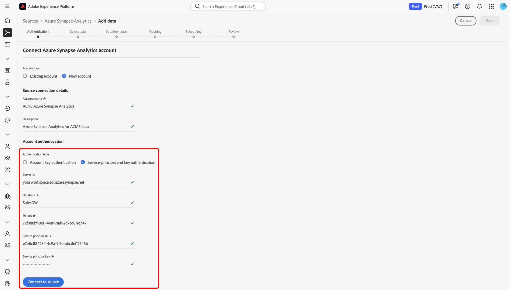

# Crear una conexión de origen [!DNL Azure Synapse Analytics] en la interfaz de usuario

>[!IMPORTANT]
>
>El origen [!DNL Azure Synapse Analytics] está disponible en el catálogo de orígenes para los usuarios que han adquirido Real-Time Customer Data Platform Ultimate.

Lea esta guía para obtener información sobre cómo conectar su cuenta de [!DNL Azure Synapse Analytics] a Adobe Experience Platform mediante el área de trabajo de orígenes en la interfaz de usuario.

## Introducción 

Este tutorial requiere una comprensión práctica de los siguientes componentes de Experience Platform:

* [[!DNL Experience Data Model (XDM)] Sistema](../../../../../xdm/home.md): El marco de trabajo estandarizado mediante el cual [!DNL Experience Platform] organiza los datos de la experiencia del cliente.
   * [Aspectos básicos de la composición de esquemas](../../../../../xdm/schema/composition.md): obtenga información sobre los componentes básicos de los esquemas XDM, incluidos los principios clave y las prácticas recomendadas en la composición de esquemas.
   * [Tutorial del editor de esquemas](../../../../../xdm/tutorials/create-schema-ui.md): Aprenda a crear esquemas personalizados mediante la interfaz de usuario del editor de esquemas.
* [[!DNL Real-Time Customer Profile]](../../../../../profile/home.md): proporciona un perfil de consumidor unificado y en tiempo real basado en los datos agregados de varias fuentes.

Si ya tiene una conexión [!DNL Azure Synapse Analytics] válida, puede omitir el resto de este documento y continuar con el tutorial sobre [configuración de un flujo de datos](../../dataflow/databases.md).

### Recopilar credenciales necesarias

Lea la [[!DNL Azure Synapse Analytics] descripción general](../../../../connectors/databases/synapse-analytics.md#prerequisites) para obtener información sobre la autenticación.

## Navegar por el catálogo de fuentes

En la interfaz de usuario de Experience Platform, seleccione **[!UICONTROL Fuentes]** en el panel de navegación izquierdo para acceder al área de trabajo *[!UICONTROL Fuentes]*. Elija una categoría o utilice la barra de búsqueda para encontrar el origen.

Para conectarse a [!DNL Azure Synapse Analytics], vaya a la categoría *[!UICONTROL Bases de datos]*, seleccione la tarjeta de origen de **[!UICONTROL Azure Synapse Analytics]** y, a continuación, seleccione **[!UICONTROL Configurar]**.

>[!TIP]
>
>Los orígenes del catálogo de orígenes muestran la opción **[!UICONTROL Set up]** cuando un origen determinado aún no tiene una cuenta autenticada. Una vez creada una cuenta autenticada, esta opción cambia a **[!UICONTROL Agregar datos]**.

## Usar una cuenta existente {#existing}

Para usar una cuenta existente, seleccione **[!UICONTROL Cuenta existente]** y luego seleccione la cuenta [!DNL Azure Synapse Analytics] que desee usar.

## Crear una nueva cuenta {#new}

Para crear una cuenta nueva, selecciona **[!UICONTROL Cuenta nueva]** y, a continuación, proporciona un nombre y, opcionalmente, agrega una descripción para tu cuenta.

### Conectar con Experience Platform

Puede conectar su cuenta de [!DNL Azure Synapse Analytics] a Experience Platform mediante la autenticación de clave de cuenta o la autenticación de clave y principal de servicio.

>[!BEGINTABS]

>[!TAB Autenticación de clave de cuenta]

Para usar la autenticación de clave de cuenta, selecciona **[!UICONTROL Autenticación de clave de cuenta]**, proporciona tu [cadena de conexión](../../../../connectors/databases/synapse-analytics.md#prerequisites) y, a continuación, selecciona **[!UICONTROL Conectarse al origen]**.

>[!TAB Autenticación de clave y principal de servicio]

También puede seleccionar **[!UICONTROL Autenticación de clave y principal de servicio]**, proporcionar valores para sus [credenciales de autenticación](../../../../connectors/databases/synapse-analytics.md#prerequisites) y, a continuación, seleccionar **[!UICONTROL Conectarse al origen]**.

>[!ENDTABS]

## Crear un flujo de datos para [!DNL Azure Synapse Analytics] datos

Ahora que ha conectado correctamente su base de datos de [!DNL Azure Synapse Analytics], puede [crear un flujo de datos e introducir datos de su base de datos en Experience Platform](../../dataflow/databases.md).
