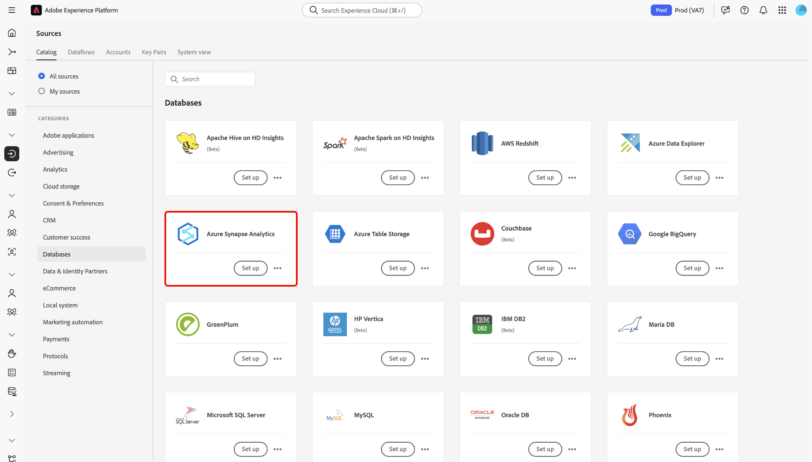

# Crear una conexión de origen [!DNL Azure Synapse Analytics] en la interfaz de usuario

>[!NOTE]
>
> El conector [!DNL Azure Synapse Analytics] está en versión beta. Consulte la [información general sobre fuentes](../../../../home.md#terms-and-conditions) para obtener más información sobre el uso de conectores con etiqueta beta.

Los conectores de origen de Adobe Experience Platform permiten la ingesta de datos de origen externo de forma programada. Este tutorial proporciona los pasos para crear un conector de origen [!DNL Azure Synapse Analytics] (en adelante denominado &quot;[!DNL Synapse]&quot;) mediante la interfaz de usuario [!DNL Platform].

## Primeros pasos

Este tutorial requiere una comprensión práctica de los siguientes componentes de Adobe Experience Platform:

* [[!DNL Experience Data Model (XDM)] Sistema](../../../../../xdm/home.md): El marco estandarizado mediante el cual se  [!DNL Experience Platform] organizan los datos de experiencia del cliente.
   * [Aspectos básicos de la composición](../../../../../xdm/schema/composition.md) del esquema: Obtenga información sobre los componentes básicos de los esquemas XDM, incluidos los principios clave y las prácticas recomendadas en la composición de esquemas.
   * [Tutorial del Editor de esquemas](../../../../../xdm/tutorials/create-schema-ui.md): Aprenda a crear esquemas personalizados mediante la interfaz de usuario del Editor de esquemas.
* [[!DNL Real-time Customer Profile]](../../../../../profile/home.md): Proporciona un perfil de cliente unificado y en tiempo real basado en datos agregados de varias fuentes.

Si ya tiene una conexión [!DNL Synapse] válida, puede omitir el resto de este documento y continuar con el tutorial sobre la [configuración de un flujo de datos](../../dataflow/databases.md).

### Recopilar las credenciales necesarias

Para acceder a su cuenta [!DNL Synapse] en [!DNL Platform], debe proporcionar los siguientes valores:

| Credencial | Descripción |
| ---------- | ----------- |
| `connectionString` | La cadena de conexión asociada con la autenticación [!DNL Synapse]. El patrón de cadena de conexión [!DNL Synapse] es `Server=tcp:{SERVER_NAME}.database.windows.net,1433;Database={DATABASE};User ID={USERNAME}@{SERVER_NAME};Password={PASSWORD};Trusted_Connection=False;Encrypt=True;Connection Timeout=30`. |

Para obtener más información sobre este valor, consulte [this [!DNL Synapse] document](https://docs.microsoft.com/en-us/azure/data-factory/connector-azure-sql-data-warehouse).

## Conecte su cuenta [!DNL Synapse]

Una vez que haya reunido las credenciales necesarias, puede seguir los pasos a continuación para vincular su cuenta [!DNL Synapse] a [!DNL Platform].

Inicie sesión en [Adobe Experience Platform](https://platform.adobe.com) y, a continuación, seleccione **[!UICONTROL Sources]** en la barra de navegación izquierda para acceder al espacio de trabajo **[!UICONTROL Sources]**. La pantalla **[!UICONTROL Catalog]** muestra una variedad de fuentes para las que puede crear una cuenta.

Puede seleccionar la categoría adecuada del catálogo en la parte izquierda de la pantalla. Alternativamente, puede encontrar la fuente específica con la que desea trabajar usando la opción de búsqueda.

En la categoría **[!UICONTROL Databases]**, seleccione **[!UICONTROL Azure Synapse Analytics]**. Si es la primera vez que utiliza este conector, seleccione **[!UICONTROL Configure]**. De lo contrario, seleccione **[!UICONTROL Add data]** para crear un nuevo conector [!DNL Synapse].

Aparece la página **[!UICONTROL Connect to Azure Synapse Analytics]**. En esta página, puede usar credenciales nuevas o existentes.

### Nueva cuenta

Si está utilizando credenciales nuevas, seleccione **[!UICONTROL New account]**. En el formulario de entrada que aparece, indique un nombre, una descripción opcional y sus credenciales [!DNL Synapse]. Cuando termine, seleccione **[!UICONTROL Connect]** y, a continuación, deje que se establezca la nueva conexión.

### Cuenta existente

Para conectar una cuenta existente, seleccione la cuenta [!DNL Synapse] con la que desea conectarse y, a continuación, seleccione **[!UICONTROL Next]** para continuar.

## Pasos siguientes

Al seguir este tutorial, ha establecido una conexión con su cuenta [!DNL Synapse]. Ahora puede continuar con el siguiente tutorial y [configurar un flujo de datos para introducir datos en [!DNL Platform]](../../dataflow/databases.md).
