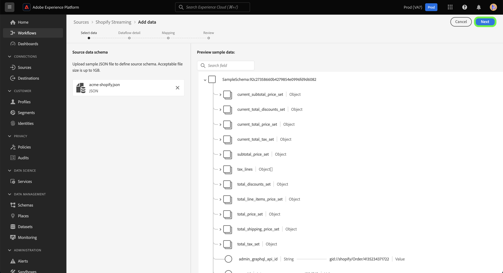

# Crear una conexión de origen y un flujo de datos para [!DNL Shopify Streaming] datos mediante la interfaz de usuario

Este tutorial proporciona los pasos para crear una [!DNL Shopify Streaming] conexión de origen y flujo de datos mediante la interfaz de usuario de Platform.

## Primeros pasos {#getting-started}

Este tutorial requiere una comprensión práctica de los siguientes componentes de Experience Platform:

* [[!DNL Experience Data Model (XDM)] Sistema](../../../../../xdm/home.md): El marco estandarizado mediante el cual [!DNL Experience Platform] organiza los datos de experiencia del cliente.
   * [Conceptos básicos de composición de esquemas](../../../../../xdm/schema/composition.md): Obtenga información acerca de los componentes básicos de los esquemas XDM, incluidos los principios clave y las prácticas recomendadas en la composición de esquemas.
   * [Tutorial del Editor de esquemas](../../../../../xdm/tutorials/create-schema-ui.md): Aprenda a crear esquemas personalizados mediante la interfaz de usuario del Editor de esquemas.
* [[!DNL Real-Time Customer Profile]](../../../../../profile/home.md): Proporciona un perfil de consumidor unificado y en tiempo real basado en los datos agregados de varias fuentes.

>[!IMPORTANT]
>
>Este tutorial requiere que haya completado la configuración de requisitos previos para su [!DNL Shopify Streaming] cuenta. Para ver los pasos necesarios para configurar su cuenta, lea la [[!DNL Shopify Streaming] descripción general](../../../../connectors/ecommerce/shopify-streaming.md).

## Conecte su [!DNL Shopify Streaming] account

En la IU de Platform, seleccione **[!UICONTROL Fuentes]** desde la barra de navegación izquierda para acceder a [!UICONTROL Fuentes] workspace. El [!UICONTROL Catálogo] La pantalla muestra una variedad de fuentes con las que puede crear una cuenta.

Puede seleccionar la categoría adecuada del catálogo en la parte izquierda de la pantalla. También puede encontrar la fuente específica con la que desea trabajar utilizando la opción de búsqueda.

En el **eCommerce** categoría, seleccionar [!DNL Shopify Streaming], y luego seleccione **[!UICONTROL Añadir datos]**.

## Seleccionar datos

El **[!UICONTROL Seleccionar datos]** Este paso aparece y proporciona una interfaz para que seleccione los datos que lleva a Platform.

* La parte izquierda de la interfaz es un explorador que le permite ver los flujos de datos disponibles en su cuenta;
* La parte derecha de la interfaz de le permite previsualizar hasta 100 filas de datos de un archivo JSON.

Seleccionar **[!UICONTROL Cargar archivos]** para cargar un archivo JSON desde el sistema local. También puede arrastrar y soltar el archivo JSON que desee cargar en [!UICONTROL Arrastrar y soltar archivos] panel.

Una vez cargado el archivo, la interfaz de vista previa se actualiza para mostrar una vista previa del esquema cargado. La interfaz de vista previa permite inspeccionar el contenido y la estructura de un archivo. También puede utilizar la variable [!UICONTROL Campo de búsqueda] para acceder a elementos específicos desde el esquema.

Cuando termine, seleccione **[!UICONTROL Siguiente]**.

## Detalles de flujo de datos

El **Detalles del flujo de datos** Este paso se muestra y le proporciona opciones para utilizar un conjunto de datos existente o establecer un nuevo conjunto de datos para su flujo de datos, así como la oportunidad de proporcionar un nombre y una descripción para su flujo de datos. Durante este paso, también puede configurar las opciones de Ingesta de perfiles, diagnósticos de error, ingesta parcial y alertas.

Cuando termine, seleccione **[!UICONTROL Siguiente]**.

## Asignación

El [!UICONTROL Asignación] Este paso aparece y le proporciona una interfaz para asignar los campos de origen del esquema de origen a sus campos XDM de destino adecuados en el esquema de destino.

Platform proporciona recomendaciones inteligentes para campos asignados automáticamente en función del esquema o el conjunto de datos de destino que seleccione. Puede ajustar manualmente las reglas de asignación para adaptarlas a sus casos de uso. En función de sus necesidades, puede elegir asignar campos directamente o utilizar funciones de preparación de datos para transformar los datos de origen y derivar valores calculados o calculados. Para ver los pasos detallados sobre el uso de la interfaz de asignación y los campos calculados, consulte la [Guía de IU de preparación de datos](https://experienceleague.adobe.com/docs/experience-platform/data-prep/ui/mapping.html).

Una vez que los datos de origen se hayan asignado correctamente, seleccione **[!UICONTROL Siguiente]**.

## Consulte

El **[!UICONTROL Revisar]** Este paso aparece, lo que le permite revisar el nuevo flujo de datos antes de crearlo. Los detalles se agrupan en las siguientes categorías:

* **[!UICONTROL Conexión]**: Muestra el tipo de origen, la ruta relevante del archivo de origen elegido y el número de columnas dentro de ese archivo de origen.
* **[!UICONTROL Asignar campos de conjunto de datos y asignación]**: Muestra en qué conjunto de datos se están ingiriendo los datos de origen, incluido el esquema al que se adhiere el conjunto de datos.

Una vez revisado el flujo de datos, seleccione **[!UICONTROL Finalizar]** y deje pasar un tiempo para crear el flujo de datos.

## Obtener la URL del extremo de flujo continuo

Con el flujo de datos de flujo continuo creado, ahora puede recuperar la URL del extremo de flujo continuo. Este punto de conexión se utilizará para suscribirse al webhook, lo que permitirá que el origen de la transmisión se comunique con el Experience Platform.

Para recuperar el extremo de flujo continuo, vaya a [!UICONTROL Actividad de flujo de datos] página del flujo de datos que acaba de crear y copie el punto final de la parte inferior de la [!UICONTROL Propiedades] panel.

## Pasos siguientes

Al seguir este tutorial, ha establecido una conexión de origen y un flujo de datos para su [!DNL Shopify Streaming] cuenta. Para obtener instrucciones sobre cómo conectar su [!DNL Shopify Streaming] Cuenta de con la API de, lea el tutorial sobre [crear una conexión de origen y un flujo de datos para transmitir [!DNL Shopify] datos mediante la API de Flow Service](../../../api/create/ecommerce/shopify-streaming.md).
