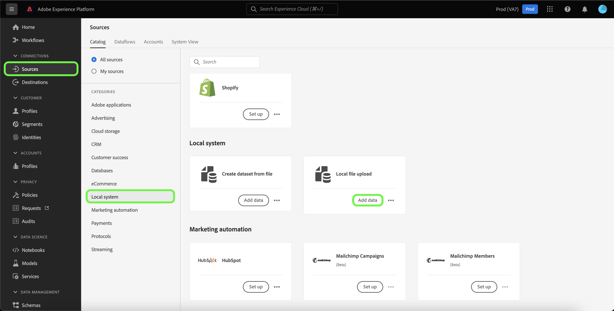
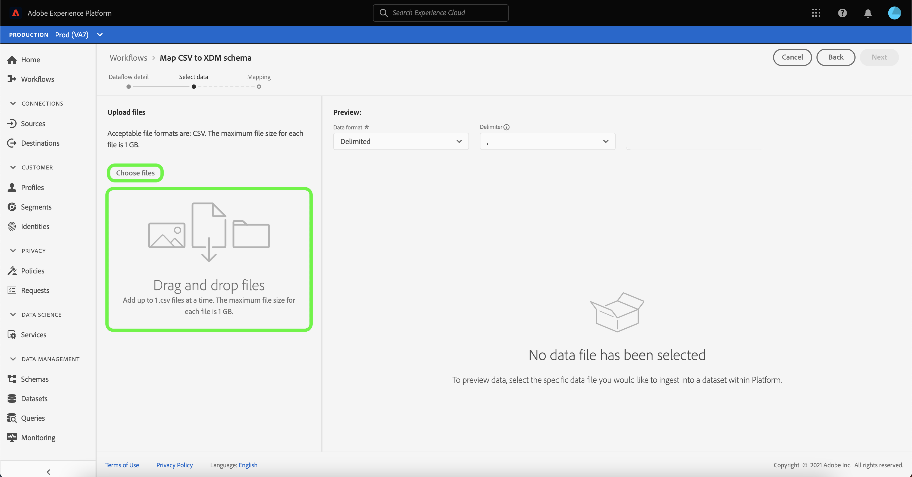

# Creación de un conector de origen de carga de archivos local en la interfaz de usuario

Este tutorial proporciona los pasos para crear un conector de origen de carga de archivos local para la ingesta de archivos locales en Platform mediante la interfaz de usuario.

## Primeros pasos

Este tutorial requiere una comprensión práctica de los siguientes componentes de Platform:

* [[!DNL Experience Data Model (XDM)] Sistema](../../../../../xdm/home.md): El marco estandarizado mediante el cual Platform organiza los datos de experiencia del cliente.
   * [Aspectos básicos de la composición del esquema](../../../../../xdm/schema/composition.md): Obtenga información sobre los componentes básicos de los esquemas XDM, incluidos los principios clave y las prácticas recomendadas en la composición de esquemas.
   * [Tutorial del Editor de esquemas](../../../../../xdm/tutorials/create-schema-ui.md): Obtenga información sobre cómo crear esquemas personalizados mediante la interfaz de usuario del Editor de esquemas.
* [[!DNL Real-Time Customer Profile]](../../../../../profile/home.md): Proporciona un perfil de cliente unificado y en tiempo real basado en datos agregados de varias fuentes.

## Cargar archivos locales a Platform

En la interfaz de usuario de Platform, seleccione **[!UICONTROL Fuentes]** en la barra de navegación izquierda para acceder a la [!UICONTROL Fuentes] espacio de trabajo. La variable [!UICONTROL Catálogo] muestra una variedad de fuentes para las que puede crear una cuenta.

Puede seleccionar la categoría adecuada del catálogo en la parte izquierda de la pantalla. Alternativamente, puede encontrar la fuente específica con la que desea trabajar usando la opción de búsqueda.

En el [!UICONTROL Sistema local] categoría, seleccione **[!UICONTROL Carga de archivo local]** y, a continuación, seleccione **[!UICONTROL Añadir datos]**.

### Usar un conjunto de datos existente

La variable [!UICONTROL Detalles de flujo de datos] le permite seleccionar si desea introducir los datos CSV en un conjunto de datos existente o un nuevo conjunto de datos.

Para introducir los datos CSV en un conjunto de datos existente, seleccione **[!UICONTROL Conjunto de datos existente]**. Puede recuperar un conjunto de datos existente mediante la variable [!UICONTROL Búsqueda avanzada] o desplazándose por la lista de conjuntos de datos existentes en el menú desplegable.

Con un conjunto de datos seleccionado, proporcione un nombre para el flujo de datos y una descripción opcional.

Durante este proceso, también puede habilitar [!UICONTROL Diagnóstico de errores] y [!UICONTROL Ingesta parcial]. [!UICONTROL Diagnóstico de errores] permite generar mensajes de error detallados para cualquier registro erróneo que se produzca en el flujo de datos, mientras que [!UICONTROL Ingesta parcial] le permite introducir datos que contengan errores, hasta un umbral determinado que defina manualmente. Consulte la [información general sobre la ingesta parcial de lotes](../../../../../ingestion/batch-ingestion/partial.md) para obtener más información.

### Usar un nuevo conjunto de datos

Para introducir los datos CSV en un nuevo conjunto de datos, seleccione **[!UICONTROL Nuevo conjunto de datos]** y, a continuación, proporcione un nombre de conjunto de datos de salida y una descripción opcional. A continuación, seleccione un esquema para asignarlo mediante la variable [!UICONTROL Búsqueda avanzada] o desplazándose por la lista de esquemas existentes en el menú desplegable.

Con un esquema seleccionado, proporcione un nombre para el flujo de datos y una descripción opcional y, a continuación, aplique la variable [!UICONTROL Diagnóstico de errores] y [!UICONTROL Ingesta parcial] configuración que desee para el flujo de datos. Cuando termine, seleccione **[!UICONTROL Siguiente]**.

### Selección de datos

La variable [!UICONTROL Seleccionar datos] , lo que le proporciona una interfaz para cargar los archivos locales y previsualizar su estructura y contenido. Select **[!UICONTROL Elegir archivos]** para cargar un archivo CSV desde el sistema local. Como alternativa, puede arrastrar y soltar el archivo CSV que desea cargar en el [!UICONTROL Arrastrar y soltar archivos] panel.

>[!TIP]
>
>Actualmente, la carga de archivos locales solo admite los archivos CSV. El tamaño máximo de archivo para cada archivo es de 1 GB.

Una vez cargado el archivo, la interfaz de vista previa se actualiza para mostrar el contenido y la estructura del archivo.

Según el archivo, puede seleccionar un delimitador de columna, como tabulaciones, comas, barras verticales o un delimitador de columna personalizado para los datos de origen. Seleccione el **[!UICONTROL Delimitador]** flecha desplegable y, a continuación, seleccione el delimitador apropiado en el menú.

Cuando termine, seleccione **[!UICONTROL Siguiente]**.

## Asignación

La variable [!UICONTROL Asignación] aparece, proporcionando una interfaz para asignar los campos de origen del esquema de origen a los campos XDM de destino adecuados en el esquema de destino.

En función de sus necesidades, puede elegir asignar campos directamente o utilizar funciones de preparación de datos para transformar los datos de origen a fin de derivar valores calculados o calculados. Para ver los pasos completos sobre el uso de la interfaz de asignación, consulte la [Guía de la interfaz de usuario de preparación de datos](../../../../../data-prep/ui/mapping.md).

Una vez que los conjuntos de asignaciones estén listos, seleccione **[!UICONTROL Finalizar]** y permitir que se cree un nuevo flujo de datos durante unos momentos.

## Monitorización de la ingesta de datos

Una vez asignado y creado el archivo CSV, puede monitorizar los datos que se están incorporando a través de él mediante el panel de monitorización. Para obtener más información, consulte el tutorial sobre [control de flujos de datos de fuentes en la interfaz de usuario](../../../../../dataflows/ui/monitor-sources.md).

## Pasos siguientes

Al seguir este tutorial, ha asignado correctamente un archivo CSV plano a un esquema XDM y lo ha introducido en Platform. Ahora, estos datos los puede utilizar el flujo descendente [!DNL Platform] servicios como [!DNL Real-Time Customer Profile]. Consulte la descripción general para [[!DNL Real-Time Customer Profile]](../../../../../profile/home.md) para obtener más información.
