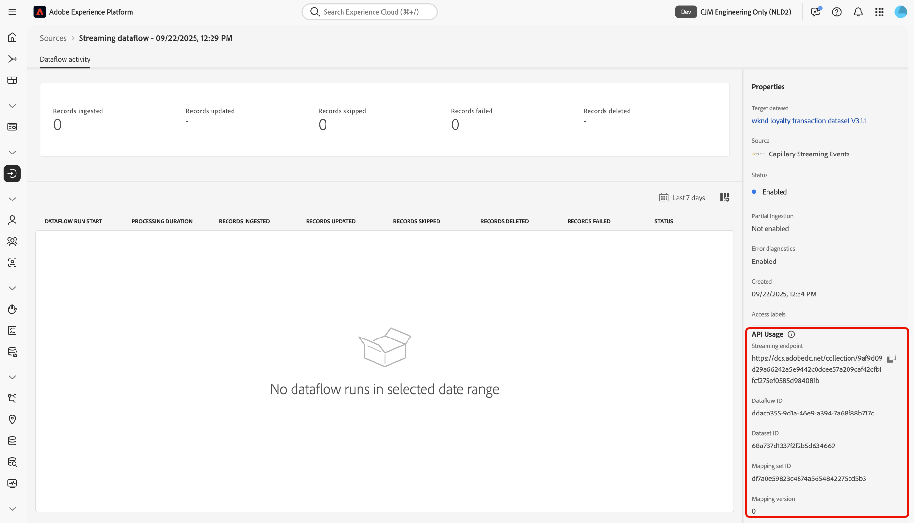

# Conectar [!DNL Capillary Streaming Events] a Experience Platform mediante la interfaz de usuario

>[!AVAILABILITY]
>
>El origen [!DNL Capillary Streaming Events] está en la versión beta. Lea los [términos y condiciones](../../../../home.md#terms-and-conditions) en la descripción general de orígenes para obtener más información sobre el uso de orígenes etiquetados como beta.

Lea esta guía para obtener información sobre cómo conectar la base de datos de [!DNL Capillary] a Adobe Experience Platform mediante el área de trabajo de orígenes en la interfaz de usuario de Experience Platform.

## Introducción

Este tutorial requiere una comprensión práctica de los siguientes componentes de Experience Platform:

* [[!DNL Experience Data Model (XDM)] Sistema](../../../../../xdm/home.md): El marco estandarizado mediante el cual Experience Platform organiza los datos de experiencia del cliente.
   * [Aspectos básicos de la composición de esquemas](../../../../../xdm/schema/composition.md): obtenga información sobre los componentes básicos de los esquemas XDM, incluidos los principios clave y las prácticas recomendadas en la composición de esquemas.
   * [Tutorial del editor de esquemas](../../../../../xdm/tutorials/create-schema-ui.md): Aprenda a crear esquemas personalizados mediante la interfaz de usuario del editor de esquemas.
* [[!DNL Real-Time Customer Profile]](../../../../../profile/home.md): proporciona un perfil de consumidor unificado y en tiempo real basado en los datos agregados de varias fuentes.

>[!NOTE]
>
>Lea la [[!DNL Capillary Streaming Events] descripción general](../../../../connectors/loyalty/capillary.md) para obtener información sobre la configuración necesaria para el origen [!DNL Capillary].

## Navegar por el catálogo de fuentes

En la interfaz de usuario de Experience Platform, seleccione **[!UICONTROL Fuentes]** en el panel de navegación izquierdo para acceder al área de trabajo *[!UICONTROL Fuentes]*. Seleccione la categoría adecuada en el panel *[!UICONTROL Categorías]*. También puede usar la barra de búsqueda para ir al origen específico que desee usar.

Para usar [!DNL Capillary], seleccione la tarjeta de origen **[!UICONTROL Eventos de flujo capilar]** en *[!UICONTROL Fidelidad]* y, a continuación, seleccione **[!UICONTROL Agregar datos]**.

>[!TIP]
>
>Los orígenes del catálogo de orígenes muestran la opción **[!UICONTROL Set up]** cuando un origen determinado aún no tiene una cuenta autenticada. Una vez creada una cuenta autenticada, esta opción cambia a **[!UICONTROL Agregar datos]**.

## Seleccionar datos

A continuación, utilice la interfaz *[!UICONTROL Select data]* para cargar un archivo JSON de muestra y definir el esquema de origen. Durante este paso, puede utilizar la interfaz de vista previa para ver la estructura de archivos de la carga útil. Cuando termine, seleccione **[!UICONTROL Siguiente]**.

>[!TIP]
>
>Puede descargar los [eventos y esquemas de perfil](../../../../images/tutorials/create/capillary/schemas.zip) para [!DNL Capillary] para usarlos en la interfaz de selección de datos.

## Detalles del flujo de datos

A continuación, debe proporcionar información sobre el conjunto de datos y el flujo de datos.

### Detalles del conjunto de datos

Un conjunto de datos es una construcción de almacenamiento y administración para una colección de datos, normalmente una tabla, que contiene un esquema (columnas) y campos (filas). Los datos que se incorporan correctamente a Experience Platform se conservan dentro del lago de datos como conjuntos de datos.

Durante este paso, puede utilizar un conjunto de datos existente o crear uno nuevo.

>[!NOTE]
>
>Independientemente de si utiliza un conjunto de datos existente o crea uno nuevo, debe asegurarse de que el conjunto de datos esté **habilitado para la ingesta de Profile**.

+++Seleccione para habilitar la Ingesta de perfiles, diagnósticos de error e ingesta parcial.

Si el conjunto de datos está habilitado para Perfil del cliente en tiempo real, durante este paso, puede alternar **[!UICONTROL Conjunto de datos de perfil]** para habilitar los datos para la ingesta de perfiles. También puede usar este paso para habilitar **[!UICONTROL diagnósticos de error]** y **[!UICONTROL ingesta parcial]**.

* **[!UICONTROL Diagnósticos de error]**: seleccione **[!UICONTROL Diagnósticos de error]** para indicar a la fuente que produzca diagnósticos de error a los que pueda hacer referencia posteriormente al supervisar la actividad del conjunto de datos y el estado del flujo de datos.
* **[!UICONTROL Ingesta parcial]**: La ingesta parcial por lotes es la capacidad de ingerir datos que contengan errores, hasta un determinado umbral configurable. Esta función le permite introducir correctamente todos los datos exactos en Experience Platform, mientras que todos los datos incorrectos se agrupan por separado con información sobre los motivos por los que no son válidos.

+++

### Detalles del flujo de datos

Una vez configurado el conjunto de datos, debe proporcionar detalles sobre el flujo de datos, incluido un nombre, una descripción opcional y configuraciones de alerta.

| Configuraciones de flujo de datos | Descripción |
| --- | --- |
| Nombre de flujo de datos | Nombre del flujo de datos.  De forma predeterminada, se utiliza el nombre del archivo que se está importando. |
| Descripción | (Opcional) Una breve descripción del flujo de datos. |
| Alertas | Experience Platform puede producir alertas basadas en eventos a las que los usuarios pueden suscribirse, estas opciones permiten que un flujo de datos en ejecución las almacene en déclencheur.  Para obtener más información, lea la [descripción general de las alertas](../../alerts.md) <ul><li>**Inicio de ejecución del flujo de datos de origen**: seleccione esta alerta para recibir una notificación cuando comience la ejecución del flujo de datos.</li><li>**Ejecución correcta del flujo de datos de origen**: seleccione esta alerta para recibir una notificación si el flujo de datos termina sin errores.</li><li>**Error al ejecutar el flujo de datos de origen**: seleccione esta alerta para recibir una notificación si la ejecución del flujo de datos termina con errores.</li></ul> |

{style="table-layout:auto"}

## Asignación

Utilice la interfaz de asignación para asignar los datos de origen a los campos de esquema adecuados antes de introducir datos en Experience Platform. Para obtener más información, lea la guía de asignación [en la interfaz de usuario](../../../../../data-prep/ui/mapping.md).

>[!TIP]
>
>Puede descargar los [eventos y asignaciones de perfiles](../../../../images/tutorials/create/capillary/mappings.zip) para [!DNL Capillary] e [importar los archivos a la preparación de datos](../../../../../data-prep/ui/mapping.md#import-mapping) cuando esté listo para asignar los datos.

## Revisar

Aparece el paso *[!UICONTROL Revisar]*, que le permite revisar los detalles del flujo de datos antes de crearlo. Los detalles se agrupan en las siguientes categorías:

* **[!UICONTROL Conexión]**: muestra el nombre de cuenta, la plataforma de origen y el nombre de origen.
* **[!UICONTROL Asignar campos de conjunto de datos y asignación]**: muestra el conjunto de datos de destino y el esquema al que se adhiere el conjunto de datos.

Después de confirmar que los detalles son correctos, seleccione **[!UICONTROL Finalizar]**.

## Recupere la URL del extremo de flujo continuo

Con la conexión creada, aparecerá la página de detalles de orígenes. Esta página muestra detalles de la conexión recién creada, incluidos los flujos de datos ejecutados anteriormente, el ID y la URL del extremo de flujo continuo.

