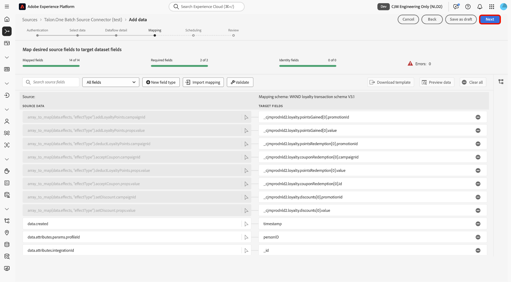

# Ingesta de datos por lotes de [!DNL Talon.One] en Experience Platform mediante la interfaz de usuario

>[!AVAILABILITY]
>
>El origen [!DNL Talon.One] está en la versión beta. Lea los [términos y condiciones](../../../../home.md#terms-and-conditions) en la descripción general de orígenes para obtener más información sobre el uso de orígenes etiquetados como beta.

Lea este tutorial para aprender a ingerir datos por lotes de su cuenta de [!DNL Talon.One] en Adobe Experience Platform mediante el espacio de trabajo de fuentes en la interfaz de usuario.

## Introducción

Este tutorial requiere una comprensión práctica de los siguientes componentes de Experience Platform:

* [[!DNL Experience Data Model (XDM)] Sistema](../../../../../xdm/home.md): El marco estandarizado mediante el cual Experience Platform organiza los datos de experiencia del cliente.
   * [Aspectos básicos de la composición de esquemas](../../../../../xdm/schema/composition.md): obtenga información sobre los componentes básicos de los esquemas XDM, incluidos los principios clave y las prácticas recomendadas en la composición de esquemas.
   * [Tutorial del editor de esquemas](../../../../../xdm/tutorials/create-schema-ui.md): Aprenda a crear esquemas personalizados mediante la interfaz de usuario del editor de esquemas.
* [[!DNL Real-Time Customer Profile]](../../../../../profile/home.md): proporciona un perfil de consumidor unificado y en tiempo real basado en los datos agregados de varias fuentes.

>[!IMPORTANT]
>
>Lea la [[!DNL Talon.One] descripción general](../../../../connectors/loyalty/talon-one.md) para obtener información sobre los pasos previos que debe seguir antes de conectar su cuenta a Experience Platform.

## Navegar por el catálogo de fuentes

En la interfaz de usuario de Experience Platform, seleccione **[!UICONTROL Fuentes]** en el panel de navegación izquierdo para acceder al área de trabajo *[!UICONTROL Fuentes]*. Seleccione la categoría adecuada en el panel *[!UICONTROL Categorías]*. También puede utilizar la barra de búsqueda para desplazarse hasta el origen específico que desee utilizar.

Para ingerir datos de [!DNL Talon.One], seleccione la tarjeta de origen **[!UICONTROL Talon.One Batch Source Connector]** en *[!UICONTROL Fidelidad]* y, a continuación, seleccione **[!UICONTROL Agregar datos]**.

>[!TIP]
>
>Los orígenes del catálogo de orígenes muestran la opción **[!UICONTROL Set up]** cuando un origen determinado aún no tiene una cuenta autenticada. Una vez creada una cuenta autenticada, esta opción cambia a **[!UICONTROL Agregar datos]**.

### Crear una nueva cuenta

Para crear una nueva cuenta para el origen de [!DNL Talon.One], seleccione **[!UICONTROL Nueva cuenta]** y proporcione un nombre y una descripción opcional para la cuenta. A continuación, proporcione su dominio [!DNL Talon.One] y su clave de API de administración [!UICONTROL Talon.One]. Cuando termine, seleccione **[!UICONTROL Conectarse al origen]** y espere unos momentos para que se establezca la conexión.

### Usar una cuenta existente

Para usar una cuenta existente, seleccione **[!UICONTROL Cuenta existente]** y la cuenta [!DNL Talon.One] que desee usar en la interfaz de cuentas.

## Seleccionar datos

Una vez que se haya autenticado, proporcione valores para **applicationId** y **sessionType**. Durante este paso, puede utilizar las funcionalidades de previsualización para inspeccionar la estructura de los datos. Cuando termine, seleccione **[!UICONTROL Siguiente]** para continuar.

## Configurar detalles del conjunto de datos y flujo de datos

A continuación, debe proporcionar información sobre el conjunto de datos y el flujo de datos.

### Detalles del conjunto de datos

Un conjunto de datos es una construcción de almacenamiento y administración para una colección de datos, normalmente una tabla, que contiene un esquema (columnas/campos) y registros (filas). Los datos que se incorporan correctamente a Experience Platform se conservan dentro del lago de datos como conjuntos de datos.

Durante este paso, puede utilizar un conjunto de datos existente o crear uno nuevo.

>[!NOTE]
>
>Independientemente de si utiliza un conjunto de datos existente o crea uno nuevo, debe asegurarse de que el conjunto de datos esté **habilitado para la ingesta de Profile**.

+++Seleccione para habilitar la Ingesta de perfiles, diagnósticos de error e ingesta parcial.

Si el conjunto de datos está habilitado para Perfil del cliente en tiempo real, durante este paso, puede alternar **[!UICONTROL Conjunto de datos del perfil]** para habilitar los datos para la ingesta de perfiles. También puede usar este paso para habilitar **[!UICONTROL diagnósticos de error]** y **[!UICONTROL ingesta parcial]**.

* **[!UICONTROL Diagnósticos de error]**: seleccione **[!UICONTROL Diagnósticos de error]** para indicar a la fuente que produzca diagnósticos de error a los que pueda hacer referencia posteriormente al supervisar la actividad del conjunto de datos y el estado del flujo de datos.
* **[!UICONTROL Ingesta parcial]**: La ingesta parcial por lotes es la capacidad de ingerir datos que contengan errores, hasta un determinado umbral configurable. Esta función le permite introducir correctamente todos los datos exactos en Experience Platform, mientras que todos los datos incorrectos se agrupan por separado con información sobre los motivos por los que no son válidos.

+++

## Detalles del flujo de datos

Una vez configurado el conjunto de datos, debe proporcionar detalles sobre el flujo de datos, incluido un nombre, una descripción opcional y configuraciones de alerta.

| Configuraciones de flujo de datos | Descripción |
| --- | --- |
| Nombre de flujo de datos | Nombre del flujo de datos. De forma predeterminada, se utiliza el nombre del archivo que se está importando. |
| Descripción | (Opcional) Una breve descripción del flujo de datos. |
| Alertas | Experience Platform puede producir alertas basadas en eventos a las que los usuarios pueden suscribirse, estas opciones permiten que un flujo de datos en ejecución las almacene en déclencheur.  Para obtener más información, lea la [descripción general de las alertas](../../alerts.md) <ul><li>**Inicio de ejecución del flujo de datos de origen**: seleccione esta alerta para recibir una notificación cuando comience la ejecución del flujo de datos.</li><li>**Ejecución correcta del flujo de datos de origen**: seleccione esta alerta para recibir una notificación si el flujo de datos termina sin errores.</li><li>**Error al ejecutar el flujo de datos de origen**: seleccione esta alerta para recibir una notificación si la ejecución del flujo de datos termina con errores.</li></ul> |

{style="table-layout:auto"}

## Asignación

Con los detalles del conjunto de datos y del flujo de datos configurados, ahora puede continuar con la asignación de los campos de datos de origen a sus campos XDM de destino adecuados. Utilice la interfaz de asignación para asignar los datos de origen a los campos de esquema adecuados antes de introducir datos en Experience Platform. Para obtener más información, lea la guía de asignación [en la interfaz de usuario](../../../../../data-prep/ui/mapping.md).

>[!IMPORTANT]
>
>Para obtener instrucciones adicionales sobre cómo asignar los datos de origen de [!DNL Talon.One], lea la [[!DNL Talon.One] descripción general](../../../../connectors/loyalty/talon-one.md#mapping).

## Programe la ingesta del flujo de datos

Aparecerá el paso [!UICONTROL Programando]. Utilice la interfaz para configurar una programación de ingesta para introducir automáticamente los datos de origen seleccionados mediante las asignaciones configuradas. De manera predeterminada, la programación se establece en `Once`. Para ajustar la frecuencia de ingesta, seleccione **[!UICONTROL Frecuencia]** y luego seleccione una opción en el menú desplegable.

>[!TIP]
>
>El intervalo y el relleno no son visibles durante una ingesta única.

Si establece la frecuencia de ingesta en `Minute`, `Hour`, `Day` o `Week`, debe establecer un intervalo para establecer un intervalo de tiempo establecido entre cada ingesta. Por ejemplo, una frecuencia de ingesta establecida en `Day` y un intervalo establecido en `15` significa que el flujo de datos está programado para ingerir datos cada 15 días.

Durante este paso, también puede habilitar **relleno** y definir una columna para la ingesta incremental de datos. El relleno se utiliza para introducir datos históricos, mientras que la columna que defina para la ingesta incremental permite diferenciar los nuevos datos de los datos existentes.

Consulte la tabla siguiente para obtener más información sobre las configuraciones de programación.

| Configuración de programación | Descripción |
| --- | --- |
| Frecuencia | Configure la frecuencia para indicar con qué frecuencia debe ejecutarse el flujo de datos. Puede establecer su frecuencia en: <ul><li>**Una vez**: establezca su frecuencia en `once` para crear una ingesta única. Las configuraciones para intervalo y relleno no están disponibles al crear un flujo de datos de ingesta único. De forma predeterminada, la frecuencia de programación se establece en una vez.</li><li>**Minuto**: establezca su frecuencia en `minute` para programar el flujo de datos e ingerir datos por minuto.</li><li>**Hora**: establezca su frecuencia en `hour` para programar el flujo de datos e ingerir datos por hora.</li><li>**Día**: Establezca su frecuencia en `day` para programar su flujo de datos e ingerir datos por día.</li><li>**Semana**: establezca su frecuencia en `week` para programar el flujo de datos e ingerir datos por semana.</li></ul> |
| Intervalo | Una vez seleccionada una frecuencia, puede configurar la configuración del intervalo para establecer el lapso de tiempo entre cada ingesta. Por ejemplo, si establece la frecuencia en día y configura el intervalo en 15, el flujo de datos se ejecutará cada 15 días. No puede establecer el intervalo en cero. El valor mínimo del intervalo aceptado para cada frecuencia es el siguiente:<ul><li>**Una vez**: n/a</li><li>**Minuto**: 15</li><li>**Hora**: 1</li><li>**Día**: 1</li><li>**Semana**: 1</li></ul> |
| Hora de inicio | La marca de tiempo de la ejecución proyectada, presentada en la zona horaria UTC. |
| Relleno | El relleno determina qué datos se incorporan inicialmente. Si el relleno está habilitado, todos los archivos actuales de la ruta especificada se introducirán durante la primera ingesta programada. Si se desactiva el relleno, solo se incorporarán los archivos que se carguen entre la primera ejecución de la ingesta y la hora de inicio. Los archivos cargados antes de la hora de inicio no se incorporarán. |

## Revisar

Aparece el paso *[!UICONTROL Revisar]*, que le permite revisar los detalles del flujo de datos antes de crearlo. Los detalles se agrupan en las siguientes categorías:

* **[!UICONTROL Conexión]**: muestra el nombre de cuenta, la plataforma de origen y el nombre de origen.
* **[!UICONTROL Asignar campos de conjunto de datos y asignación]**: muestra el conjunto de datos de destino y el esquema al que se adhiere el conjunto de datos.

Después de confirmar que los detalles son correctos, seleccione **[!UICONTROL Finalizar]**.

## Monitorización del flujo de datos

Una vez creado el flujo de datos, puede monitorizar los datos que se están ingiriendo a través de él para ver información sobre las tasas de ingesta, el éxito y los errores. Para obtener más información sobre cómo supervisar el flujo de datos, consulte el tutorial sobre [supervisar cuentas y flujos de datos en la interfaz de usuario](../../../../../dataflows/ui/monitor-sources.md).