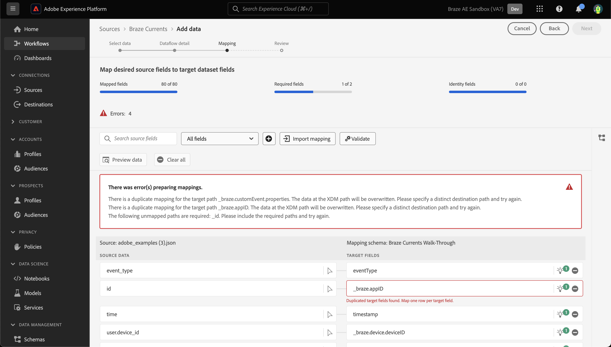

# Crear una conexión de origen [!DNL Braze Currents] en la interfaz de usuario

>[!NOTE]
>
>El origen [!DNL Braze Currents] está en la versión beta. Lea [información general de orígenes](../../../../home.md#terms-and-conditions) para obtener más información sobre el uso de orígenes etiquetados como beta.

[!DNL Braze] potencia las interacciones centradas en el cliente entre consumidores y marcas en tiempo real. [!DNL Braze Currents] es un flujo de datos en tiempo real de eventos de participación de la plataforma Braze que es la exportación más sólida pero granular de la plataforma [!DNL Braze].

Lea el siguiente tutorial para aprender a traer datos de eventos de participación de su cuenta de [!DNL Braze] a Adobe Experience Platform en la interfaz de usuario.

## Requisitos previos

Para completar los pasos de esta guía, necesitará lo siguiente:

* Iniciar sesión en [Adobe Experience Platform](https://platform.adobe.com) y obtener permiso para crear una nueva conexión de origen de flujo continuo.
* Iniciar sesión en [[!DNL Braze] panel](https://dashboard.braze.com/sign_in), obtener una licencia de [Currents Connector](https://www.braze.com/docs/user_guide/data_and_analytics/braze_currents) sin usar y obtener permisos para crear un conector. Para obtener más información, lea los [requisitos para configurar [!DNL Currents]](https://www.braze.com/docs/user_guide/data_and_analytics/braze_currents/setting_up_currents/#requirements).

## Introducción

Este tutorial requiere una comprensión práctica de los siguientes componentes de Adobe Experience Platform:

* [[!DNL Experience Data Model (XDM)] Sistema](../../../../../xdm/home.md): El marco de trabajo estandarizado mediante el cual [!DNL Experience Platform] organiza los datos de la experiencia del cliente.
   * [Aspectos básicos de la composición de esquemas](../../../../../xdm/schema/composition.md): obtenga información sobre los componentes básicos de los esquemas XDM, incluidos los principios clave y las prácticas recomendadas en la composición de esquemas.
   * [Tutorial del editor de esquemas](../../../../../xdm/tutorials/create-schema-ui.md): Aprenda a crear esquemas personalizados mediante la interfaz de usuario del editor de esquemas.
* [[!DNL Real-Time Customer Profile]](../../../../../profile/home.md): proporciona un perfil de consumidor unificado y en tiempo real basado en los datos agregados de varias fuentes.

Este tutorial también requiere una comprensión práctica de [[!DNL Braze] Corrientes](https://www.braze.com/docs/user_guide/data_and_analytics/braze_currents).

Si ya tiene una conexión de [!DNL Braze], puede omitir el resto de este documento y continuar con el tutorial sobre [configuración de un flujo de datos](../../dataflow/marketing-automation.md).

## Creación de un esquema XDM

>[!TIP]
>
>Debe crear un esquema del Modelo de datos de experiencia (XDM) si es la primera vez que crea una conexión de [!DNL Braze Currents]. Si ya ha creado un esquema para [!DNL Braze Currents], puede omitir este paso y continuar con [conectando su cuenta a Experience Platform](#connect).

En la interfaz de usuario de Experience Platform, utilice la navegación izquierda y, a continuación, seleccione **[!UICONTROL Esquemas]** para acceder al área de trabajo de [!UICONTROL Esquemas]. A continuación, seleccione **[!UICONTROL Crear esquema]** y luego seleccione **[!UICONTROL Evento de experiencia]**. Para continuar, seleccione **[!UICONTROL Siguiente]**.

Proporcione un nombre y una descripción para el esquema. A continuación, utilice el panel [!UICONTROL Composition] para configurar los atributos de esquema. En [!UICONTROL Grupos de campos], seleccione **[!UICONTROL Agregar]** y agregue el grupo de campos [!UICONTROL Evento de usuario de corrientes de Bear]. Cuando termine, seleccione **[!UICONTROL Guardar]**.

Para obtener más información sobre los esquemas, lea la guía para [crear esquemas en la interfaz de usuario](../../../../../xdm/tutorials/create-schema-ui.md).

## Conecte su cuenta de [!DNL Braze] a Experience Platform {#connect}

En la interfaz de usuario de Experience Platform, seleccione **[!UICONTROL Fuentes]** en el panel de navegación izquierdo para acceder al área de trabajo [!UICONTROL Fuentes]. Puede seleccionar la categoría adecuada del catálogo en la parte izquierda de la pantalla. También puede encontrar la fuente específica con la que desea trabajar utilizando la opción de búsqueda.

En la categoría *Automatización de mercadotecnia*, seleccione **[!UICONTROL Corrientes de Bear]** y, a continuación, **[!UICONTROL Agregar datos]**.

A continuación, cargue el archivo de muestra [Braze Currents proporcionado](https://github.com/Appboy/currents-examples/blob/master/sample-data/Adobe/adobe_examples.json). Este archivo contiene todos los campos posibles que Braze podría enviar como parte de un evento.

Una vez cargado el archivo, debe proporcionar los detalles del flujo de datos, incluida la información sobre el conjunto de datos y el esquema al que está asignando.  Si es la primera vez que conecta un origen de corrientes de Bear, cree un nuevo conjunto de datos.  De lo contrario, puede utilizar cualquier conjunto de datos existente que haga referencia al esquema Braze.  Si crea un nuevo conjunto de datos, utilice el esquema que hemos creado en la sección anterior.

A continuación, configure la asignación para los datos mediante la interfaz de asignación.

La asignación tendrá los siguientes problemas que deben resolverse.

En los datos de origen, *id* se asignará incorrectamente a *_braze.appID*. Debe cambiar el campo de asignación de destino a *_id* en el nivel raíz del esquema. A continuación, asegúrese de que *properties.is_amp* esté asignado a *_braze.messaging.email.isAMP*.

A continuación, elimine la asignación *time* to *timestamp*, luego seleccione el icono de agregar (`+`) y luego seleccione **[!UICONTROL Agregar campo calculado]**. En el cuadro proporcionado, escriba *time \* 1000* y seleccione **[!UICONTROL Guardar]**.

Una vez agregado el nuevo campo calculado, seleccione **[!UICONTROL Asignar campo de destino]** junto al nuevo campo de origen y asígnelo a *timestamp* en el nivel raíz del esquema. Luego debe seleccionar **[!UICONTROL Validar]** para asegurarse de que no haya más errores.

>[!IMPORTANT]
>
>Las marcas de tiempo de Braze no se expresan en milisegundos, sino en segundos. Para que las marcas de tiempo de Experience Platform se reflejen con precisión, debe crear campos calculados en milisegundos. Un cálculo de &quot;tiempo * 1000&quot; se convertirá correctamente en milisegundos, adecuados para su asignación a un campo de marca de tiempo en Experience Platform.
>
>

Cuando termine, seleccione **[!UICONTROL Siguiente]**. Utilice la página de revisión para confirmar los detalles del flujo de datos y, a continuación, seleccione **[!UICONTROL Finalizar]**.

### Recopilar credenciales necesarias

Una vez creada la conexión, debe recopilar los siguientes valores de credencial, que luego proporcionará en el panel de Brazo para enviar datos a Experience Platform. Para obtener más información, lea la [!DNL Braze] [guía sobre cómo navegar a Corrientes](https://www.braze.com/docs/user_guide/data_and_analytics/braze_currents/setting_up_currents/#step-2-navigate-to-currents).

| Campo | Descripción |
| --- | --- |
| ID de cliente | El ID de cliente asociado con el origen de Experience Platform. |
| Secreto del cliente | El secreto de cliente asociado con el origen de Experience Platform. |
| ID de inquilino | El ID de inquilino asociado con el origen de Experience Platform. |
| Nombre de la zona protegida | La zona protegida asociada a su origen de Experience Platform. |
| ID de flujo de datos | El ID de flujo de datos asociado con el origen de Experience Platform. |
| Punto final de streaming | Punto final de flujo continuo asociado a la fuente de Experience Platform. **Nota**: [!DNL Braze] convierte automáticamente esto en el extremo de flujo continuo por lotes. |

### Configure [!DNL Braze Currents] para transmitir datos a su fuente de datos

En [!DNL Braze Dashboard], vaya a Integraciones de socios **->** Exportación de datos y, a continuación, seleccione **[!DNL Create New Current]**. Se le pedirá que proporcione un nombre para el conector, información de contacto para las notificaciones sobre el conector y las credenciales enumeradas anteriormente. Seleccione los eventos que desea recibir, opcionalmente configure las exclusiones/transformaciones de campo que desee y luego seleccione **[!DNL Launch Current]**.

## Pasos siguientes

Al seguir este tutorial, ha establecido una conexión con su cuenta de [!DNL Braze]. Ahora puede continuar con el siguiente tutorial y [configurar un flujo de datos para incorporar datos del sistema de automatización de marketing a [!DNL Experience Platform]](../../dataflow/marketing-automation.md).
