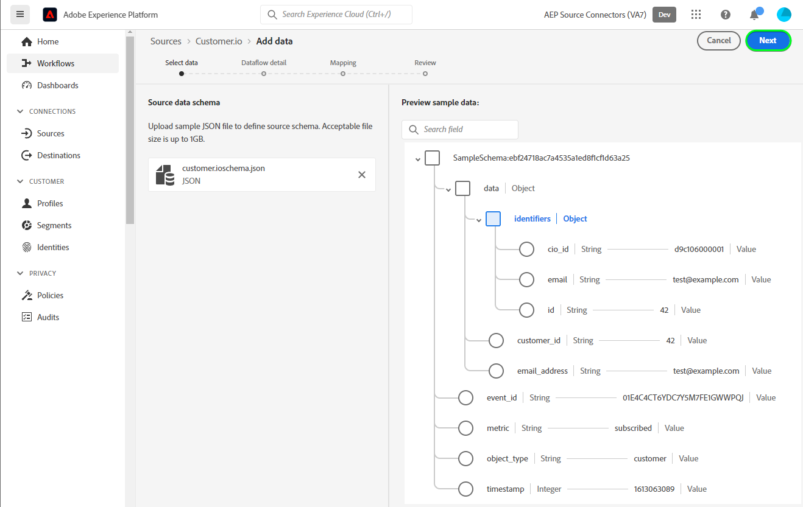

# Crear una conexión de origen y un flujo de datos de [!DNL Customer.io] en la interfaz de usuario

>[!NOTE]
>
>El origen [!DNL Customer.io] está en la versión beta. Lea [información general de orígenes](../../../../home.md#terms-and-conditions) para obtener más información sobre el uso de orígenes etiquetados como beta.

Este tutorial proporciona los pasos para crear una conexión de origen y un flujo de datos de [!DNL Customer.io] mediante la interfaz de usuario de Adobe Experience Platform.

## Introducción {#getting-started}

Este tutorial requiere una comprensión práctica de los siguientes componentes de Experience Platform:

* [[!DNL Experience Data Model (XDM)] Sistema](../../../../../xdm/home.md): El marco de trabajo estandarizado mediante el cual [!DNL Experience Platform] organiza los datos de la experiencia del cliente.
   * [Aspectos básicos de la composición de esquemas](../../../../../xdm/schema/composition.md): obtenga información sobre los componentes básicos de los esquemas XDM, incluidos los principios clave y las prácticas recomendadas en la composición de esquemas.
   * [Tutorial del editor de esquemas](../../../../../xdm/tutorials/create-schema-ui.md): Aprenda a crear esquemas personalizados mediante la interfaz de usuario del editor de esquemas.
* [[!DNL Real-Time Customer Profile]](../../../../../profile/home.md): proporciona un perfil de consumidor unificado y en tiempo real basado en los datos agregados de varias fuentes.

## Requisitos previos {#prerequisites}

La siguiente sección proporciona información sobre los requisitos previos que se deben completar para poder crear una conexión de origen de [!DNL Customer.io].

### Ejemplo de JSON para definir el esquema de origen de [!DNL Customer.io] {#prerequisites-json-schema}

Antes de crear una conexión de origen de [!DNL Customer.io], necesitará que se proporcione un esquema de origen. Puede utilizar el siguiente JSON.

```
{
  "event_id": "01E4C4CT6YDC7Y5M7FE1GWWPQJ",
  "object_type": "customer",
  "metric": "subscribed",
  "timestamp": 1613063089,
  "data": {
    "customer_id": "42",
    "email_address": "test@example.com",
    "identifiers": {
      "id": "42",
      "email": "test@example.com",
      "cio_id": "d9c106000001"
    }
  }
}
```

### Crear un esquema de Experience Platform para [!DNL Customer.io] {#create-platform-schema}

También debe asegurarse de crear un esquema de Experience Platform para utilizarlo en el origen. Consulte el tutorial de [creación de un esquema de Experience Platform](../../../../../xdm/schema/composition.md) para ver los pasos detallados sobre cómo crear un esquema.


## Conectar su cuenta de [!DNL Customer.io] {#connect-account}

En la interfaz de usuario de Experience Platform, seleccione **[!UICONTROL Sources]** en el panel de navegación izquierdo para acceder al área de trabajo [!UICONTROL Sources] y ver un catálogo de orígenes disponibles en Experience Platform.

Utilice el menú *[!UICONTROL Categorías]* para filtrar orígenes por categoría. También puede introducir un nombre de origen en la barra de búsqueda para buscar un origen específico del catálogo.

Vaya a la categoría [!UICONTROL Automatización de marketing] para ver la tarjeta de origen [!DNL Customer.io]. Para empezar, seleccione **[!UICONTROL Agregar datos]**.


## Seleccionar datos {#select-data}

Aparecerá el paso **[!UICONTROL Seleccionar datos]**, que proporciona una interfaz para que pueda seleccionar los datos que desea llevar a Experience Platform.

* La parte izquierda de la interfaz es un explorador que le permite ver los flujos de datos disponibles en su cuenta;
* La parte derecha de la interfaz de le permite previsualizar hasta 100 filas de datos de un archivo JSON.

Seleccione **[!UICONTROL Cargar archivos]** para cargar un archivo JSON desde su sistema local. También puede arrastrar y soltar el archivo JSON que desee cargar en el panel [!UICONTROL Arrastrar y soltar archivos].


Una vez cargado el archivo, la interfaz de vista previa se actualiza para mostrar una vista previa del esquema cargado. La interfaz de vista previa permite inspeccionar el contenido y la estructura de un archivo. También puede usar la utilidad [!UICONTROL Campo de búsqueda] para acceder a elementos específicos desde el esquema.

Cuando termine, seleccione **[!UICONTROL Siguiente]**.



## Detalles del flujo de datos {#dataflow-detail}

Aparecerá el paso **Detalle del flujo de datos**, que le proporcionará opciones para usar un conjunto de datos existente o establecer uno nuevo para su flujo de datos, así como la oportunidad de proporcionar un nombre y una descripción para su flujo de datos. Durante este paso, también puede configurar las opciones de Ingesta de perfiles, diagnósticos de error, ingesta parcial y alertas.

Cuando termine, seleccione **[!UICONTROL Siguiente]**.


## Asignación {#mapping}

Aparecerá el paso [!UICONTROL Mapping], que le proporcionará una interfaz para asignar los campos de origen del esquema de origen a sus campos XDM de destino adecuados en el esquema de destino.

Experience Platform proporciona recomendaciones inteligentes para campos asignados automáticamente en función del esquema o conjunto de datos de destino seleccionado. Puede ajustar manualmente las reglas de asignación para adaptarlas a sus casos de uso. En función de sus necesidades, puede elegir asignar campos directamente o utilizar funciones de preparación de datos para transformar los datos de origen y derivar valores calculados o calculados. Para ver los pasos detallados sobre el uso de la interfaz de asignador y los campos calculados, consulte la [guía de la interfaz de usuario de la preparación de datos](../../../../../data-prep/ui/mapping.md).

Todas las asignaciones enumeradas a continuación son obligatorias y deben configurarse antes de continuar con la fase [!UICONTROL Revisar].

| Campo de destino | Descripción |
| --- | --- |
| `object_type` | El tipo de objeto; consulte la documentación de [!DNL Customer.io] [events](https://customer.io/docs/webhooks/#events) para obtener los tipos compatibles. |
| `id` | El identificador del objeto. |
| `email` | La dirección de correo electrónico asociada con el objeto. |
| `event_id` | El identificador único del evento. |
| `cio_id` | El identificador [!DNL Customer.io] del evento. |
| `metric` | El tipo de evento. Para obtener más información, consulte la documentación de [!DNL Customer.io] [events](https://customer.io/docs/webhooks/#events) para ver los tipos compatibles. |
| `timestamp` | La marca de tiempo cuando se produjo el evento. |

>[!IMPORTANT]
>
>No asigne `cio_id` al ejecutar el webhook [!DNL Customer.io] en `test mode`, ya que no se enviarán campos asociados desde [!DNL Customer.io].

Una vez que los datos de origen estén asignados correctamente, seleccione **[!UICONTROL Siguiente]**.


## Revisar {#review}

Aparece el paso **[!UICONTROL Revisar]**, que le permite revisar el nuevo flujo de datos antes de crearlo. Los detalles se agrupan en las siguientes categorías:

* **[!UICONTROL Conexión]**: muestra el tipo de origen, la ruta de acceso relevante del archivo de origen elegido y la cantidad de columnas dentro de ese archivo de origen.
* **[!UICONTROL Asignar campos de conjunto de datos y asignación]**: muestra en qué conjunto de datos se están ingiriendo los datos de origen, incluido el esquema al que se adhiere el conjunto de datos.

Una vez que haya revisado el flujo de datos, seleccione **[!UICONTROL Finalizar]** y espere un poco para que se cree el flujo de datos.


## Obtener la URL del extremo de flujo continuo {#get-streaming-endpoint}

Con el flujo de datos de flujo continuo creado, ahora puede recuperar la URL del extremo de flujo continuo. Este punto de conexión se utilizará para suscribirse al webhook, lo que permitirá que el origen de flujo se comunique con Experience Platform.

Para construir la dirección URL utilizada para configurar el webhook en [!DNL Customer.io], debe recuperar lo siguiente:

* **[!UICONTROL ID de flujo de datos]**
* **[!UICONTROL Extremo de streaming]**

Para recuperar tu **[!UICONTROL ID de flujo de datos]** y **[!UICONTROL extremo de transmisión]**, ve a la página de [!UICONTROL actividad de flujo de datos] del flujo de datos que acabas de crear y copia los detalles desde la parte inferior del panel [!UICONTROL Propiedades].


Una vez que haya recuperado su extremo de flujo continuo y el ID de flujo de datos, genere una URL basada en el siguiente patrón: ```{STREAMING_ENDPOINT}?x-adobe-flow-id={DATAFLOW_ID}```. Por ejemplo, una URL de gancho web construida puede tener el siguiente aspecto: ``https://dcs.adobedc.net/collection/febc116d22ba0ea2868e9c93b199375302afb8a589617700991bb8f3f0341ad7?x-adobe-flow-id=439b3fc4-3042-4a3a-b5e0-a494898d3fb0``

## Configurar webhook de informes en [!DNL Customer.io] {#set-up-webhook}

Con la URL del gancho web creada, ahora puede configurar el gancho web de informes con la interfaz de usuario [!DNL Customer.io]. Para ver los pasos para configurar los webhooks de informes, lee la [[!DNL Customer.io] guía](https://customer.io/docs/webhooks/#setup) sobre la configuración de webhooks.

En la interfaz de usuario [!DNL Customer.io], escriba la [URL de gancho web](#get-streaming-endpoint-url) en el campo [!DNL WEBHOOK ENDPOINT].


>[!TIP]
>
>Puede suscribirse a una variedad de eventos diferentes para su webhook de informes. El mensaje de cada evento se incorporará a Experience Platform cuando se cumpla un criterio de déclencheur de evento de acción [!DNL Customer.io]. Para obtener más información sobre los diferentes eventos, consulte la [[!DNL Customer.io] documentación de eventos](https://customer.io/docs/webhooks/#events).

## Pasos siguientes {#next-steps}

Al seguir este tutorial, configuró correctamente un flujo de datos de streaming para llevar los datos de [!DNL Customer.io] a Experience Platform. Para supervisar los datos que se están ingiriendo, consulte la guía sobre [supervisión de flujos de datos de flujo continuo mediante la interfaz de usuario de Experience Platform](../../monitor-streaming.md).

## Recursos adicionales {#additional-resources}

Las secciones siguientes proporcionan recursos adicionales a los que puede hacer referencia al usar el origen [!DNL Customer.io].

### Mecanismos de protección {#guardrails}

Para obtener información sobre las protecciones, consulte la [[!DNL Customer.io] página de tiempos de espera y errores](https://customer.io/docs/webhooks/#timeouts-and-failures).

### Validación {#validation}

Para comprobar que ha configurado correctamente el origen y que se están introduciendo [!DNL Customer.io] mensajes, siga los pasos a continuación:

* Puede consultar la página [!DNL Customer.io] **[!UICONTROL Registros de actividad]** para identificar los eventos capturados por [!DNL Customer.io].


* En la interfaz de usuario de Experience Platform, seleccione **[!UICONTROL Ver flujos de datos]** junto al menú de tarjeta [!DNL Customer.io] en el catálogo de fuentes. A continuación, seleccione **[!UICONTROL Vista previa del conjunto de datos]** para comprobar los datos introducidos para los eventos seleccionados en [!DNL Customer.io].


