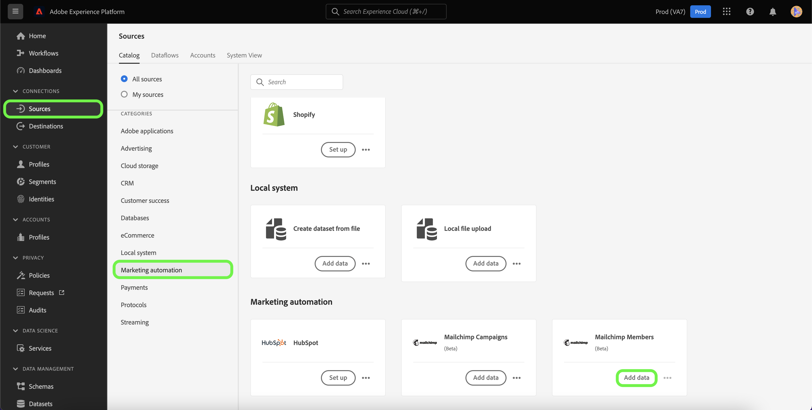

# Crear un [!DNL Mailchimp Members] conexión de origen mediante la IU de Platform

Este tutorial proporciona los pasos para crear una [!DNL Mailchimp] conector de origen para la ingesta [!DNL Mailchimp Members] datos a Adobe Experience Platform mediante la interfaz de usuario de.

## Primeros pasos

Esta guía requiere una comprensión práctica de los siguientes componentes de Adobe Experience Platform:

* [Fuentes](../../../../home.md): Platform permite la ingesta de datos desde varias fuentes, al tiempo que le ofrece la capacidad de estructurar, etiquetar y mejorar los datos entrantes mediante [!DNL Platform] servicios.
* [Zonas protegidas](../../../../../sandboxes/home.md): Platform proporciona zonas protegidas virtuales que dividen una sola instancia de Platform en entornos virtuales independientes para ayudar a desarrollar y evolucionar aplicaciones de experiencia digital.

## Recopilar credenciales necesarias

Para poder traer su [!DNL Mailchimp Members] datos a Platform, primero debe proporcionar las credenciales de autenticación adecuadas que se correspondan con su [!DNL Mailchimp] cuenta.

El [!DNL Mailchimp Members] source admite código de actualización de OAuth 2 y autenticación básica. Consulte las tablas siguientes para obtener más información sobre estos tipos de autenticación.

### Código de actualización de OAuth 2

| Credenciales | Descripción |
| --- | --- |
| Domain | La URL raíz utilizada para conectarse a la API de MailChimp. El formato de la URL raíz es el siguiente `https://{DC}.api.mailchimp.com`, donde `{DC}` representa el centro de datos que corresponde a su cuenta de. |
| URL de prueba de autorización | La dirección URL de prueba de autorización se utiliza para validar credenciales al conectarse [!DNL Mailchimp] a Platform. Si no se proporciona, las credenciales se comprueban automáticamente durante el paso de creación de la conexión de origen. |
| Token de acceso | El token de acceso correspondiente utilizado para autenticar el origen. Esto es necesario para la autenticación basada en OAuth. |

Para obtener más información sobre el uso de OAuth 2 para autenticar el [!DNL Mailchimp] cuenta de a Platform, consulte esto [[!DNL Mailchimp] documento sobre el uso de OAuth 2](https://mailchimp.com/developer/marketing/guides/access-user-data-oauth-2/).

### Autenticación básica

| Credenciales | Descripción |
| --- | --- |
| Domain | La URL raíz utilizada para conectarse a la API de MailChimp. El formato de la URL raíz es el siguiente `https://{DC}.api.mailchimp.com`, donde `{DC}` representa el centro de datos que corresponde a su cuenta de. |
| Nombre de usuario | El nombre de usuario que corresponde con su cuenta de MailChimp. Esto es necesario para la autenticación básica. |
| Una contraseña | La contraseña que corresponde a su cuenta de MailChimp. Esto es necesario para la autenticación básica. |

## Conecte su [!DNL Mailchimp Members] cuenta a Platform

En la IU de Platform, seleccione **[!UICONTROL Fuentes]** desde la barra de navegación izquierda para acceder a [!UICONTROL Fuentes] workspace. El [!UICONTROL Catálogo] La pantalla muestra una variedad de fuentes con las que puede crear una cuenta.

Puede seleccionar la categoría adecuada del catálogo en la parte izquierda de la pantalla. También puede encontrar la fuente específica con la que desea trabajar utilizando la opción de búsqueda.

En el [!UICONTROL Automatización de marketing] categoría, seleccionar **[!UICONTROL Campaña de Mailchimp]**, y luego seleccione **[!UICONTROL Añadir datos]**.

El **[!UICONTROL Conectar la cuenta de Mailchimp Campaigns]** página. En esta página, puede seleccionar si está accediendo a una cuenta existente u optando por crear una nueva cuenta.

### Cuenta existente

Para utilizar una cuenta existente, seleccione la [!DNL Mailchimp Members] cuenta con la que desea crear un nuevo flujo de datos y seleccione **[!UICONTROL Siguiente]** para continuar.

### Nueva cuenta

Si está creando una cuenta nueva, seleccione **[!UICONTROL Nueva cuenta]** y, a continuación, proporcione un nombre y una descripción para su [!DNL Mailchimp Members] detalles de conexión de origen.

#### Autenticar con OAuth 2

Para usar OAuth 2, seleccione [!UICONTROL Código de actualización de OAuth 2], proporcione valores para el dominio, la dirección URL de prueba de autorización y el token de acceso y, a continuación, seleccione **[!UICONTROL Conectar con el origen]**. Espere unos momentos para que sus credenciales se validen y, a continuación, seleccione **[!UICONTROL Siguiente]** para continuar.

#### Autenticar con autenticación básica

Para utilizar la autenticación básica, seleccione [!UICONTROL Autenticación básica], proporcione valores para el dominio, nombre de usuario y contraseña y, a continuación, seleccione **[!UICONTROL Conectar con el origen]**. Espere unos momentos para que sus credenciales se validen y, a continuación, seleccione **[!UICONTROL Siguiente]** para continuar.

### Seleccionar [!DNL Mailchimp Members] datos

Una vez autenticado el origen, debe proporcionar el `listId` que se corresponde con su [!DNL Mailchimp Members] cuenta.

En el [!UICONTROL Seleccionar datos] , introduzca su `listId` y luego seleccione **[!UICONTROL Explorar]**.

La página se actualiza en un árbol de esquema interactivo que le permite explorar e inspeccionar la jerarquía de los datos. Seleccionar **[!UICONTROL Siguiente]** para continuar.

## Pasos siguientes

Con su [!DNL Mailchimp] cuenta autenticada y su [!DNL Mailchimp Members] Si selecciona datos, ahora puede empezar a crear un flujo de datos para llevar los datos a Platform. Para ver los pasos detallados sobre cómo crear un flujo de datos, consulte la documentación sobre [creación de un flujo de datos para llevar los datos de automatización de marketing a Platform](../../dataflow/marketing-automation.md).
