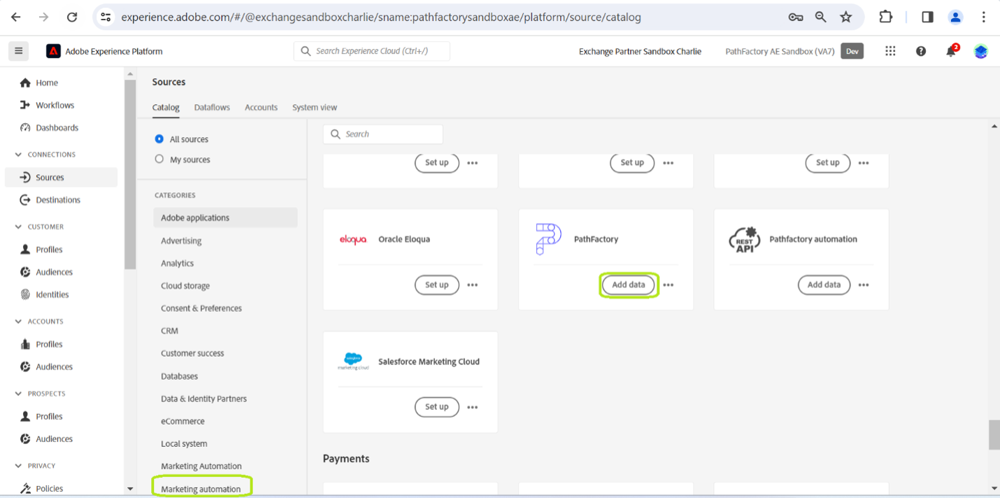

# Conecte su [!DNL PathFactory] Cuenta de a Experience Platform a través de la IU de

Este tutorial proporciona pasos sobre cómo conectar su [!DNL PathFactory] Los datos de Visitantes, Sesiones y Vistas de página se envían a Adobe Experience Platform a través de la interfaz de usuario.

## Introducción

Este tutorial requiere una comprensión práctica de los siguientes componentes de Experience Platform:

* [[!DNL Experience Data Model (XDM)] Sistema](../../../../../xdm/home.md): El marco estandarizado mediante el cual [!DNL Experience Platform] organiza los datos de experiencia del cliente.
   * [Conceptos básicos de composición de esquemas](../../../../../xdm/schema/composition.md): Obtenga información acerca de los componentes básicos de los esquemas XDM, incluidos los principios clave y las prácticas recomendadas en la composición de esquemas.
   * [Tutorial del Editor de esquemas](../../../../../xdm/tutorials/create-schema-ui.md): Aprenda a crear esquemas personalizados mediante la interfaz de usuario del Editor de esquemas.
* [[!DNL Real-Time Customer Profile]](../../../../../profile/home.md): Proporciona un perfil de consumidor unificado y en tiempo real basado en los datos agregados de varias fuentes.

Si ya tiene un [!DNL PathFactory] cuenta de, puede omitir el resto de este documento y continuar con el tutorial sobre [Introducción de datos de automatización de marketing al Experience Platform mediante la IU](../../dataflow/marketing-automation.md).

### Recopilar credenciales necesarias {#gather-credentials}

Para acceder a su cuenta de PathFactory en Platform, debe proporcionar los siguientes valores:

| Credencial | Descripción |
| ---------- | ----------- |
| Nombre de usuario | Su nombre de usuario de cuenta de PathFactory. Esto es esencial para identificar su cuenta en el sistema. |
| Una contraseña | La contraseña asociada a su cuenta de PathFactory. Asegúrese de que se mantenga seguro para evitar el acceso no autorizado. |
| Dominio | El dominio asociado con su cuenta de PathFactory. Normalmente, hace referencia al identificador único de la dirección URL de PathFactory. |
| Token de acceso | Un token único utilizado para la autenticación de API para garantizar la comunicación segura entre sus sistemas y PathFactory. |
| Extremos de API | Puntos finales específicos de API para acceder a los datos: visitantes, sesiones y vistas de páginas. Cada extremo corresponde a diferentes conjuntos de datos que puede recuperar. **Nota:** Están predefinidas por [!DNL PathFactory] y son específicos de los datos a los que desea acceder: <ul><li>**Punto final de visitantes**: `/api/public/v3/data_lake_apis/visitors.json`</li><li>**Punto final de sesiones**: `/api/public/v3/data_lake_apis/sessions.json`</li><li>**Extremo de vistas de página**: `/api/public/v3/data_lake_apis/page_views.json`</li></ul> |

Para obtener instrucciones detalladas sobre cómo proteger y utilizar sus credenciales, y para obtener información sobre cómo obtener y actualizar su token de acceso, visite la [Centro de soporte de PathFactory](https://support.pathfactory.com/categories/adobe/). Este recurso ofrece guías completas sobre la administración de las credenciales y la garantía de una integración de API eficaz y segura.

## Conecte su [!DNL PathFactory] account

En la IU de Platform, seleccione **[!UICONTROL Fuentes]** desde la navegación izquierda para acceder a [!UICONTROL Fuentes] workspace. El [!UICONTROL Catálogo] muestra una variedad de fuentes admitidas por Experience Platform.

Puede seleccionar la categoría adecuada de la lista de categorías. También puede utilizar la barra de búsqueda para filtrar por un origen específico.

En el [!UICONTROL Automatización de marketing] categoría, seleccionar **[!UICONTROL PathFactory]** y luego seleccione **[!UICONTROL Configuración de]**.

El **[!UICONTROL Conectar con PathFactory]** página. En esta página, puede crear una cuenta nueva o utilizar una cuenta existente.

### Nueva cuenta

Para crear una nueva cuenta, seleccione **[!UICONTROL Nueva cuenta]** y proporcione un nombre para su cuenta, una descripción opcional y las credenciales de autenticación que se correspondan con su [!DNL PathFactory] cuenta.

Cuando termine, seleccione **[!UICONTROL Conectar con el origen]** y, a continuación, espere un poco para que se establezca la nueva conexión.

### Cuenta existente

Si ya tiene una cuenta, seleccione **[!UICONTROL Cuenta existente]** y, a continuación, seleccione la cuenta que desee utilizar en la lista que aparece.

## Pasos siguientes

Al seguir este tutorial, ha establecido una conexión entre sus [!DNL PathFactory] cuenta y Experience Platform. Ahora puede continuar con el siguiente tutorial y [cree un flujo de datos para llevar los datos de automatización de marketing a Experience Platform](../../dataflow/marketing-automation.md).
