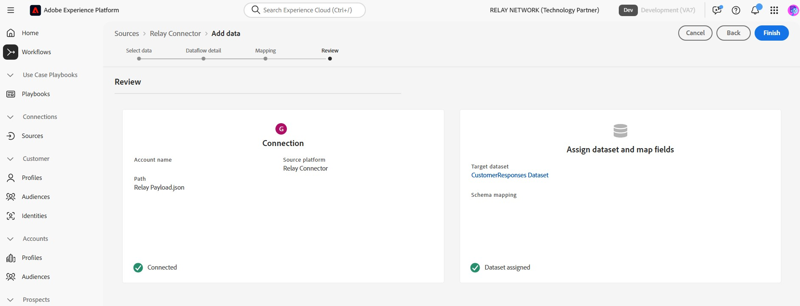

# Conexión de la retransmisión a Experience Platform en la interfaz de usuario

>[!NOTE]
>
>El origen [!DNL Relay Connector] está en la versión beta. Lea [información general de orígenes](../../../../home.md#terms-and-conditions) para obtener más información sobre el uso de orígenes etiquetados como beta.

Con [!DNL Relay Connector], puede ofrecer experiencias personalizadas a sus clientes en los momentos más significativos de su recorrido, lo que le ayuda a crear relaciones más sólidas y a impulsar una mayor lealtad y valor mediante la creación de una conexión entrante a los eventos de flujo desde su integración de [!DNL Relay Network] en Adobe Experience Platform.

Lea esta guía para aprender a utilizar [!DNL Relay Connector] en el área de trabajo de orígenes de la interfaz de usuario de Experience Platform.

>[!IMPORTANT]
>
>El equipo *[!DNL Relay Network]* mantiene esta página de documentación. Para cualquier consulta o solicitud de actualización, comuníquese directamente con ellos al *[[!DNL Relay Network]](https://www.relaynetwork.com/) o envíe un correo electrónico a [info@relaynetwork.com](mailto:info@relaynetwork.com)*.

## Conectar el origen de [!DNL Relay Connector]

En la interfaz de usuario de Experience Platform, seleccione **[!UICONTROL Fuentes]** en la barra de navegación izquierda para acceder al área de trabajo de [!UICONTROL Fuentes]. La pantalla [!UICONTROL Catálogo] muestra una variedad de orígenes con los que puede crear una cuenta. Puede seleccionar la categoría adecuada del catálogo en la parte izquierda de la pantalla o utilizar la opción de búsqueda para encontrar una fuente específica.

En la categoría *[!UICONTROL Automatización de marketing]*, seleccione la tarjeta de origen [!DNL Relay Connector] y seleccione **[!UICONTROL Agregar datos]**.

>[!TIP]
>
>Los orígenes del catálogo de orígenes muestran la opción **[!UICONTROL Set up]** cuando no existe ninguna cuenta autenticada. Una vez autenticada una cuenta, esta opción cambia a **[!UICONTROL Agregar datos]**.

### Seleccionar datos

Aparece la interfaz **[!UICONTROL Origen del conector de retransmisión de conexión]**. Utilice la interfaz *[!UICONTROL Select data]* para examinar o especificar el esquema de datos de origen. También puede cargar un archivo JSON de muestra para definir el esquema de origen.

>[!NOTE]
>
>El tamaño de archivo aceptable es de hasta 1 GB.

Una vez cargados los datos, puede usar la sección [!UICONTROL Vista previa de datos de ejemplo] para obtener una vista previa de los datos.

### Detalles del flujo de datos

A continuación, utilice la interfaz *[!UICONTROL Detalles del flujo de datos]* para proporcionar un **nombre** y una **descripción opcional** para su flujo de datos. Además, seleccione el **[!UICONTROL conjunto de datos de destino]** que desee usar. Puede crear un nuevo conjunto de datos o utilizar uno existente.

### Asignación

Puede asignar los campos de origen a campos de esquema XDM mediante la funcionalidad de asignación automática, que coincide con los campos en función de sus nombres, o crear asignaciones personalizadas para un control más preciso. Si es necesario, también puede aplicar transformaciones como concatenación, formato o cambio de nombre para garantizar que los datos se ajusten perfectamente al esquema de destino. Para obtener más información sobre la asignación, lea la [Guía de la interfaz de usuario para la preparación de datos](../../../../../data-prep/ui/mapping.md).

>[!TIP]
>
>Para obtener más información sobre los tipos de eventos y los valores de datos que la retransmisión enviará a su origen, lea la documentación de [[!DNL Relay Network] eventos push](https://docs.relaynetwork.com/docs/push-events). Esta información le ayudará a diseñar correctamente su **esquema de eventos de experiencia**.

### Revisar

Finalmente, revise todas las configuraciones, incluyendo su **origen, conjunto de datos y asignaciones**. Cuando termine, seleccione **Finish** para crear el flujo de datos.

### Recupere la URL del extremo de flujo continuo

Una vez que haya creado el flujo de datos, encontrará la *URL del extremo de transmisión* y otros detalles relacionados en la sección **Propiedades** a la derecha de la página del flujo de datos.

Use estos valores para configurar el webhook en la **consola de retransmisión**. Para obtener instrucciones detalladas sobre la configuración de la API push, consulte la documentación de retransmisión: [Configuración de la API push](https://docs.relaynetwork.com/docs/configuring-the-push-api).

## Recursos adicionales

* [Crear una nueva especificación de conexión mediante la API de Flow Service](https://experienceleague.adobe.com/es/docs/experience-platform/sources/sdk/streaming-sdk/create)
* [Conéctese a su origen mediante la interfaz de usuario](https://experienceleague.adobe.com/es/docs/experience-platform/sources/sdk/streaming-sdk/submit#test-your-source-using-the-ui)
