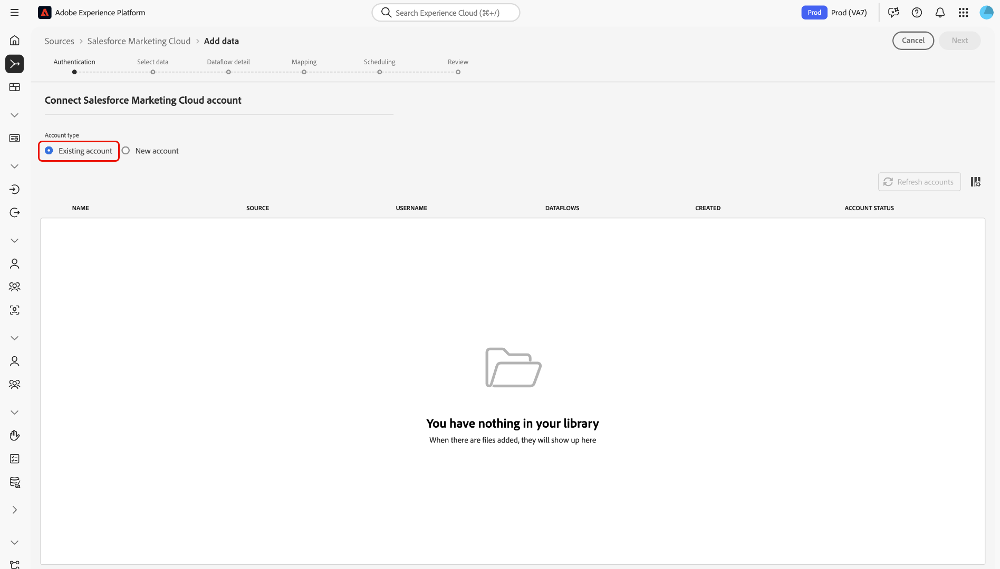

# Conecte su [!DNL Salesforce Marketing Cloud] Cuenta de a Experience Platform a través de la IU de

>[!IMPORTANT]
>
>La ingesta de objetos personalizados no es compatible actualmente con [!DNL Salesforce Marketing Cloud] integración de origen.

Este tutorial proporciona pasos sobre cómo conectar su [!DNL Salesforce Marketing Cloud] a Adobe Experience Platform a través de la interfaz de usuario.

## Introducción

Este tutorial requiere una comprensión práctica de los siguientes componentes de Experience Platform:

* [[!DNL Experience Data Model (XDM)] Sistema](../../../../../xdm/home.md): El marco estandarizado mediante el cual [!DNL Experience Platform] organiza los datos de experiencia del cliente.
   * [Conceptos básicos de composición de esquemas](../../../../../xdm/schema/composition.md): Obtenga información acerca de los componentes básicos de los esquemas XDM, incluidos los principios clave y las prácticas recomendadas en la composición de esquemas.
   * [Tutorial del Editor de esquemas](../../../../../xdm/tutorials/create-schema-ui.md): Aprenda a crear esquemas personalizados mediante la interfaz de usuario del Editor de esquemas.
* [[!DNL Real-Time Customer Profile]](../../../../../profile/home.md): Proporciona un perfil de consumidor unificado y en tiempo real basado en los datos agregados de varias fuentes.

Si ya tiene un [!DNL Salesforce Marketing Cloud] cuenta de, puede omitir el resto de este documento y continuar con el tutorial sobre [Introducción de datos de automatización de marketing al Experience Platform mediante la IU](../../dataflow/marketing-automation.md).

### Recopilar credenciales necesarias

Para acceder a su [!DNL Salesforce Marketing Cloud] en Platform, debe proporcionar los siguientes valores:

| Credencial | Descripción |
| ---------- | ----------- |
| Host | Servidor host de la aplicación. Este suele ser su subdominio. **Nota:** Al introducir su `host` , solo necesita especificar el subdominio y no la dirección URL completa. Por ejemplo, si la dirección URL del host es `https://abcd-ab12c3d4e5fg6hijk7lmnop8qrst.auth.marketingcloudapis.com/`, entonces solo necesita introducir `abcd-ab12c3d4e5fg6hijk7lmnop8qrst` como valor de host. |
| ID del cliente | El ID de cliente asociado con su [!DNL Salesforce Marketing Cloud] aplicación. |
| Secreto de cliente | El secreto de cliente asociado con su [!DNL Salesforce Marketing Cloud] aplicación. |

Para obtener más información sobre la autenticación para [!DNL Salesforce Marketing Cloud], visite la [[!DNL Salesforce] documentación de autenticación](https://developer.salesforce.com/docs/atlas.en-us.mc-apis.meta/mc-apis/authentication.htm).

## Conecte su [!DNL Salesforce Marketing Cloud] account

En la IU de Platform, seleccione **[!UICONTROL Fuentes]** desde la navegación izquierda para acceder a [!UICONTROL Fuentes] workspace. El [!UICONTROL Catálogo] muestra una variedad de fuentes admitidas por Experience Platform.

Puede seleccionar la categoría adecuada de la lista de categorías. También puede utilizar la barra de búsqueda para filtrar por un origen específico.

En el [!UICONTROL Automatización de marketing] categoría, seleccionar **[!UICONTROL Marketing Cloud de Salesforce]** y luego seleccione **[!UICONTROL Configuración de]**.

El **[!UICONTROL Conectar con Salesforce Marketing Cloud]** página. En esta página, puede crear una cuenta nueva o utilizar una cuenta existente.

### Nueva cuenta

Para crear una nueva cuenta, seleccione **[!UICONTROL Nueva cuenta]** y proporcione un nombre para su cuenta, una descripción opcional y las credenciales de autenticación que se correspondan con su [!DNL Salesforce Marketing Cloud] cuenta.

Cuando termine, seleccione **[!UICONTROL Conectar con el origen]** y, a continuación, espere un poco para que se establezca la nueva conexión.

### Cuenta existente

Si ya tiene una cuenta, seleccione **[!UICONTROL Cuenta existente]** y, a continuación, seleccione la cuenta que desee utilizar en la lista que aparece.

## Pasos siguientes

Al seguir este tutorial, ha establecido una conexión entre sus [!DNL Salesforce Marketing Cloud] cuenta y Experience Platform. Ahora puede continuar con el siguiente tutorial y [cree un flujo de datos para llevar los datos de automatización de marketing a Experience Platform](../../dataflow/marketing-automation.md).
