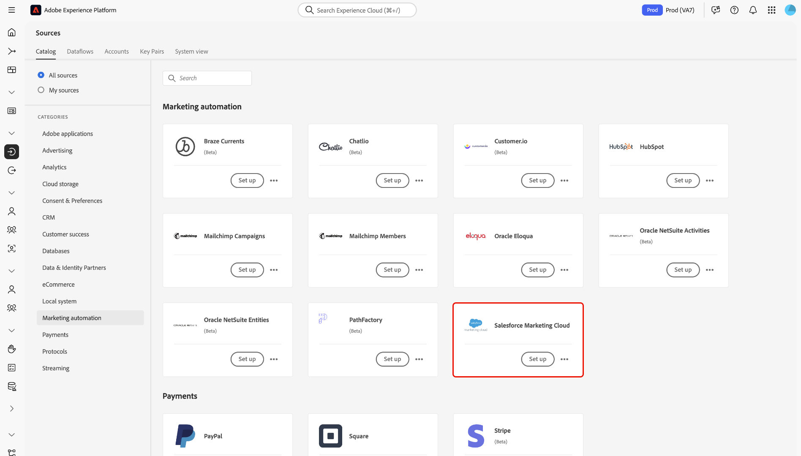

# Conecte su cuenta de [!DNL Salesforce Marketing Cloud] a Experience Platform mediante la interfaz de usuario

>[!WARNING]
>
>El origen [!DNL Salesforce Marketing Cloud] quedará obsoleto a finales de junio de 2025.

Este tutorial proporciona pasos sobre cómo conectar su cuenta de [!DNL Salesforce Marketing Cloud] a Adobe Experience Platform a través de la interfaz de usuario.

## Introducción

Este tutorial requiere una comprensión práctica de los siguientes componentes de Experience Platform:

* [[!DNL Experience Data Model (XDM)] Sistema](../../../../../xdm/home.md): El marco de trabajo estandarizado mediante el cual [!DNL Experience Platform] organiza los datos de la experiencia del cliente.
   * [Aspectos básicos de la composición de esquemas](../../../../../xdm/schema/composition.md): obtenga información sobre los componentes básicos de los esquemas XDM, incluidos los principios clave y las prácticas recomendadas en la composición de esquemas.
   * [Tutorial del editor de esquemas](../../../../../xdm/tutorials/create-schema-ui.md): Aprenda a crear esquemas personalizados mediante la interfaz de usuario del editor de esquemas.
* [[!DNL Real-Time Customer Profile]](../../../../../profile/home.md): proporciona un perfil de consumidor unificado y en tiempo real basado en los datos agregados de varias fuentes.

Si ya tiene una cuenta de [!DNL Salesforce Marketing Cloud], puede omitir el resto de este documento y continuar con el tutorial de [introducción de datos de automatización de marketing en Experience Platform mediante la interfaz de usuario](../../dataflow/marketing-automation.md).

### Recopilar credenciales necesarias

Para tener acceso a su cuenta de [!DNL Salesforce Marketing Cloud] en Experience Platform, debe proporcionar los siguientes valores:

| Credencial | Descripción |
| ---------- | ----------- |
| Host | Servidor host de la aplicación. Este suele ser su subdominio. **Nota:** Al escribir el valor `host`, debe especificar `{subdomain}.rest.marketingcloudapis.com`. Por ejemplo, si la dirección URL de host es `https://acme-ab12c3d4e5fg6hijk7lmnop8qrst.auth.marketingcloudapis.com/`, debe escribir `acme-ab12c3d4e5fg6hijk7lmnop8qrst.rest.marketingcloudapis.com/` como valor de host. |
| ID de cliente | Identificador de cliente asociado con la aplicación [!DNL Salesforce Marketing Cloud]. |
| Secreto del cliente | Secreto de cliente asociado a la aplicación [!DNL Salesforce Marketing Cloud]. |

Para obtener más información acerca de la autenticación de [!DNL Salesforce Marketing Cloud], visite la [[!DNL Salesforce] documentación de autenticación](https://developer.salesforce.com/docs/atlas.en-us.mc-apis.meta/mc-apis/authentication.htm).

## Conectar su cuenta de [!DNL Salesforce Marketing Cloud]

>[!IMPORTANT]
>
>La integración de origen de [!DNL Salesforce Marketing Cloud] no admite actualmente la ingesta de objetos personalizados.

En la interfaz de usuario de Experience Platform, seleccione **[!UICONTROL Fuentes]** en el panel de navegación izquierdo para acceder al área de trabajo [!UICONTROL Fuentes]. El [!UICONTROL catálogo] muestra una variedad de orígenes admitidos por Experience Platform.

Puede seleccionar la categoría adecuada de la lista de categorías. También puede utilizar la barra de búsqueda para filtrar por un origen específico.

En la categoría [!UICONTROL Automatización de marketing], seleccione **[!UICONTROL Salesforce Marketing Cloud]** y luego **[!UICONTROL Configurar]**.

Aparecerá la página **[!UICONTROL Conectar con Salesforce Marketing Cloud]**. En esta página, puede crear una cuenta nueva o utilizar una cuenta existente.

### Nueva cuenta

Para crear una cuenta nueva, selecciona **[!UICONTROL Cuenta nueva]** y proporciona un nombre para tu cuenta, una descripción opcional y las credenciales de autenticación que corresponden a tu cuenta de [!DNL Salesforce Marketing Cloud].

Cuando termine, seleccione **[!UICONTROL Conectarse al origen]** y deje pasar un tiempo para que se establezca la nueva conexión.

### Cuenta existente

Si ya tiene una cuenta, seleccione **[!UICONTROL Cuenta existente]** y luego seleccione la cuenta que desee usar en la lista que aparece.

## Pasos siguientes

Al seguir este tutorial, ha establecido una conexión entre su cuenta de [!DNL Salesforce Marketing Cloud] y Experience Platform. Ahora puede continuar con el siguiente tutorial y [crear un flujo de datos para introducir los datos de automatización de marketing en Experience Platform](../../dataflow/marketing-automation.md).
