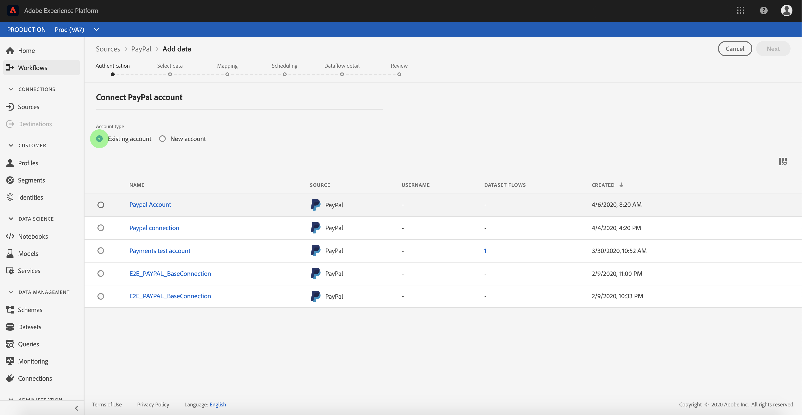

# Cree un [!DNL PayPal] conexión de origen en la interfaz de usuario

Los conectores de origen de Adobe Experience Platform permiten la ingesta de datos de origen externo de forma programada. Este tutorial proporciona los pasos para crear un [!DNL PayPal] conector de origen mediante la interfaz de usuario de Platform.

## Primeros pasos

Este tutorial requiere una comprensión práctica de los siguientes componentes de Adobe Experience Platform:

* [[!DNL Experience Data Model (XDM)] Sistema](../../../../../xdm/home.md): El marco normalizado por el cual [!DNL Experience Platform] organiza los datos de experiencia del cliente.
   * [Aspectos básicos de la composición del esquema](../../../../../xdm/schema/composition.md): Obtenga información sobre los componentes básicos de los esquemas XDM, incluidos los principios clave y las prácticas recomendadas en la composición de esquemas.
   * [Tutorial del Editor de esquemas](../../../../../xdm/tutorials/create-schema-ui.md): Obtenga información sobre cómo crear esquemas personalizados mediante la interfaz de usuario del Editor de esquemas.
* [[!DNL Real-Time Customer Profile]](../../../../../profile/home.md): Proporciona un perfil de cliente unificado y en tiempo real basado en datos agregados de varias fuentes.

Si ya tiene una [!DNL PayPal] conexión, puede omitir el resto de este documento y continuar con el tutorial en [configuración de un flujo de datos](../../dataflow/payments.md)

### Recopilar las credenciales necesarias

Para acceder a su [!DNL PayPal] plataforma de cuenta, debe proporcionar los siguientes valores:

| Credencial | Descripción |
| ---------- | ----------- |
| `host` | La dirección URL del [!DNL PayPal] instancia. |
| `clientID` | El ID de cliente asociado con su [!DNL PayPal] aplicación. |
| `clientSecret` | El secreto de cliente asociado con su [!DNL PayPal] aplicación. |

Para obtener más información sobre cómo empezar, consulte esta [[!DNL PayPal] documento](https://developer.paypal.com/docs/api/overview/#get-credentials)

## Conecte su [!DNL PayPal] account

Una vez que haya reunido las credenciales necesarias, puede seguir los pasos a continuación para vincular sus [!DNL PayPal] a Platform.

Iniciar sesión en [Adobe Experience Platform](https://platform.adobe.com) y, a continuación, seleccione **[!UICONTROL Fuentes]** en la barra de navegación izquierda para acceder a la **[!UICONTROL Fuentes]** espacio de trabajo. La variable **[!UICONTROL Catálogo]** muestra una variedad de fuentes para las que puede crear una cuenta.

Puede seleccionar la categoría adecuada del catálogo en la parte izquierda de la pantalla. Alternativamente, puede encontrar la fuente específica con la que desea trabajar usando la opción de búsqueda.

En el **[!UICONTROL Pagos]** categoría, seleccione **[!UICONTROL PayPal]**. Si es la primera vez que utiliza este conector, seleccione **[!UICONTROL Configurar]**. De lo contrario, seleccione **[!UICONTROL Añadir datos]** para crear un [!DNL PayPal] conector.

La variable **[!UICONTROL Conectarse a PayPal]** se abre. En esta página, puede usar credenciales nuevas o existentes.

### Nueva cuenta

Si está utilizando credenciales nuevas, seleccione **[!UICONTROL Nueva cuenta]**. En el formulario de entrada que aparece, indique un nombre, una descripción opcional y su [!DNL PayPal] credenciales. Cuando termine, seleccione **[!UICONTROL Connect]** y, a continuación, permita que la nueva conexión se establezca durante algún tiempo.

### Cuenta existente

Para conectar una cuenta existente, seleccione la opción [!DNL PayPal] cuenta con la que desea conectarse y, a continuación, seleccione **[!UICONTROL Siguiente]** para continuar.

## Pasos siguientes

Al seguir este tutorial, ha establecido una conexión con su [!DNL PayPal] cuenta. Ahora puede continuar con el siguiente tutorial y [configurar un flujo de datos para introducir los datos de pago en Platform](../../dataflow/payments.md).
