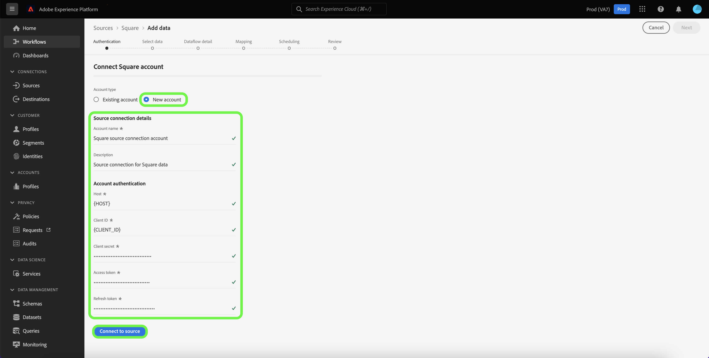

# Crear una conexión de origen [!DNL Square] en la interfaz de usuario

Este tutorial proporciona los pasos para crear un conector de origen [!DNL Square] mediante la interfaz de usuario de Experience Platform.

## Introducción

Este tutorial requiere una comprensión práctica de los siguientes componentes de Adobe Experience Platform:

* [[!DNL Experience Data Model (XDM)] Sistema](../../../../../xdm/home.md): El marco de trabajo estandarizado mediante el cual [!DNL Experience Platform] organiza los datos de la experiencia del cliente.
   * [Aspectos básicos de la composición de esquemas](../../../../../xdm/schema/composition.md): obtenga información sobre los componentes básicos de los esquemas XDM, incluidos los principios clave y las prácticas recomendadas en la composición de esquemas.
   * [Tutorial del editor de esquemas](../../../../../xdm/tutorials/create-schema-ui.md): Aprenda a crear esquemas personalizados mediante la interfaz de usuario del editor de esquemas.
* [[!DNL Real-Time Customer Profile]](../../../../../profile/home.md): proporciona un perfil de consumidor unificado y en tiempo real basado en los datos agregados de varias fuentes.

### Recopilar credenciales necesarias

Para tener acceso a la Experience Platform de su cuenta de [!DNL Square], debe proporcionar los siguientes valores:

| Credencial | Descripción |
| --- | --- |
| Host | Dirección URL de la instancia [!DNL Square]. |
| ID de cliente | Identificador de cliente asociado con su cuenta de [!DNL Square]. |
| Secreto del cliente | El secreto de cliente asociado con su cuenta de [!DNL Square]. |
| Token de acceso | El token de acceso se utiliza para autenticar su cuenta de [!DNL Square] con la autenticación OAuth 2.0. El token de acceso se puede obtener de [!DNL Square]. |
| Actualizar token | El token de actualización se utiliza para generar nuevos tokens de acceso una vez que caduca el token de acceso actual. El token de actualización se puede obtener de [!DNL Square]. |

Para obtener más información sobre estas credenciales y cómo obtenerlas, consulte la [[!DNL Square] documentación sobre OAuth](https://developer.squareup.com/docs/oauth-api/receive-and-manage-tokens).

Una vez que haya recopilado las credenciales necesarias, puede seguir los pasos a continuación para vincular su cuenta de [!DNL Square] a Experience Platform.

## Conectar su cuenta de [!DNL Square]

En la interfaz de usuario de Experience Platform, seleccione **[!UICONTROL Fuentes]** en el panel de navegación izquierdo para acceder al área de trabajo [!UICONTROL Fuentes]. La pantalla [!UICONTROL Catálogo] muestra una variedad de orígenes con los que puede crear una cuenta.

Puede seleccionar la categoría adecuada del catálogo en la parte izquierda de la pantalla. También puede encontrar la fuente específica con la que desea trabajar utilizando la opción de búsqueda.

En la categoría [!UICONTROL Pagos], seleccione **[!UICONTROL Cuadrado]** y, a continuación, seleccione **[!UICONTROL Agregar datos]**.

Aparecerá la página **[!UICONTROL Conectar a Square]**. En esta página, puede usar credenciales nuevas o existentes.

### Cuenta existente

Para usar una cuenta existente, seleccione la cuenta de [!DNL Square] con la que desee crear un nuevo flujo de datos y, a continuación, seleccione **[!UICONTROL Siguiente]** para continuar.

### Nueva cuenta

Si va a crear una cuenta nueva, seleccione **[!UICONTROL Nueva cuenta]** y, a continuación, proporcione un nombre, una descripción opcional y los valores apropiados para las credenciales de [!DNL Square]. Cuando termine, seleccione **[!UICONTROL Conectarse al origen]** y deje pasar un tiempo para que se establezca la nueva conexión.

## Pasos siguientes

Siguiendo este tutorial, ha autenticado y creado una conexión de origen entre su cuenta de [!DNL Square] y Experience Platform. Ahora puede continuar con el siguiente tutorial y [crear un flujo de datos para introducir datos de pagos en Experience Platform](../../dataflow/payments.md).
