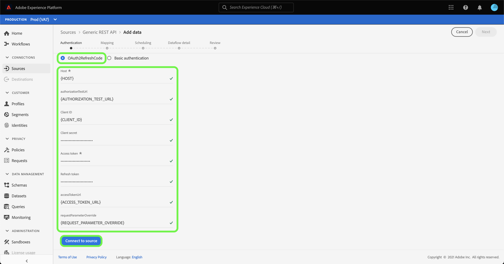

# Crear una conexión de origen [!DNL Generic REST API] en la interfaz de usuario

>[!NOTE]
>
> El origen [!DNL Generic REST API] está en la versión beta. Consulte [Resumen de fuentes](../../../../home.md#terms-and-conditions) para obtener más información sobre el uso de conectores con etiqueta beta.

Este tutorial proporciona los pasos para crear un conector de origen [!DNL Generic REST API] mediante la interfaz de usuario de Adobe Experience Platform.

## Introducción

Este tutorial requiere una comprensión práctica de los siguientes componentes de Platform:

* [Fuentes](../../../../home.md): El Experience Platform permite la ingesta de datos de varias fuentes, al tiempo que le ofrece la capacidad de estructurar, etiquetar y mejorar los datos entrantes mediante los servicios de Platform.
* [Zonas protegidas](../../../../../sandboxes/home.md): El Experience Platform proporciona zonas protegidas virtuales que dividen una sola instancia de Platform en entornos virtuales independientes para ayudar a desarrollar y evolucionar aplicaciones de experiencia digital.

### Recopilar credenciales necesarias

Para tener acceso a su cuenta de [!DNL Generic REST API] en Platform, debe proporcionar credenciales válidas para el tipo de autenticación que elija. La API REST genérica admite código de actualización OAuth 2 y autenticación básica. Consulte las siguientes tablas para obtener información sobre las credenciales de los dos tipos de autenticación admitidos.

#### Código de actualización de OAuth 2

| Credencial | Descripción |
| --- | --- |
| Host | La URL de host de la fuente a la que realiza la solicitud. Este valor es obligatorio y no se puede omitir usando la anulación de parámetros de solicitud. |
| URL de prueba de autorización | (Opcional) La dirección URL de prueba de autorización se utiliza para validar credenciales al crear una conexión base. Si no se proporcionan, las credenciales se comprueban automáticamente durante el paso de creación de la conexión de origen. |
| ID de cliente | (Opcional) El ID de cliente asociado con su cuenta de usuario. |
| Secreto del cliente | (Opcional) Secreto de cliente asociado a su cuenta de usuario. |
| Token de acceso | Credencial de autenticación principal utilizada para acceder a la aplicación. El token de acceso representa la autorización de la aplicación para acceder a determinados aspectos de los datos de un usuario. Este valor es obligatorio y no se puede omitir usando la anulación de parámetros de solicitud. |
| Actualizar token | (Opcional) Un token que se usa para generar un nuevo token de acceso cuando el token de acceso ha caducado. |
| URL de token de acceso | (Opcional) Punto final de URL utilizado para recuperar el token de acceso. |
| Solicitar anulación de parámetros | (Opcional) Una propiedad que le permite especificar qué parámetros de credencial se van a anular. |

#### Autenticación básica

| Credencial | Descripción |
| --- | --- |
| Host | La URL de host de la fuente a la que realiza la solicitud. |
| Nombre de usuario | El nombre de usuario que corresponde con su cuenta de usuario. |
| Contraseña | La contraseña que corresponde a su cuenta de usuario. |

## Conecte su cuenta de API de REST genérica

En la interfaz de usuario de Platform, seleccione **[!UICONTROL Sources]** en el panel de navegación izquierdo para acceder al área de trabajo [!UICONTROL Sources]. La pantalla [!UICONTROL Catálogo] muestra una variedad de orígenes con los que puede crear una cuenta.

Puede seleccionar la categoría adecuada del catálogo en la parte izquierda de la pantalla. También puede encontrar la fuente específica con la que desea trabajar en la barra de búsqueda.

En la categoría [!UICONTROL Protocolos], seleccione **[!UICONTROL API REST genérica]** y, a continuación, seleccione **[!UICONTROL Agregar datos]**.

Aparecerá la página **[!UICONTROL Conectar con API REST genérica]**. En esta página, puede usar credenciales nuevas o existentes.

### Cuenta existente

Para conectar una cuenta existente, selecciona la cuenta de API REST genérica con la que deseas conectarte y, a continuación, selecciona **[!UICONTROL Siguiente]** para continuar.

### Nueva cuenta

Si va a crear una cuenta nueva, seleccione **[!UICONTROL Nueva cuenta]** y, a continuación, proporcione un nombre y una descripción de opción para la nueva cuenta de [!DNL Generic REST API].

#### Autenticar con el código de actualización de OAuth 2

[!DNL Generic REST API] admite código de actualización OAuth 2 y autenticación básica. Para autenticarse con una autenticación OAuth2, seleccione **[!UICONTROL OAuth2RefreshCode]**, proporcione sus credenciales de OAuth 2 y luego seleccione **[!UICONTROL Conectarse al origen]**.

#### Autenticar con autenticación básica

Para usar la autenticación básica, selecciona **[!UICONTROL Autenticación básica]**, proporciona tu host, tu nombre de usuario y tu contraseña y, a continuación, selecciona **[!UICONTROL Conectarse al origen]**.

## Pasos siguientes

Al seguir este tutorial, ha establecido una conexión con su cuenta de API de REST genérica. Ahora puede continuar con el siguiente tutorial y [configurar un flujo de datos para introducir datos en la plataforma](../../dataflow/protocols.md).
