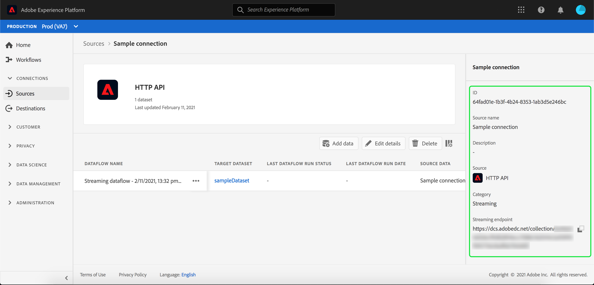

# Creación de una conexión de flujo continuo mediante la interfaz de usuario

Esta guía de la interfaz de usuario le ayudará a crear una conexión de flujo continuo con Adobe Experience Platform.

## Primeros pasos

Este tutorial requiere un conocimiento práctico de los siguientes componentes de Adobe Experience Platform:

- [[!DNL Experience Data Model (XDM)] Sistema](../../../../../xdm/home.md): Marco normalizado por el cual se  [!DNL Experience Platform] organizan los datos de experiencia del cliente.
   - [Conceptos básicos de la composición](../../../../../xdm/schema/composition.md) de esquemas: Obtenga información sobre los componentes básicos de los esquemas XDM, incluidos los principios clave y las prácticas recomendadas en la composición de esquemas.
   - [Tutorial](../../../../../xdm/tutorials/create-schema-ui.md) del Editor de esquemas: Obtenga información sobre cómo crear esquemas personalizados mediante la interfaz de usuario del Editor de Esquemas.
- [[!DNL Real-time Customer Profile]](../../../../../profile/home.md):: Proporciona un perfil de consumo unificado y en tiempo real basado en datos agregados de varias fuentes.

## Creación de una conexión de flujo continuo

Después de iniciar sesión en la [!DNL Experience Platform] interfaz de usuario, seleccione **[!UICONTROL Fuentes]** en la barra de navegación izquierda para acceder al espacio de trabajo **[!UICONTROL Fuentes]**. La pantalla **[!UICONTROL Catálogo]** muestra una variedad de fuentes con las que puede crear una cuenta.

Puede seleccionar la categoría adecuada en el catálogo a la izquierda de la pantalla. También puede encontrar la fuente específica con la que desea trabajar mediante la opción de búsqueda.

En la categoría **[!UICONTROL Streaming]**, seleccione **[!UICONTROL HTTP API]**. Si es la primera vez que utiliza este conector, seleccione **[!UICONTROL Configurar]**. De lo contrario, seleccione **[!UICONTROL Añadir datos]** para crear un nuevo conector de flujo HTTP.

Aparece la página **[!UICONTROL Cuenta de API HTTP de Connect]**. En esta página, puede usar credenciales nuevas o existentes.

### Nueva cuenta

Si está utilizando nuevas credenciales, seleccione **[!UICONTROL Nueva cuenta]**. En el formulario de entrada que aparece, especifique un nombre de cuenta y una descripción opcional. También tendrá la opción de proporcionar las siguientes propiedades de configuración:

- **[!UICONTROL Autenticación]:** esta propiedad determina si la conexión de flujo requiere autenticación o no. La autenticación garantiza que los datos se recopilen a partir de fuentes de confianza. Si está trabajando con Información de identificación personal (PII), esta propiedad debe estar activada. De forma predeterminada, esta propiedad está desactivada.
- **[!UICONTROL Compatibilidad] de Esquema XDM:** esta propiedad indica si esta conexión de flujo enviará eventos compatibles con esquemas XDM. De forma predeterminada, esta propiedad está activada.

Cuando termine, seleccione **[!UICONTROL Conectar con origen]**, seguido de **[!UICONTROL Siguiente]** para continuar.

### Cuenta existente

Para conectarse mediante credenciales existentes, seleccione la conexión de API HTTP que desee utilizar y, a continuación, seleccione **[!UICONTROL Siguiente]** para continuar.

## Seleccionar datos

Después de crear la conexión de la API HTTP, aparece el paso **[!UICONTROL Seleccionar datos]**, que proporciona una interfaz para elegir el conjunto de datos con el que conectarse. Tiene la opción de crear un nuevo conjunto de datos o de conectarse a uno existente.

### Crear un nuevo conjunto de datos

Para crear un nuevo conjunto de datos, seleccione **[!UICONTROL Nuevo conjunto de datos]**. En el formulario que aparece, proporcione el nombre, una descripción opcional y el esquema de destinatario para el conjunto de datos. Si selecciona un esquema con Perfil habilitado, puede elegir si el conjunto de datos también debe tener Perfil habilitado.

### Usar un conjunto de datos existente

Para utilizar un conjunto de datos existente, seleccione **[!UICONTROL Conjunto de datos existente]**. En el formulario que aparece, seleccione el conjunto de datos que desee utilizar. Una vez seleccionado un conjunto de datos, puede elegir si el conjunto de datos debe estar habilitado para el Perfil.

## Detalles de flujo de datos

Aparece el paso **[!UICONTROL Detalle de flujo de datos]**. En esta página, puede proporcionar detalles para el flujo de datos creado con un nombre y una descripción opcional.

Después de proporcionar detalles para el flujo de datos, seleccione **[!UICONTROL Siguiente]**.

## Revisar

Aparece el paso **[!UICONTROL Revisar]**, que le permite revisar los detalles del flujo de datos antes de crearlo. Los detalles se agrupan en las siguientes categorías:

- **[!UICONTROL Conexión]**: Muestra el nombre de la cuenta, la plataforma de origen y el nombre del origen.
- **[!UICONTROL Asignar conjuntos de datos y campos]** de mapas: Muestra el conjunto de datos de destinatario y el esquema al que se adhiere el conjunto de datos.

Después de confirmar que los detalles son correctos, seleccione **[!UICONTROL Finalizar]**.

## Obtener URL del extremo de flujo continuo

Con la conexión creada, aparece la página de detalles de orígenes. Esta página muestra detalles de la conexión recién creada, incluidos flujos de datos ejecutados anteriormente, ID y URL de extremo de flujo continuo.

## Pasos siguientes

Siguiendo este tutorial, ha creado una conexión HTTP de flujo que le permite utilizar el extremo de flujo para acceder a una variedad de API [!DNL Data Ingestion]. Para obtener instrucciones sobre cómo crear una conexión de flujo en la API, lea el [tutorial de creación de una conexión de flujo](../../../api/create/streaming/http.md).

Para aprender a transmitir datos a la plataforma, lea el tutorial sobre [transmisión de datos de series temporales](../../../../../ingestion/tutorials/streaming-time-series-data.md) o el tutorial sobre [transmisión de datos de registros](../../../../../ingestion/tutorials/streaming-record-data.md).
