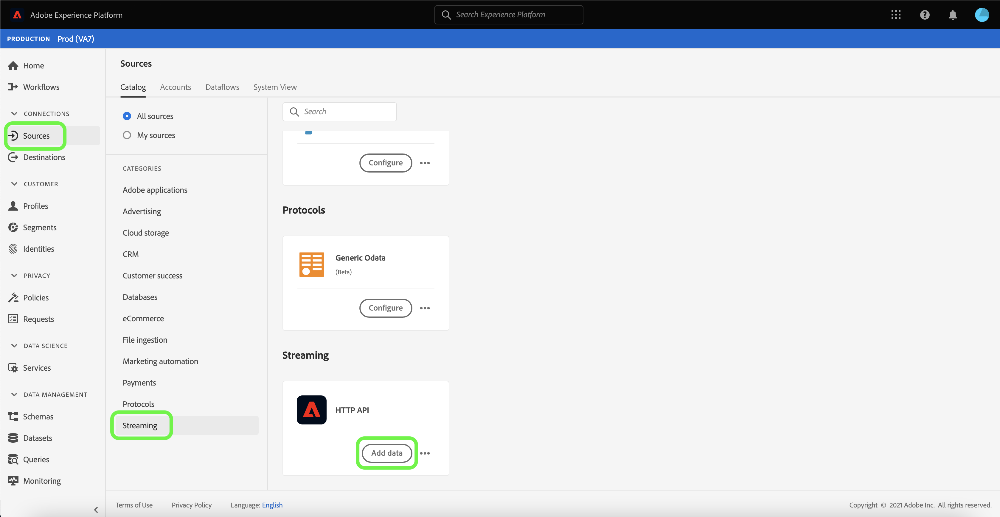
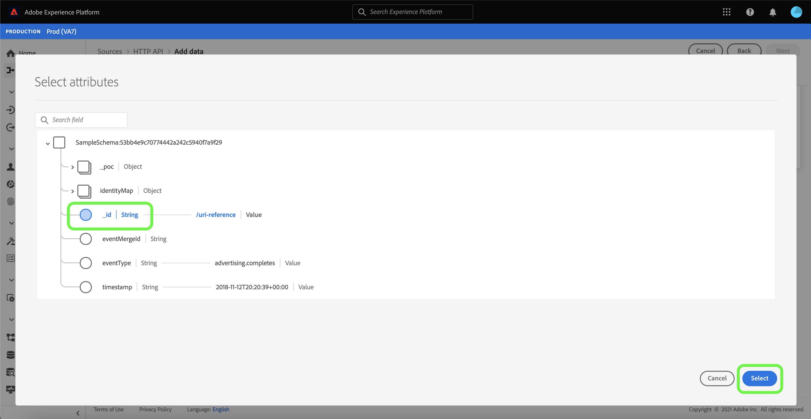

# Creación de una conexión de flujo continuo mediante la interfaz de usuario

Este tutorial proporciona pasos para crear una conexión de origen de flujo continuo mediante el espacio de trabajo [!UICONTROL Sources].

## Primeros pasos

Este tutorial requiere una comprensión práctica de los siguientes componentes de Adobe Experience Platform:

- [[!DNL Experience Data Model (XDM)] Sistema](../../../../../xdm/home.md): El marco estandarizado mediante el cual se  [!DNL Experience Platform] organizan los datos de experiencia del cliente.
   - [Aspectos básicos de la composición](../../../../../xdm/schema/composition.md) del esquema: Obtenga información sobre los componentes básicos de los esquemas XDM, incluidos los principios clave y las prácticas recomendadas en la composición de esquemas.
   - [Tutorial del Editor de esquemas](../../../../../xdm/tutorials/create-schema-ui.md): Aprenda a crear esquemas personalizados mediante la interfaz de usuario del Editor de esquemas.
- [[!DNL Real-time Customer Profile]](../../../../../profile/home.md): Proporciona un perfil de cliente unificado y en tiempo real basado en datos agregados de varias fuentes.

## Creación de una conexión de flujo continuo

En la interfaz de usuario de Platform, seleccione **[!UICONTROL Sources]** en el panel de navegación izquierdo para acceder al espacio de trabajo [!UICONTROL Sources]. La pantalla [!UICONTROL Catalog] muestra una variedad de fuentes con las que puede crear una cuenta.

Puede seleccionar la categoría adecuada del catálogo en la parte izquierda de la pantalla. Alternativamente, puede encontrar la fuente específica con la que desea trabajar usando la opción de búsqueda.

En la categoría **[!UICONTROL Streaming]**, seleccione **[!UICONTROL HTTP API]** y luego seleccione **[!UICONTROL Add data]**.

Aparece la página **[!UICONTROL Connect HTTP API account]**. En esta página, puede usar credenciales nuevas o existentes.

### Cuenta existente

Para utilizar una cuenta existente, seleccione la cuenta de API HTTP con la que desee crear un nuevo flujo de datos y, a continuación, seleccione **[!UICONTROL Next]** para continuar.

### Nueva cuenta

Si está creando una cuenta nueva, seleccione **[!UICONTROL New account]**. En el formulario de entrada que aparece, indique un nombre de cuenta y una descripción opcional. También tendrá la opción de proporcionar las siguientes propiedades de configuración:

- **[!UICONTROL Authentication]:** Esta propiedad determina si la conexión de flujo continuo requiere autenticación. La autenticación garantiza que los datos se recopilen a partir de fuentes de confianza. Si está trabajando con información de identificación personal (PII), esta propiedad debe estar activada. De forma predeterminada, esta propiedad está desactivada.
- **[!UICONTROL XDM compatible]:** Esta propiedad indica si esta conexión de flujo continuo enviará eventos compatibles con esquemas XDM. De forma predeterminada, esta propiedad está desactivada.

Cuando termine, seleccione **[!UICONTROL Connect to source]** y luego seleccione **[!UICONTROL Next]** para continuar.

## Seleccionar datos

Después de crear la conexión API HTTP, aparece el paso **[!UICONTROL Select data]**, que le proporciona una interfaz para cargar y previsualizar los datos.

Seleccione **[!UICONTROL Upload files]** para cargar los datos. Como alternativa, puede arrastrar y soltar los datos en la sección [!UICONTROL Drag and drop files] de la interfaz.

Con los datos cargados, puede utilizar el lado derecho de la interfaz para obtener una vista previa de la jerarquía de archivos. Seleccione **[!UICONTROL Next]** para continuar.

## Asignación de campos de datos a un esquema XDM

Aparece el paso [!UICONTROL Mapping], que proporciona una interfaz para asignar los datos de origen a un conjunto de datos de Platform.

Los archivos de parqué deben ser compatibles con XDM y no requieren que configure manualmente la asignación, mientras que los archivos CSV requieren que configure explícitamente la asignación, pero permiten seleccionar qué campos de datos de origen asignar. Los archivos JSON, si se marcan como quejas de XDM, no requieren configuración manual. Sin embargo, si no está marcado como compatible con XDM, necesitará que configure explícitamente la asignación.

Elija un conjunto de datos para los datos entrantes en los que se van a introducir. Puede utilizar un conjunto de datos existente o crear uno nuevo.

### Crear un nuevo conjunto de datos

Para crear un nuevo conjunto de datos, seleccione **[!UICONTROL New dataset]**. En el formulario que aparece, proporcione el nombre, una descripción opcional y el esquema de destino para el conjunto de datos. Si selecciona un esquema habilitado para [!DNL Profile], puede elegir si el conjunto de datos también debe estar habilitado para [!DNL Profile].

### Usar un conjunto de datos existente

Para usar un conjunto de datos existente, seleccione **[!UICONTROL Existing dataset]**. En el formulario que aparece, seleccione el conjunto de datos que desea utilizar. Una vez que seleccione un conjunto de datos, puede elegir si el conjunto de datos debe estar habilitado para [!DNL Profile].

### Asignación de campos estándar

En función de sus necesidades, puede elegir asignar campos directamente o utilizar funciones de preparación de datos para transformar los datos de origen a fin de derivar valores calculados o calculados. Para obtener más información sobre las funciones de asignación y asignación de datos, consulte el tutorial sobre [asignación de datos CSV a campos de esquema XDM](../../../../../ingestion/tutorials/map-a-csv-file.md).

Para agregar un nuevo campo de origen, seleccione **[!UICONTROL Add new mapping]**.

Se muestra un nuevo campo de origen y un nuevo emparejamiento de campos de destino. Para añadir un nuevo campo de origen, seleccione el icono de flecha situado junto a la barra de entrada [!UICONTROL Select source field].

El panel [!UICONTROL Select attributes] le permite explorar la jerarquía de archivos y seleccionar un campo de origen específico para asignarlo a un campo XDM de destino. Una vez seleccionado el campo de origen que desea asignar, seleccione **[!UICONTROL Select]** para continuar.

Con un campo de origen seleccionado, ahora puede identificar el campo XDM de destino adecuado al que asignar. Seleccione el icono de esquema en la sección de campo de destino.

Aparece la ventana [!UICONTROL Map source field to target field] , que proporciona una interfaz para explorar el esquema del conjunto de datos de destinatario. Seleccione el campo de destino que coincida con el campo de origen y, a continuación, seleccione **[!UICONTROL Select]** para continuar.

Una vez que todos los campos de origen estén asignados a los campos XDM de destino adecuados, seleccione **[!UICONTROL Next]**

## Detalles de flujo de datos

Aparece el paso **[!UICONTROL Dataflow detail]**. En esta página, puede proporcionar detalles para el flujo de datos creado dando un nombre y una descripción opcional.

Después de proporcionar detalles para el flujo de datos, seleccione **[!UICONTROL Next]**.

## Consulte

Aparece el paso **[!UICONTROL Review]**, que le permite revisar los detalles del flujo de datos antes de crearlo. Los detalles se agrupan dentro de las siguientes categorías:

- **[!UICONTROL Connection]**: Muestra el nombre de la cuenta, la plataforma de origen y el nombre de origen.
- **[!UICONTROL Assign dataset and map fields]**: Muestra el conjunto de datos de destino y el esquema al que se adhiere el conjunto de datos.

Después de confirmar que los detalles son correctos, seleccione **[!UICONTROL Finish]**.

## Obtener URL de extremo de flujo continuo

Con la conexión creada, aparece la página de detalles de orígenes. Esta página muestra detalles de la conexión recién creada, incluidos flujos de datos ejecutados anteriormente, ID y URL de extremo de flujo continuo.

## Pasos siguientes

Siguiendo este tutorial, ha creado una conexión HTTP de flujo continuo, que le permite utilizar el extremo de flujo continuo para acceder a varias API [!DNL Data Ingestion]. Para obtener instrucciones para crear una conexión de flujo continuo en la API, lea el [tutorial de creación de una conexión de flujo continuo](../../../api/create/streaming/http.md).

Para aprender a transmitir datos a Platform, lea el tutorial sobre [transmisión de datos de series temporales](../../../../../ingestion/tutorials/streaming-time-series-data.md) o el tutorial sobre [transmisión de datos de registros](../../../../../ingestion/tutorials/streaming-record-data.md).
