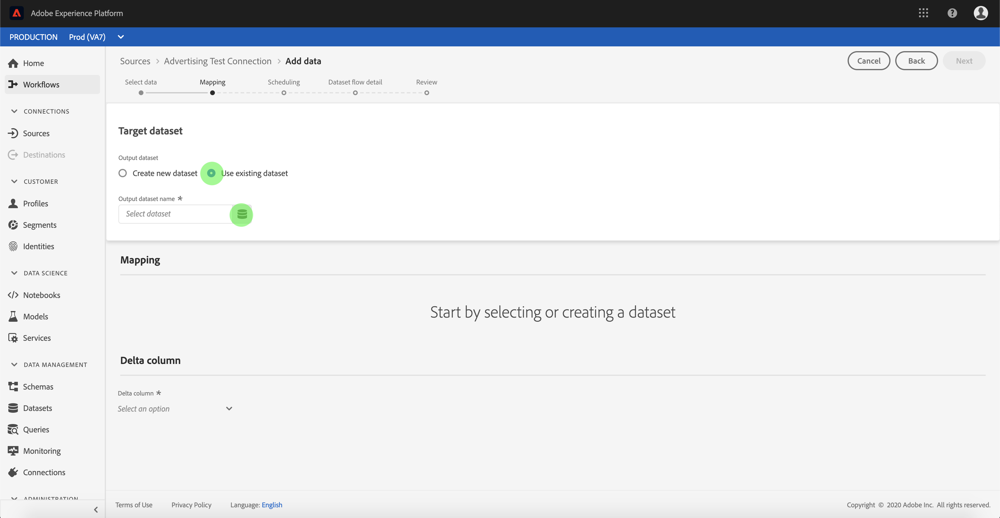
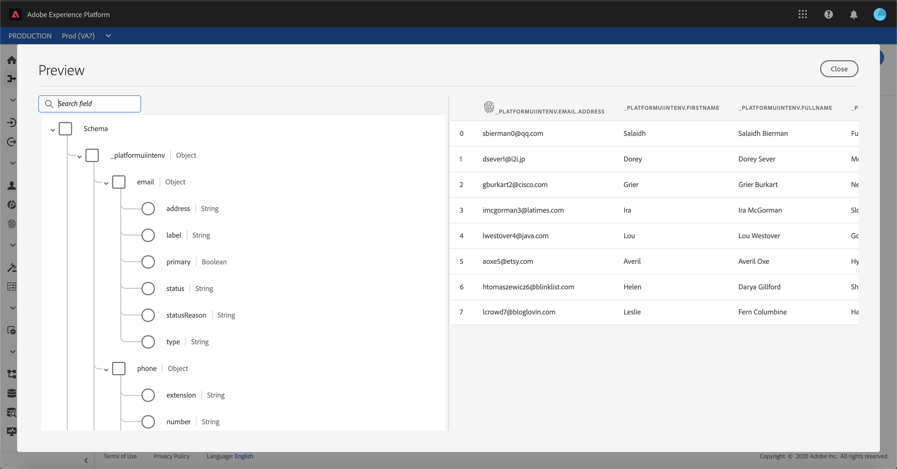
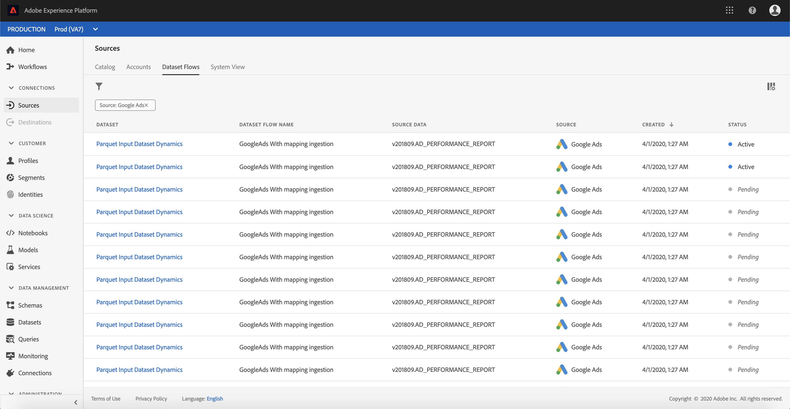

# Configuración de un flujo de datos para una conexión de publicidad en la interfaz de usuario

Un flujo de datos es una tarea programada que recupera e ingiere datos de un origen a un conjunto de datos de Adobe Experience Platform. Este tutorial proporciona pasos para configurar un nuevo flujo de datos con su cuenta de publicidad.

## Primeros pasos

Este tutorial requiere un conocimiento práctico de los siguientes componentes de Adobe Experience Platform:

- [[!DNL Experience Data Model (XDM)] Sistema](../../../../xdm/home.md): Marco normalizado por el cual se  [!DNL Experience Platform] organizan los datos de experiencia del cliente.
   - [Conceptos básicos de la composición](../../../../xdm/schema/composition.md) de esquemas: Obtenga información sobre los componentes básicos de los esquemas XDM, incluidos los principios clave y las prácticas recomendadas en la composición de esquemas.
   - [Tutorial](../../../../xdm/tutorials/create-schema-ui.md) del Editor de esquemas: Obtenga información sobre cómo crear esquemas personalizados mediante la interfaz de usuario del Editor de Esquemas.
- [[!DNL Real-time Customer Profile]](../../../../profile/home.md):: Proporciona un perfil de consumo unificado y en tiempo real basado en datos agregados de varias fuentes.

Además, este tutorial requiere que ya haya creado una cuenta de publicidad. Encontrará una lista de tutoriales para crear diferentes conectores de pago en la interfaz de usuario en la [información general de los conectores de origen](../../../home.md).

## Seleccionar datos

Después de crear la cuenta de publicidad, aparece el paso **[!UICONTROL Seleccionar datos]**, que proporciona una interfaz interactiva para explorar la jerarquía de archivos.

- La mitad izquierda de la interfaz es un navegador de directorios, que muestra los archivos y directorios del servidor.
- La mitad derecha de la interfaz permite la previsualización de hasta 100 filas de datos desde un archivo compatible.

Puede utilizar la opción **[!UICONTROL Buscar]** en la parte superior de la página para identificar rápidamente los datos de origen que desea utilizar.

>[!NOTE]
>
>La opción de datos de origen de búsqueda está disponible para todos los conectores de origen basados en tabulaciones, excluyendo los conectores de Analytics, Clasificaciones, Eventos y Kinesis.

Una vez que encuentre los datos de origen, seleccione el directorio y haga clic en **[!UICONTROL Siguiente]**.

## Asignación de campos de datos a un esquema XDM

Aparece el paso **[!UICONTROL Mapping]**, que proporciona una interfaz interactiva para asignar los datos de origen a un conjunto de datos [!DNL Platform].

Elija un conjunto de datos para los datos de entrada en los que se van a ingerir. Puede utilizar un conjunto de datos existente o crear un nuevo conjunto de datos.

### Usar un conjunto de datos existente

Para ingerir datos en un conjunto de datos existente, seleccione **[!UICONTROL Usar conjunto de datos existente]** y haga clic en el icono del conjunto de datos.

Aparece el cuadro de diálogo **[!UICONTROL Seleccionar conjunto de datos]**. Busque el conjunto de datos que desee utilizar, selecciónelo y haga clic en **[!UICONTROL Continuar]**.

### Usar un nuevo conjunto de datos

Para ingestar datos en un nuevo conjunto de datos, seleccione **[!UICONTROL Crear nuevo conjunto de datos]** e introduzca un nombre y una descripción para el conjunto de datos en los campos proporcionados.

Puede adjuntar un campo de esquema introduciendo un nombre de esquema en la barra de búsqueda **[!UICONTROL Seleccionar esquema]**. También puede seleccionar el icono desplegable para ver una lista de esquemas existentes. Como alternativa, puede seleccionar **[!UICONTROL Búsqueda avanzada]** para acceder a la pantalla de esquemas existentes, incluyendo sus respectivos detalles.

Durante este paso, puede habilitar el conjunto de datos para [!DNL Real-time Customer Profile] y crear una vista holística de los atributos y comportamientos de una entidad. Los datos de todos los conjuntos de datos habilitados se incluirán en [!DNL Profile] y los cambios se aplicarán al guardar el flujo de datos.

Alterne el botón **[!UICONTROL conjunto de datos de Perfil]** para habilitar el conjunto de datos de destinatario para [!DNL Profile].

Aparece el cuadro de diálogo **[!UICONTROL Seleccionar esquema]**. Seleccione el esquema que desee aplicar al nuevo conjunto de datos y haga clic en **[!DNL Done]**.

En función de sus necesidades, puede elegir asignar los campos directamente o utilizar funciones de asignador para transformar los datos de origen para derivar valores calculados o calculados. Para obtener más información sobre la asignación de datos y las funciones del asignador, consulte el tutorial sobre [asignación de datos CSV a campos de esquema XDM](../../../../ingestion/tutorials/map-a-csv-file.md).

>[!TIP]
>
>[!DNL Platform] proporciona recomendaciones inteligentes para campos asignados automáticamente en función del esquema de destinatario o del conjunto de datos que haya seleccionado. Puede ajustar manualmente las reglas de asignación para adaptarlas a sus casos de uso.

Seleccione **[!UICONTROL datos de Previsualización]** para ver los resultados de asignación de hasta 100 filas de datos de muestra del conjunto de datos seleccionado.

Durante la previsualización, se da prioridad a la columna de identidad como primer campo, ya que es la información clave necesaria para validar los resultados de la asignación.

Una vez asignados los datos de origen, seleccione **[!UICONTROL Cerrar]**.

## Programar ejecuciones de ingestión

Aparece el paso **[!UICONTROL Programación]**, que le permite configurar una programación de ingestión para ingestar automáticamente los datos de origen seleccionados mediante las asignaciones configuradas. La siguiente tabla describe los diferentes campos configurables para la programación:

| Campo | Descripción |
| --- | --- |
| Frecuencia | Las frecuencias seleccionables incluyen `Once`, `Minute`, `Hour`, `Day` y `Week`. |
| Intervalo | Un entero que establece el intervalo para la frecuencia seleccionada. |
| Tiempo de inicio | Marca de hora UTC que indica cuándo se produce la primera ingestión. |
| Rellenar | Un valor booleano que determina qué datos se ingieren inicialmente. Si **[!UICONTROL Rellenar]** está habilitado, todos los archivos actuales de la ruta especificada se ingestarán durante la primera ingestión programada. Si **[!UICONTROL Rellenar]** está deshabilitado, solo se ingerirán los archivos que se carguen entre la primera ejecución de ingesta y el tiempo de inicio. Los archivos cargados antes de la hora de inicio no se ingieren. |
| Columna delta | Una opción con un conjunto filtrado de campos de esquema de origen de tipo, fecha u hora. Este campo se utiliza para diferenciar entre datos nuevos y existentes. Los datos incrementales se ingieren según la marca de tiempo de la columna seleccionada. |

Los flujos de datos están diseñados para transferir datos automáticamente en forma programada. Inicio seleccionando la frecuencia de ingestión. A continuación, configure el intervalo para designar el período entre dos ejecuciones de flujo. El valor del intervalo debe ser un entero distinto de cero y debe establecerse en bueno o igual a 15.

Para establecer la hora de inicio para la ingestión, ajuste la fecha y la hora que se muestran en el cuadro de hora del inicio. También puede seleccionar el icono de calendario para editar el valor de tiempo del inicio. La hora de inicio debe ser buena o igual a la hora UTC actual.

Seleccione **[!UICONTROL Cargar datos incrementales por]** para asignar la columna delta. Este campo ofrece una distinción entre los datos nuevos y los existentes.

### Configurar un flujo de datos de ingestión único

Para configurar la ingestión de una sola vez, seleccione la flecha desplegable de frecuencia y seleccione **[!UICONTROL Una vez]**.

>[!TIP]
>
>**** Intervalos y  **** Rellenos no son visibles durante una ingestión única.

Una vez que haya proporcionado los valores adecuados a la programación, seleccione **[!UICONTROL Siguiente]**.

## Proporcionar detalles de flujo de datos

Aparece el paso **[!UICONTROL Detalle de flujo de datos]**, que le permite asignar un nombre y una breve descripción del nuevo flujo de datos.

Durante este proceso, también puede habilitar **[!UICONTROL la ingestión parcial]** y **[!UICONTROL Diagnósticos de error]**. Al habilitar **[!UICONTROL la ingestión parcial]** se puede ingestar datos que contengan errores hasta un determinado umbral. Una vez habilitada la **[!UICONTROL ingestión parcial]**, arrastre el dial **[!UICONTROL umbral de error %]** para ajustar el umbral de error del lote. Como alternativa, puede ajustar manualmente el umbral seleccionando el cuadro de entrada. Para obtener más información, consulte la [información general sobre la ingestión parcial por lotes](../../../../ingestion/batch-ingestion/partial.md).
Proporcione valores para el flujo de datos y seleccione **[!UICONTROL Siguiente]**.

## Revise el flujo de datos

Aparece el paso **[!UICONTROL Revisar]**, que le permite revisar el nuevo flujo de datos antes de crearlo. Los detalles se agrupan en las siguientes categorías:

- **[!UICONTROL Conexión]**: Muestra el tipo de origen, la ruta de acceso relevante del archivo de origen seleccionado y la cantidad de columnas dentro de ese archivo de origen.
- **[!UICONTROL Asignar campos]** de conjunto de datos y mapa: Muestra en qué conjunto de datos se están ingeriendo los datos de origen, incluido el esquema al que se adhiere el conjunto de datos.
- **[!UICONTROL Programación]**: Muestra el período activo, la frecuencia y el intervalo del programa de ingestión.

Una vez que haya revisado el flujo de datos, haga clic en **[!UICONTROL Finalizar]** y permita que se cree el flujo de datos.

## Monitorear el flujo de datos

Una vez creado el flujo de datos, puede monitorear los datos que se están ingeriendo a través de él para ver información sobre tasas de ingestión, éxito y errores. Para obtener más información sobre cómo supervisar el flujo de datos, consulte el tutorial sobre [control de cuentas y flujos de datos en la interfaz de usuario](../monitor.md).

## Eliminar el flujo de datos

Puede eliminar flujos de datos que ya no sean necesarios o que se hayan creado incorrectamente mediante la función **[!UICONTROL Delete]** disponible en el espacio de trabajo **[!UICONTROL Dataflows]**. Para obtener más información sobre cómo eliminar flujos de datos, consulte el tutorial sobre [eliminación de flujos de datos en la interfaz de usuario](../delete.md).

## Pasos siguientes

Siguiendo este tutorial, ha creado correctamente un flujo de datos para incorporar datos de un sistema de automatización de marketing y ha adquirido una perspectiva sobre la supervisión de conjuntos de datos. Los datos entrantes ahora se pueden utilizar en servicios de flujo descendente [!DNL Platform] como [!DNL Real-time Customer Profile] y [!DNL Data Science Workspace]. Consulte los siguientes documentos para obtener más información:

- [Información general sobre el Perfil del cliente en tiempo real](../../../../profile/home.md)
- [Información general sobre el área de trabajo de ciencias de datos](../../../../data-science-workspace/home.md)

## Apéndice

Las secciones siguientes proporcionan información adicional para trabajar con conectores de origen.

### Deshabilitar un flujo de datos

Cuando se crea un flujo de datos, se activa inmediatamente y se ingieren datos según la programación que se le haya dado. Puede desactivar un flujo de datos activo en cualquier momento siguiendo las instrucciones que se indican a continuación.

En la pantalla **[!UICONTROL Flujos de datos]**, seleccione el nombre del flujo de datos que desea deshabilitar.

La columna **[!UICONTROL Propiedades]** aparece en la parte derecha de la pantalla. Este panel contiene un botón de alternancia **[!UICONTROL Enabled]**. Haga clic en el botón de alternancia para deshabilitar el flujo de datos. Se puede utilizar la misma opción para volver a habilitar un flujo de datos después de desactivarlo.

### Activar datos de entrada para [!DNL Profile] población

Los datos entrantes del conector de origen se pueden utilizar para enriquecer y rellenar los datos [!DNL Real-time Customer Profile]. Para obtener más información sobre cómo rellenar los datos [!DNL Real-time Customer Profile], consulte el tutorial sobre [población de Perfiles](../profile.md).