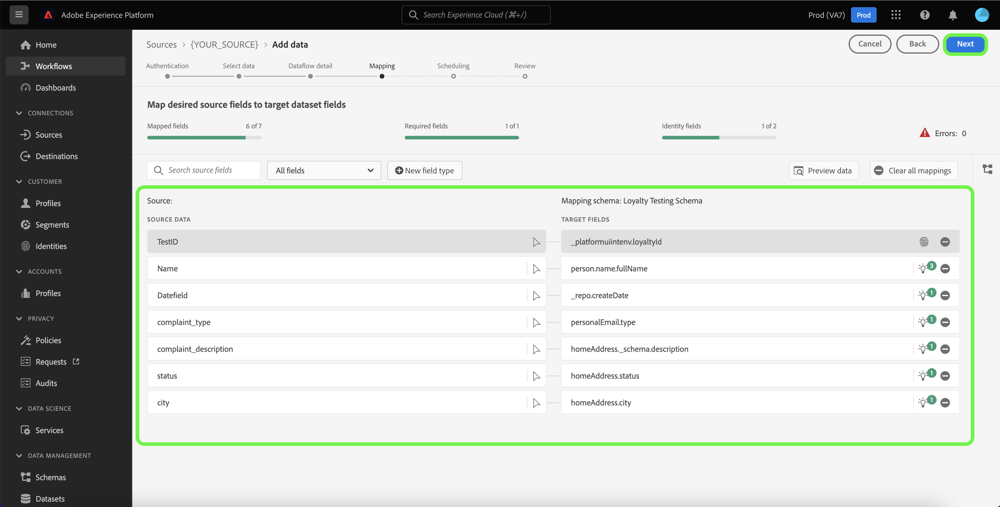

# Creación de un flujo de datos mediante una fuente de análisis en la IU

Un flujo de datos es una tarea programada que recupera e ingiere datos de un origen a un conjunto de datos en Adobe Experience Platform. Este tutorial proporciona pasos sobre cómo crear un flujo de datos para una fuente de análisis mediante la IU de Platform.

>[!NOTE]
>
>Para crear un flujo de datos, ya debe tener una cuenta autenticada con el [!DNL Mixpanel] origen. Consulte el tutorial sobre [creación de un [!DNL Mixpanel] conexión de origen en la interfaz de usuario](../../ui/create/analytics/mixpanel.md) para obtener más información.

## Introducción

Este tutorial requiere una comprensión práctica de los siguientes componentes de Platform:

* [Fuentes](../../../home.md): Platform permite la ingesta de datos desde varias fuentes, al tiempo que le ofrece la capacidad de estructurar, etiquetar y mejorar los datos entrantes mediante [!DNL Platform] servicios.
* [[!DNL Experience Data Model (XDM)] Sistema](../../../../xdm/home.md): El marco estandarizado mediante el cual Experience Platform organiza los datos de experiencia del cliente.
   * [Conceptos básicos de composición de esquemas](../../../../xdm/schema/composition.md): Obtenga información acerca de los componentes básicos de los esquemas XDM, incluidos los principios clave y las prácticas recomendadas en la composición de esquemas.
   * [Tutorial del Editor de esquemas](../../../../xdm/tutorials/create-schema-ui.md): Aprenda a crear esquemas personalizados mediante la interfaz de usuario del Editor de esquemas.
* [[!DNL Real-Time Customer Profile]](../../../../profile/home.md): Proporciona un perfil de consumidor unificado y en tiempo real basado en los datos agregados de varias fuentes.
* [[!DNL Data Prep]](../../../../data-prep/home.md): permite a los ingenieros de datos asignar, transformar y validar datos desde y hacia el modelo de datos de experiencia (XDM).

<!-- ## Add data

After creating your analytics source account, the **[!UICONTROL Add data]** step appears, providing an interface for you to explore your analytics account's table hierarchy.

* The left half of the interface is a browser, displaying a list of data tables contained in your account. The interface also includes a search option that allows you to quickly identify the source data you intend to use.
* The right half of the interface is a preview panel, allowing you to preview up to 100 rows of data.

>[!NOTE]
>
>The search source data option is available to all table-based sources excluding the Adobe Analytics, [!DNL Amazon Kinesis], and [!DNL Azure Event Hubs].

Once you find the source data, select the table, then select **[!UICONTROL Next]**.

 -->

## Proporcionar detalles del flujo de datos

El [!UICONTROL Detalles del flujo de datos] le permite seleccionar si desea utilizar un conjunto de datos existente o uno nuevo. Durante este proceso, también puede configurar las opciones de [!UICONTROL Conjunto de datos de perfil], [!UICONTROL Diagnósticos de error], [!UICONTROL Ingesta parcial], y [!UICONTROL Alertas].

### Usar un conjunto de datos existente

Para introducir datos en un conjunto de datos existente, seleccione **[!UICONTROL Conjunto de datos existente]**. Puede recuperar un conjunto de datos existente mediante la variable [!UICONTROL Búsqueda avanzada] o desplazándose por la lista de conjuntos de datos existentes en el menú desplegable. Una vez seleccionado un conjunto de datos, proporcione un nombre y una descripción para el flujo de datos.

### Usar un nuevo conjunto de datos

Para introducir en un nuevo conjunto de datos, seleccione **[!UICONTROL Nuevo conjunto de datos]** y, a continuación, proporcione un nombre del conjunto de datos de salida y una descripción opcional. A continuación, seleccione un esquema al que asignar mediante la variable [!UICONTROL Búsqueda avanzada] o desplazándose por la lista de esquemas existentes en el menú desplegable. Una vez seleccionado un esquema, proporcione un nombre y una descripción para el flujo de datos.

### Activar [!DNL Profile] Diagnósticos de error y

A continuación, seleccione la **[!UICONTROL Conjunto de datos de perfil]** para habilitar el conjunto de datos para [!DNL Profile]. Esto le permite crear una vista integral de los atributos y comportamientos de una entidad. Datos de todos [!DNL Profile]Los conjuntos de datos habilitados para se incluirán en [!DNL Profile] Los cambios y se aplican al guardar el flujo de datos.

[!UICONTROL Diagnósticos de error] permite generar mensajes de error detallados para cualquier registro erróneo que se produzca en el flujo de datos, mientras que [!UICONTROL Ingesta parcial] permite la ingesta de datos que contienen errores, hasta un determinado umbral que se define manualmente. Consulte la [resumen de ingesta parcial por lotes](../../../../ingestion/batch-ingestion/partial.md) para obtener más información.

### Habilitar alertas

Puede activar alertas para recibir notificaciones sobre el estado del flujo de datos. Seleccione una alerta de la lista a la que suscribirse para recibir notificaciones sobre el estado del flujo de datos. Para obtener más información sobre las alertas, consulte la guía de [suscripción a alertas de fuentes mediante la IU](../alerts.md).

Cuando haya terminado de proporcionar detalles al flujo de datos, seleccione **[!UICONTROL Siguiente]**.

## Asignación de campos de datos a un esquema XDM

>[!IMPORTANT]
>
>No se puede asignar ningún valor de par de claves dinámicas como objeto desde [!DNL OneTrust] a Platform y deben especificar esas claves en el esquema de destinatario para asignar los datos durante la ingesta.

El [!UICONTROL Asignación] Este paso aparece y le proporciona una interfaz para asignar los campos de origen del esquema de origen a sus campos XDM de destino adecuados en el esquema de destino.

Platform proporciona recomendaciones inteligentes para campos asignados automáticamente en función del esquema o el conjunto de datos de destino seleccionado. Puede ajustar manualmente las reglas de asignación para adaptarlas a sus casos de uso. En función de sus necesidades, puede elegir asignar campos directamente o utilizar funciones de preparación de datos para transformar los datos de origen y derivar valores calculados o calculados. Para ver los pasos detallados sobre el uso de la interfaz de asignación y los campos calculados, consulte la [Guía de IU de preparación de datos](../../../../data-prep/ui/mapping.md).

Una vez que los datos de origen se hayan asignado correctamente, seleccione **[!UICONTROL Siguiente]**.

## Programar ejecuciones de ingesta

El [!UICONTROL Programación] Este paso aparece, lo que le permite configurar una programación de ingesta para introducir automáticamente los datos de origen seleccionados mediante las asignaciones configuradas. De forma predeterminada, la programación está configurada en `Once`. Para ajustar la frecuencia de ingesta, seleccione **[!UICONTROL Frecuencia]** y, a continuación, seleccione una opción en el menú desplegable.

>[!TIP]
>
>El intervalo y el relleno no son visibles durante una ingesta única.

Si establece la frecuencia de ingesta en `Minute`, `Hour`, `Day`, o `Week`, debe establecer un intervalo para establecer un intervalo de tiempo establecido entre cada ingesta. Por ejemplo, una frecuencia de ingesta establecida en `Day` y un intervalo establecido en `15` significa que el flujo de datos está programado para introducir datos cada 15 días.

Durante este paso, también puede activar **relleno** y defina una columna para la ingesta incremental de datos. El relleno se utiliza para introducir datos históricos, mientras que la columna que defina para la ingesta incremental permite diferenciar los nuevos datos de los datos existentes.

Consulte la tabla siguiente para obtener más información sobre las configuraciones de programación.

| Campo | Descripción |
| --- | --- |
| Frecuencia | La frecuencia con la que se produce una ingesta. Las frecuencias seleccionables incluyen `Once`, `Minute`, `Hour`, `Day`, y `Week`. |
| Intervalo | Un entero que define el intervalo para la frecuencia seleccionada. El valor del intervalo debe ser un entero distinto de cero y debe establecerse en mayor o igual que 15. |
| Hora de inicio | Una marca de tiempo UTC que indica cuándo se configurará para que se produzca la primera ingesta. La hora de inicio debe ser posterior o igual a la hora UTC actual. |
| Relleno | Un valor booleano que determina qué datos se incorporan inicialmente. Si el relleno está habilitado, todos los archivos actuales de la ruta especificada se introducirán durante la primera ingesta programada. Si se desactiva el relleno, solo se incorporarán los archivos que se carguen entre la primera ejecución de la ingesta y la hora de inicio. Los archivos cargados antes de la hora de inicio no se incorporarán. |
| Cargar datos incrementales por | Una opción con un conjunto filtrado de campos de esquema de origen de tipo, fecha u hora. El campo que seleccione para **[!UICONTROL Cargar datos incrementales por]** debe tener sus valores de fecha y hora en la zona horaria UTC para cargar correctamente los datos incrementales. Todos los orígenes de lotes basados en tablas seleccionan datos incrementales comparando un valor de marca de tiempo de columna delta con el correspondiente tiempo UTC de la ventana de ejecución de flujo y copiando los datos del origen, si se encuentran nuevos datos dentro de la ventana de tiempo UTC. |

## Revisión del flujo de datos

El **[!UICONTROL Revisar]** Este paso aparece, lo que le permite revisar el nuevo flujo de datos antes de crearlo. Los detalles se agrupan en las siguientes categorías:

* **[!UICONTROL Conexión]**: Muestra el tipo de origen, la ruta relevante del archivo de origen elegido y la cantidad de columnas dentro de ese archivo de origen.
* **[!UICONTROL Asignar campos de conjunto de datos y asignación]**: Muestra en qué conjunto de datos se están ingiriendo los datos de origen, incluido el esquema al que se adhiere el conjunto de datos.
* **[!UICONTROL Programación]**: Muestra el periodo activo, la frecuencia y el intervalo de la programación de ingesta.

Una vez revisado el flujo de datos, seleccione **[!UICONTROL Finalizar]** y deje pasar un tiempo para crear el flujo de datos.

## Monitorización del flujo de datos

Una vez creado el flujo de datos, puede monitorizar los datos que se están ingiriendo a través de él para ver información sobre las tasas de ingesta, el éxito y los errores. Para obtener más información sobre cómo monitorizar el flujo de datos, consulte el tutorial sobre [monitorización de cuentas y flujos de datos en la IU](../monitor.md).

## Eliminar el flujo de datos

Puede eliminar los flujos de datos que ya no son necesarios o que se crearon incorrectamente utilizando **[!UICONTROL Eliminar]** función disponible en el **[!UICONTROL Flujos de datos]** workspace. Para obtener más información sobre cómo eliminar flujos de datos, consulte el tutorial sobre [eliminación de flujos de datos en la IU](../delete.md).

## Pasos siguientes

Al seguir este tutorial, ha creado correctamente un flujo de datos para llevar los datos de su fuente de análisis a Platform. Ahora, los datos entrantes pueden utilizarse en el flujo descendente [!DNL Platform] servicios como [!DNL Real-Time Customer Profile] y [!DNL Data Science Workspace]. Consulte los siguientes documentos para obtener más información:

* [Información general del [!DNL Real-Time Customer Profile]](../../../../profile/home.md)
* [Información general del [!DNL Data Science Workspace]](../../../../data-science-workspace/home.md)

>[!WARNING]
>
> La interfaz de usuario de Platform que se muestra en el siguiente vídeo no está actualizada. Consulte la documentación anterior para obtener las capturas de pantalla y la funcionalidad más recientes de la interfaz de usuario.
>
>[!VIDEO](https://video.tv.adobe.com/v/29711?quality=12&learn=on)
