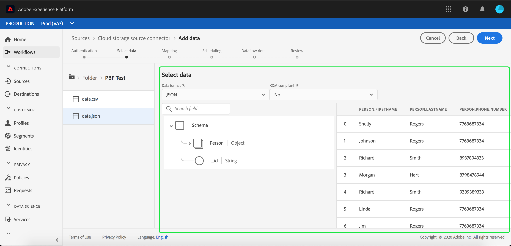
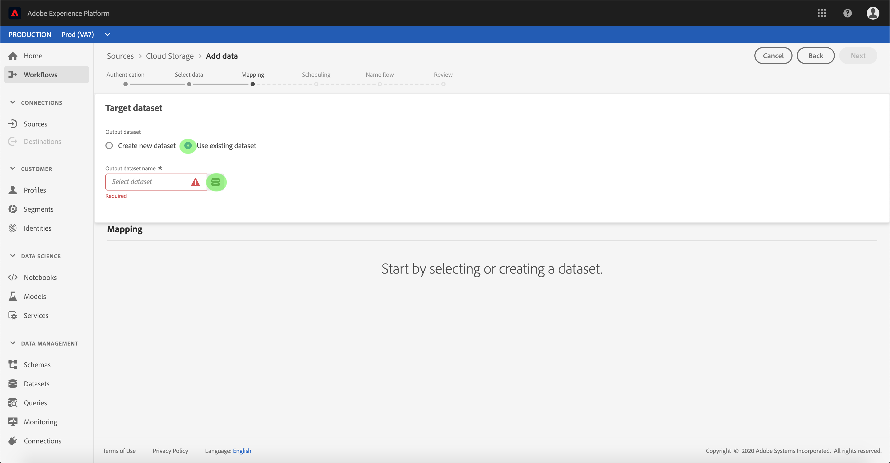

# Configuración de un flujo de datos para una conexión por lotes de almacenamiento en la nube en la interfaz de usuario

Un flujo de datos es una tarea programada que recupera e ingiere datos de un origen a un conjunto de datos [!DNL Platform]. Este tutorial proporciona pasos para configurar un nuevo flujo de datos con su cuenta de almacenamiento en la nube.

## Primeros pasos

Este tutorial requiere un conocimiento práctico de los siguientes componentes de Adobe Experience Platform:

* [[!DNL Experience Data Model (XDM)] Sistema](../../../../../xdm/home.md): Marco normalizado por el cual se  [!DNL Experience Platform] organizan los datos de experiencia del cliente.
   * [Conceptos básicos de la composición](../../../../../xdm/schema/composition.md) de esquemas: Obtenga información sobre los componentes básicos de los esquemas XDM, incluidos los principios clave y las prácticas recomendadas en la composición de esquemas.
   * [Tutorial](../../../../../xdm/tutorials/create-schema-ui.md) del Editor de esquemas: Obtenga información sobre cómo crear esquemas personalizados mediante la interfaz de usuario del Editor de Esquemas.
* [[!DNL Real-time Customer Profile]](../../../../../profile/home.md):: Proporciona un perfil de consumo unificado y en tiempo real basado en datos agregados de varias fuentes.

Además, este tutorial requiere que tenga una cuenta de almacenamiento en la nube establecida. Encontrará una lista de tutoriales para crear distintas cuentas de almacenamiento en la nube en la interfaz de usuario en la [información general de los conectores de origen](../../../../home.md).

### Formatos de archivo compatibles

[!DNL Experience Platform] admite los siguientes formatos de archivo para la ingesta desde almacenamientos externos:

* Valores separados por delimitadores (DSV): Actualmente, la compatibilidad con archivos de datos con formato DSV está limitada a valores separados por comas. El valor de los encabezados de campo dentro de archivos con formato DSV solo debe consistir en caracteres alfanuméricos y guiones bajos. En el futuro se proporcionará compatibilidad con archivos DSV generales.
* [!DNL JavaScript Object Notation] (JSON): Los archivos de datos con formato JSON deben ser compatibles con XDM.
* [!DNL Apache Parquet]:: Los archivos de datos con formato de parqué deben ser compatibles con XDM.

## Seleccionar datos

Después de crear la cuenta de almacenamiento en la nube, aparece el paso **[!UICONTROL Seleccionar datos]**, que proporciona una interfaz para explorar la jerarquía de archivos de almacenamiento en la nube.

* La mitad izquierda de la interfaz es un navegador de directorios, que muestra los archivos y directorios del servidor.
* La mitad derecha de la interfaz permite la previsualización de hasta 100 filas de datos desde un archivo compatible.

La selección de una carpeta de la lista permite recorrer la jerarquía de carpetas en carpetas más profundas. Una vez seleccionado un archivo o carpeta compatible, aparece la lista desplegable **[!UICONTROL Seleccionar formato de datos]**, donde puede elegir un formato para mostrar los datos en la ventana de previsualización.

Seleccione el formato de datos apropiado para el archivo que desea ingestar y permita que se complete la ventana de previsualización durante unos segundos.

Puede definir un delimitador personalizado al ingestar archivos delimitados. Seleccione la opción **[!UICONTROL Delimitador]** y, a continuación, seleccione un delimitador en el menú desplegable. El menú muestra las opciones más utilizadas para los delimitadores, incluyendo una coma (`,`), una ficha (`\t`) y una barra vertical (`|`). También puede seleccionar **[!UICONTROL Personalizado]** e introducir un delimitador personalizado de su elección en la barra de entrada emergente.

Una vez que haya seleccionado el formato de datos y establecido el delimitador, seleccione **[!UICONTROL Siguiente]**.

### Ingesta de archivos de parqué o JSON

Las cuentas de almacenamiento de nube también admiten archivos JSON y Parquet. Los archivos de parquet deben ser compatibles con XDM, mientras que los archivos JSON no necesitan ser compatibles con XDM. Para ingestar archivos JSON o Parquet, seleccione el formato de archivo adecuado en el navegador de directorios y aplique un formato de datos compatible desde la interfaz correcta.

Si el formato de datos está en JSON, aparecerá una previsualización que mostrará información sobre los datos del archivo. En la pantalla previsualización, puede seleccionar si el JSON es compatible con XDM mediante la lista desplegable **[!UICONTROL compatible con XDM]**.

Seleccione **[!UICONTROL Siguiente]** para continuar.

>[!IMPORTANT]
>
>A diferencia de los tipos de archivos delimitados y JSON, los archivos con formato de parquet no están disponibles para la previsualización.

## Asignación de campos de datos a un esquema XDM

Aparece el paso **[!UICONTROL Mapping]**, que proporciona una interfaz interactiva para asignar los datos de origen a un conjunto de datos [!DNL Platform]. Los archivos de origen formateados en Parquet deben ser compatibles con XDM y no requieren que configure manualmente la asignación, mientras que los archivos CSV requieren que configure explícitamente la asignación, pero permiten elegir los campos de datos de origen que se asignarán. Los archivos JSON, si se marcan como una queja XDM, no requieren configuración manual. Sin embargo, si no está marcado como compatible con XDM, deberá configurar explícitamente la asignación.

Elija un conjunto de datos para los datos de entrada en los que se van a ingerir. Puede usar un conjunto de datos existente o crear uno nuevo.

**Usar un conjunto de datos existente**

Para ingerir datos en un conjunto de datos existente, seleccione **[!UICONTROL Conjunto de datos existente]** y luego seleccione el icono del conjunto de datos.

Aparece el cuadro de diálogo **[!UICONTROL Seleccionar conjunto de datos]**. Busque el conjunto de datos que desee utilizar, selecciónelo y haga clic en **[!UICONTROL Continuar]**.

**Usar un nuevo conjunto de datos**

Para ingestar datos en un nuevo conjunto de datos, seleccione **[!UICONTROL Nuevo conjunto de datos]** e introduzca un nombre y una descripción para el conjunto de datos en los campos proporcionados. Para agregar un esquema, puede introducir un nombre de esquema existente en el cuadro de diálogo **[!UICONTROL Seleccionar esquema]**. También puede seleccionar la **[!UICONTROL búsqueda avanzada de Esquema]** para buscar un esquema adecuado.

Durante este paso, puede habilitar el conjunto de datos para [!DNL Real-time Customer Profile] y crear una vista holística de los atributos y comportamientos de una entidad. Los datos de todos los conjuntos de datos habilitados se incluirán en [!DNL Profile] y los cambios se aplicarán al guardar el flujo de datos.

Alterne el botón **[!UICONTROL conjunto de datos de Perfil]** para habilitar el conjunto de datos de destinatario para [!DNL Profile].

Aparece el cuadro de diálogo **[!UICONTROL Seleccionar esquema]**. Seleccione el esquema que desee aplicar al nuevo conjunto de datos y, a continuación, seleccione **[!UICONTROL Listo]**.

En función de sus necesidades, puede elegir asignar los campos directamente o utilizar funciones de asignador para transformar los datos de origen para derivar valores calculados o calculados. Para obtener más información sobre la asignación de datos y las funciones del asignador, consulte el tutorial sobre [asignación de datos CSV a campos de esquema XDM](../../../../../ingestion/tutorials/map-a-csv-file.md).

Para archivos JSON, además de asignar campos directamente a otros campos, puede asignar objetos directamente a otros objetos y matrices a otras matrices. También puede asignar y asignar tipos de datos complejos como matrices en archivos JSON mediante un conector de origen de almacenamiento de nube.

Tenga en cuenta que no puede asignar distintos tipos. Por ejemplo, no se puede asignar un objeto a una matriz ni un campo a un objeto.

>[!TIP]
>
>[!DNL Platform] proporciona recomendaciones inteligentes para campos asignados automáticamente en función del esquema de destinatario o del conjunto de datos que haya seleccionado. Puede ajustar manualmente las reglas de asignación para adaptarlas a sus casos de uso.

Seleccione **[!UICONTROL datos de Previsualización]** para ver los resultados de asignación de hasta 100 filas de datos de muestra del conjunto de datos seleccionado.

Durante la previsualización, se da prioridad a la columna de identidad como primer campo, ya que es la información clave necesaria para validar los resultados de la asignación.

Una vez asignados los datos de origen, seleccione **[!UICONTROL Cerrar]**.

## Programar ejecuciones de ingestión

Aparece el paso **[!UICONTROL Programación]**, que le permite configurar una programación de ingestión para ingestar automáticamente los datos de origen seleccionados mediante las asignaciones configuradas. La siguiente tabla describe los diferentes campos configurables para la programación:

| Campo | Descripción |
| --- | --- |
| Frecuencia | Las frecuencias seleccionables incluyen `Once`, `Minute`, `Hour`, `Day` y `Week`. |
| Intervalo | Un entero que establece el intervalo para la frecuencia seleccionada. |
| Tiempo de inicio | Marca de hora UTC que indica cuándo se produce la primera ingestión. |
| Rellenar | Un valor booleano que determina qué datos se ingieren inicialmente. Si **[!UICONTROL Rellenar]** está habilitado, todos los archivos actuales de la ruta especificada se ingestarán durante la primera ingestión programada. Si **[!UICONTROL Rellenar]** está deshabilitado, solo se ingerirán los archivos que se carguen entre la primera ejecución de ingesta y el tiempo de inicio. Los archivos cargados antes de la hora de inicio no se ingieren. |

Los flujos de datos están diseñados para transferir datos automáticamente en forma programada. Inicio seleccionando la frecuencia de ingestión. A continuación, configure el intervalo para designar el período entre dos ejecuciones de flujo. El valor del intervalo debe ser un entero distinto de cero y debe establecerse en bueno o igual a 15.

Para establecer la hora de inicio para la ingestión, ajuste la fecha y la hora que se muestran en el cuadro de hora del inicio. También puede seleccionar el icono de calendario para editar el valor de tiempo del inicio. La hora de inicio debe ser buena o igual a la hora actual en UTC.

Proporcione valores para la programación y seleccione **[!UICONTROL Siguiente]**.

### Configurar un flujo de datos de ingestión único

Para configurar la ingestión de una sola vez, seleccione la flecha desplegable de frecuencia y seleccione **[!UICONTROL Una vez]**. Puede seguir editando en un conjunto de flujos de datos para una ingestión de frecuencia única, siempre y cuando el tiempo de inicio permanezca en el futuro. Una vez transcurrido el tiempo de inicio, ya no se puede editar el valor de frecuencia de una sola vez. **** Intervalos y  **** Rellenado no son visibles al configurar un flujo de datos de ingestión único.

>[!IMPORTANT]
>
>Se recomienda encarecidamente programar el flujo de datos para una ingestión única al utilizar el [conector de FTP](../../../../connectors/cloud-storage/ftp.md).

Una vez que haya proporcionado los valores adecuados a la programación, seleccione **[!UICONTROL Siguiente]**.

## Proporcionar detalles de flujo de datos

Aparece el paso **[!UICONTROL Detalle de flujo de datos]**, que le permite asignar un nombre y una breve descripción del nuevo flujo de datos.

Durante este proceso, también puede habilitar **[!UICONTROL la ingestión parcial]** y **[!UICONTROL Diagnósticos de error]**. Al habilitar **[!UICONTROL la ingestión parcial]** se puede ingestar datos que contengan errores, hasta un umbral determinado que se pueda establecer. Al habilitar **[!UICONTROL diagnósticos de error]** se proporcionarán detalles sobre cualquier dato incorrecto que se envíe por lotes por separado. Para obtener más información, consulte la [información general sobre la ingestión parcial por lotes](../../../../../ingestion/batch-ingestion/partial.md).

Proporcione valores para el flujo de datos y seleccione **[!UICONTROL Siguiente]**.

## Revise el flujo de datos

Aparece el paso **[!UICONTROL Revisar]**, que le permite revisar el nuevo flujo de datos antes de crearlo. Los detalles se agrupan en las siguientes categorías:

* **[!UICONTROL Conexión]**: Muestra el tipo de origen, la ruta de acceso relevante del archivo de origen seleccionado y la cantidad de columnas dentro de ese archivo de origen.
* **[!UICONTROL Asignar campos]** de conjunto de datos y mapa: Muestra en qué conjunto de datos se están ingeriendo los datos de origen, incluido el esquema al que se adhiere el conjunto de datos.
* **[!UICONTROL Programación]**: Muestra el período activo, la frecuencia y el intervalo del programa de ingestión.

Una vez que haya revisado el flujo de datos, haga clic en **[!UICONTROL Finalizar]** y permita que se cree el flujo de datos.

## Monitorear el flujo de datos

Una vez creado el flujo de datos, puede monitorear los datos que se están ingeriendo a través de él para ver información sobre tasas de ingestión, éxito y errores. Para obtener más información sobre cómo supervisar el flujo de datos, consulte el tutorial sobre [control de cuentas y flujos de datos en la interfaz de usuario](../../monitor.md).

## Eliminar el flujo de datos

Puede eliminar flujos de datos que ya no sean necesarios o que se hayan creado incorrectamente mediante la función **[!UICONTROL Delete]** disponible en el espacio de trabajo **[!UICONTROL Dataflows]**. Para obtener más información sobre cómo eliminar flujos de datos, consulte el tutorial sobre [eliminación de flujos de datos en la interfaz de usuario](../../delete.md).

## Pasos siguientes

Siguiendo este tutorial, ha creado correctamente un flujo de datos para traer datos de un almacenamiento de nube externo y ha adquirido una perspectiva sobre la supervisión de conjuntos de datos. Para obtener más información sobre la creación de flujos de datos, puede complementar su aprendizaje viendo el siguiente vídeo. Además, los datos entrantes ahora pueden ser utilizados por servicios de flujo descendente [!DNL Platform] como [!DNL Real-time Customer Profile] y [!DNL Data Science Workspace]. Consulte los siguientes documentos para obtener más información:

* Información general del [[!DNL Real-time Customer Profile] ](../../../../../profile/home.md)
* Información general del [[!DNL Data Science Workspace] ](../../../../../data-science-workspace/home.md)

>[!WARNING]
>
> La [!DNL Platform] IU que se muestra en el siguiente vídeo no está actualizada. Consulte la documentación anterior para obtener las capturas de pantalla y la funcionalidad más recientes de la interfaz de usuario.

>[!VIDEO](https://video.tv.adobe.com/v/29695?quality=12&learn=on)

## Apéndice

Las secciones siguientes proporcionan información adicional para trabajar con conectores de origen.

### Deshabilitar un flujo de datos

Cuando se crea un flujo de datos, se activa inmediatamente y se ingieren datos según la programación que se le haya dado. Puede desactivar un flujo de datos activo en cualquier momento siguiendo las instrucciones que se indican a continuación.

En el espacio de trabajo **[!UICONTROL Fuentes]**, haga clic en la ficha **[!UICONTROL Examinar]**. A continuación, haga clic en el nombre de la cuenta asociada al flujo de datos activo que desea deshabilitar.

Aparece la página **[!UICONTROL actividad de origen]**. Seleccione el flujo de datos activo de la lista para abrir su columna **[!UICONTROL Propiedades]** en el lado derecho de la pantalla, que contiene un botón de alternancia **[!UICONTROL Habilitado]**. Haga clic en el botón de alternancia para deshabilitar el flujo de datos. Se puede utilizar la misma opción para volver a habilitar un flujo de datos después de desactivarlo.

### Activar datos de entrada para [!DNL Profile] población

Los datos entrantes del conector de origen se pueden utilizar para enriquecer y rellenar los datos [!DNL Real-time Customer Profile]. Para obtener más información sobre cómo rellenar los datos [!DNL Real-time Customer Profile], consulte el tutorial sobre [población de Perfiles](../../profile.md).
