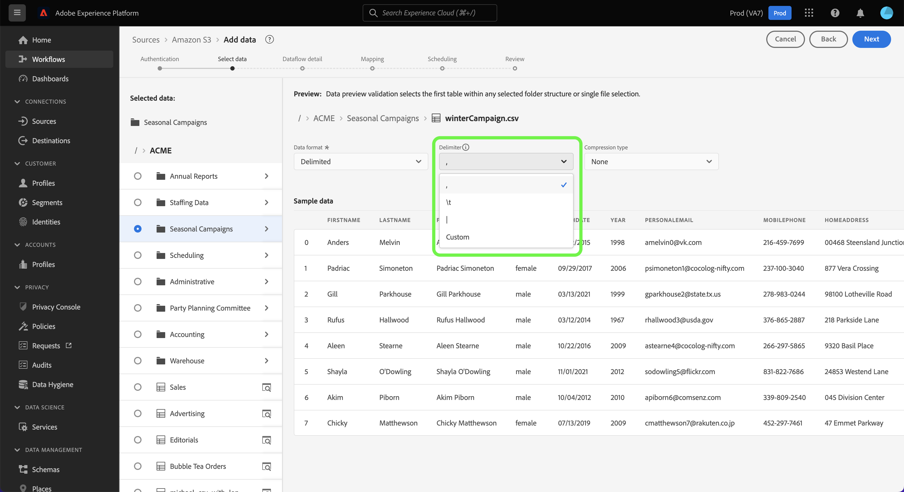

# Configure un flujo de datos para introducir datos por lotes desde una fuente de almacenamiento en la nube en la IU

Este tutorial proporciona pasos sobre cómo configurar un flujo de datos para traer datos por lotes de su fuente de almacenamiento en la nube a Adobe Experience Platform.

## Introducción

>[!NOTE]
>
>Para crear un flujo de datos para traer datos por lotes desde un almacenamiento en la nube, ya debe tener acceso a una fuente de almacenamiento en la nube autenticada. Si no tiene acceso, vaya a la [descripción general de orígenes](../../../../home.md#cloud-storage) para obtener una lista de orígenes de almacenamiento en la nube con los que puede crear una cuenta.

Este tutorial requiere una comprensión práctica de los siguientes componentes de Experience Platform:

* [[!DNL Experience Data Model (XDM)] Sistema](../../../../../xdm/home.md): El marco estandarizado mediante el cual el Experience Platform organiza los datos de experiencia del cliente.
   * [Aspectos básicos de la composición de esquemas](../../../../../xdm/schema/composition.md): obtenga información sobre los componentes básicos de los esquemas XDM, incluidos los principios clave y las prácticas recomendadas en la composición de esquemas.
   * [Tutorial del editor de esquemas](../../../../../xdm/tutorials/create-schema-ui.md): Aprenda a crear esquemas personalizados mediante la interfaz de usuario del editor de esquemas.
* [[!DNL Real-Time Customer Profile]](../../../../../profile/home.md): proporciona un perfil de consumidor unificado y en tiempo real basado en los datos agregados de varias fuentes.

### Formatos de archivo compatibles

Las fuentes de almacenamiento en la nube para datos por lotes admiten los siguientes formatos de archivo para la ingesta:

* Valores separados por delimitadores (DSV): cualquier valor de un solo carácter puede utilizarse como delimitador para archivos de datos con formato DSV.
* [!DNL JavaScript Object Notation] (JSON): los archivos de datos con formato JSON deben ser compatibles con XDM.
* [!DNL Apache Parquet]: los archivos de datos con formato de parquet deben ser compatibles con XDM.
* Archivos comprimidos: los archivos JSON y delimitados se pueden comprimir como: `bzip2`, `gzip`, `deflate`, `zipDeflate`, `tarGzip` y `tar`.

## Adición de datos

Después de crear la cuenta de almacenamiento en la nube, aparece el paso **[!UICONTROL Agregar datos]**, que proporciona una interfaz para explorar la jerarquía de archivos de almacenamiento en la nube y seleccionar la carpeta o el archivo específico que desea llevar a Platform.

* La parte izquierda de la interfaz es un explorador de directorios que muestra la jerarquía de archivos del almacenamiento en la nube.
* La parte derecha de la interfaz permite obtener una vista previa de hasta 100 filas de datos desde una carpeta o archivo compatible.

Seleccione la carpeta raíz para acceder a la jerarquía de carpetas. Desde aquí, puede seleccionar una sola carpeta para introducir todos los archivos de la carpeta de forma recursiva. Al ingerir una carpeta completa, debe asegurarse de que todos los archivos de esa carpeta compartan el mismo formato de datos y esquema.

Una vez seleccionada una carpeta, la interfaz correcta se actualiza a una vista previa del contenido y la estructura del primer archivo de la carpeta seleccionada.

Durante este paso, puede realizar varias configuraciones en los datos antes de continuar. En primer lugar, selecciona **[!UICONTROL Formato de datos]** y, a continuación, selecciona el formato de datos apropiado para el archivo en el panel desplegable que aparece.

La siguiente tabla muestra los formatos de datos adecuados para los tipos de archivo admitidos:

| Tipo de archivo | Formato de datos |
| --- | --- |
| CSV | [!UICONTROL Delimitado] |
| JSON | [!UICONTROL JSON] |
| Parquet | [!UICONTROL XDM Parquet] |

### Seleccionar un delimitador de columna

Después de configurar el formato de datos, puede establecer un delimitador de columna al ingerir archivos delimitados. Seleccione la opción **[!UICONTROL Delimitador]** y, a continuación, seleccione un delimitador en el menú desplegable. El menú muestra las opciones utilizadas con más frecuencia para delimitadores, como una coma (`,`), una tabulación (`\t`) y una barra vertical (`|`).

Si prefiere usar un delimitador personalizado, seleccione **[!UICONTROL Personalizado]** e introduzca un delimitador de un solo carácter de su elección en la barra de entrada emergente.

### Ingesta de archivos comprimidos

También puede introducir archivos JSON comprimidos o delimitados especificando su tipo de compresión.

En el paso [!UICONTROL Seleccionar datos], seleccione un archivo comprimido para su ingesta y, a continuación, seleccione su tipo de archivo adecuado, y si es compatible con XDM o no. A continuación, seleccione **[!UICONTROL Tipo de compresión]** y, a continuación, seleccione el tipo de archivo comprimido apropiado para los datos de origen.

Para llevar un archivo específico a Platform, seleccione una carpeta y, a continuación, el archivo que desea introducir. Durante este paso, también puede obtener una vista previa del contenido de otros archivos de una carpeta determinada mediante el icono de vista previa junto a un nombre de archivo.

Cuando termine, seleccione **[!UICONTROL Siguiente]**.

## Proporcionar detalles del flujo de datos

La página [!UICONTROL Detalles del flujo de datos] le permite seleccionar si desea utilizar un conjunto de datos existente o uno nuevo. Durante este proceso, también puede configurar los datos para que se incorporen al perfil y habilitar opciones como [!UICONTROL Diagnóstico de errores], [!UICONTROL Ingesta parcial] y [!UICONTROL Alertas].

### Usar un conjunto de datos existente

Para introducir datos en un conjunto de datos existente, seleccione **[!UICONTROL Conjunto de datos existente]**. Puede recuperar un conjunto de datos existente mediante la opción [!UICONTROL Búsqueda avanzada] o desplazándose por la lista de conjuntos de datos existentes en el menú desplegable. Una vez seleccionado un conjunto de datos, proporcione un nombre y una descripción para el flujo de datos.

### Usar un nuevo conjunto de datos

Para ingerir en un nuevo conjunto de datos, seleccione **[!UICONTROL Nuevo conjunto de datos]** y, a continuación, proporcione un nombre de conjunto de datos de salida y una descripción opcional. A continuación, seleccione un esquema al que asignar con la opción [!UICONTROL Búsqueda avanzada] o desplazándose por la lista de esquemas existentes en el menú desplegable. Una vez seleccionado un esquema, proporcione un nombre y una descripción para el flujo de datos.

### Habilitar diagnósticos de perfil y error

A continuación, seleccione la opción **[!UICONTROL Conjunto de datos del perfil]** para habilitar su conjunto de datos para el perfil. Esto le permite crear una vista integral de los atributos y comportamientos de una entidad. Los datos de todos los conjuntos de datos habilitados para perfiles se incluirán en el perfil y los cambios se aplicarán al guardar el flujo de datos.

[!UICONTROL Diagnósticos de error] permite la generación detallada de mensajes de error para cualquier registro erróneo que ocurra en su flujo de datos, mientras que [!UICONTROL Ingesta parcial] le permite ingerir datos que contengan errores, hasta un determinado umbral que usted defina manualmente. Consulte la [descripción general de la ingesta parcial por lotes](../../../../../ingestion/batch-ingestion/partial.md) para obtener más información.

### Habilitar alertas

Puede activar alertas para recibir notificaciones sobre el estado del flujo de datos. Seleccione una alerta de la lista a la que suscribirse para recibir notificaciones sobre el estado del flujo de datos. Para obtener más información sobre las alertas, consulte la guía sobre [suscripción a alertas de fuentes mediante la interfaz de usuario](../../alerts.md).

Cuando termine de proporcionar detalles al flujo de datos, seleccione **[!UICONTROL Siguiente]**.

## Asignación de campos de datos a un esquema XDM

Aparecerá el paso [!UICONTROL Mapping], que le proporcionará una interfaz para asignar los campos de origen del esquema de origen a sus campos XDM de destino adecuados en el esquema de destino.

Platform proporciona recomendaciones inteligentes para campos asignados automáticamente en función del esquema o el conjunto de datos de destino seleccionado. Puede ajustar manualmente las reglas de asignación para adaptarlas a sus casos de uso. En función de sus necesidades, puede elegir asignar campos directamente o utilizar funciones de preparación de datos para transformar los datos de origen y derivar valores calculados o calculados. Para ver los pasos detallados sobre el uso de la interfaz de asignador y los campos calculados, consulte la [guía de la interfaz de usuario de la preparación de datos](../../../../../data-prep/ui/mapping.md).

Una vez que los datos de origen estén asignados correctamente, seleccione **[!UICONTROL Siguiente]**.

## Programar ejecuciones de ingesta

>[!IMPORTANT]
>
>Se recomienda programar el flujo de datos para una ingesta única al usar el [origen FTP](../../../../connectors/cloud-storage/ftp.md).

Aparece el paso [!UICONTROL Programación], que le permite configurar una programación de ingesta para introducir automáticamente los datos de origen seleccionados mediante las asignaciones configuradas. De manera predeterminada, la programación se establece en `Once`. Para ajustar la frecuencia de ingesta, seleccione **[!UICONTROL Frecuencia]** y luego seleccione una opción en el menú desplegable.

>[!TIP]
>
>El intervalo y el relleno no son visibles durante una ingesta única.

Si establece la frecuencia de ingesta en `Minute`, `Hour`, `Day` o `Week`, debe establecer un intervalo para establecer un intervalo de tiempo establecido entre cada ingesta. Por ejemplo, una frecuencia de ingesta establecida en `Day` y un intervalo establecido en `15` significa que el flujo de datos está programado para ingerir datos cada 15 días.

Durante este paso, también puede habilitar **relleno** y definir una columna para la ingesta incremental de datos. El relleno se utiliza para introducir datos históricos, mientras que la columna que defina para la ingesta incremental permite diferenciar los nuevos datos de los datos existentes.

Consulte la tabla siguiente para obtener más información sobre las configuraciones de programación.

| Configuración de programación | Descripción |
| --- | --- |
| Frecuencia | Configure la frecuencia para indicar con qué frecuencia debe ejecutarse el flujo de datos. Puede establecer su frecuencia en: <ul><li>**Una vez**: establezca su frecuencia en `once` para crear una ingesta única. Las configuraciones para intervalo y relleno no están disponibles al crear un flujo de datos de ingesta único. De forma predeterminada, la frecuencia de programación se establece en una vez.</li><li>**Minuto**: establezca su frecuencia en `minute` para programar el flujo de datos e ingerir datos por minuto.</li><li>**Hora**: establezca su frecuencia en `hour` para programar el flujo de datos e ingerir datos por hora.</li><li>**Día**: Establezca su frecuencia en `day` para programar su flujo de datos e ingerir datos por día.</li><li>**Semana**: establezca su frecuencia en `week` para programar el flujo de datos e ingerir datos por semana.</li></ul> |
| Intervalo | Una vez seleccionada una frecuencia, puede configurar la configuración del intervalo para establecer el lapso de tiempo entre cada ingesta. Por ejemplo, si establece la frecuencia en día y configura el intervalo en 15, el flujo de datos se ejecutará cada 15 días. No puede establecer el intervalo en cero. El valor mínimo del intervalo aceptado para cada frecuencia es el siguiente:<ul><li>**Una vez**: n/a</li><li>**Minuto**: 15</li><li>**Hora**: 1</li><li>**Día**: 1</li><li>**Semana**: 1</li></ul> |
| Hora de inicio | La marca de tiempo de la ejecución proyectada, presentada en la zona horaria UTC. |
| Relleno | El relleno determina qué datos se incorporan inicialmente. Si el relleno está habilitado, todos los archivos actuales de la ruta especificada se introducirán durante la primera ingesta programada. Si se desactiva el relleno, solo se incorporarán los archivos que se carguen entre la primera ejecución de la ingesta y la hora de inicio. Los archivos cargados antes de la hora de inicio no se incorporarán. |

>[!NOTE]
>
>Para la ingesta por lotes, cada flujo de datos subsiguiente selecciona los archivos que se van a ingerir de su origen en función de su marca de tiempo **última modificación**. Esto significa que los flujos de datos por lotes seleccionan archivos del origen que son nuevos o que se han modificado desde la última ejecución del flujo. Además, debe asegurarse de que haya un lapso de tiempo suficiente entre la carga del archivo y una ejecución de flujo programada, ya que es posible que los archivos que no se han cargado completamente en su cuenta de almacenamiento en la nube antes del tiempo de ejecución del flujo programado no se recojan para su ingesta.

Cuando termine de configurar la programación de ingesta, seleccione **[!UICONTROL Siguiente]**.

## Revisión del flujo de datos

Aparece el paso **[!UICONTROL Revisar]**, que le permite revisar el nuevo flujo de datos antes de crearlo. Los detalles se agrupan en las siguientes categorías:

* **[!UICONTROL Conexión]**: muestra el tipo de origen, la ruta de acceso relevante del archivo de origen elegido y la cantidad de columnas dentro de ese archivo de origen.
* **[!UICONTROL Asignar campos de conjunto de datos y asignación]**: muestra en qué conjunto de datos se están ingiriendo los datos de origen, incluido el esquema al que se adhiere el conjunto de datos.
* **[!UICONTROL Programación]**: muestra el período activo, la frecuencia y el intervalo de la programación de ingesta.

Una vez que haya revisado el flujo de datos, haga clic en **[!UICONTROL Finalizar]** y espere un poco para que se cree el flujo de datos.

## Pasos siguientes

Al seguir este tutorial, ha creado correctamente un flujo de datos para introducir datos de un almacenamiento de nube externo y ha obtenido información sobre la monitorización de conjuntos de datos. Para obtener más información sobre la creación de flujos de datos, puede complementar su aprendizaje viendo el vídeo siguiente. Además, los servicios de flujo descendente [!DNL Platform], como [!DNL Real-Time Customer Profile] y [!DNL Data Science Workspace], ahora pueden usar los datos entrantes. Consulte los siguientes documentos para obtener más información:

* [Información general de [!DNL Real-Time Customer Profile]](../../../../../profile/home.md)
* [Información general de [!DNL Data Science Workspace]](../../../../../data-science-workspace/home.md)

>[!WARNING]
>
> La interfaz de usuario [!DNL Platform] que se muestra en el siguiente vídeo no está actualizada. Consulte la documentación anterior para obtener las capturas de pantalla y la funcionalidad más recientes de la interfaz de usuario.

>[!VIDEO](https://video.tv.adobe.com/v/29695?quality=12&learn=on)

## Apéndice

Las secciones siguientes proporcionan información adicional para trabajar con conectores de origen.

## Monitorización del flujo de datos

Una vez creado el flujo de datos, puede monitorizar los datos que se están ingiriendo a través de él para ver información sobre las tasas de ingesta, el éxito y los errores. Para obtener más información sobre cómo supervisar el flujo de datos, visite el tutorial sobre [supervisar cuentas y flujos de datos en la interfaz de usuario](../../monitor.md).

## Actualizar el flujo de datos

Para actualizar las configuraciones para la programación, asignación e información general de los flujos de datos, visite el tutorial sobre [actualización de flujos de datos de origen en la interfaz de usuario](../../update-dataflows.md)

## Eliminar el flujo de datos

Puede eliminar flujos de datos que ya no sean necesarios o que se hayan creado incorrectamente mediante la función **[!UICONTROL Delete]** disponible en el área de trabajo **[!UICONTROL Flujos de datos]**. Para obtener más información sobre cómo eliminar flujos de datos, visite el tutorial sobre [eliminar flujos de datos en la interfaz de usuario](../../delete.md).