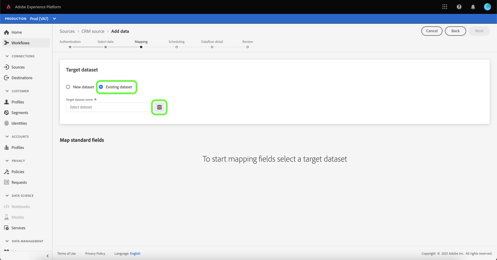
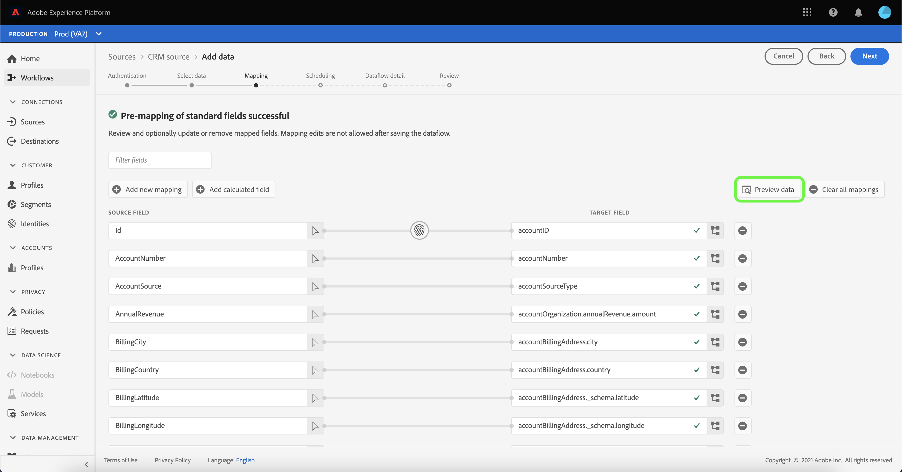
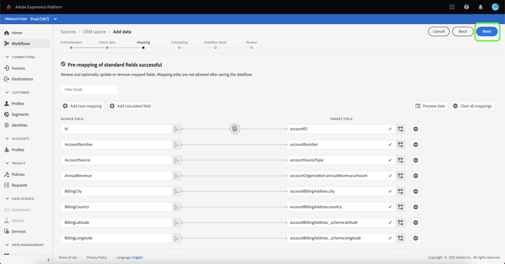
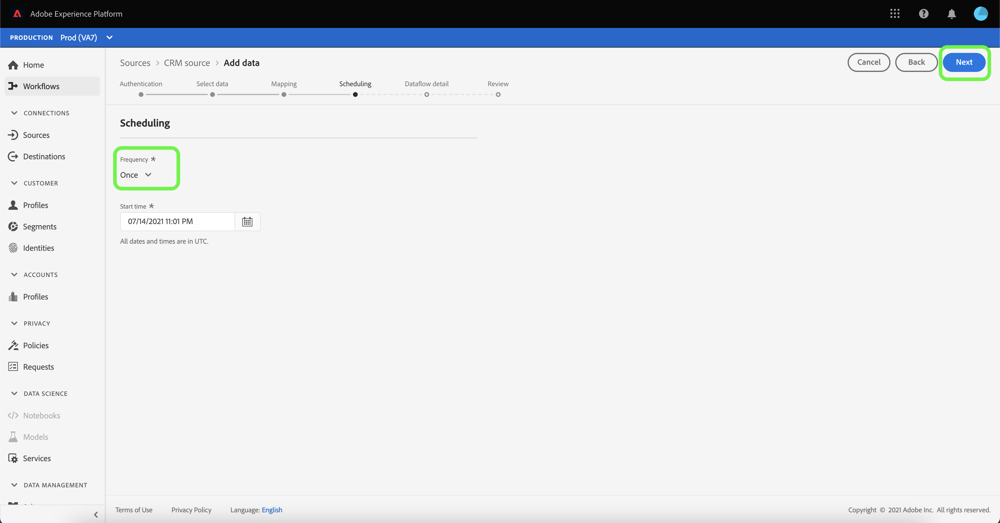

# Configurar un flujo de datos para una conexión CRM en la interfaz de usuario

Un flujo de datos es una tarea programada que recupera e incorpora datos de un origen a un conjunto de datos de Platform. Este tutorial proporciona pasos para configurar un nuevo flujo de datos con su cuenta de CRM.

## Primeros pasos

Este tutorial requiere una comprensión práctica de los siguientes componentes de Adobe Experience Platform:

* [[!DNL Experience Data Model (XDM)] Sistema](../../../../xdm/home.md): El marco normalizado por el cual [!DNL Experience Platform] organiza los datos de experiencia del cliente.
   * [Aspectos básicos de la composición del esquema](../../../../xdm/schema/composition.md): Obtenga información sobre los componentes básicos de los esquemas XDM, incluidos los principios clave y las prácticas recomendadas en la composición de esquemas.
   * [Tutorial del Editor de esquemas](../../../../xdm/tutorials/create-schema-ui.md): Obtenga información sobre cómo crear esquemas personalizados mediante la interfaz de usuario del Editor de esquemas.
* [[!DNL Real-time Customer Profile]](../../../../profile/home.md): Proporciona un perfil de cliente unificado y en tiempo real basado en datos agregados de varias fuentes.

Además, este tutorial requiere que ya haya creado una cuenta de CRM. Puede encontrar una lista de tutoriales para crear diferentes conectores CRM en la interfaz de usuario en la [información general sobre conectores de origen](../../../home.md).

## Seleccionar datos

Después de crear su cuenta de CRM, la variable [!UICONTROL Seleccionar datos] aparece, proporcionando una interfaz para explorar la jerarquía de archivos.

* La mitad izquierda de la interfaz es un navegador de directorios, que muestra los archivos y directorios de su CRM.
* La mitad derecha de la interfaz permite previsualizar hasta 100 filas de datos de un archivo compatible.

Puede usar la variable **[!UICONTROL Buscar]** en la parte superior de la página para identificar rápidamente los datos de origen que desea utilizar.

>[!NOTE]
>
>La opción de datos de la fuente de búsqueda está disponible para todos los conectores de origen basados en tablas, excepto los conectores de Analytics, Clasificaciones, Centros de eventos y Kinesis.

Una vez que encuentre los datos de origen, seleccione el directorio y, a continuación, seleccione **[!UICONTROL Siguiente]**.

## Asignación de campos de datos a un esquema XDM

La variable **[!UICONTROL Asignación]** aparece, proporcionando una interfaz para asignar los datos de origen a un conjunto de datos de Platform.

Elija un conjunto de datos para los datos entrantes en los que se van a introducir. Puede usar un conjunto de datos existente o crear un conjunto de datos nuevo.

### Usar un conjunto de datos existente

Para introducir datos en un conjunto de datos existente, seleccione **[!UICONTROL Conjunto de datos existente]** y, a continuación, seleccione el icono de datos  junto a la barra de entrada.

La variable **[!UICONTROL Seleccionar conjunto de datos]** se abre. Busque el conjunto de datos que desea utilizar, selecciónelo y haga clic en **[!UICONTROL Continuar]**.

### Usar un nuevo conjunto de datos

Para introducir datos en un nuevo conjunto de datos, seleccione **[!UICONTROL Nuevo conjunto de datos]** e introduzca un nombre y una descripción para el conjunto de datos en los campos proporcionados.

Puede adjuntar un campo de esquema introduciendo un nombre de esquema en la variable **[!UICONTROL Seleccionar esquema]** barra de búsqueda. También puede seleccionar el icono desplegable para ver una lista de los esquemas existentes. También puede seleccionar **[!UICONTROL Búsqueda avanzada]** para acceder a la pantalla de los esquemas existentes, incluidos sus respectivos detalles.

Durante este paso, puede habilitar su conjunto de datos para [!DNL Real-time Customer Profile] y crear una vista holística de los atributos y comportamientos de una entidad. Los datos de todos los conjuntos de datos habilitados se incluirán en [!DNL Profile] Los cambios y se aplican cuando guarda el flujo de datos.

Alternar el **[!UICONTROL Conjunto de datos del perfil]** para habilitar el conjunto de datos de target [!DNL Profile].

La variable **[!UICONTROL Seleccionar esquema]** se abre. Seleccione el esquema que desea aplicar al nuevo conjunto de datos y haga clic en **[!UICONTROL Listo]**.

En función de sus necesidades, puede elegir asignar campos directamente o utilizar funciones de preparación de datos para transformar los datos de origen a fin de derivar valores calculados o calculados. Para ver los pasos completos sobre el uso de la interfaz del asignador y los campos calculados, consulte la [Guía de la interfaz de usuario de preparación de datos](../../../../data-prep/ui/mapping.md)

>[!TIP]
>
>Si está utilizando la variable [!DNL Salesforce] origen como parte de B2B CDP, consulte [[!DNL Salesforce] tablas de asignación de campos](../../../connectors/adobe-applications/mapping/salesforce.md) para obtener una guía sobre los conjuntos de asignaciones adecuados entre [!DNL Salesforce] campos de origen y campos de destino XDM.

Platform proporciona recomendaciones inteligentes para campos asignados automáticamente en función del esquema o conjunto de datos de destino que haya seleccionado. Puede ajustar manualmente las reglas de asignación para adaptarlas a sus casos de uso.

Select **[!UICONTROL Vista previa de datos]** para ver los resultados de asignación de hasta 100 filas de datos de ejemplo del conjunto de datos seleccionado.

Durante la vista previa, la columna de identidad se prioriza como el primer campo, ya que es la información clave necesaria al validar los resultados de la asignación.

Una vez asignados los datos de origen, seleccione **[!UICONTROL Cerrar]**.

A continuación, desde la [!UICONTROL Asignación] pantalla, seleccionar **[!UICONTROL Siguiente]** para continuar.

## Programar ejecuciones de ingesta

La variable **[!UICONTROL Programación]** , lo que le permite configurar una programación de ingesta para que ingrese automáticamente los datos de origen seleccionados mediante las asignaciones configuradas. La siguiente tabla describe los diferentes campos configurables para la programación:

| Campo | Descripción |
| --- | --- |
| Frecuencia | Las frecuencias seleccionables incluyen `Once`, `Minute`, `Hour`, `Day`y `Week`. |
| Intervalo | Un entero que define el intervalo para la frecuencia seleccionada. |
| Hora de inicio | Marca de tiempo UTC que indica cuándo se configura la primera ingesta. |
| Relleno | Un valor booleano que determina qué datos se introducen inicialmente. If **[!UICONTROL Relleno]** está activada, todos los archivos actuales de la ruta especificada se incorporarán durante la primera ingesta programada. If **[!UICONTROL Relleno]** está desactivado, solo los archivos que se cargan entre la primera ejecución de ingesta y la **[!UICONTROL Hora de inicio]** se incorporarán. Archivos cargados antes de **[!UICONTROL Hora de inicio]** no se ingerirán. |
| Columna Delta | Una opción con un conjunto filtrado de campos de esquema de origen de tipo, fecha u hora. Este campo se utiliza para diferenciar entre datos nuevos y existentes. Los datos incrementales se incorporarán en función de la marca de tiempo de la columna seleccionada. |

Los flujos de datos están diseñados para introducir datos automáticamente y de forma programada. Comience por seleccionar la frecuencia de ingesta. A continuación, configure el intervalo para designar el periodo entre dos ejecuciones de flujo. El valor del intervalo debe ser un entero distinto de cero y debe establecerse en bueno o igual a 15.

Para definir la hora de inicio de la ingesta, ajuste la fecha y la hora que se muestran en el cuadro de hora de inicio. También puede seleccionar el icono de calendario para editar el valor de la hora de inicio. La hora de inicio debe ser buena o igual a la hora UTC actual.

Select **[!UICONTROL Cargar datos incrementales por]** para asignar la columna delta. Este campo proporciona una distinción entre datos nuevos y existentes.

### Configurar un flujo de datos de ingesta único

Para configurar la ingesta única, seleccione la flecha desplegable de frecuencia y seleccione **[!UICONTROL Una vez]**.

>[!TIP]
>
>**[!UICONTROL Intervalo]** y **[!UICONTROL Relleno]** no son visibles durante una ingesta única.

Una vez que haya proporcionado los valores adecuados a la programación, seleccione **[!UICONTROL Siguiente]**.

## Proporcionar detalles de flujo de datos

La variable **[!UICONTROL Detalles de flujo de datos]** aparece, lo que le permite asignar un nombre y describir brevemente el nuevo flujo de datos.

Durante este proceso, también puede habilitar **[!UICONTROL Ingesta parcial]** y **[!UICONTROL Diagnóstico de errores]**. Habilitación **[!UICONTROL Ingesta parcial]** permite introducir datos que contengan errores hasta un umbral determinado. Una vez **[!UICONTROL Ingesta parcial]** está activada, arrastre el **[!UICONTROL Umbral de error %]** para ajustar el umbral de error del lote. Como alternativa, puede ajustar manualmente el umbral seleccionando el cuadro de entrada. Para obtener más información, consulte la [información general sobre la ingesta parcial de lotes](../../../../ingestion/batch-ingestion/partial.md).

Proporcione valores para el flujo de datos y seleccione **[!UICONTROL Siguiente]**.

## Revise el flujo de datos

La variable *Consulte* , lo que le permite revisar el nuevo flujo de datos antes de crearlo. Los detalles se agrupan en las siguientes categorías:

* **[!UICONTROL Conexión]**: Muestra el nombre de la cuenta de origen, la plataforma de origen, la ruta de acceso correspondiente del archivo de origen seleccionado y la cantidad de columnas dentro de ese archivo de origen.
* **[!UICONTROL Asignación de campos de conjunto de datos y asignación]**: Muestra el conjunto de datos de destino en el que se están incorporando los datos de origen, incluido el esquema al que se adhiere el conjunto de datos.
* **[!UICONTROL Programación]**: Muestra la hora de inicio y la frecuencia del flujo de datos.

Una vez que haya revisado el flujo de datos, haga clic en **[!UICONTROL Finalizar]** y permitir que se cree un flujo de datos.

## Monitorizar el flujo de datos

Una vez creado el flujo de datos, puede monitorizar los datos que se incorporan a través de él para ver información sobre las tasas de ingesta, el éxito y los errores. Para obtener más información sobre cómo monitorizar el flujo de datos, consulte el tutorial en [supervisión de cuentas y flujos de datos en la interfaz de usuario](../monitor.md).

## Eliminar el flujo de datos

Puede eliminar flujos de datos que ya no sean necesarios o que se hayan creado incorrectamente empleando la función **[!UICONTROL Eliminar]** en la función **[!UICONTROL Flujos de datos]** espacio de trabajo. Para obtener más información sobre cómo eliminar flujos de datos, consulte el tutorial sobre [eliminación de flujos de datos en la interfaz de usuario](../delete.md).

## Pasos siguientes

Al seguir este tutorial, ha creado correctamente un flujo de datos para incorporar datos de un CRM y ha obtenido información sobre la monitorización de conjuntos de datos. Para obtener más información sobre la creación de flujos de datos, puede complementar su aprendizaje viendo el siguiente vídeo. Además, los datos entrantes ahora se pueden usar en servicios de Platform descendentes como [!DNL Real-time Customer Profile] y [!DNL Data Science Workspace]. Consulte los siguientes documentos para obtener más información:

* [Resumen del perfil del cliente en tiempo real](../../../../profile/home.md)
* [Información general de Data Science Workspace](../../../../data-science-workspace/home.md)

>[!WARNING]
>
> La interfaz de usuario de Platform que se muestra en el siguiente vídeo no está actualizada. Consulte la documentación anterior para obtener las últimas capturas de pantalla y funciones de la interfaz de usuario.
>
>[!VIDEO](https://video.tv.adobe.com/v/29711?quality=12&learn=on)
