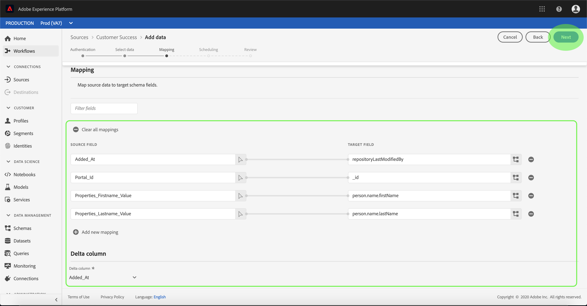
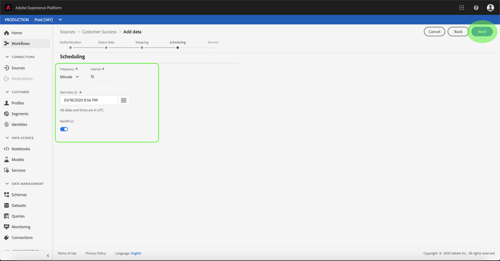

# Configurar un flujo de datos para un conector de éxito de cliente en la interfaz de usuario

Un flujo de datos es una tarea programada que recupera e ingiere datos de un origen a un [!DNL Platform] conjunto de datos. Este tutorial proporciona pasos para configurar un nuevo flujo de datos con su cuenta de éxito de cliente.

## Primeros pasos

Este tutorial requiere un conocimiento práctico de los siguientes componentes del Adobe Experience Platform:

- [Sistema](../../../../xdm/home.md)de modelo de datos de experiencia (XDM): El marco normalizado por el cual [!DNL Experience Platform] organiza los datos de experiencia del cliente.
   - [Conceptos básicos de la composición](../../../../xdm/schema/composition.md)de esquemas: Obtenga información sobre los componentes básicos de los esquemas XDM, incluidos los principios clave y las prácticas recomendadas en la composición de esquemas.
   - [Tutorial](../../../../xdm/tutorials/create-schema-ui.md)del Editor de Esquemas: Obtenga información sobre cómo crear esquemas personalizados mediante la interfaz de usuario del Editor de Esquemas.
- [Perfil](../../../../profile/home.md)del cliente en tiempo real: Proporciona un perfil de consumo unificado y en tiempo real basado en datos agregados de varias fuentes.

Además, este tutorial requiere que ya haya creado una cuenta de éxito de cliente. Puede encontrar una lista de tutoriales para crear diferentes conectores de éxito de clientes en la interfaz de usuario en la descripción general [de los conectores](../../../home.md)de origen.

## Seleccionar datos

Después de crear el conector de éxito del cliente, aparece el paso *[!UICONTROL Seleccionar datos]* , que proporciona una interfaz interactiva para explorar la jerarquía de archivos.

- La mitad izquierda de la interfaz es un navegador de directorios, que muestra los archivos y directorios del servidor.
- La mitad derecha de la interfaz permite la previsualización de hasta 100 filas de datos desde un archivo compatible.

Seleccione el directorio que desee utilizar y haga clic en **[!UICONTROL Siguiente]**.

## Asignación de campos de datos a un esquema XDM

Aparece el paso *[!UICONTROL Asignación]* , que proporciona una interfaz interactiva para asignar los datos de origen a un [!DNL Platform] conjunto de datos.

Elija un conjunto de datos para los datos de entrada en los que se van a ingerir. Puede utilizar un conjunto de datos existente o crear un nuevo conjunto de datos.

### Usar un conjunto de datos existente

Para ingerir datos en un conjunto de datos existente, seleccione **[!UICONTROL Utilizar conjunto]** de datos existente y, a continuación, haga clic en el icono de conjunto de datos.

Aparece el cuadro de diálogo *[!UICONTROL Seleccionar conjunto de datos]* . Busque el conjunto de datos que desee utilizar, selecciónelo y haga clic en **[!UICONTROL Continuar]**.

### Usar un nuevo conjunto de datos

Para ingestar datos en un nuevo conjunto de datos, seleccione **[!UICONTROL Crear nuevo conjunto]** de datos e introduzca un nombre y una descripción para el conjunto de datos en los campos proporcionados.

Durante este proceso, también puede activar los diagnósticos *[!UICONTROL de ingestión]* parcial y de *[!UICONTROL error]*. La activación de la ingestión ** parcial permite ingestar datos que contengan errores, hasta un umbral determinado que se pueda establecer. Al habilitar los diagnósticos *[!UICONTROL de]* error se proporcionarán detalles sobre los datos incorrectos que se agrupan por lotes por separado. Para obtener más información, consulte la información general sobre la ingestión [parcial de lotes](../../../../ingestion/batch-ingestion/partial.md).

A continuación, haga clic en el icono de esquema.

Aparecerá el cuadro de diálogo *[!UICONTROL Seleccionar esquema]* . Seleccione el esquema que desee aplicar al nuevo conjunto de datos y haga clic en **[!UICONTROL Finalizado]**.

En función de sus necesidades, puede elegir asignar los campos directamente o utilizar funciones de asignador para transformar los datos de origen para derivar valores calculados o calculados. Para obtener más información sobre la asignación de datos y las funciones del asignador, consulte el tutorial sobre la [asignación de datos CSV a campos](../../../../ingestion/tutorials/map-a-csv-file.md)de esquema XDM.

Una vez asignados los datos de origen, haga clic en **[!UICONTROL Siguiente]**.

## Programar ejecuciones de ingestión

Aparece el paso *[!UICONTROL Programación]* , que le permite configurar una programación de ingestión para ingestar automáticamente los datos de origen seleccionados mediante las asignaciones configuradas. La siguiente tabla describe los diferentes campos configurables para la programación:

| Campo | Descripción |
| --- | --- |
| Frecuencia | Las frecuencias seleccionables incluyen Minuto, Hora, Día y Semana. |
| Intervalo | Un entero que establece el intervalo para la frecuencia seleccionada. |
| Tiempo de Inicio | Marca de hora UTC para la que se producirá la primera ingestión. |
| Rellenar | Un valor booleano que determina qué datos se ingieren inicialmente. Si *[!UICONTROL Rellenar]* está activado, todos los archivos actuales de la ruta especificada se ingerirán durante la primera ingestión programada. Si *[!UICONTROL Rellenar]* está desactivado, solo se ingerirán los archivos que se carguen entre la primera ejecución de la ingesta y el tiempo *[!UICONTROL de]* Inicio. Los archivos cargados antes de la hora *[!UICONTROL de]* Inicio no se ingieren. |

Los flujos de datos están diseñados para transferir datos automáticamente en forma programada. Si solo desea realizar una ingesta una vez a través de este flujo de trabajo, puede hacerlo configurando la **[!UICONTROL Frecuencia]** en &quot;Día&quot; y aplicando un número muy grande para el **[!UICONTROL intervalo]**, como 10000 o similar.

Proporcione valores para la programación y haga clic en **[!UICONTROL Siguiente]**.

## Revise el flujo de datos

Aparece el paso *[!UICONTROL Revisar]* , que le permite revisar el nuevo flujo de datos antes de crearlo. Los detalles se agrupan en las siguientes categorías:

- *[!UICONTROL Detalles]* de la conexión: Muestra el tipo de origen, la ruta de acceso relevante del archivo de origen seleccionado y la cantidad de columnas dentro de ese archivo de origen.
- *[!UICONTROL Detalles]* de asignación: Muestra en qué conjunto de datos se están ingeriendo los datos de origen, incluido el esquema al que se adhiere el conjunto de datos.
- *[!UICONTROL Detalles]* de programación: Muestra el período activo, la frecuencia y el intervalo del programa de ingestión.

Una vez que haya revisado el flujo de datos, haga clic en **[!UICONTROL Finalizar]** y permita que se cree el flujo de datos.

## Monitorear el flujo de datos

Una vez creado el flujo de datos, puede monitorear los datos que se están ingeriendo a través de él. Siga los pasos a continuación para acceder al monitor de conjuntos de datos de un flujo de datos.

En el espacio de trabajo *[!UICONTROL Fuentes]* , seleccione la fuente de éxito del cliente que desea vista en la categoría Éxito *[!UICONTROL del]* cliente. Seleccione *[!UICONTROL Connect Source]* para iniciar la interfaz de autenticación. Para vista de un flujo de datos existente, seleccione Cuenta ** existente y seleccione la cuenta a la que desea acceder.

Aparece la pantalla actividad ** de origen. Desde aquí, haga clic en el nombre de un conjunto de datos cuya actividad desee monitorear.

Aparece la pantalla *[!UICONTROL actividad]* del conjunto de datos. Esta página muestra la velocidad de los mensajes que se consumen en forma de gráfico.

Para obtener más información sobre la supervisión de conjuntos de datos y la ingestión, consulte el tutorial sobre la [supervisión de flujos de datos](../../../../ingestion/quality/monitor-data-flows.md)de flujo continuo.

## Pasos siguientes

Siguiendo este tutorial, ha creado correctamente un flujo de datos para traer datos de un origen de éxito de cliente y ha adquirido una perspectiva sobre la supervisión de conjuntos de datos. Los datos entrantes ahora pueden ser utilizados por servicios [!DNL Platform] descendentes como [!DNL Real-time Customer Profile] y [!DNL Data Science Workspace]. Consulte los siguientes documentos para obtener más información:

- [Información general sobre el Perfil del cliente en tiempo real](../../../../profile/home.md)
- [Información general sobre el área de trabajo de ciencias de datos](../../../../data-science-workspace/home.md)

## Apéndice

Las secciones siguientes proporcionan información adicional para trabajar con conectores de origen.

### Deshabilitar un flujo de datos

Cuando se crea un flujo de datos, se activa inmediatamente y se ingieren datos según la programación que se le haya dado. Puede desactivar un flujo de datos activo en cualquier momento siguiendo las instrucciones que se indican a continuación.

En la pantalla de *[!UICONTROL autenticación]* , seleccione el nombre de la cuenta asociada al flujo de datos que desea deshabilitar.

Aparece la página actividad __ de origen. Seleccione el flujo de datos activo de la lista para abrir su columna *[!UICONTROL Propiedades]* en el lado derecho de la pantalla, que contiene un botón de alternancia **[!UICONTROL Habilitado]** . Haga clic en el botón de alternancia para deshabilitar el flujo de datos. Se puede utilizar la misma opción para volver a habilitar un flujo de datos después de desactivarlo.

### Activar datos de entrada para [!DNL Profile] población

Los datos entrantes del conector de origen se pueden utilizar para enriquecer y rellenar [!DNL Real-time Customer Profile] los datos. Para obtener más información sobre cómo rellenar [!DNL Real-time Customer Profile] los datos, consulte el tutorial sobre población [de](../profile.md)Perfiles.