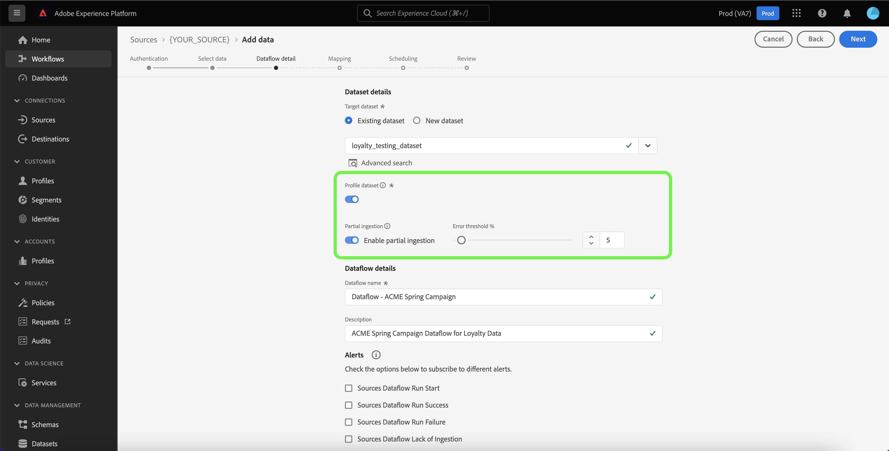

# Creación de un flujo de datos con una fuente de comercio electrónico en la interfaz de usuario

Un flujo de datos es una tarea programada que recupera e ingiere datos de un origen a un conjunto de datos en Adobe Experience Platform. Este tutorial proporciona pasos sobre cómo crear un flujo de datos para una fuente de comercio electrónico mediante la interfaz de usuario de Experience Platform.

>[!NOTE]
>
>* Para crear un flujo de datos, ya debe tener una cuenta autenticada con una fuente de comercio electrónico. Encontrará una lista de tutoriales para crear distintas cuentas de origen de comercio electrónico en la interfaz de usuario en [descripción general de las fuentes](../../../home.md#ecommerce).
>* Para que Experience Platform pueda introducir datos, las zonas horarias de todos los orígenes de lotes basados en tablas deben configurarse en UTC.

## Introducción

Este tutorial requiere una comprensión práctica de los siguientes componentes de Experience Platform:

* [Fuentes](../../../home.md): Experience Platform permite la ingesta de datos de varias fuentes al tiempo que le ofrece la capacidad de estructurar, etiquetar y mejorar los datos entrantes mediante los servicios de [!DNL Experience Platform].
* [[!DNL Experience Data Model (XDM)] Sistema](../../../../xdm/home.md): El marco estandarizado mediante el cual Experience Platform organiza los datos de experiencia del cliente.
   * [Aspectos básicos de la composición de esquemas](../../../../xdm/schema/composition.md): obtenga información sobre los componentes básicos de los esquemas XDM, incluidos los principios clave y las prácticas recomendadas en la composición de esquemas.
   * [Tutorial del editor de esquemas](../../../../xdm/tutorials/create-schema-ui.md): Aprenda a crear esquemas personalizados mediante la interfaz de usuario del editor de esquemas.
* [[!DNL Real-Time Customer Profile]](../../../../profile/home.md): proporciona un perfil de consumidor unificado y en tiempo real basado en los datos agregados de varias fuentes.
* [[!DNL Data Prep]](../../../../data-prep/home.md): permite a los ingenieros de datos asignar, transformar y validar datos desde y hacia el modelo de datos de experiencia (XDM).

## Adición de datos

Después de crear la cuenta de origen de comercio electrónico, aparece el paso **[!UICONTROL Agregar datos]**, que proporciona una interfaz para explorar la jerarquía de tablas de la cuenta de origen de comercio electrónico.

* La mitad izquierda de la interfaz es un navegador que muestra una lista de tablas de datos incluidas en su cuenta. La interfaz también incluye una opción de búsqueda que le permite identificar rápidamente los datos de origen que desea utilizar.
* La mitad derecha de la interfaz es un panel de previsualización, que le permite previsualizar hasta 100 filas de datos.

>[!NOTE]
>
>La opción de búsqueda de datos de origen está disponible para todos los orígenes basados en tablas excepto Adobe Analytics, [!DNL Amazon Kinesis] y [!DNL Azure Event Hubs].

Cuando encuentre los datos de origen, seleccione la tabla y, a continuación, seleccione **[!UICONTROL Siguiente]**.

## Proporcionar detalles del flujo de datos

El [!UICONTROL Página detallado] Flujo de datos le permite seleccionar si desea utilizar un conjunto de datos existente o uno nuevo conjunto de datos. Durante este proceso, también puede configurar las opciones de [!UICONTROL conjunto de datos] de perfil, [!UICONTROL diagnóstico Error], [!UICONTROL ingesta] parcial y [!UICONTROL alertas].

### Usar un conjunto de datos existente

Para introducir datos en un conjunto de datos existente, seleccione **[!UICONTROL Conjunto de datos existente]**. Puede recuperar un conjunto de datos existente mediante la opción [!UICONTROL Búsqueda avanzada] o desplazándose por la lista de conjuntos de datos existentes en el menú desplegable. Una vez seleccionado un conjunto de datos, proporcione un nombre y una descripción para el flujo de datos.

### Usar un nuevo conjunto de datos

Para ingerir en una nueva conjunto de datos, seleccione **[!UICONTROL Nuevo conjunto de datos]** y, a continuación, proporcione un nombre de conjunto de datos de salida y una descripción opcional. A continuación, seleccione un esquema al que asignar con la opción [!UICONTROL Búsqueda avanzada] o desplazándose por la lista de esquemas existentes en el menú desplegable. Una vez seleccionado un esquema, proporcione un nombre y una descripción para el flujo de datos.

### Habilitar [!DNL Profile] y los diagnósticos de error

A continuación, seleccione la opción **[!UICONTROL Conjunto de datos del perfil]** para habilitar su conjunto de datos para [!DNL Profile]. Esto le permite crear una vista integral de los atributos y comportamientos de una entidad. Los datos de todos los [!DNL Profile]conjuntos de datos habilitados se incluirán en [!DNL Profile] el flujo de datos y se aplicarán los cambios al guardar el flujo de datos.

[!UICONTROL Error diagnóstico permite la generación detallada de mensajes de error para cualquier registro erróneo que se produzca en el flujo de] datos, mientras [!UICONTROL que la ingesta] parcial le permite ingerir datos que contienen errores, hasta un cierto umbral que defina manualmente. Consulte la información general[&#128279;](../../../../ingestion/batch-ingestion/partial.md) sobre la ingesta parcial de lotes para obtener más información.

### Habilitar alertas

Puede habilitar alertas para recibir notificaciones sobre el estado del flujo de datos. Seleccione una alerta de la lista a suscribirse para recibir notificaciones sobre el estado del flujo de datos. Para obtener más información sobre las alertas, consulte la guía sobre [suscripción a alertas de fuentes mediante la interfaz de usuario](../alerts.md).

Cuando termine de proporcionar detalles al flujo de datos, seleccione **[!UICONTROL Siguiente]**.

## Asignación de campos de datos a un esquema XDM

Aparecerá el paso [!UICONTROL Mapping], que le proporcionará una interfaz para asignar los campos de origen del esquema de origen a sus campos XDM de destino adecuados en el esquema de destino.

Experience Platform proporciona recomendaciones inteligentes para campos asignados automáticamente en función del esquema o conjunto de datos de destino seleccionado. Puede ajustar manualmente las reglas de asignación para adaptarlas a sus casos de uso. En función de sus necesidades, puede optar por asignar campos directamente o utilizar funciones de preparación de datos para transformar los datos de origen para derivar valores calculados o calculados. Para ver los pasos detallados sobre el uso de la interfaz de asignador y los campos calculados, consulte la [guía de la interfaz de usuario de la preparación de datos](../../../../data-prep/ui/mapping.md).

Una vez que los datos de origen estén asignados correctamente, seleccione **[!UICONTROL Siguiente]**.

## Programar ejecuciones de ingesta

Aparece el paso [!UICONTROL Programación], que le permite configurar una programación de ingesta para introducir automáticamente los datos de origen seleccionados mediante las asignaciones configuradas. De forma predeterminada, la programación está definida en `Once`. Para ajustar su Frecuencia de ingesta, seleccione **[!UICONTROL Frecuencia]** y luego seleccione una opción del menú desplegable.

>[!TIP]
>
>El intervalo y la relleno no son visibles durante una ingesta única.

Si configura su Frecuencia de ingesta en `Minute`, `Hour`, `Day`, o , entonces `Week`debe establecer un intervalo para establecer una lapso de tiempo establecida entre cada ingestión. Por ejemplo, un Frecuencia de ingesta establecido en `Day` y un intervalo establecido en `15` significa que el flujo de datos está programado para ingerir datos cada 15 días.

Durante este paso, también puede habilitar **relleno** y definir una columna para la ingesta incremental de datos. El relleno se utiliza para introducir datos históricos, mientras que la columna que defina para la ingesta incremental permite diferenciar los nuevos datos de los datos existentes.

Consulte la tabla siguiente para obtener más información sobre las configuraciones de programación.

| Configuración de programación | Descripción |
| --- | --- |
| Frecuencia | Configure la frecuencia para indicar con qué frecuencia debe ejecutarse el flujo de datos. Puede establecer su frecuencia en: <ul><li>**Una vez**: establezca su frecuencia en `once` para crear una ingesta única. Las configuraciones para intervalo y relleno no están disponibles al crear un flujo de datos de ingesta único. De forma predeterminada, la frecuencia de programación se establece en una vez.</li><li>**Minuto**: establezca su frecuencia en `minute` para programar el flujo de datos e ingerir datos por minuto.</li><li>**Hora**: establezca su frecuencia en `hour` para programar el flujo de datos e ingerir datos por hora.</li><li>**Día**: Establezca su frecuencia en `day` para programar su flujo de datos e ingerir datos por día.</li><li>**Semana**: establezca su frecuencia en `week` para programar el flujo de datos e ingerir datos por semana.</li></ul> |
| Intervalo | Una vez seleccionada una frecuencia, puede configurar la configuración del intervalo para establecer el lapso de tiempo entre cada ingesta. Por ejemplo, si establece la frecuencia en día y configura el intervalo en 15, el flujo de datos se ejecutará cada 15 días. No puede establecer el intervalo en cero. El valor mínimo del intervalo aceptado para cada frecuencia es el siguiente:<ul><li>**Una vez**: n/a</li><li>**Minuto**: 15</li><li>**Hora**: 1</li><li>**Día**: 1</li><li>**Semana**: 1</li></ul> |
| Hora de inicio | La marca de tiempo de la ejecución proyectada, presentada en la zona horaria UTC. |
| Relleno | El relleno determina qué datos se incorporan inicialmente. Si relleno está habilitada, todos los archivos actuales de la ruta especificada se ingieren durante la primera ingesta programada. Si relleno está deshabilitado, solo se ingerirán los archivos que se carguen entre la primera ejecución de la ingesta y la inicio vez. Archivos cargados antes del inicio tiempo no se ingerirán. |
| Cargar datos incrementales por | Una opción con un conjunto filtrado de campos de esquema de origen de tipo, fecha u hora. El campo que seleccione para **[!UICONTROL Cargar datos incrementales por]** debe tener sus valores de fecha y hora en la zona horaria UTC para cargar correctamente los datos incrementales. Todos los orígenes de lotes basados en tablas seleccionan datos incrementales comparando un valor de marca de tiempo de columna delta con el correspondiente tiempo UTC de la ventana de ejecución de flujo y copiando los datos del origen, si se encuentran nuevos datos dentro de la ventana de tiempo UTC. |

## Revisión del flujo de datos

Aparece el paso **[!UICONTROL Revisar]**, que le permite revisar el nuevo flujo de datos antes de crearlo. Los detalles se agrupan en las siguientes categorías:

* **[!UICONTROL Conexión]**: muestra el tipo de origen, la ruta de acceso relevante del archivo de origen elegido y la cantidad de columnas dentro de ese archivo de origen.
* **[!UICONTROL Asignar campos de conjunto de datos y asignación]**: muestra en qué conjunto de datos se están ingiriendo los datos de origen, incluido el esquema al que se adhiere el conjunto de datos.
* **[!UICONTROL Programación]**: muestra el período activo, la frecuencia y el intervalo de la programación de ingesta.

Una vez que haya revisado el flujo de datos, seleccione **[!UICONTROL Finalizar]** y espere un poco para que se cree el flujo de datos.

## Monitorización del flujo de datos

Una vez creado el flujo de datos, puede monitor los datos que se ingieren a través de él para ver información sobre las tasas de ingesta, el éxito y los errores. Para obtener más información sobre cómo supervisar el flujo de datos, consulte el tutorial sobre [supervisar cuentas y flujos de datos en la interfaz de usuario](../monitor.md).

## Eliminar el flujo de datos

Puede eliminar flujos de datos que ya no sean necesarios o que se hayan creado incorrectamente mediante la función Eliminar **&#x200B;**&#x200B;disponible en el espacio de trabajo Flujos **de** datos. Para obtener más información sobre cómo eliminar flujos de datos, consulte el tutorial sobre [la eliminación de flujos de datos en el IU](../delete.md).

## Pasos siguientes

Al seguir este tutorial, ha creado correctamente un flujo de datos para llevar datos del origen comercio electrónico a Experience Platform. Los datos entrantes ahora pueden ser utilizados por servicios de flujo descendente [!DNL Experience Platform] como [!DNL Real-Time Customer Profile] y [!DNL Data Science Workspace]. Consulte los siguientes documentos para obtener más información:

* [Información general de [!DNL Real-Time Customer Profile]](../../../../profile/home.md)
* [Información general de [!DNL Data Science Workspace]](../../../../data-science-workspace/home.md)

>[!WARNING]
>
> La interfaz de usuario de Experience Platform que se muestra en el siguiente vídeo no está actualizada. Consulte la documentación anterior para obtener las capturas de pantalla y la funcionalidad más recientes de la interfaz de usuario.
>
>[!VIDEO](https://video.tv.adobe.com/v/29711?quality=12&learn=on)

