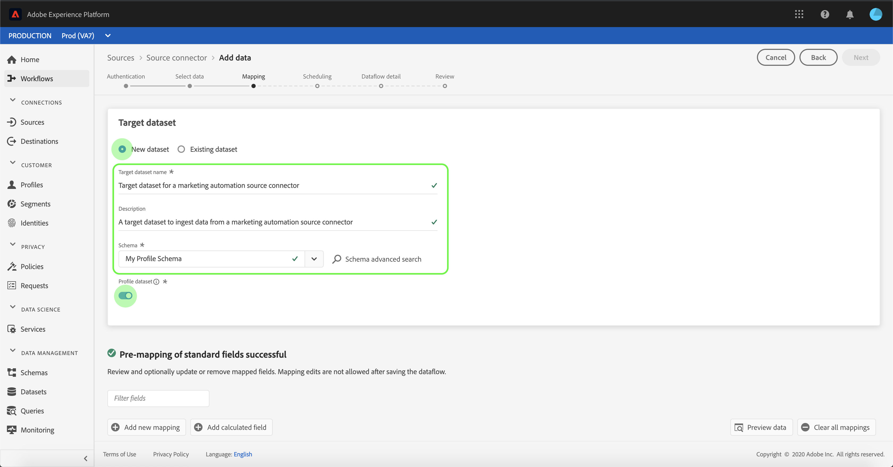

# Configurar un flujo de datos para una conexión de automatización de marketing en la interfaz de usuario

Un flujo de datos es una tarea programada que recupera e incorpora datos de un origen a un conjunto de datos [!DNL Platform]. Este tutorial proporciona pasos para configurar un nuevo flujo de datos con su cuenta de automatización de marketing.

## Primeros pasos

Este tutorial requiere una comprensión práctica de los siguientes componentes de Adobe Experience Platform:

- [[!DNL Experience Data Model (XDM)] Sistema](../../../../xdm/home.md): El marco estandarizado mediante el cual se  [!DNL Experience Platform] organizan los datos de experiencia del cliente.
   - [Aspectos básicos de la composición](../../../../xdm/schema/composition.md) del esquema: Obtenga información sobre los componentes básicos de los esquemas XDM, incluidos los principios clave y las prácticas recomendadas en la composición de esquemas.
   - [Tutorial del Editor de esquemas](../../../../xdm/tutorials/create-schema-ui.md): Aprenda a crear esquemas personalizados mediante la interfaz de usuario del Editor de esquemas.
- [[!DNL Real-time Customer Profile]](../../../../profile/home.md): Proporciona un perfil de cliente unificado y en tiempo real basado en datos agregados de varias fuentes.

Además, este tutorial requiere que ya haya creado una cuenta de automatización de marketing. Puede encontrar una lista de tutoriales para crear diferentes conectores de automatización de marketing en la interfaz de usuario en la [información general de conectores de origen](../../../home.md).

## Seleccionar datos

Después de crear su cuenta de automatización de marketing, aparece el paso *Select data*, que proporciona una interfaz interactiva para explorar la jerarquía de archivos.

- La mitad izquierda de la interfaz es un navegador de directorios, que muestra los archivos y directorios del servidor.
- La mitad derecha de la interfaz permite previsualizar hasta 100 filas de datos de un archivo compatible.

Puede utilizar la opción **[!UICONTROL Search]** en la parte superior de la página para identificar rápidamente los datos de origen que desea utilizar.

>[!NOTE]
>
>La opción de datos de la fuente de búsqueda está disponible para todos los conectores de origen basados en tablas, excepto los conectores de Analytics, Clasificaciones, Centros de eventos y Kinesis.

Una vez que encuentre los datos de origen, seleccione el directorio y haga clic en **[!UICONTROL Next]**.

## Asignación de campos de datos a un esquema XDM

Aparece el paso **[!UICONTROL Mapping]**, que proporciona una interfaz interactiva para asignar los datos de origen a un conjunto de datos [!DNL Platform].

Elija un conjunto de datos para los datos entrantes en los que se van a introducir. Puede usar un conjunto de datos existente o crear un conjunto de datos nuevo.

### Usar un conjunto de datos existente

Para introducir datos en un conjunto de datos existente, seleccione **[!UICONTROL Usar conjunto de datos existente]** y, a continuación, haga clic en el icono del conjunto de datos.

Aparece el cuadro de diálogo **[!UICONTROL Seleccionar conjunto de datos]**. Busque el conjunto de datos que desea utilizar, selecciónelo y haga clic en **[!UICONTROL Continuar]**.

### Usar un nuevo conjunto de datos

Para introducir datos en un nuevo conjunto de datos, seleccione **[!UICONTROL Crear nuevo conjunto de datos]** e introduzca un nombre y una descripción para el conjunto de datos en los campos proporcionados.

Puede adjuntar un campo de esquema introduciendo un nombre de esquema en la barra de búsqueda **[!UICONTROL Select schema]**. También puede seleccionar el icono desplegable para ver una lista de los esquemas existentes. Como alternativa, puede seleccionar **[!UICONTROL Búsqueda avanzada]** para acceder a la pantalla de esquemas existentes, incluidos sus respectivos detalles.

Durante este paso, puede habilitar su conjunto de datos para [!DNL Real-time Customer Profile] y crear una vista holística de los atributos y comportamientos de una entidad. Los datos de todos los conjuntos de datos habilitados se incluirán en [!DNL Profile] y los cambios se aplicarán cuando guarde el flujo de datos.

Alterne el botón **[!UICONTROL Profile dataset]** para habilitar el conjunto de datos de destinatario para [!DNL Profile].

Aparece el cuadro de diálogo **[!UICONTROL Select schema]**. Seleccione el esquema que desea aplicar al nuevo conjunto de datos y haga clic en **[!UICONTROL Listo]**.

En función de sus necesidades, puede elegir asignar campos directamente o utilizar funciones de preparación de datos para transformar los datos de origen a fin de derivar valores calculados o calculados. Para obtener más información sobre las funciones del asignador y los campos calculados, consulte la [Guía de funciones de preparación de datos](../../../../data-prep/functions.md) o la [guía de campos calculados](../../../../data-prep/calculated-fields.md).

>[!TIP]
>
>[!DNL Platform] proporciona recomendaciones inteligentes para campos asignados automáticamente basadas en el esquema o conjunto de datos de destino seleccionado. Puede ajustar manualmente las reglas de asignación para adaptarlas a sus casos de uso.

Seleccione **[!UICONTROL Preview data]** para ver los resultados de asignación de hasta 100 filas de datos de ejemplo del conjunto de datos seleccionado.

Durante la vista previa, la columna de identidad se prioriza como el primer campo, ya que es la información clave necesaria al validar los resultados de la asignación.

Una vez asignados los datos de origen, seleccione **[!UICONTROL Close]**.

## Programar ejecuciones de ingesta

Aparece el paso **[!UICONTROL Scheduling]** , que le permite configurar una programación de ingesta para que ingrese automáticamente los datos de origen seleccionados mediante las asignaciones configuradas. La siguiente tabla describe los diferentes campos configurables para la programación:

| Campo | Descripción |
| --- | --- |
| Frecuencia | Las frecuencias seleccionables incluyen `Once`, `Minute`, `Hour`, `Day` y `Week`. |
| Intervalo | Un entero que define el intervalo para la frecuencia seleccionada. |
| Hora de inicio | Marca de tiempo UTC que indica cuándo se configura la primera ingesta. |
| Relleno | Un valor booleano que determina qué datos se introducen inicialmente. Si **[!UICONTROL Relleno de fondo]** está habilitado, todos los archivos actuales de la ruta especificada se incorporarán durante la primera ingesta programada. Si **[!UICONTROL Backfill]** está deshabilitado, solo se incorporarán los archivos que se carguen entre la primera ejecución de la ingesta y la hora de inicio. Los archivos cargados antes de la hora de inicio no se incorporarán. |
| Columna Delta | Una opción con un conjunto filtrado de campos de esquema de origen de tipo, fecha u hora. Este campo se utiliza para diferenciar entre datos nuevos y existentes. Los datos incrementales se incorporarán en función de la marca de tiempo de la columna seleccionada. |

Los flujos de datos están diseñados para introducir datos automáticamente y de forma programada. Comience por seleccionar la frecuencia de ingesta. A continuación, configure el intervalo para designar el periodo entre dos ejecuciones de flujo. El valor del intervalo debe ser un entero distinto de cero y debe establecerse en bueno o igual a 15.

Para definir la hora de inicio de la ingesta, ajuste la fecha y la hora que se muestran en el cuadro de hora de inicio. También puede seleccionar el icono de calendario para editar el valor de la hora de inicio. La hora de inicio debe ser buena o igual a la hora UTC actual.

Seleccione **[!UICONTROL Cargar datos incrementales por]** para asignar la columna delta. Este campo proporciona una distinción entre datos nuevos y existentes.

### Configurar un flujo de datos de ingesta único

Para configurar la ingesta única, seleccione la flecha desplegable de frecuencia y seleccione **[!UICONTROL Once]**.

>[!TIP]
>
>**** El  **** relleno de intervalación no es visible durante una ingesta única.

Una vez que haya proporcionado los valores adecuados a la programación, seleccione **[!UICONTROL Next]**.

## Proporcionar detalles de flujo de datos

Aparece el paso **[!UICONTROL Dataflow detail]**, que le permite dar un nombre y una breve descripción del nuevo flujo de datos.

Durante este proceso, también puede habilitar la **[!UICONTROL ingesta parcial]** y los **[!UICONTROL diagnósticos de error]**. Al habilitar la **[!UICONTROL ingesta parcial]** se puede ingerir datos que contengan errores hasta un umbral determinado. Una vez activada la **[!UICONTROL Ingesta parcial]**, arrastre el dial **[!UICONTROL Error threshold %]** para ajustar el umbral de error del lote. Como alternativa, puede ajustar manualmente el umbral seleccionando el cuadro de entrada. Para obtener más información, consulte la [información general sobre la ingesta parcial de lotes](../../../../ingestion/batch-ingestion/partial.md).

Proporcione valores para el flujo de datos y seleccione **[!UICONTROL Next]**.

## Revise el flujo de datos

Aparece el paso **[!UICONTROL Review]**, que le permite revisar el nuevo flujo de datos antes de crearlo. Los detalles se agrupan en las siguientes categorías:

- **[!UICONTROL Conexión]**: Muestra el tipo de origen, la ruta correspondiente del archivo de origen elegido y la cantidad de columnas dentro de ese archivo de origen.
- **[!UICONTROL Asignar campos]** de conjunto de datos y asignación: Muestra en qué conjunto de datos se están incorporando los datos de origen, incluido el esquema al que se adhiere el conjunto de datos.
- **[!UICONTROL Programación]**: Muestra el período, la frecuencia y el intervalo activos del programa de ingesta.

Una vez que haya revisado el flujo de datos, haga clic en **[!UICONTROL Finish]** y permita que se cree el flujo de datos.

## Monitorizar el flujo de datos

Una vez creado el flujo de datos, puede monitorizar los datos que se incorporan a través de él para ver información sobre las tasas de ingesta, el éxito y los errores. Para obtener más información sobre cómo monitorizar el flujo de datos, consulte el tutorial sobre [monitorización de cuentas y flujos de datos en la interfaz de usuario](../monitor.md).

## Eliminar el flujo de datos

Puede eliminar flujos de datos que ya no sean necesarios o que se hayan creado incorrectamente empleando la función **[!UICONTROL Delete]** disponible en el espacio de trabajo **[!UICONTROL Dataflows]**. Para obtener más información sobre cómo eliminar flujos de datos, consulte el tutorial sobre la [eliminación de flujos de datos en la interfaz de usuario](../delete.md).

## Pasos siguientes

Al seguir este tutorial, ha creado correctamente un flujo de datos para incorporar datos de un sistema de automatización de marketing y ha obtenido información sobre la monitorización de conjuntos de datos. Los datos entrantes ahora se pueden usar en servicios descendentes [!DNL Platform] como [!DNL Real-time Customer Profile] y [!DNL Data Science Workspace]. Consulte los siguientes documentos para obtener más información:

- [Información general del [!DNL Real-time Customer Profile]](../../../../profile/home.md)
- [Información general del [!DNL Data Science Workspace]](../../../../data-science-workspace/home.md)

## Apéndice

Las secciones siguientes proporcionan información adicional para trabajar con conectores de origen.

### Desactivación de un flujo de datos

Cuando se crea un flujo de datos, este se activa inmediatamente e ingresa los datos según la programación que se le haya dado. Puede deshabilitar un flujo de datos activo en cualquier momento siguiendo las instrucciones que se indican a continuación.

En la pantalla **[!UICONTROL authentication]**, seleccione el nombre de la conexión asociada al flujo de datos que desea deshabilitar.

Aparece la página **[!UICONTROL Source activity]**. Seleccione el flujo de datos activo de la lista para abrir su columna **[!UICONTROL Properties]** en el lado derecho de la pantalla, que contiene un botón de alternancia **[!UICONTROL Enabled]**. Haga clic en el botón de alternancia para deshabilitar el flujo de datos. Se puede utilizar la misma opción para volver a habilitar un flujo de datos una vez desactivado.

### Activar datos de entrada para la población [!DNL Profile]

Los datos de entrada del conector de origen se pueden utilizar para enriquecer y rellenar los datos [!DNL Real-time Customer Profile]. Para obtener más información sobre cómo rellenar los datos [!DNL Real-time Customer Profile], consulte el tutorial sobre [Población del perfil](../profile.md).
