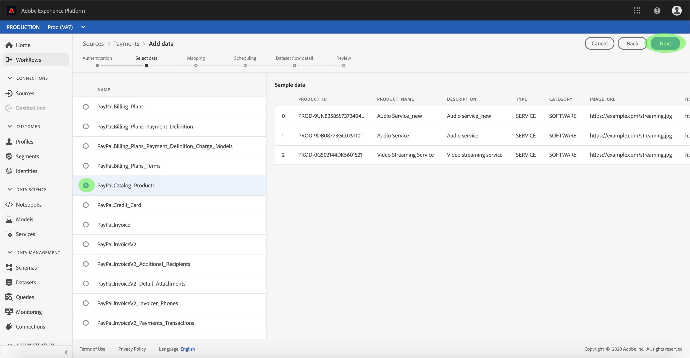
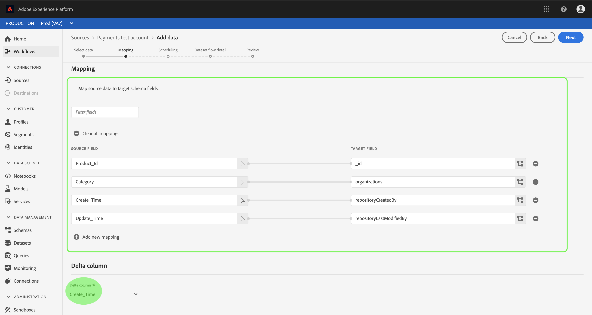
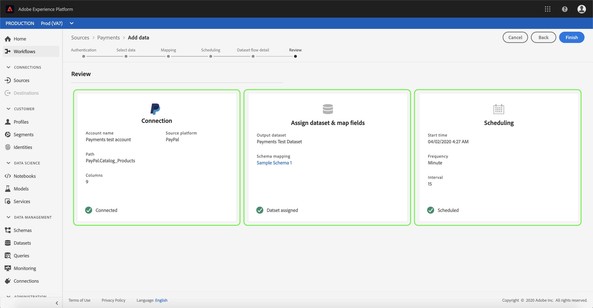

# Configurar un flujo de datos para un conector de pago en la interfaz de usuario

Un flujo de datos es una tarea programada que recupera e ingiere datos de un origen a un conjunto de datos de la plataforma de experiencia de Adobe. Este tutorial proporciona pasos para configurar un nuevo flujo de datos con su cuenta de pagos.

## Primeros pasos

Este tutorial requiere un conocimiento práctico de los siguientes componentes de Adobe Experience Platform:

- [Sistema](../../../../xdm/home.md)de modelo de datos de experiencia (XDM): Marco normalizado mediante el cual la plataforma de experiencias organiza los datos de experiencia del cliente.
   - [Conceptos básicos de la composición](../../../../xdm/schema/composition.md)de esquemas: Obtenga información sobre los componentes básicos de los esquemas XDM, incluidos los principios clave y las prácticas recomendadas en la composición de esquemas.
   - [Tutorial](../../../../xdm/tutorials/create-schema-ui.md)del Editor de Esquemas: Obtenga información sobre cómo crear esquemas personalizados mediante la interfaz de usuario del Editor de Esquemas.
- [Perfil](../../../../profile/home.md)del cliente en tiempo real: Proporciona un perfil de consumo unificado y en tiempo real basado en datos agregados de varias fuentes.

Además, este tutorial requiere que ya haya creado una cuenta de pagos. Puede encontrar una lista de tutoriales para crear diferentes conectores de pago en la interfaz de usuario en la descripción general [de los conectores](../../../home.md)de origen.

## Seleccionar datos

Después de crear la cuenta de pagos, aparece el paso *Seleccionar datos* , que proporciona una interfaz interactiva para explorar la jerarquía de archivos.

- La mitad izquierda de la interfaz es un navegador de directorios, que muestra los archivos y directorios del servidor.
- La mitad derecha de la interfaz permite la previsualización de hasta 100 filas de datos desde un archivo compatible.

Seleccione el directorio que desee utilizar y, a continuación, seleccione **Siguiente**.

## Asignación de campos de datos a un esquema XDM

Aparece el paso *Asignación* , que proporciona una interfaz interactiva para asignar los datos de origen a un conjunto de datos de la plataforma.

Elija un conjunto de datos para los datos de entrada en los que se van a ingerir. Puede utilizar un conjunto de datos existente o crear un nuevo conjunto de datos.

### Usar un conjunto de datos existente

Para ingerir datos en un conjunto de datos existente, seleccione **Utilizar conjunto** de datos existente y, a continuación, haga clic en el icono de conjunto de datos.

Aparece el cuadro de diálogo *Seleccionar conjunto de datos* . Busque el conjunto de datos que desee utilizar, selecciónelo y haga clic en **Continuar**.

### Usar un nuevo conjunto de datos

Para ingestar datos en un nuevo conjunto de datos, seleccione **Crear nuevo conjunto** de datos e introduzca un nombre y una descripción para el conjunto de datos en los campos proporcionados.

Durante este proceso, también puede activar los diagnósticos *de ingestión* parcial y de *error*. La activación de la ingestión ** parcial permite ingestar datos que contengan errores, hasta un umbral determinado que se pueda establecer. Al habilitar los diagnósticos de error se proporcionan detalles sobre los datos incorrectos que se agrupan por lotes por separado. Para obtener más información, consulte la información general sobre la ingestión [parcial de lotes](../../../../ingestion/batch-ingestion/partial.md).

Cuando termine, haga clic en el icono de esquema.

Aparecerá el cuadro de diálogo *Seleccionar esquema* . Seleccione el esquema que desee aplicar al nuevo conjunto de datos y haga clic en **Finalizado**.

En función de sus necesidades, puede elegir asignar los campos directamente o utilizar funciones de asignador para transformar los datos de origen para derivar valores calculados o calculados. Para obtener más información sobre la asignación de datos y las funciones del asignador, consulte el tutorial sobre la [asignación de datos CSV a campos](../../../../ingestion/tutorials/map-a-csv-file.md)de esquema XDM.

La pantalla *Asignación* también permite definir la columna ** Delta. Cuando se crea el flujo del conjunto de datos, se puede establecer cualquier campo de marca de hora como base para decidir qué registros se van a transferir en las ingestas incrementales programadas.

Una vez asignados los datos de origen, haga clic en **Siguiente**.

## Programar ejecuciones de ingestión

Aparece el paso *Programación* , que le permite configurar una programación de ingestión para ingestar automáticamente los datos de origen seleccionados mediante las asignaciones configuradas. La siguiente tabla describe los diferentes campos configurables para la programación:

| Campo | Descripción |
| --- | --- |
| Frecuencia | Las frecuencias seleccionables incluyen Minuto, Hora, Día y Semana. |
| Intervalo | Un entero que establece el intervalo para la frecuencia seleccionada. |
| Tiempo de Inicio | Marca de hora UTC para la que se producirá la primera ingestión. |
| Rellenar | Un valor booleano que determina qué datos se ingieren inicialmente. Si *Rellenar* está activado, todos los archivos actuales de la ruta especificada se ingerirán durante la primera ingestión programada. Si *Rellenar* está desactivado, solo se ingerirán los archivos que se carguen entre la primera ejecución de la ingesta y el tiempo *de* Inicio. Los archivos cargados antes de la hora *de* Inicio no se ingieren. |

Los flujos de datos están diseñados para transferir datos automáticamente en forma programada. Si solo desea realizar una ingesta una vez a través de este flujo de trabajo, puede hacerlo configurando la **Frecuencia** en &quot;Día&quot; y aplicando un número muy grande para el **intervalo**, como 10000 o similar.

Proporcione valores para la programación y haga clic en **Siguiente**.

## Asigne un nombre al flujo de conjuntos de datos

Aparece el paso de detalle *del flujo de* datos, donde debe proporcionar un nombre y una descripción opcional para el flujo de conjuntos de datos. Seleccione **Siguiente** cuando termine.

## Revise el flujo de conjuntos de datos

Aparece el paso *Revisar* , que le permite revisar el nuevo flujo de datos antes de crearlo. Los detalles se agrupan en las siguientes categorías:

- *Conexión*: Muestra el tipo de origen, la ruta de acceso relevante del archivo de origen seleccionado y la cantidad de columnas dentro de ese archivo de origen.
- *Asignar campos* de conjunto de datos y mapa: Muestra en qué conjunto de datos se están ingeriendo los datos de origen, incluido el esquema al que se adhiere el conjunto de datos.
- *Programación*: Muestra el período activo, la frecuencia y el intervalo del programa de ingestión.

Una vez que haya revisado el flujo de datos, haga clic en **Finalizar** y permita que se cree el flujo de datos.

## Monitoree el flujo de conjuntos de datos

Una vez creado el flujo del conjunto de datos, puede monitorear los datos que se están ingeriendo a través de él. Para obtener más información sobre cómo monitorear los flujos de conjuntos de datos, consulte el tutorial sobre [cuentas y flujos](../monitor.md)de conjuntos de datos.

## Pasos siguientes

Siguiendo este tutorial, ha creado correctamente un flujo de conjuntos de datos para incorporar datos de un sistema de automatización de marketing y ha adquirido una perspectiva sobre la supervisión de conjuntos de datos. Los datos entrantes ahora se pueden utilizar en los servicios de plataforma descendente, como Perfil del cliente en tiempo real y Área de trabajo de ciencias de datos. Consulte los siguientes documentos para obtener más información:

- [Información general sobre el Perfil del cliente en tiempo real](../../../../profile/home.md)
- [Información general sobre el área de trabajo de ciencias de datos](../../../../data-science-workspace/home.md)

## Apéndice

Las secciones siguientes proporcionan información adicional para trabajar con conectores de origen.

### Deshabilitar un flujo de conjuntos de datos

Cuando se crea un flujo de conjunto de datos, se activa inmediatamente y se ingieren datos según la programación que se le haya dado. Puede deshabilitar un flujo de conjuntos de datos activo en cualquier momento siguiendo las instrucciones a continuación.

En la pantalla Flujos *de* datos, seleccione el nombre del flujo de conjuntos de datos que desea deshabilitar.

La columna *Propiedades* aparece en la parte derecha de la pantalla. Este panel contiene un botón de alternancia **activado** . Haga clic en el botón de alternancia para deshabilitar el flujo de datos. Se puede utilizar la misma opción para volver a habilitar un flujo de datos después de desactivarlo.

### Activar datos de entrada para población de Perfiles

Los datos entrantes del conector de origen se pueden utilizar para enriquecer y rellenar los datos de Perfil del cliente en tiempo real. Para obtener más información sobre cómo rellenar los datos de Perfil de clientes reales, consulte el tutorial sobre población [de](../profile.md)Perfiles.
