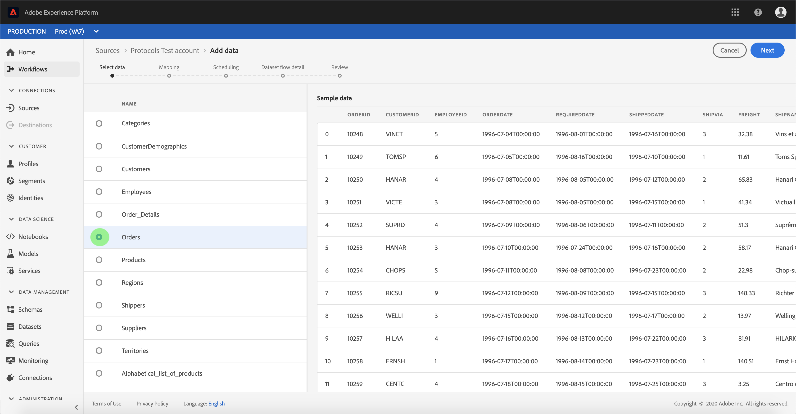

# Configuración de un flujo de datos para un conector de protocolo en la interfaz de usuario

Un flujo de conjuntos de datos es una tarea programada que recupera e ingiere datos de un origen a un conjunto de datos de Adobe Experience Platform. Este tutorial proporciona pasos para configurar un nuevo flujo de conjuntos de datos mediante la cuenta de protocolos.

## Primeros pasos

Este tutorial requiere un conocimiento práctico de los siguientes componentes del Adobe Experience Platform:

- [Sistema](../../../../xdm/home.md)de modelo de datos de experiencia (XDM): El marco normalizado por el cual [!DNL Experience Platform] organiza los datos de experiencia del cliente.
   - [Conceptos básicos de la composición](../../../../xdm/schema/composition.md)de esquemas: Obtenga información sobre los componentes básicos de los esquemas XDM, incluidos los principios clave y las prácticas recomendadas en la composición de esquemas.
   - [Tutorial](../../../../xdm/tutorials/create-schema-ui.md)del Editor de Esquemas: Obtenga información sobre cómo crear esquemas personalizados mediante la interfaz de usuario del Editor de Esquemas.
- [Perfil](../../../../profile/home.md)del cliente en tiempo real: Proporciona un perfil de consumo unificado y en tiempo real basado en datos agregados de varias fuentes.

Además, este tutorial requiere que ya haya creado una cuenta de protocolos. Puede encontrar una lista de tutoriales para crear diferentes conectores de protocolo en la interfaz de usuario en la descripción general [de los conectores](../../../home.md)de origen.

## Seleccionar datos

Después de crear la cuenta de protocolos, aparece el paso *[!UICONTROL Seleccionar datos]* , que proporciona una interfaz interactiva para explorar la jerarquía de archivos.

- La mitad izquierda de la interfaz es un navegador de directorios, que muestra los archivos y directorios del servidor.
- La mitad derecha de la interfaz permite la previsualización de hasta 100 filas de datos desde un archivo compatible.

Seleccione el directorio que desee utilizar y haga clic en **[!UICONTROL Siguiente]**.

## Asignación de campos de datos a un esquema XDM

Aparece el paso *[!UICONTROL Asignación]* , que proporciona una interfaz interactiva para asignar los datos de origen a un conjunto de datos de [!UICONTROL Platform] .

Elija un conjunto de datos para los datos de entrada en los que se van a ingerir. Puede utilizar un conjunto de datos existente o crear un nuevo conjunto de datos.

### Usar un conjunto de datos existente

Para ingerir datos en un conjunto de datos existente, seleccione **[!UICONTROL Utilizar conjunto]** de datos existente y, a continuación, haga clic en el icono de conjunto de datos.

Aparece el cuadro de diálogo *[!UICONTROL Seleccionar conjunto de datos]* . Busque el conjunto de datos que desee utilizar, selecciónelo y haga clic en **[!UICONTROL Continuar]**.

### Usar un nuevo conjunto de datos

Para ingestar datos en un nuevo conjunto de datos, seleccione **[!UICONTROL Crear nuevo conjunto]** de datos e introduzca un nombre y una descripción para el conjunto de datos en los campos proporcionados.

Durante este proceso, también puede activar los diagnósticos *[!UICONTROL de ingestión]* parcial y de *[!UICONTROL error]*. La activación de la ingestión ** parcial permite ingestar datos que contengan errores, hasta un umbral determinado que se pueda establecer. Al habilitar los diagnósticos de error se proporcionan detalles sobre los datos incorrectos que se agrupan por lotes por separado. Para obtener más información, consulte la información general sobre la ingestión [parcial de lotes](../../../../ingestion/batch-ingestion/partial.md).

Cuando termine, haga clic en el icono de esquema.

Aparecerá el cuadro de diálogo *[!UICONTROL Seleccionar esquema]* . Seleccione el esquema que desee aplicar al nuevo conjunto de datos y haga clic en **[!UICONTROL Finalizado]**.

En función de sus necesidades, puede elegir asignar los campos directamente o utilizar funciones de asignador para transformar los datos de origen para derivar valores calculados o calculados. Para obtener más información sobre la asignación de datos y las funciones del asignador, consulte el tutorial sobre la [asignación de datos CSV a campos](../../../../ingestion/tutorials/map-a-csv-file.md)de esquema XDM.

La pantalla *[!UICONTROL Asignación]* también permite definir la columna ** Delta. Cuando se crea el flujo del conjunto de datos, se puede establecer cualquier campo de marca de hora como base para decidir qué registros se van a transferir en las ingestas incrementales programadas.

Una vez asignados los datos de origen, haga clic en **[!UICONTROL Siguiente]**.

Aparece el paso *[!UICONTROL Programación]* , que le permite configurar una programación de ingestión para ingestar automáticamente los datos de origen seleccionados mediante las asignaciones configuradas. La siguiente tabla describe los diferentes campos configurables para la programación:

| Campo | Descripción |
| --- | --- |
| Frecuencia | Las frecuencias seleccionables incluyen Minuto, Hora, Día y Semana. |
| Intervalo | Un entero que establece el intervalo para la frecuencia seleccionada. |
| Tiempo de Inicio | Marca de hora UTC para la que se producirá la primera ingestión. |
| Rellenar | Un valor booleano que determina qué datos se ingieren inicialmente. Si *[!UICONTROL Rellenar]* está activado, todos los archivos actuales de la ruta especificada se ingerirán durante la primera ingestión programada. Si *[!UICONTROL Rellenar]* está desactivado, solo se ingerirán los archivos que se carguen entre la primera ejecución de la ingesta y el tiempo *[!UICONTROL de]* Inicio. Los archivos cargados antes de la hora *[!UICONTROL de]* Inicio no se ingieren. |

Los flujos de conjuntos de datos están diseñados para ingestar automáticamente los datos de forma programada. Si solo desea realizar una ingesta una vez a través de este flujo de trabajo, puede hacerlo configurando la **[!UICONTROL Frecuencia]** en &quot;Día&quot; y aplicando un número muy grande para el **[!UICONTROL intervalo]**, como 10000 o similar.

Proporcione valores para la programación y haga clic en **[!UICONTROL Siguiente]**.

## Asigne un nombre al flujo de conjuntos de datos

Aparece el paso de detalle *[!UICONTROL del flujo de]* datos, donde debe proporcionar un nombre y una descripción opcional para el flujo de conjuntos de datos. Haga clic en **[!UICONTROL Siguiente]** cuando termine.

## Revise el flujo de conjuntos de datos

Aparece el paso *[!UICONTROL Revisar]* , que le permite revisar el nuevo flujo de datos antes de crearlo. Los detalles se agrupan en las siguientes categorías:

- *[!UICONTROL Conexión]*: Muestra el tipo de origen, la ruta de acceso relevante del archivo de origen seleccionado y la cantidad de columnas dentro de ese archivo de origen.
- *[!UICONTROL Asignar campos]* de conjunto de datos y mapa: Muestra en qué conjunto de datos se están ingeriendo los datos de origen, incluido el esquema al que se adhiere el conjunto de datos.
- *[!UICONTROL Programación]*: Muestra el período activo, la frecuencia y el intervalo del programa de ingestión.

Una vez que haya revisado el flujo de datos, haga clic en **[!UICONTROL Finalizar]** y permita que se cree el flujo de datos.

## Monitoree el flujo de conjuntos de datos

Una vez creado el flujo del conjunto de datos, puede monitorear los datos que se están ingeriendo a través de él. Para obtener más información sobre cómo monitorear los flujos de conjuntos de datos, consulte el tutorial sobre [cuentas y flujos](../monitor.md)de conjuntos de datos.

## Pasos siguientes

Siguiendo este tutorial, ha creado correctamente un flujo de conjuntos de datos para incorporar datos de un sistema de automatización de marketing y ha adquirido una perspectiva sobre la supervisión de conjuntos de datos. Los datos entrantes ahora pueden ser utilizados por servicios [!DNL Platform] descendentes como [!DNL Real-time Customer Profile] y [!DNL Data Science Workspace]. Consulte los siguientes documentos para obtener más información:

- [Información general sobre el Perfil del cliente en tiempo real](../../../../profile/home.md)
- [Información general sobre el área de trabajo de ciencias de datos](../../../../data-science-workspace/home.md)

## Apéndice

Las secciones siguientes proporcionan información adicional para trabajar con conectores de origen.

### Deshabilitar un flujo de conjuntos de datos

Cuando se crea un flujo de conjunto de datos, se activa inmediatamente y se ingieren datos según la programación que se le haya dado. Puede deshabilitar un flujo de conjuntos de datos activo en cualquier momento siguiendo las instrucciones a continuación.

En la pantalla Flujos *[!UICONTROL de]* datos, seleccione el nombre del flujo de conjuntos de datos que desea deshabilitar.

La columna *[!UICONTROL Propiedades]* aparece en la parte derecha de la pantalla. Este panel contiene un botón de alternancia **[!UICONTROL activado]** . Haga clic en el botón de alternancia para deshabilitar el flujo de datos. Se puede utilizar la misma opción para volver a habilitar un flujo de datos después de desactivarlo.

### Activar datos de entrada para [!DNL Profile] población

Los datos entrantes del conector de origen se pueden utilizar para enriquecer y rellenar [!DNL Real-time Customer Profile] los datos. Para obtener más información sobre cómo rellenar [!DNL Real-time Customer Profile] los datos, consulte el tutorial sobre población [de](../profile.md)Perfiles.