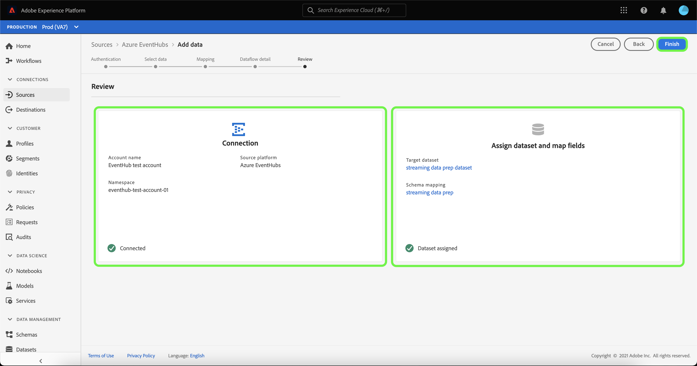

# Configuración de un flujo de datos para un conector de flujo de almacenamiento en la nube en la interfaz de usuario

Un flujo de datos es una tarea programada que recupera e ingiere datos de un origen a un [!DNL Platform] conjunto de datos. Este tutorial proporciona pasos para configurar un nuevo flujo de datos mediante el conector base del almacenamiento de nube.

## Primeros pasos

Este tutorial requiere un conocimiento práctico de los siguientes componentes de Adobe Experience Platform:

- [[!DNL Experience Data Model (XDM)] Sistema](../../../../../xdm/home.md): El marco normalizado por el cual [!DNL Experience Platform] organiza los datos de experiencia del cliente.
   - [Conceptos básicos de la composición](../../../../../xdm/schema/composition.md)de esquemas: Obtenga información sobre los componentes básicos de los esquemas XDM, incluidos los principios clave y las prácticas recomendadas en la composición de esquemas.
   - [Tutorial](../../../../../xdm/tutorials/create-schema-ui.md)del Editor de esquemas: Obtenga información sobre cómo crear esquemas personalizados mediante la interfaz de usuario del Editor de Esquemas.
- [[!DNL Real-time Customer Profile]](../../../../../profile/home.md):: Proporciona un perfil de consumo unificado y en tiempo real basado en datos agregados de varias fuentes.

Además, este tutorial requiere que ya haya creado un conector de almacenamiento de nube. Encontrará una lista de tutoriales para crear diferentes conectores de almacenamiento en la interfaz de usuario en la descripción general [de los conectores](../../../../home.md)de origen.

## Seleccionar datos

Después de crear el conector de almacenamiento de nube, aparece el paso *Seleccionar datos* , que proporciona una interfaz para seleccionar el flujo desde el que se transmitirán los datos.

## Asignación de campos de datos a un esquema XDM

Aparece el paso **[!UICONTROL Asignación]** , que proporciona una interfaz interactiva para asignar los datos de origen a un [!DNL Platform] conjunto de datos.

Elija un conjunto de datos para los datos de entrada en los que se van a ingerir. Puede usar un conjunto de datos existente o crear uno nuevo.

**Usar un conjunto de datos existente**

Para ingerir datos en un conjunto de datos existente, seleccione **[!UICONTROL Utilizar conjunto]** de datos existente y, a continuación, haga clic en el icono de conjunto de datos.

Aparece el cuadro de diálogo **[!UICONTROL Seleccionar conjunto de datos]** . Busque el conjunto de datos que desee utilizar, selecciónelo y haga clic en **[!UICONTROL Continuar]**.

**Usar un nuevo conjunto de datos**

Para ingestar datos en un nuevo conjunto de datos, seleccione **[!UICONTROL Crear nuevo conjunto]** de datos e introduzca un nombre y una descripción para el conjunto de datos en los campos proporcionados. A continuación, seleccione el esquema que desee utilizar en la lista desplegable.

## Asigne un nombre al flujo de datos

Aparece el paso de detalles **** de flujo de datos, que le permite asignar un nombre y una breve descripción del nuevo flujo de datos.

Proporcione valores para el flujo de datos y haga clic en **[!UICONTROL Siguiente]**.

### Revise el flujo de datos

Aparece el paso **[!UICONTROL Revisar]** , que le permite revisar el nuevo flujo de datos antes de crearlo. Los detalles se agrupan en las siguientes categorías:

- **[!UICONTROL Detalles]** de la fuente: Muestra el tipo de origen y otros detalles relevantes sobre el origen.
- **[!UICONTROL Detalles]** del destinatario: Muestra en qué conjunto de datos se están ingeriendo los datos de origen, incluido el esquema al que se adhiere el conjunto de datos.

Una vez que haya revisado el flujo de datos, haga clic en **[!UICONTROL Finalizar]** y permita que se cree el flujo de datos.

## Monitorear y eliminar el flujo de datos

Una vez creado el flujo de datos del almacenamiento de nube, puede supervisar los datos que se están ingeriendo a través de él. Para obtener más información sobre la supervisión y eliminación de flujos de datos, consulte el tutorial sobre la [supervisión de flujos de datos](../../../../../ingestion/quality/monitor-data-ingestion.md).

## Pasos siguientes

Siguiendo este tutorial, ha creado correctamente un flujo de datos para traer datos de un almacenamiento de nube externo y ha adquirido una perspectiva sobre la supervisión de conjuntos de datos. Los datos entrantes ahora pueden ser utilizados por servicios [!DNL Platform] descendentes como [!DNL Real-time Customer Profile] y [!DNL Data Science Workspace]. Consulte los siguientes documentos para obtener más información:

- [[!DNL Real-time Customer Profile] sobre validación](../../../../../profile/home.md)
- [[!DNL Data Science Workspace] sobre validación](../../../../../data-science-workspace/home.md)

## Apéndice

Las secciones siguientes proporcionan información adicional para trabajar con conectores de origen.

### Deshabilitar un flujo de datos

Cuando se crea un flujo de datos, se activa inmediatamente y se ingieren datos según la programación que se le haya dado. Puede desactivar un flujo de datos activo en cualquier momento siguiendo las instrucciones que se indican a continuación.

En el espacio de trabajo **[!UICONTROL Fuentes]** , haga clic en la ficha **[!UICONTROL Examinar]** . A continuación, haga clic en el nombre de la conexión asociada al flujo de datos activo que desea deshabilitar.

Aparece la página actividad **** de origen. Seleccione el flujo de datos activo de la lista para abrir su columna **[!UICONTROL Propiedades]** en el lado derecho de la pantalla, que contiene un botón de alternancia **[!UICONTROL Habilitado]** . Haga clic en el botón de alternancia para deshabilitar el flujo de datos. Se puede utilizar la misma opción para volver a habilitar un flujo de datos después de desactivarlo.

### Activar datos de entrada para [!DNL Profile] población

Los datos entrantes del conector de origen se pueden utilizar para enriquecer y rellenar [!DNL Real-time Customer Profile] los datos. Para obtener más información sobre cómo rellenar [!DNL Real-time Customer Profile] los datos, consulte el tutorial sobre población [de](../../profile.md)Perfiles.
